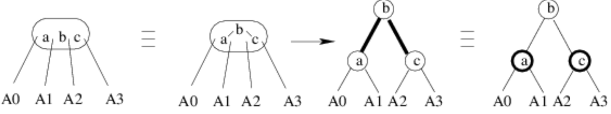

# Árvores Rubro Negra

## Conceitos Básicos

* Se apresenta como uma solução mais otimizada para casos de [Árvore 2-3-4](Arvore234.md), evitando desperdício de memória

* Substitui a representação múltipla de nós por uma representação única contendo os atributos: element, apontadores (esquerda e direita) e um bit para cor

* A ideia de cor se aplica as arestas da árvore mas como não é possível aplicar atributos a ponteiros na programação, a cor é alocada no objeto que representa um nó.

* A cor é aplicada a um nó caso ele seja gêmeo do seu pai na árvore

* A altura de uma RedBlack que derivou de uma 2-3-4 com altura h pode ser no máximo de 2h 