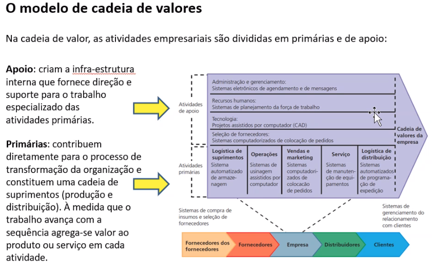
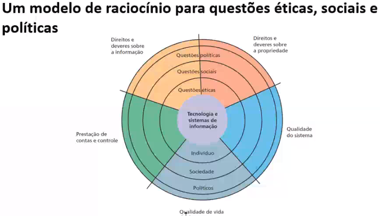
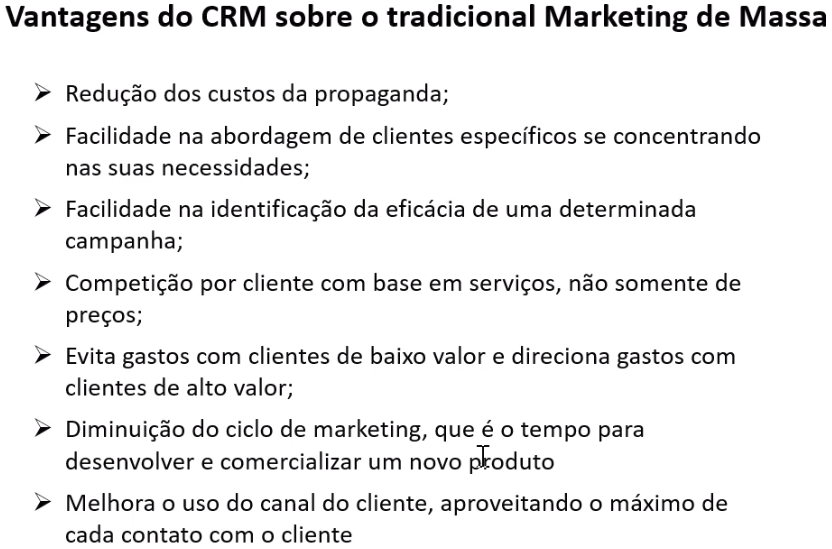
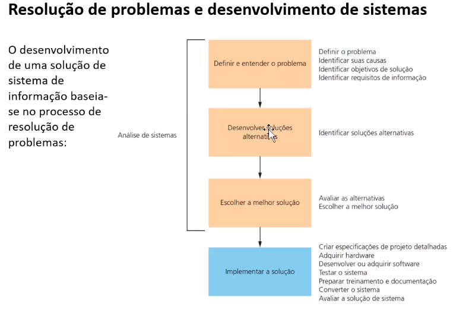

### Notes

**1ª Aula ->** Formatação de texto acadêmico, apresentação...

---

**2ª Aula ->** Como é o uso de SI nas empresas. || o que há de novo em SI (nuvem, big data...). || Globalização

    *Dados* é o material bruto, *informação* são os dados já modelados, útil para uso.

    *Possíveis problemas nas empresas, tudo que precisamos avaliar está no slide dia 10/08*

---

**3ª Aula ->** UPS (como a TI ajudou nessa empresa - Atividade) || Montagem de grupos

---

**4ª Aula ->** Tipos de organizações || Gestão centralizada e descentralizada || Estrutura formal e informal || Estrutura Funcional (Divisional e Matricial)

[gestão centralizada e descentralizada - Pesquisa Google](https://www.google.com/search?q=gest%C3%A3o+centralizada+e+descentralizada&oq=gest%C3%A3o+centrali&aqs=chrome.2.69i57j0l7.4364j0j1&sourceid=chrome&ie=UTF-8)

http://marcusmarques.com.br/pequenas-e-medias-empresas/estrutura-organizacional-conheca-tres-tipos-existentes/

- Vertical: hierarquia

- Horizontal: departamentalização

MPEs realizam a informatização buscando a melhoria da qualidade das informações, redução de custos e modernização.

ESTUDAR ESSA AULA!!!!!!!!! :)

---

**5ª Aula ->** Conversa com ex-aluno sobre trabalho fora do Brasil

---

**6ª Aula ->** Funções Empresariais (4 em específico) || Níveis de uma organização e tomadas de decisão || Organograma || Buy or Build || Tipos de sistemas de informação empresariais (SPTs, SIGs, SADs...) || Função do SI nas empresas

- Financeiro → Patrimônio Líquido = Ativos - passivos;
- Recursos Humanos → Toda a administração de pessoas;
- Vendas e marketing → Todo esse processo (embalagem, concorrentes...) e os 4ps do marketing. Processos do marketing;
- Produção-Operação → SCM, gestão fiscal...

*Um processo de negócio é um conjunto de atividades relacionadas que define como tarefas organizacionais vão ser executadas.*

- SPT: Sistema de processamento de transações. Os Sistemas de Processamento de Transação (SPTs) são sistemas de suporte para atividades do dia a dia da organização que servem o nível operacional como monitorando as atividades diárias ou normais de uma empresa, controle de estoque, contabilidade, sistemas de cobrança e pagamento de contas, folha de pagamento, atendimento a clientes, fluxo de materiais, entre outros. É o mais antigo tipo de sistema de informação e tem como principal objetivo responder a questões rotineiras e acompanhar o fluxo de transações através da organização. Os SPTs capacitam as organizações a executar suas atividades mais importantes de maneira mais eficiente. Uma transação consiste na troca de valores que afetam a lucratividade ou o ganho global de uma organização.Portanto, esses sistemas são valiosas fontes de dados para o nível operacional da empresa e também para os níveis mais elevados da empresa.

- SIG: Sistema de Informação Gerencial. São processos utilizados para transformar dados em informações que auxiliem no processo decisório da empresa. *É um sistema que disponibiliza a informação certa, para a pessoa certa, no lugar certo, na hora certa, da forma correta e com o custo certo.* Os SIGs possuem uma multiplicidade de produtos de informação, que são apresentadas através de relatórios, que ajudam os gerentes com o fornecimento de dados e informações para a tomada de decisões.

- SAD: Sistema de Apoio a Decisão. *“…a eficácia empresarial está sendo seriamente prejudicada por sistemas que, simplesmente, produzem enormes quantidades de dados e informações que não são trabalhados e utilizados”*. Ou seja, um SIG não é muito bem utilizado para micro e pequenas empresas, logo evoluiram para o SAD. A função principal do SAD é apoiar o processo de tomada de decisão em áreas de planejamento estratégico, controle gerencial e controle operacional.

**Organograma:** É um gráfico que representa a estrutura formal de uma organização. Ou seja, é a representação gráfica clássica de uma estrutura organizacional. Define funções, grupos de trabalho e até os principais projetos que transitam pela empresa

---

**7ª Aula ->** Conquistando vantagem competitiva com os sistemas de informação || Atividade (artigo)

- **5 forças de Michael Porter** - https://rockcontent.com/br/blog/5-forcas-de-porter/
  
  - Ameaça de entrada de novos concorrentes;
  
  - Ameaça de produtos substitutos;
  
  - Poder de negociação dos clientes;
  
  - Poder de negociação dos fornecedores;
  
  - Rivalidade entre concorrentes;

*São os pilares de uma empresa, e se algum mudar, deve-se reavaliar seu posicionamento estratégico. A possibilidade de avaliar com clareza fatores que são imutáveis — independente do tamanho e segmento da empresa — facilita o processo de identificação de falhas e possíveis oportunidades, as quais podem ser exploradas como um diferencial competitivo, garantindo o sucesso do negóci https://rockcontent.com/br/blog/5-forcas-de-porter/o.*

*A pergunta de 1 milhão -> Como a gente pode melhorar esses processos com tecnologia?*

- **Processo de análise:**
  
  - Identificar a estratégia e metas do negócio;
  
  - Transforme as metas em atividades e processos concretos;
  
  - Defina de que maneira irá avaliar o progresso em direção às metas do negócio;
  
  - Como a tecnologia de info pode me ajudar a progredir rumo às metas empresariais e de que maneira ela vai aprimorar os processos e atividades do negócio?
  
  - Avalie o desempenho real. Deixe os números falarem.

- **Estratégias:**
  
  - Liderança em custos baixos: Usar SI para produzir produtos e serviços melhores e mais baratos; 
  
  - Diferenciação de produto: Usar SI para diferenciar produtos e facilitar a criação de novos;
  
  - Foco em nichos de mercado: Usar SI para facilitar a estratégia focada em um único nicho de mercado;
  
  - Intimidade com o cliente e o fornecedor: Usar SI para desenvolver laços mais fortes com o cliente e fornecedores e conquistar sua lealdade;

**Impacto da internet:** Acesso fácil à informação (acesso a preços...) o poder de barganha aumenta || Acesso direto aos fornecedores (da pra saber qual é melhor... mais facilmente) || Reduz a barreira de entrada no mercado || Amplia a abrangencia geográfica do mercado, ou seja, mais concorrencia > melhoria dos produtos e processos.... 

**Benchmarking:** processo que compara processos iguais em empresas diferentes para ver como melhorar;

**BPM (Business process management):** Abordagem cujo objetivo é a melhoria contínua dos processos de negócio;

---

**8ª Aula ->** Ética social 

Análise ética (quando confrontado):

- Identifique e descreva claramente os fatos

- Defina os conflitos ou dilema e identifique os valores de ordem mais elevado envolvidos

- Identifique os interessados

- Identifique as alternativas razoáveis a adotar

- Identifique as potenciais consequências das suas opções

**As cinco dimensões morais da era da informação**:

##### Debate :)

**Perguntas:**

1. Sabe-se que hoje estamos passando por um momento de enfrentamento referente ao covid e com isso a tecnologia vem como uma aliada muito forte tanto quanto a demanda de tempo quanto a tecnologia envolvida para solucionar a vacina, referente a isso como enfrentaríamos esse tal momento sem a tecnologia como aporte principal? 

2. Com a tecnologia as fronteiras da educação e de muitas outras áreas foram quase extintas. vocês acreditam que sem a tecnologia teriam tantas pessoas com educação básica hoje? ;) 

3. Como as empresas iriam agilizar seus processos sem a automatização gerada através da tecnologia ? qual seria o outro meio que traria a mesma taxa de produtividade ? E como a taxa de acidentes se manteria baixa sem a automatização

**Questões para defender:**

1. Meio ambiente -> diminuição do uso de papel || Prever locais propensos à queimadas...

2. Saude mental

3. a tecnologia ao msm tempo que inclui, exclui muitas pessoas - mas se tem internet pq não estão se qualificando mais???? :)

---

**9ª Aula ->** Sistemas integrados

Aplicativos integrados são sistemas que abrangem TODA a empresa (todos os níveis de gerência...)

**Tipos:**

- **ERP** - Enterprise Resource Planning (sistemas de gestão empresarial) -> Esse tipo pode vir integrado com os próximos dois. Integram vários processos de negócios nas áreas de manufatura e produção, logistica, finanças, vendas (incluindo controle de inventário) e recursos humanos. É dividido em módulos, ou seja, se o cliente só quiser um desses anteriores, ele pode. **Base de dados compartilhada** entre os módulos! O que permite um fluxo integrado de informações entre os módulos;
  
  - Critério 1 -> Suporte aos processos de negócio da empresa;
  
  - 2 -> Cobertura do escopo geográfico (lingua, moeda, leis...);
  
  - 3-> Flexibilidade (adaptar às mudancias do negócio dos cliente...);
  
  - 4-> Conectividade (o quão fácil é o acesso e interconexão outros sistemas);
  
  - 5 -> Facilidade de integração (facilidade na integração com os sistemas utilizados pela empresa);
  
  - 6 -> Maturidade (estabilidade).

        **Estilos de implantação:** Big-bang, Small-bang e Em fases.

        **Valor empresarial deles:** Extinção de tarefas reduntantes, administração sênior... 

        **Fatores desfavoráveis:** Custos altos, Não fornece vantagem competitiva (está disponível para todos), Tempo de implantação longo.

- **SCM** - Supply Chain Management (sistemas de gestão da cadeia de suprimentos) -> É a gestão do produto da fonte até o consumidor, desde a matéria prima até estoque e entrega. Interliga fornecedores, instalações industriais, centros de distribuição, varejistas, clientes....
  
  - Determina a quantidade de um produto específico a ser fabricado em dado período, sintonizando oferta e demanda;
  
  - Estabelecer níveis de 
  
  - estoque para matéria-primas e produtos acabados;
  
  - Determinar onde armazenar os artigos acabados;
  
  - Identificar o meio de transporte a ser utilizado para a entrega, melhorando o serviço, reduzindo tempo de entrega...

*Todas as empresas envolvidas precisam contribuir com seus dados e info.*

- **CRM** - Customer Relationship Management (sistemas de gestão do relacionamento com o cliente) -> Não da mais para competir só com base no preço, não da mais para ter um marketing de massa (uma única frase em todos os meios), precisa ser um marketing personalizado para cada cliente. O CRM é a combinação de processos de negócio e tecnologia com o objetivo de entender os clientes mediante a várias perspectiva: quem são?, o que fazem?, do que gostam?.... Aplicação para fidelização de cliente, aumento da satisfação dos mesmos.... 

*Ciclo de vida do cliente: Adquirir -> Aprimorar -> Reter*

*Cross-sell: Soraia sempre compra pipoca quando vai no cinema -> Duas pipocas por uma. Ou Promoção de pipoca + refri + chocolate.*

*Up-sell: Ela sempre compra uma pipoca -> promoção para comprar uma pipoca maior.*

---

**10ª Aula ->** Atividade artigo ERPs

**11ª Aula ->** 1º Conexão FSI

**12ª Aula ->** Continuação do 1º Conexão FSI

**13ª Aula ->** Continuação das apresentações do trabalho de extensão

---

**14ª Aula ->** SCM e CRM (9ª Aula)

**15ª Aula ->** 1ª Prova

---

**16ª Aula ->** Infraestrutura de TI (hardware e software - Cliente/servidor...)

- Virtualização: permite que em uma mesma máquina sejam executadas simultaneamente dois ou mais ambientes distintos e isolados. Esse conceito de virtualização remonta aos antigos mainframes, que deviam ser divididos por vários usuários em ambientes de aplicação completamente diferentes. O interesse na virtualização não se atém somente ao fato de permitir o uso de um mesmo sistema por vários usuários concomitantemente, mas os principais interesses são a segurança, confiabilidade e disponibilidade, custo, adaptabilidade, balanceamento de carga esuporte a aplicações legadas.

[O que é virtualização?](https://www.redhat.com/pt-br/topics/virtualization/what-is-virtualization)

---

**17ª Aula ->** 2º Conexão FSI

---

**18ª Aula ->** Continuação do 2º Conexão FSI || Segurança 

**Pilares da segurança da informação:**

- Disponibilidade;

- Confidencialidade;

- Integridade.

**Vulnerabilidade:**

- Softwares mal-intencionados: Vírus, Worms, Cavalo de troia, Spyware... || Hacker, spoofing, sniffer. || Ataques de recusa de serviço (DoS - Denial of Service) || Roubo de identidade (phishing é uma forma de spoofing - pharming é uma técnica de phishing) || Fraude do clique;

- Ameaças internas: funcionários;

##### **Perícia forense computacional:** procedimento científico de coleta, exame, análise... de dados mantidos em meios de armazenamento digital, de tal maneira que as informações possam ser usadas como prova em juízo.

**Estabelecer uma estrutura para segurança e controle:**

- Controles gerais -> controle de software, hardware, operações do computador...

- Controles de aplicação -> processamento de folha de pagamento ou pedidos...

- Avaliação de risco -> determina o nível de risco de uma empresa caso uma atividade ou um processo específico não sejam controlados adequadamento.

- Uma vez identificado os principais riscos , será necessário desenvolver uma política de segurança par proteger esses ativos.

- Plano de recuperação de desastres

- Plano de continuidade dos negócios

- Auditoria de sistemas de informação

**Tecnologias e ferramentas para garantir a segurança dos recursos de informação:**

- Autenticação (two factor, por exemplo);
- Firewalls;
- Sistemas de detecção de intrusão - Software antivírus - Sistemas unificados de gestão de ameaças (UTM);
- Segurança em redes sem fio;
- Criptografia;
- Segurança em nuvem

---

**19ª Aula ->** Continuação da 2ª apresentação de extensão

---

**20ª Aula ->** Comércio eletrônico: mercados/mercadorias digitais

**E-commerce:** É o uso da internet para conduzir um negócio. *m-commerce = mobile-commerce.*

- Ubiquidade: a tecnologia web estar disponivel a qualquer parte e a qualquer momento. Redução de custo de transação para o consumidor...
- Alcance global: atravessa fronteiras culturais e nacionais, abrange todo o planeta;
- Padrões universais: padroes técnicos para pagamento e troca de dados facilita tudo. reduz custos...
- Riqueza: grande distribuição de conteúdo, mesagens, divulgação...
- Interatividade: Consequentemente tem uma interatividade mais com os clientes.
- Densidade da informação: Grande densidade de informações e detalhamento de produtos, avaliações, diferença de preços...
- Personalização/customização: personalização de marketing, customização de produtos, tudo focado nos cliente individualmente (isso é excencial hoje);
- Tecnologia social: A tecnologia ajuda/suporta a geração de conteúdos e redes sociais.

*Redução da **assimetria de informação** , ou seja, ambas as partes (vendedor e consumidor) estão cientes de tudo sobre a transação. || **Determinação diâmica de preços**...*

**Classificações:**

- **B2C** (Business to consumer): Venda de serviço/produto diretamente com o consumidor;
- **B2B** (Business to business): Serviços/produtos de empresa para empresas;
- **C2C** (Consumer to consumer): Ambas as partes do negócio são consumidores finais. Ex: Mercado livre.

**Modelos de receita** do comércio eletrônico, ex: venda de produtos, anúncios, taxa de transação (TripAdvisor, Decolar...), Receita de afiliação (sites enviam visitantes para outros sites)...

*O e-commerce deve estar integrado ao CRM (ex: lista de desejos do cliente, marketing personalizado...) e ao SCM (ex: acompanhamento da entrega)*

---

**21ª e 22ª e 23ª Aula ->** Apresentação do trabalho de comércio eletrônico

---

**24ª Aula ->** Como desenvolver sistemas de informação e gerenciar projetos

*Metodologias ágeis!*

Prova a partir da aula 16