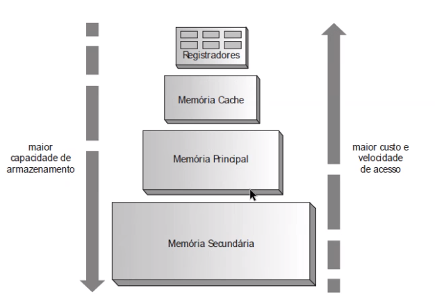
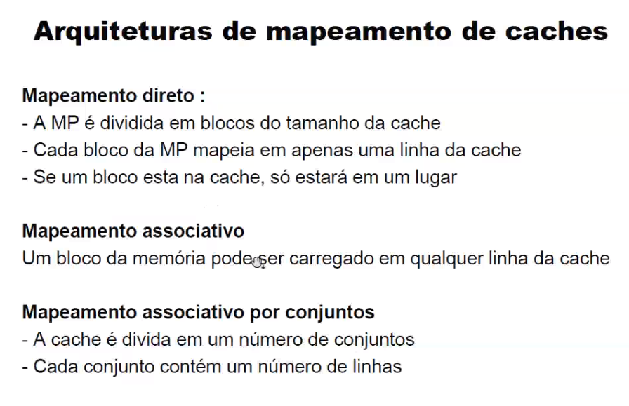
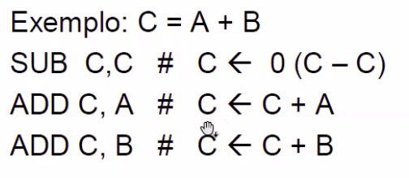

### Meanings

- **Barramento:** É um **caminho elétrico** comum que liga e permite a comunicação entre dispositivos de hardware (processador, memórias, controladores...). Grupos funcionais dos barramentos: dados, endereços e controle;
- **Registradores:** É uma combinação de *flip-flops* (variante de memória 1bit, amazena o valor de transição do bit, ou seja, de 0 para 1 ou vice-versa). Tal combinação permite armazenar valores superiores à 1bit. (memórias internas na CPU);
- **Controladores:**
- **Pilhas:** É uma área de alocação de variáveis, ou seja, enquanto o programa está rodando ele empilha, armazena suas variáveis necessárias para execução de determinado processo neste local da memória, e quando o processo acaba este bloco da memória é desempilhado, desalocado;
- **Opcodes:** 

*Pilha -> PUSH coloca - POP tira (e troca no vetor dos valores inicias) - MULT multiplica os dois valores do top - ADD soma //*

sizeof

https://mixmisturado.com/diferenca-entre-opcode-e-bytecode/#:~:text=Opcode%20%C3%A9%20um%20tipo%20de%20instru%C3%A7%C3%A3o%20em%20linguagem%20de%20m%C3%A1quina.

---

### General

**1ª Aula ->** Apresentação e falou o básico de arquitetura computacional, como arquiteturas x86 (mais antiga, 32 bits...) e ARM;

---

**2ª Aula ->** Continuação do slide || Unidade de controle (UC)!! || IAS || Bits e Bytes || Barramentos || Controladores || Pilhas

    Registradores: são memórias internas na CPU. (**Saber todos os nomes e tipos de registradores**)

    *Funcionamento do processadores, da memoria, e como os dados são registrados!!!*

---

**3ª Aula ->** Tabela ASCII || Software || Tradutores: Montadores e compiladores || Interpretadores || Sistema de numeração

- **Softwares:** programas que permitem o uso efetivo do computador;

- **Tradutores:** Interpreta e traduz o programa inteiro (conversão integral) de uma vez em linguagem de máquina. Ex: javac, C;
  
  - Vantagens: Execução mais rápida! || Uma vez traduzido, o código original pode ser descartado da memória, ficando somente o programa objeto e podendo executar o programa diretamente. 
  
  - Desvantagens: Não portabilidade do código executável entre as diferentes plataformas || Para ser utilizado o código precisa passar por muitos níveis de compilação || Processo de correção ou alteração do código requer que ele seja novamente recompilado.

*No caso de montadores e compiladores, eles são tipos de tradutores, porém depende da linguagem fonte.*

- Montadores: 
  
  - Linguagem de montagem = Assembly || Montador = Assembler;

- Compiladores: A única diferença é o uso de linguagem de alto nível (Java, C#) em vez de linguagem de montagem (Assembly)
  
  **Compilação** (traduzir p/ linguagem de máquina), **Ligação** (ligá-lo a vários outros programas em linguagem de máquina dos quais ele dependa), **Carga** (Carrega-lo na memória principal) e **Execução** (Alocar o processador e transferir o controle dele para o programa a ser executado)

- **Interpretadores:** Lê e executa uma única linha por vez. Ex: Unix/Linux - Shell, Prolog, Lisp; 
  
  - Vantagens: A facilidade para executar comandos, a facilidade de depuração e mais flexíveis.
  
  - Desvantagens: Execução mais lenta do programa || Necessita sempre ser lido o código original para ser executado;

*Ciclo de instrução: Busca e executa. Saber interpretar uma instrução em hexa, por exemplo - Tabela OP CODE*

pergunta: O que seria exatamente o programa objeto gerado pelos tradutores? O programa já convertido para a linguagem de máquina, a linguagem alvo?

---

**4ª Aula ->** Conversão de bases || Introdução à sistemas lógicos (portas lógicas...) || Portas lógicas

---

**5ª Aula ->** Continuação de sistemas numéricos (*conversão e operações de bases*) **Conversão de nº decimais** || Sinal Magnitude || Complemento-2 (sinais positivos e negativos) || Padrão/formato IEEE 754

- Complemento-2 -> [Complemento de dois: funcionamento e exemplos - FilipeFlop](https://www.filipeflop.com/blog/complemento-de-dois/)

- Foram feitos os exercícios 1,2 e 3 de ARQ em aula

- **Exercícios 1, 4, 9, 12 ,13, 22, 23, 27 ctz que vai cair na prova (2,6, 7, 14, 24 talvez)(11 não cai)**

---

**6ª Aula ->** Abertura XII Scap

**7ª Aula ->** Continuação do Padrão IEEE 754 (32 bits) - Números PF: 32, 64 e 128 bits

 **8ª Aula ->** Circuitos Lógicos || Mintermos e Maxtermos

---

**9ª Aula ->** Multiplexador || Decodificador  || Somadores || Clock? || Início de memórias

**Multiplexador:** Seleciona as informações de duas ou mais fontes de dados num único canal. *Pag 125 - Tanenbaum.*

**Decodificador:** Um descodificador ou decodificador é um circuito combinatório,  isto é, converte um código binário de entrada de N bits de entrada em M linha de saída, de modo que cada linha de saída será ativada por uma única combinação das possíveis de entrada. *Pag 126 - Tanenbaum*.

**Comparadores:** Compara duas palavras de entrada. *Pag 126 - Tanenbaum*.

**Somadores:** Adição de bits. *Pag 126 - Tanenbaum*.

---

**10ª Aula ->** Tipos de memória (olhar nos slides) (A comparação de características das memórias vai cair na prova)

- NV (não voláteis): Somente Leitura
  
  - ROM -> Gravadas durante a fabricação
  
  - PROM -> ROM Programável (śo uma vez) e precisa de equipamento especial para programar; 
  
  - (UV)EPROM -> (UV Erasable PROM) Apagada (erased) por UV (ultra violeta)
  
  - EEPROM -> Apagada eletricamente
  
  - UV-PROM -> 
  
  - FLASH ->
    
    - Flash NOR ->
    
    - Flash NAND ->

- V (voláteis): RAM (Acesso à qualquer posição). Leitura e escrita. Armazenamento temporário.
  
  - RAM Estática - SRAM (porta lógica) ->
  
  - RAM Dinâmica -  -> 

Regeneração (refreshing): 

DDR (explicação): 

Tecnologia Optane: 

---

**11ª Aula ->** Prova

---

**12ª Aula ->**  Banda passante de memória (BPM) || Mais um pouco de explicação de memória || Memória Cache

**BPM** = LB * f 

- LB (largura do barramento de dados (memória))

- f (frequência da banda de memória)

**Memória Cache:** está entre a CPU e a mamória principal. Ou seja, a CPU procura na cache antes de procurar na principal, por isso mais rápido acesso. Caso não encontre o que deseja na memória cache, é feita uma busca parcial antes para o bloco da memória principal.

**Taxa de acerto/erro da cache:** t = c + (1-h)*m

- t = tempo médio de acesso médio

- c = tempo de acesso a cache

- m = tempo de acesso a memória

- h = taxa de acerto ("hit ratio")

**Write back:** escrita de volta. A memória é atualizada quando não há mais espaço. E a info contida nela vai para a próxima memória. Ex: cache -> principal;

**Mapeamento direto:** para cada dado existem um ID, logo para verificar se tal dado está em tal memória é comparado os IDs da memória em questão, com o ID do dado que eu desejo. ID = endereço de memória. 

---

**13ª Aula ->** Mais memória || Instruções

**Memória virtual (overlay automático):** combina memória principal e secundária para permitir executar programas maiores que a memória principal. Pode se imaginar o swap do linux, só que um pouco mais amplo. 

**Paginação**

- Substituição de páginas: desempenho - simplificação: EAT = (1-p).m+p.d
  - p = taxa de falta de páginas
  - m = tempo de acesso à memória RAM
  - d = tempo de tratamento de falta de página
  - EAT = 

### Instruções:

- **ISA:** Arquitetura de conjunto de instruções;
  - RISC x CISC: !!!!!!!!!!!!!!!!!!!!!!!!!!!!!!!!!!!!!!!!!!!!!!!!!!!!!!!!!!!!!!!!!!!!!!!!
  - FISC (pós-RISC - Convergência RISC e CISC):
- 4bits + 6bits + 6bits = 16bits (opcode + referência ao operando + Referência ao operando);
- **Ciclo de instrução:** 
- Ciclo de instrução resumido: Busca e execução;
- **Ciclo de execução:** 

Formato de instrução: 

- Instrução sem endereço: OPCODE
- Com endereço: OPCODE + endereço A 
- Com dois endereços: OP. + A + B
- Com três endereços: OP. + A + B + C

*Matéria de Opcode ta no início do arquivo!*

**Deslocamento e rotação de input:** 

**Diferença entre endereçamento imediato, direto e indireto:** 

- indireto: O endereço da instrução aponta para outro endereço com o operando desejado;

**Paralelismo:** 

- Nível de instrução:
- Nível de processador: 
  - SIMD: 
  - MIMD: 
- Sistemas multiprocessador: tem a mesma memória e é fortemente acoplado.
  - NUMA: 
  - Multicore e multithread: 

*Pipeline:*

- Pipeline de cinco estágios:
- **Superpipeline:**

**Arquitetura superescalar:** 

Sistemas fracamente acoplados: sistemas ligados a rede, sem estarem ligados fisicamente, diretamente. Multicomputadores.

- Sistemas em rede; clusters; Grid; 

**Tipos de desempenho:**

- Tempo de execução (latência):
- Vazão (Banda passante do processador): 
- BPM (Banda passante de memória): BPM = LB*f

*O tempo de execução é o inverso do desempenho.* 

Programas de BenchMarks -> testar o desempenho.

---

**14ª Aula ->** Dispositivos de E/S

Controladore/adaptador: controla os comandos, informa o disco, o bloco...

Comandos/endereços: hexa? - Comunicação UCP

Métodos de E/S: por programa (polling)

Device Drive: 

Barramentos ISA - Vesa:

Barramentos PCI - PCI Express: 

Arquitetura InfiniBand:

*Calcular a banda de transmição (Ex7 Lista2 AC)*

Serial ATA ou SATA: 

RAIDs níveis: 

---

**15ª Aula ->** Continuação de instruções

**16ª Aula ->** Dúvidas Lista 2 e Trabalho prático

---

Questões:

1. **Barramento de dados:** Transporta toda informação interna do computador, sejam elas dados e códigos de programas;
2. **Barramento de endereços:** Transporta a localização, o endereço de memória onde se deseja ler ou escrever dados;
3. **Barramento de controle:** Controla as ações dos barramentos anteriores. Agrupa um conjunto de sinais elétricos de controle do sistema. Ex: sinais para indicar se tais dados que circulam no barramento de dados é para escrita ou leitura;
4. **Barramento:**  É um **caminho elétrico** comum que liga e permite a comunicação entre dispositivos de hardware (processador, memórias, controladores...);
5. **Registrador de endereço de memória (MAR):**  Quando uma operação precisa ser realizada com algum dado que está na memória principal, o endereço desse dado é passado para o MAR;
6. **Registrador de buffer de memória (MBR):** utilizado para armazenar temporariamente os dados que foram lidos da memória ou dados que serão escritos na memória;
7. **Contador de programa (PC):** Registrados da CPU que indica qual é a posição atual na sequência de execução de um processo;
8. **Registrador de instrução (IR):** Recebe as instruções da memória principal e passa para a unidade de controle. (Registrador = É uma combinação de *flip-flops* (variante de memória 1bit, amazena o valor de transição do bit, ou seja, de 0 para 1 ou vice-versa). Tal combinação permite armazenar valores superiores à 1bit. (memórias internas na CPU);
9. **Ciclo de instrução:** É o ciclo em que o computador lê e processa uma instrução da sua memória principal ou pela sequência de ações que a a CPU realiza;
10. **Ciclo de busca:** É um dos dois processos do ciclo de instrução. Para executar o ciclo de instrução, primeiro é preciso fazer a busca dos dados necessários para a operação, sejam dados para servirem de entrada ou para o armazenamento na memória;
11. **Clico de execução:** É o outro processos do ciclo de instrução. Após fazer a busca dos dados necessários a CPU já sabe exatamente qual operação deve executar, com quais dados e o que fazer com o resultado.

ai pai, quando puder dar uma olhada, por favor... Qualquer coisa a gente conversa também

o video ficou com um formato meio ruim, tamo tentando consertar aqui, mas é só dar um zoom 

ai depois que você ver tudo, só preciso pegar seu feedback

19- {  15 }

x = 2 | y = 3 | z = 40 