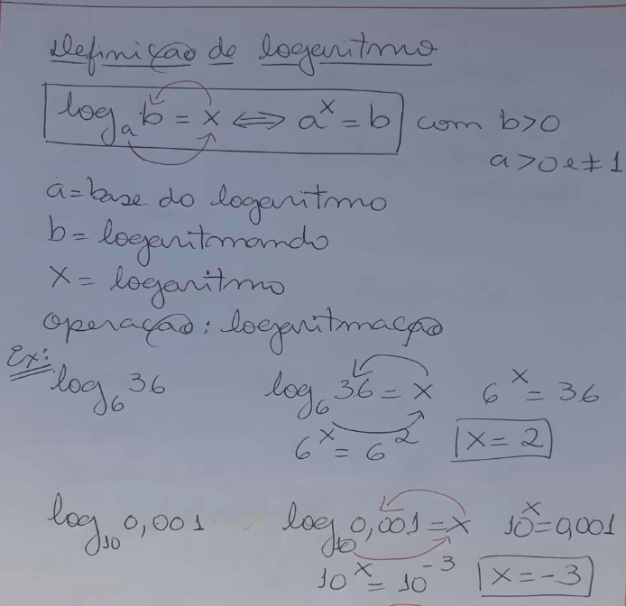
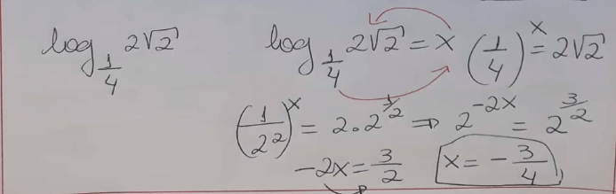
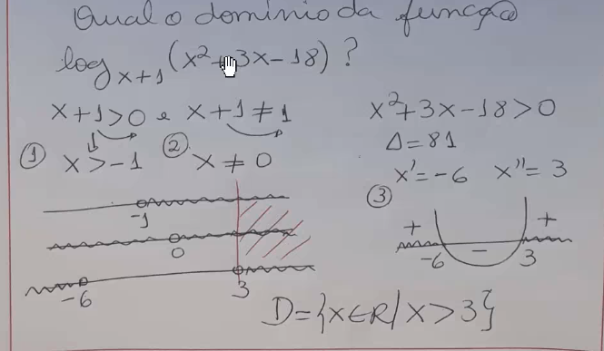
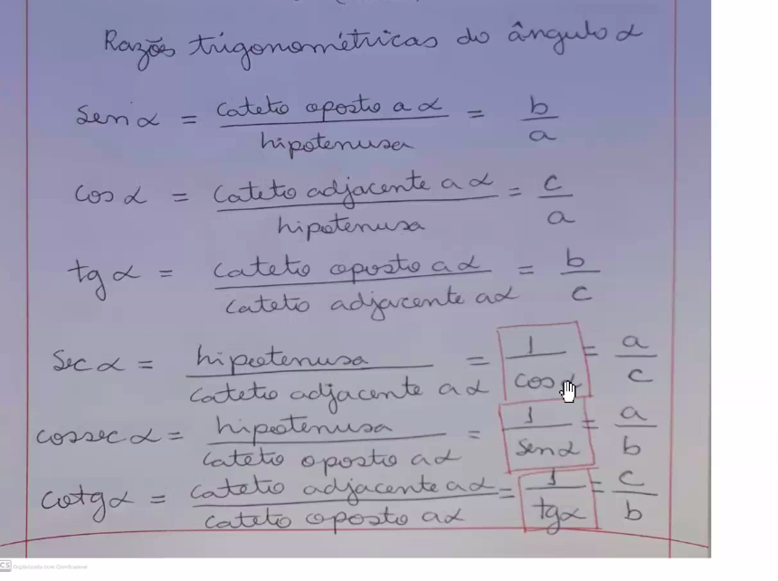
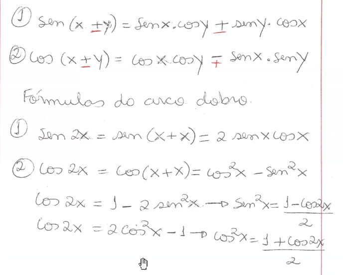
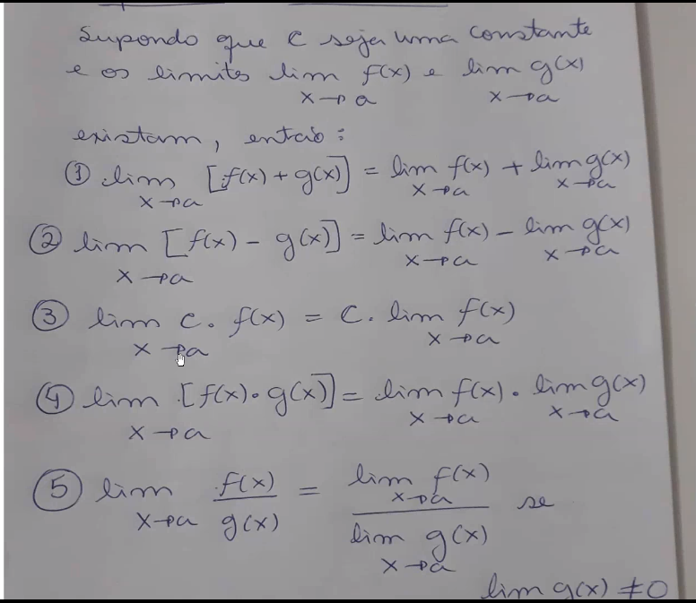
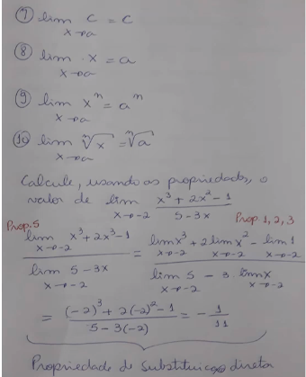
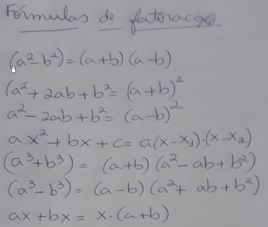
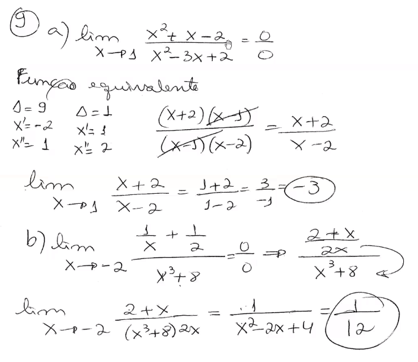
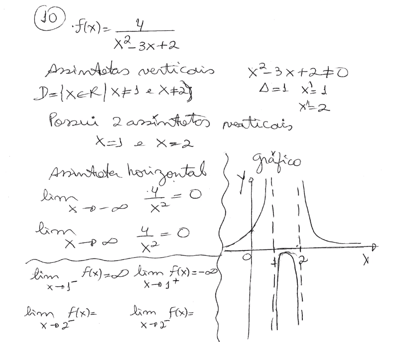

### Notes

**1ª Aula ->** (Revisão Ensino Médio) -> Potenciação, Radiciação, Produtos Notáveis (a²-2ab+b²), Racionalização e Linguagem de intervalos (conjuntos numéricos);

---

**2ª Aula ->** Noções básicas de **funções** (relação de dependência, lembrar da conta de luz)

    X -> Conjunto Domínio (x é variável independente)

    Y -> Conjunto Imagem ("os pares", variável dependente), contradomínio todos os valores de Y; 

    *Para ser função toda variável dependênte precisa de relacionar com uma variável independente.*

- Intercepto de X -> (X, 0)

- Intercepto de Y -> (0, Y)

- Crescimento e decrescimento de uma função.

---

**3ª Aula ->** Domínio de uma função real - Restrições || **Restrições de domínio** || Função composta e inversa (Só pra usar nas derivadas, não vai ser cobrada em prova)

- **Restrições de Domínio:** 
  
  1. Expressões comuns (todas as polinomiais) ou Função com raiz de índice ímpar -> **Domínio = Real (D = R)**;
  
  2. Função com **fração** -> Toda expressão do denominador != 0;
  
  3. Função com **raiz de índice par** -> Toda expressão dentro da raiz >= 0;
  
  4. Fração com **denominador** com raiz de **índice par** -> Toda expressão dentro da raiz > 0;

- Função Injetora -> Cada elemento de X tem um único par em Y. E pode sobrar em Y;

- Função Sobrejetora -> Não sobra elemento em Y;

- Função Bijetora -> Injetora e Bijetora ao mesmo tempo. Cada elemento de X tem um único par em Y e não sobra elementos em Y.

- **Taxa de variação média ->** deltaY / deltaX = y2-y1 / x2-x1

---

**4ª Aula->** Início de Funções e Modelos - **Funções Polinomiais**

- **Função Polinomiais:** O grau da função corresponde ao grau do polinômio, ou seja, depende do grau do maior expoente;
  
  - 1º Grau: **Y= f(x) = ax+b** ou função Linear
    
    - a -> coeficiente angular;
    
    - b -> coeficiente linear;
    
    - **-b/a** <- Como achar onde toca o eixo X no gráfico;
  
  *O valor fixo, ou seja, o independente (no caso do 1º grau seria b, no 2º grau c...) é onde toca o eixo y*
  
  - 2º Grau: **Y= f(x) = ax²+bx+c** ou função Quadrática
    
    - Se **a > 0** a parábola vai ser para **cima**, se **a < 0** para **baixo**;
    - Se você já possuir a função, é fácil montar o gráfico. Só precisa calcular as **raízes**, e o **vértice** da função (o **C** você já tem). 
    - Soma das raízes: **-b/a**;
    - Produto das raízes: **c/a**;
    - Xv = -b/2a
    - Yv = -delta/4a
  
  - 3º Grau: Y= f(x) = ax³+bx²+cx+d ou função Cúbica
  
  - 4º Grau: Y= f(x) = ax4+bx³+cx²+dx+e

- **Função Constante**

Notes:

*Forma fatorada da equação: a(x-x')(x-x'')*

---

**5ª Aula ->** Continuidade de funções polinomiais

**6ª Aula ->** Correção de exercício || Início de outra lista de funções

---

**7ª Aula ->** Continuidade de funções polinomiais

- **Funções Racionais:** Y= f(x) = P(x) / Q(x) onde esses dois são polinômios.
  
  - D = R - {0} - pois Q(x) não pode ser 0 (denominador não pode ser 0)
  
  - Gráfico = hipérbole

- **Funções Algébricas:** Dada por uma operação algébrica (adição, subtração...). Geralmente aparecem como raizes;

---

**8ª Aula ->** Correção de atividade || Funções Exponenciais

- Função Exponencial: **Y= f(x) = b.a^x+c**
  
  - Condições: **a > 0** e **a != 0**;
  
  - Quando a > 1 o gráfico ficará crescente;
  
  - Quando 0 < a < 1 o gráfico ficará decrescente;
  
  - A linha do gráfico nunca vai tocar no eixo 0 (não há valor de X que faça o Y dar 0);

---

**9ª Aula ->** Continuação de função exponencial

---

**10ª Aula ->** **Logaritmos** 

Conceito: Operação criada para descobrir expoente (logaritmo = expoente). Uma maneira para facilitar as operações matemáticas. 10^0 = 1 || 10¹ = 10 || 10^0,301 = 2.

 

Condição de existência do logaritmo: **b > 0** || **a > 0** || **!= 1**

**Propriedades:**

1. Log de um nº na mesma base é sempre 1;

2. Peteleco para multiplicar o expoente pelo log;

3. Se a base estiver com um expoente, taca o expoente dividindo pelo nº que ta multiplicando o log (se não tiver nº, considera como 1);

4. Log de 1 em qualquer base é igual a 0;

5. "A" elevado ao log de "C" na base "A" é igual a "C";

[Explicação Fácil e Rápida I Aprenda I Logaritmo - YouTube](https://youtu.be/k2XkYEUH9nA)

---

**10ª Aula ->** Equações logarítmicas || Função logaritmica

---

**11ª Aula ->** Realização de 2 exercícios da lista || Razões trigonométricas || Medidas de angulos (Grau e radiano)

*Medidas dos lados dos triângulos!*

---

**12ª Aula ->** Funções trigonométricas (ou circulares) || **Círculo trigonométrico** || Redução ao 1º quadrante || Modelo geral para a função seno e cosseno

Função Seno: **f(x) = SenX** (Os valores do SenX são dados no eixo Y)

Função Cosseno: **f(x) = CosX** (Os valores do CosX são dados no eixo X)

Função Tangente: **f(x) = TgX** || **TgX = SenX/CosX** (Não vai usar muito)

---

**13ª Aula ->** Correção de lista de logarítmos || Resolução de exercícios de função trigonométrica

---

**14ª Aula ->** Limites

*Limite é para entender o conceito de derivada - Derivada é um limite.*

Ex: Analisar o comportamento da função f definida por f(x)=x^2-x+2 para valores de x **próximos** de 2.

- Limite lateral pela esquerda = x < 2

- Limite lateral pela direita = x > 2

*O limite da função tal quando x tende a tal é igual a tal nº*

Se os limites laterais forem diferentes não existe limite para aquela função quando x -tende a tal valor. Se forem iguais há o limite para aquela função.

*imagem = limite -> contínua*

**Propriedades dos limites:**

Usando a substituição direta da para achar o limite só substituindo os valores.

só pode usar substituição direta se a função for polinomial.

**Essas são duas maneira, lateral e substituição direta.**

---

**15ª Aula ->** Continuação de limites

Formas fatoradas:

**Formas indeterminadas - 0/0** -> Fatora a equação que da pra descobrir o limite.

**Limites infinitos - n/0** -> Faz os limites laterais da função para resolver.

**Limites nos extremos do domínio (eixo X)** -> Quando o limite de X tente ao infinito

Se temos uma polinomial, e ela tende ao infino, pode desprezar tudo e manter só os termos de maior grau da equação.

Estudar assintota - x tendendo a infino - Tem ou não assintota? (como saber isso)

---

**16ª Aula ->** Correção do trabalho de funções || Correção do trabalho de trigonometria

A 7 não vai cair na prova

Assintota vertical -> encontrar os x que zeram o denominador. Se não tem valor que zera, então nao tem assintota vertical

Assintota Horizontal -> Fazer o limite do x -> + e - infinito 

---

**17ª Aula ->** 1ª Prova :0

---

**18ª Aula ->** Continuidade de uma função (finalização de limites)

1. f(c) é definida

2. lim f(x) com x -> c  || existe

3. lim f(x) = f(c)

*imagem = limite -> contínua* (os limites laterais precisam ser iguais a imagem)

1. Acha a imagem 

2. Depois os limites laterais

---

**19ª Aula ->** Introdução ao estudo de **derivadas**

**20ª Aula ->** Derivando por limites || Regras de derivação 

**21ª Aula ->** Regras de derivação

**22ª Aula ->** Continuação de regras de derivação || **Regra do produto e cadeia**

**23ª Aula ->** Continuação de regra de cadeia || Derivada Sucessiva - Implícita e Explícita

**24ª Aula ->** Olhar topicos com o pedro

---

**25ª Aula ->** Aplicações de derivada

- **Taxas relacionadas:** Taxa = derivada. Relacionadas = mais de uma grandexa para existir uma relação. Se a gente tem a avariação de uma variável, a gente consegue descobre a variação de outra variável. Ex: a área cresce, logo o raio cresce. Descobrir o raio no ponto em que a área for 9km^2;
- Regra L'Hopital: Para calcular limites fracionarios cujos numeradores e denominadores se aproximam de zero ou +- infinito. Cuja substituição direta dá 0/0 e infinito/infitino.
- **Estudo completo do gráfico:** 
  - Mínimos e Máximos: As derivadas desses pontos = 0 (zero). Coeficiente angular = 0 (zero). 
    - **Como encontrar:** através da derivada da função. Quando derivar, e achar uma função de 2º grau, as raizes da função são chamados de pontos críticos. Para o ponto ser mínimo ou máximo, ele tem que ser um ponto crítico.
    - **Como saber se é MIN ou MAX:** 1ª Opção Teste da derivada primeira -> Antes do ponto critico a função é crescente, e depois é decrescente = MAX. E ao contrário é MIN. 2ª Opção Teste da derivada segunda -> Olhar concavidade.
- **Otimização:** 

---

**26ª Aula ->** Revisão de Taxas || Regra de L'Hopital

**27ª Aula ->** Mínimos e Máximos

**28ª Aula ->** Estudo completo da função

**29ª Aula ->** Continuação de estudo completo da função ||  

---

**Derivada:** 

*Geometricamente, a derivada representa a inclinação da reta tangente num dado ponto.* 

Estudar:

- [x] Limites (acabar com continuidade)
- [x] Derivadas
  - [x] Regras de derivação 
    - [x] Regra do produto
    - [x] Regra da cadeia
    - [ ] ...
  - [x] Derivada sucessiva (1ª ordem, 2ª ordem... nª ordem)
  - [x] Derivada Implícita e Explícita
- [x] Derivando por limites
