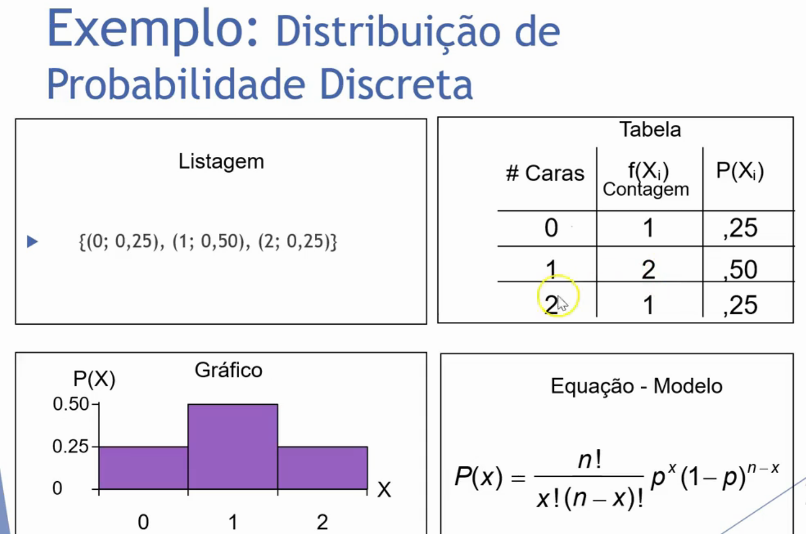
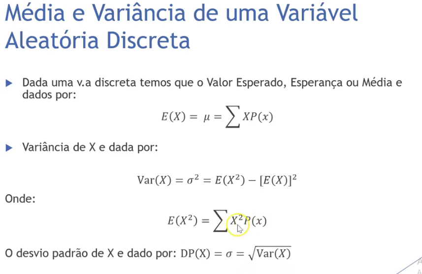
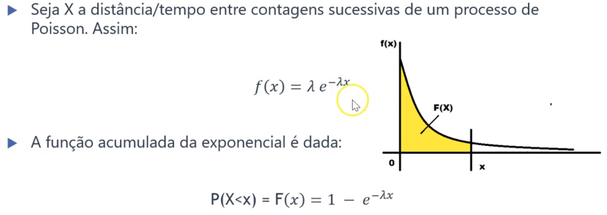
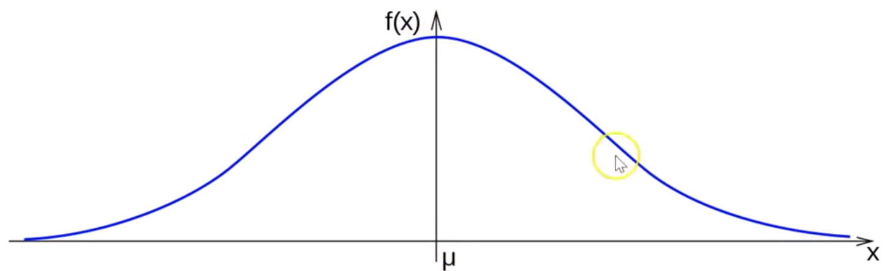
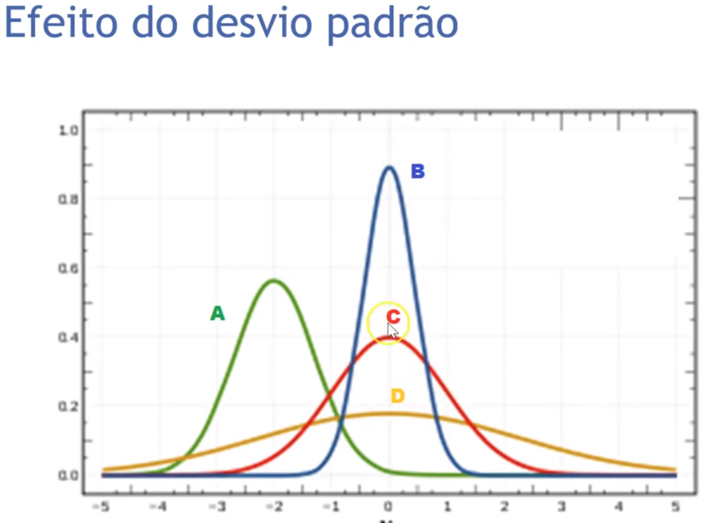
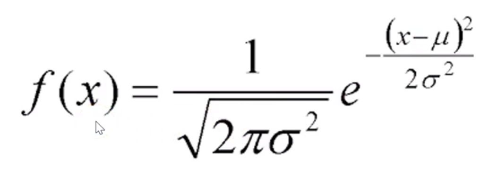
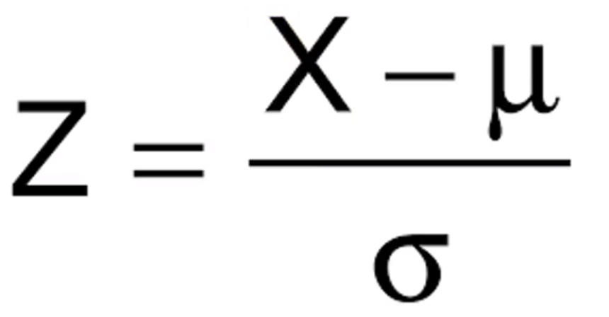
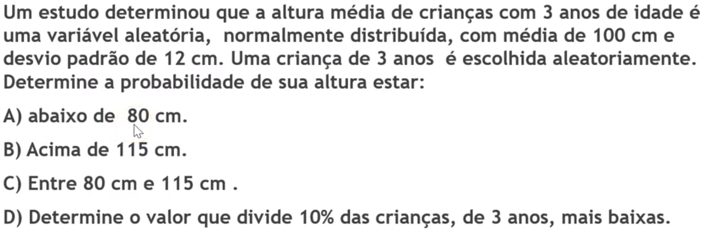
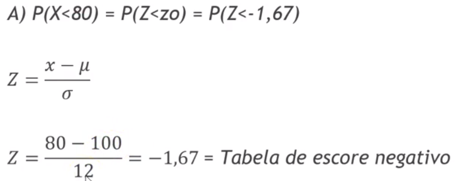
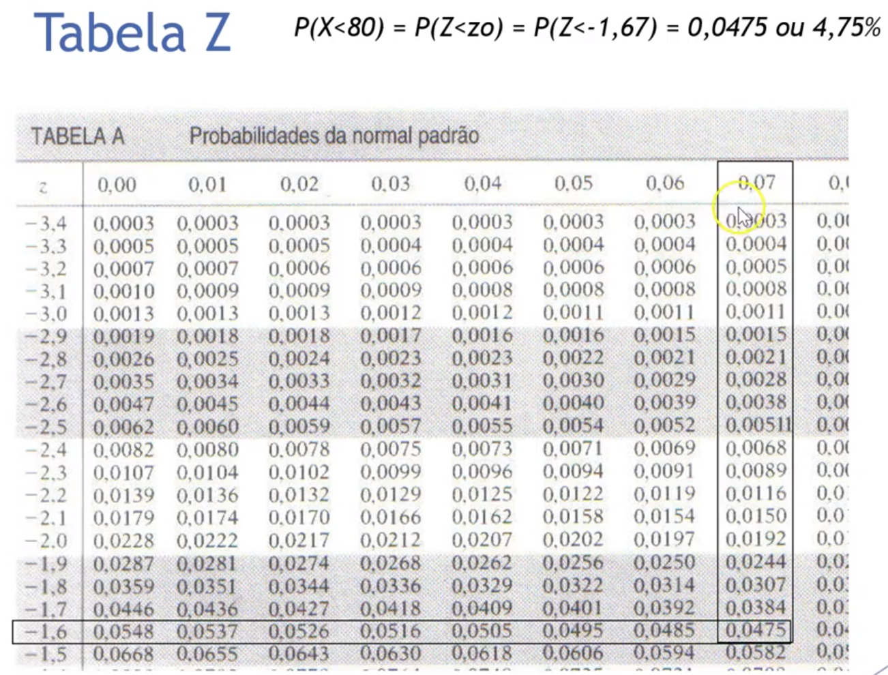

## Notes

Ta tudo no caderno :)

---

## Aula 1 - 09/02

#### Apresentação da disciplina

#### Conceitos básicos

---

## Aula 2 - 23/02

*Vídeos sugeridos na aula anterior: Modulo 1 -> aula 2 e aula 3, com foco na 3.*

---

## Resumo by Camila Nicola

## MV e MTC

MTC- tende ao centro do conjunto (é afetada por valores extremos)

MV - mostra como os valores estão afastados do conjunto

### média (mc)

- simples - soma de todos os resultados dividido pelo número de eventos
- ponderada - resultados vezes seus respectivos pesos divididos pela soma dos pesos
- Aparada - média sem x% dos menores e x% dos maiores valores

### moda

Número que se repete mais vezes em um conjunto

- se não tem moda (amodal)
- Bimodal - 2 modas
- Trimodal - 3 modas e por aí vai

### Mediana

Valor que está exatamente no meio do conjunto depois de organizado. Se o conjunto tem um número par de elementos, a mediana é a soma dos dois valores centrais dividido por 2

### Amplitude

Diferença entre maior e menor valor

### Ponto médio

Valor que está no centro da amplitude

## Medidas de variabilidade

Medem dispersão

Desvio = valor- média (a soma dos desvios sempre é 0)

## Desvio padrão

S= desvio padrão

Resumo : é a raiz do resultado de (somatório do quadrado de todos os desvios de uma amostra dividido pelo número de elementos menos 1)

x=valores do conjunto

Resumo: abreviação do desvio padrão é a raiz de: (número de elementos vezes a soma do quadrado dos valores do conjunto) menos (soma dos valores) ao quadrado dividido pelo número de valores *número de valores-1

**O que está em parenteses deve ser feito antes das outras operações**

### Coeficiente de variação

Desvio em medida percentual

s= desvio padrão

x=média

- se o resultado for ≤  20%= conjunto homogêneo
- se for maior que 20%= hetero

## Escore padronizado

Quantidade em S que uma observação está afastada da média

Se for calculado o eMaximo: vai ser usado o maior valor do conjunto no lugar de x

eMinimo: vai ser usado o menor valor do conjunto no lugar de x

------

## Distribuições de frequência e seus gráficos

### Passos para construir tabela de freq

As classes são o agrupamento de alguns valores(vamos fazer vários pacotinhos de valores ordenados entre o maior e o menor valor do conjunto todo)

1. decidir o número de classes (5-15)
2. Calcular amplitude das classes
3. Calcular os limites das classes (limite inferior é o menor valor e o superior o maior)

O limite de uma classe é o início da próxima. As contagens são as vezes que valores de cada classe aparecem(frequência)

Só pra ter uma tabela e todas as referências de cada abreviação.

Uma coisa pra lembrar aqui... o último valor que está escrito em cada classe NÃO É LEVADO EM CONTA NELA, só na classe seguinte

### Histograma com polígono de freq

Basicamente um gráfico de barras verticais com as classes. Nesse gráfico é marcado o ponto médio de cada classe e os pontos são ligados e as extremidades conectadas ao eixo. Se quiser só o histograma é só não fazer os pontos

Outra lógica pode ser:

- se a maioria dos valores forem menoe que a média, vai tender para a direita
- se a maioria dos valores forem maiores que a média para a esquerda
- se estiverem mais ou menos no meio do conjunto depois de organizado, é central

### Cálculo de média e desvio padrão pras classes

Na verdade é igual a lógica das medidas centrais, mas muda as variáveis usadas

Desvio padrão (mesmíssima lógica de antes), mas agora usando frequência absoluta (fi) vezes o ponto médio (xi)

Mesma coisa pra média

### Ogiva de Galton

Mostra distribuição acumulada de frequência de cada classe. As freq são ligadas para montar o gráfico (a diferença desse pro outro é que não usa o ponto médio e sim a soma da freq de cada classe)

### Boxplot

verifica valores discrepantes(outliers) e um gráfico de comparação gráfica dispersiva

- Percentil: uma medida de posição que, dada uma amostra ordenada em ordem crescente e dividida em 100 partes, indica o valor do qual determinado percentual de elementos da amostra são menores ou iguais a ele.

Nesse caso foram foram considerados esses dados:

- Quartis: São os percentis de 25%(primeiro quartil), 50%(segundo quartil) e 75%(terceiro quartil). O segundo quartil equivale a mediana (está exatamente no meio do conjunto ordenado)

As hastes de máximo e mínimo são possíveis outliers. Aquele O(pode aparecer com * ou outra coisa), significa valores atipicos ou outliers

- Posição: linha no meio do retângulo mostra a mediana
- Dispersão: pode ser medido de duas formas

1- se considerar os valores máximos e mínimos (amplitude), podem estar sofrendo interferência de valores extremos

2- se considerar só o início do primeiro quartil e o final do último, a estatística é mais robusta e confiável

- Simetria: Um conjunto de dados que tem uma distribuição simétrica, terá a linha da mediana no centro do retângulo. Quando a linha da mediana está próxima ao primeiro quartil, os dados são assimétricos positivos e quando a posição da linha da mediana é próxima ao terceiro quartil, os dados são assimétricos negativos. Vale ressaltar que a mediana é a medida de tendência central mais indicada quando os dados possuem distribuição assimétrica, uma vez que a média aritmética é influenciada pelos valores extremos.
- Caudas: são essas linhas vão do retangulo até os out (num vou escrever esse nome todo o tempo todo deus me dibre)
- Out: observações são consideradas outliers quando estão abaixo ou acima do limite de detecção de outliers

(!!!!!! IMPORTANTE )

## Probabilidade

- Evento aleatório(E) -Processo de obtenção de um resultado (jogar moeda, dado e etc). Esse evento é obrigatório pra conseguir contagem, medição ou resposta
- Espaço amostral (S)- todas combinações possíveis dos eventos aleatórios
- Evento(A) - conjunto específico de S
- Resultado: resultado de uma única tentativa

### Prob classica

Supondo que a chance de A e B são igualmente provaveis. N(A)= número de eventos favoraveis para A acontecer

N(S)= todos os conjuntos de eventos possíveis

### Prob Frequentista

Mesma fórmula de cima, mas é calculado o número de vezes que A ocorreu sobre o número de vezes que o experimento foi feito

### Abordagem axiomática

- A probabilidade de um evento acontecer varia entre 0 e 1(sendo 1=100%)
- A probabilidade do espaço amostral inteiro acontecer é 1(a soma da probabilidade de todos os eventos deve ser 1)
- Se A e B forem mutuamente excludentes, a prob total é a soma dos dois

------

## Eventos

### União (A e B ocorrem simultaneamente)

Soma de prob de união: P(AUB) = P(A) + P(B) - intercessão A e B

como a interseção já é contada em uma das probabilidades, ela deve ser retirada uma vez para não ser contada duas vezes

Se tiver mais um evento (ou círculo), a probabilidade dele é adicionada na soma e todas as intercessões possíveis são tiradas ao fim

- Se A e B forem mutamente excludentes, é só somar as prob

### Interseção(aquela meiuca entre A e B ocorre)

P(B|A) = ocorrencia de B dado que A aconteceu

Se os eventos forem independentes é só multiplicar por B

- a prob condicional é a mesma fórmula, mas passando P(A) como divisor para o outro lado

### Eventos mutuamente excludentes (a e b não tem casos em comum)

Se acontece A, não tem chance de B acontecer

### Eventos complementares (eventos de S que não estão em um dos eventos esperados)

Ac= 1- P(A) (justamente pq a soma de todas as probabilidades sempre vai ser 1)

------

## Partição do espaço amostral

A junção de todas as partes de A é S

Ai= qualquer parte do conjunto(i=numero que tá aí em cima)

p(Ai)>0(então eles precisam ter chance de acontecer)

P(B) = vamo com calma aqui

1. Calcula a probabilidade de Ai acontecer e multiplica a prob de B acontecer dado que A acontece. Se B não acontece, ou não faz parte de A = 0
2. Repete isso pra todos os Ai possíveis
3. soma o resultado de todas as vezes que cê fez esses passos. Se tem 7 Ai, soma os 7 resultados diferentes de cada Ai.

### Teorema de Bayes

Calcula o contrário de Ai acontecer dado que B ocorreu

Isso aqui é só uma fórmula normal de probabilidade, mas levando em consideração o A específico. Como o evento depende de B, é a intercessão de Ai com B dividido por P(B)

Isso aqui tb é a mesma coisa, mas com a fórmula aberta

------

## Variáveis aleatórias

Discreta - obtida por contagem e assume números (mesmo que vá até o infinito)

Contínua- uma medida não contável

### Discreta

Lista todos os casos possíveis e as probabilidades(como se fosse um gráfico cartesiano)- até pq vira gráfico depois

{Listagem dos pares igual o modelo acima}- sendo X o evento desejado

### Probabilidades binomiais

Dividindo essa coisa enorme aqui:

1- Primeiro acha as combinações que satisfazem o que a gente precisa

n= número de vezes que o evento vai acontecer

x= número de vezes que precisamos que algo ocorra

2- p=probabilidade de sair o que você precisa uma vez

(se precisa acertar 1 questão em 3 no chute p=1/3) elevado ao numero de vezes que voce precisa que esse evento ocorra - aquela probabilidade condicional de E. Isso tudo vezes a probabilidade de não acontecer o que você quer, então acha a prob (1-p) elevado ao número de vezes que sobrou

------

## Hipergeométrica

---

## Distibuição de probabilidade discreta

---

## Aula 13 - 13/04

#### Poisson

Na teoria da probabilidade e na estatística, a distribuição de **Poisson** é uma distribuição de probabilidade de variável aleatória discreta que expressa a probabilidade de uma série de eventos ocorrer num certo período de tempo se estes eventos ocorrem independentemente de quando ocorreu o último evento.

![Distribuição de Poisson - Uma fórmula para calcular a distribuição de  probabilidade | Cibersistemas.pt](data:image/png;base64,iVBORw0KGgoAAAANSUhEUgAAAUMAAACcCAMAAADS8jl7AAABnlBMVEX///8AAADx8fHV1dU6Ojr6+vr19fXDw8MUFBSKiorNzc1OTk7u7u7r6+uioqL8/PxjY2NtbW3a2trj4+OEhIQ/Pz9ERESYmJjm5uZbW1saGhozMzOSkpIQEBDY2NhoaGi2trZ5eXlTU1MoKCisrKwhISH///ixsbF9fX0sLCy9vb2mpqZKSkpzc3Pr/P/1/////+P///H54citmIqLpMvYq4BUNBhXsODptIJUIQAAZLn/67V8XlV4qM//8sB3RBwARanQm4mavNTRf0clV64ydcHAaj48lNXv5dbCrJN+gqTL4/Hnw5dwY3Sk2fb415xYKwBsOQAlg7/i8v7lsWodAAAAQLV8Si1twebFt6qdi3EAAF6z3vFSNTw8MSWiaEIAABxwu8WbYE5imNHBils0DQAJJBkAAEZ0Vi8iWEgyZKVJKAAAE0Z4jWUtMnMpAACqfmx/mK/mxpVhPxUAACRFRo2ceHLvtGcpVonck1dPHhM2AAAPQW1sjKk6GQAAKlbqxa6gXzyFUG1yXGopf6pYg7C3kW21dEc9aZVaZngf6H9PAAAMR0lEQVR4nO2d+4PaxhHHGUASbyGJlwAdQjyPh33n1qkT20nb1PalvtpNbTdx49Zp3DZu7NZxk6bPNE7bJM1/3Z2VAAFaYfAdGLSfHwwCCYsvszOzs48LhTgcDofD4XA4HA6Hw+FwOBwOh8PhcDgcDofD4XA4nMBz7jvfPbPpe9hu2udfAfje2U3fxlZz4VUAeI0b4gtw8dLlM6+/8f1bm76PLab9gx8SE3zzR1zD1WmLMvn3zSsBb8uy69/VaF+9FqyYIouiKE8Ojt768XWiwvFPbqz+kTd/Gqy4nOrvQzkzEvH4bRJUf3YrdPsO/HxlGV5/B94NkoZakogG+x3n8OjuL16B9+7d/GXhV1dWleHg/p33bwRIQy0KYBARc5OXzj+CX3/w4Ky6alQ4/M1vf/fhvRO5u61ArIFe71qGW8OLD+H3Hy0WMJx2Ex571MPzjx7/4Y8B0tCEqhgKlWpQF8avHdx/8v5id3bwcdbN01E+2P7TJ58+uP3n66d1xy8dqViRPiZASU1evfDo8WJ3dvCZ4qL2dCTauYfw0a2/BCjFrur2YwSG4cmrtz+Ba6s6w3P37/z1XuhvVwKkYcR+jEB38uK5j/8Oq9rR0df/+OeNs+2rJDsKtYXF5+8QEVdMOTz/+Qf/eu/e4SoqHp5/9QvSXT68eo1c/SxAcSWEGsbpYzsltI+/vXfhEbx788HyGd7h8duPLxP1Dr587Vbo3L+DpaEENLa0n8WfvvWfy2cuvgP//Wz5rl77+OGnX2FsOfjyw6d33whWlzkcj/Xx8eDrJ/DFV7dCh9/cefxg6ajSPncf/kfD8+E3T8B5GhSETrli4pP2s0vf0kTv+NLnHgqkpH6xmOlLovfHtI/u9q/btoefEygJ5UQUChJ92j5SqQiH6nxEUTPDgV7PxiBfDc+9OUP7KBKc5AZRLQArsuAksZM19M5eWsuQDrYZrKxlMakaAGRL/ieVco1yVcM+cZicPkz5nx00hC7Wvob+Vev0EBpFuwWLClE8vY472x4ygMWvru85qTrEqk4kkQoAfd6W3fTKAIWMu/Q1jxifNHaZPC+r67izrUHdB2iYCaj6nCNL5JyMc9AkFzS5GboQ80BaqdCDjM9JKdJ6a7YzlJsVgOLC1CZQkKwGaoKQKTfZ5wh9Yoa0GxPSui2I9hgpdkCpEwkLIunqVXrsk1Kk9VoaeaLFSWoY115k3Hn3IAYGLRIr0krBJ8XeQ1vVOvVCjOQ3GneFUyQwMUyQJ6UktTNvhCpQKsOmJnAbnCYVI8rQWKJVsmwfFyYNuFUVZS6fByTCgkKfacaQfVoYbdBczy1tGxiSK/ZTFRwNI5n5No0aRs313dcWkUMf5zxXHXuU47n5YgJq2HCnj7LGkxtKB53hyOhU0GlPrtMy588MN8ZtnlLK6uwAtGaWjXHySWYVERRmnBOqpK8iC2KnXPeogNG4PDZEuRfVF5TJTgJZcMOIZ7Kqm8zLnEuEqVcSXenEVEyTLp6ri6zixC+9AVHJ62QNW30rExYFUYxkIb6Onp7azLjom4lUeO7Li8XYcNqrpM3JNY5YkxeapPWEi+Vc6WQSDFHHquvkWLMzQEaHTyjSd1tKTtknEXotOU5PSZZhCquZnv6ftUHZnLlKrRcM+5voSofKK9SsmH33hS4tNvX2kydjirlyzBi4fsJUnSbRrKqgmKvYt2ZE42toxw5mC//LrJKLx3M6tpuB5BJRjlT2PVqN0N/Hq9zGgPXRSn18rpQ3TqLsVCqS25oSo9S1rHqCfUWibg0GllJca92w4MocEjhekXeJlqgYnvdr96rcbxENLXc1oFc5rdrdoggnamvPaND29NFBukZ77aNDtQAZ7zvuVdzRkvqp7N7UGf1yOShjaiqKYY4PsXNf7jsHpSxYjNBWGpIT4+M0V7RAmfE/xHNFF41i7ggZDCoT21dJtx26tnBCzgCJ1XDQ/w1GBitWoTY3ftbLQzcYA5PYeKOTQw37plnbIfeiEGUGNxPt17EzseghYUjsAnSC0JrFwlQKay9fsD0b+sYM0zurWRiN+BAJPcfNm/uQD8KwWg+TFNcXVTHVqVOj6pNO1h7rOjrwCAqeKGYg69kt1Uh+XA1Ap5+4PCi7jiXMWegEvxSJGgOfPLVPsuqGalsho2dPGnPrpen0nx7YlXJVNWk3wE4Q0eF51JfGSAOaIaKErAZbNYIwwBvB7HCSU8s9ug4J2x9tq349TrRTKJZ8JAzhCG9y50NzEd3fJAVMYFTWqSY0Zvjmd9hVSdZ9JAwlBtPOdjdRULOxsUk0sbGFw6ZssENKyJ6KYYDuo3N6ErvdryZYbGWzL2Emo9huPyXlSJ5j5JwgQGsIvja0h7406Wuq+BPVZyKz3CskvXl5is7L0MFEuWUNc/F4N4uuUZGcXJm6w6T/l8LZgLqvu0OXmZ/pLQpNYLGVzR5He/aLCi1kQUXJJMa5TBoDdM23BCeiQmXfKZJ0zuVsj7sksdjGXFJEf9VNpTVV3VNVLe36Dnv0LT+BxGp5tv41Bx2R28oW+txIeaYINKT6pYckL9SxPuHbEanGFqnMRtYiG0FdrjUU0ZK8bY3K66MhkdDaQzMb+DlEaqqeo0eLKXUr0U1g+cwr8wAdGmP6ygINUcKIHZL82jv9kXqrDQ2VaszYc6p4DVyzwcUe0PH+hjgdnK0hkTCZcAplfhK9iIayGN4MS2WpmCQDI/TS3jArpjgS2oY89PEftC2v6A+3A3RnBYapRTCBni3vOwgZGNjCoEYtPw1j841d6EDME8M/pX8poYuOWGE1RRNoz7SESFhwbIt6TZ/cheY2M78SO8eObZ+GPRSA2SPGGQN5L3lcEoZktNYq29/V0UfP5NhyhPSKPFm8PvGlA+suLWZPJGPYJdZZRJeEtkgNdmP2Cfw7gYjfX2FmL3TMad5KiYTuMXwcL2A3ZhG9xS4XYalIff8xp7mQmopPtttCIpgC1VmNmSZPO9zVk6m/9ylUVz1sSCOGNbXkME13MWPJ1COdwfyu1rEFUbRnHdU1kWWJZnQ0wDe6Ji1hyx2mRjsQyqNP2dfColeLxSr5rjbldKdbMAzMyaCixBkihuvTgdkcNgCvMfJxJ9Qk4gP7UwzQ416ZNMmPYuubwbZe1OokvcjFWYbSbEwNqBRH1+RG89LM3Phjcl0PDTEBZf1CAQHHSdnzHJ6DToW08hO7ne1EKkD+BZqi3H3B32AnKJZ9R5gXkLD4Zgq4SBMKKzdGoQp+Szw3QGojaRYxpZWDgpRvrFg5XIm5ar5rLCFBxZPinsnDqZNIgs+ydT+0bIPdCToFulZ+QNGHGSpZOJMdFMhxIT+g0w5whm9lIw0joRudxWfNoyr55lrjidSkHS8odCSVmr8YMetYAq50M3RLAiwxGf77upwWkVyrv3yTjNQsc90hGXcEAsO9cwv2NYc9p6JGR3J1zytPnVQzX13SGYdNJRdZ/0JsdUZDoWrAZKVPY4MaYp9uSTeiZcxNhEABx4Bqk+Ne1HD9+vim+901E15SEXEztRq5Q1RKjuvGEQuKLn+CtUyjvon72ipKWEMaLa7ZyxpTOwThJKyy3x5NHAS3YhrVN9XatIQhHAprrZioBQgBbS1LlVMVY2aIC/NDr/WbnGkimCCiTqoCs6OEaVg0KZWDpHGlSJGOWcyvocfB3sCXkRYTprMmvSVEDQsbuKdtg86hyPZqkPMY7m8BWOu/pe0Dt3soV0YLX6cZTG0MwWGRxqm53hKSJJun2M9DGIs3jOWDcYjxFPt5wCxw4J0F9lk7unCmCOPslLL3jrEJaPEUezEinbri/IGVWUp8pPY5EAegY+3GexmmDBW+ueQiiIRZWoj13kdSdu9bwfEEJZTtDSmKXu/LrcG6b2nbIL4QVxGHcc5f16tfLA82NhKwJaCEdPYVZjeW10CyPNzMqN7WMJYwpDZYtVaVV778COsjCe1dtHiHZGlSEwmd2g03uSVJEwknUQQdYsOcP0su8VloTFR9agcYlW6/Nb8nq6nUT26b2h0jUZjeCYI6xORcZMYODO8we1LCdTb77ldUnJ0EudkZvLgcx715NsdGk8whrTI0JUcyUerZ879AMaWpv59C54rwIuwcnZpl6UhSd9quWtPtV8hDdurP+PRaMFoyzHHh2jbDkSvl3t5iOg6bxSJ3hxwOh8PhcDgcDofD4XA4HA7nNPg/roL3XFGXDUwAAAAASUVORK5CYII=)

> Lambda = média de acontecimentos do evento em um intervalo qualquer
> x = número de vezes que eu espero que aconteça o trem
> euler = constante = 2,72 aprox

---

## Aula 14 - 20/04

#### Distribuição exponencial

Essa distribuição contínua que pode ser utilizada para descrever as **probabilidades envolvidas no tempo que decorre para que um determinado evento aconteça.** Existe uma conexão muito próxima entre a distribuição exponencial e a de Poisson. Ou seja, é Utilizada para descrever o tempo entre as ocorrências de sucessivos eventos de uma distribuição de Poisson. As relações entre as distribuições podem ser associadas a um processo estocástico, chamado deprocesso de Poisson.

Como exemplo podemos estar interessados em algumas quantidades, como onúmero de chegadas em um determinado intervalo (contínuo). Essa quantidade é descrita por umavariável aleatória Poisson. Outra quantidade de interesse poderia ser adistribuição do tempo entre chegadas, onde essa quantidade é umavariável aleatória Exponencial.

Seja X a distância/tempo entre contagens sucessivas de um processo de Poisson.

- Exemplo 
  - o tempo entre as chamadas telefônicas
  - o tempo entre as avarias de um equipamento.
  - o tempo entre as chegadas de táxis a uma interseção movimentada.
  - o tempo entre as chegadas de aeronaves a um aeroporto específico.

Exemplo:

---

## Aula 15 - 27/04

#### Distribuição Normal

*Utiliza-se a média e desvio padrão como parâmetros.*

Em meados do século XIX, Frederick Gauss, com seus estudos sobre eventos da natureza, observou um comportamento padrão entre as amostras estudadas por ele.

Esse comportamento, posteriormente foi apresentado como a Curva de Gauss. Que mostrava que grande parte dos eventos ficam em torno de um valor médio, com uma certa variabilidade.

Uma distribuição estatística é uma função que define uma curva, e a área sob essa curva determina a probabilidade de ocorrer o evento por ela correlacionado. E o que é distribuição normal? Me arrisco dizer, que é a mais importante dentre as distribuições estatísticas.

**A curva de distribuição normal representa o comportamento de diversos processos nas empresas e muitos fenômenos comuns, como por exemplo, altura ou peso de uma população, a pressão sanguínea de um grupo de pessoas, o tempo que um grupo de estudantes gasta para realizar uma prova.**

A distribuição normal pode ser usada para aproximar distribuições discretas de probabilidade, como por exemplo a distribuição binomial. Além disso, a distribuição normal serve também como base para a inferência estatística clássica.

Nela, a [média, mediana e moda](https://www.voitto.com.br/blog/artigo/media-moda-mediana) dos dados possuem o mesmo valor.

> - Descrição de diversos processos e fenômenos;
> - Pode ser utilizada para aproximar distribuições discretas;
> - É a base da estatística inferencial.

D = Desvio padrão **alto**;

B = Desvio padrão **baixo**.

##### Fórmula

Serve para todo mundo:

Chegado ao valor de *Z*, a probabilidade é obtida por meio da tabela dos escores da distribuição normal padronizada.

#### Exemplo

---

## Aula 16 - XX/XX