## Notes

*Todas as anotações relacionadas ao material online da disciplina será escrito na aula respectiva aos vídeos sujeridos.*

---

## Aula 1 - 03/02

#### Apresentação da disciplina

- Diferença entre **dado** e **informação** -> Dado é a matéria prima. Dados tratados (ex: clusterização), dados interpretados, conclusões tiradas a partir de dados são informações, são úteis, contextualizados. Dados avulsos podem até ser interpretados de forma errada, se utilizado sem contexto e informação.

---

## Aula 2 - 10/02 - Unidade 1

*Vídeos sugeridos na aula anterior: Todos da unidade 1*

#### Introdução à BD

Antigamente era usado a **"Abordagem isolada de arquivos"**. Os dados eram armazenados em arquivos individuais, cada sistema tinha sua base particular, isolada (sem comunicação direta entre eles - sem um controle centralizado). E consequentemente com alto risco de uma base ter características diferentes das outras (até na tipagem e estrutura dos dados). Segue alguns problemas desse padrão antigo:

- Redundância de dados;
- Inconsistência de dados;
- Dificuldade de aproveitamente dos dados existentes em novas aplicações.

Pela existência desses problemas/dificuldades/limitações foi criada a tecnologia da **abordagem integrada de banco de dados** (abordagem atual).

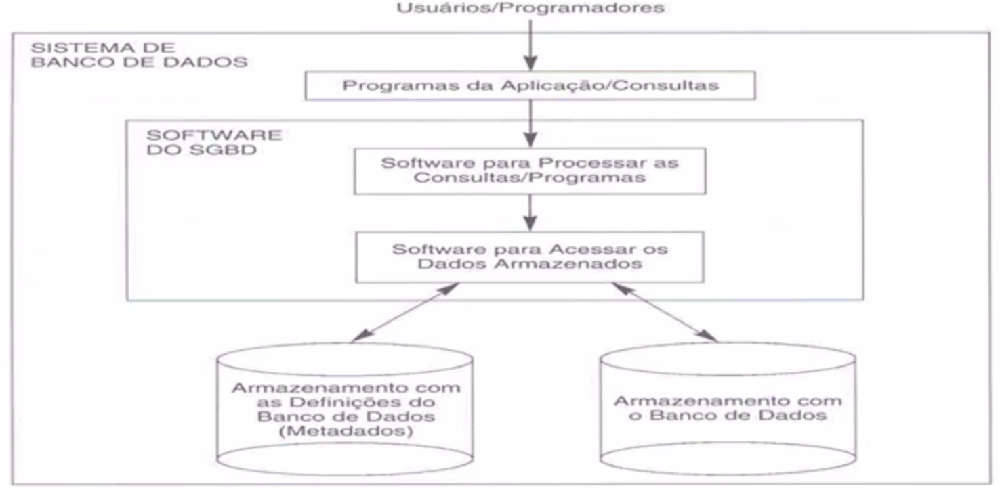

#### Conceitos

- **Catálogo** (metadados): possui dados a respeito de como aquele banco está estruturado (tabelas, atributos, índices...) para organização interna do sistema;
- **DDL** (Data Definition Language): Comandos para criação de estruturas. Ex: Create table, indices, relacionamentos...;
- **DML** (Data Manipulation Language): Comandos para manipulação do conteúdo do banco. Ex: Inserts, deletes...
  - **Procedural**: Necessário especificar QUAL dado é necessário e COMO obtê-lo. 
  - **Não-Procedural**: Não define COMO os dados serão acessados. Padrão SQL. Ex: Select básico.

#### Funções/Cargos

- Admin. de dados (**AD**): Atua na parte lógica, conceitual, modela o banco de dados de acordo com as necessidade do négocio. Precisa saber muito sobre a organização, sobre o funcionamento do negócio;
- Admin. de BD (**DBA**): Atua na parte física do BD, vai implementar ele fisicamente com o SGBD escolhido;
- Analista de sistemas (**desenvolvedores**): Faz a conexão com o sistema, todas as queries... Desenvolve a aplicação que irá usar o BD e permitir os usuários finais a acessar, armazenar e modificar seus dados. E em algum momento trabalha com os outros dois, pois faz levantamento dos requisitos do usuário final e o sistema faz relação com o lógico e o físico.

#### Arquitetura de 3 níveis

- **Nível físico:** Principal nível de atuação do DBA. Nível mais baixo, descreve COMO os dados estão armazenados. Trata da estrutura do BD, uso de índices...
  - Independência física: Quando alterações no nível físico não provocam modificações no conceitual.
- **Nível Conceitual:** Principal nível de atuação do AD. Baseado na modelagem dos dados. Descreve os dados, seus relacionamentos... Que queremos armazenar e estruturar.
  - Independência lógica: Quando alterações no nível conceitual não provocam modificações no visão.
- **Visão 1, 2...:** Visão de cada usuário, podendo ser um desenvolvedor, o usuário final... 
  - Exemplo um sistema de folha de pagamento, o usuário final consegue ter acesso aos dados através do sistema, sem acessar diretamente o BD.

#### Etapas usuais de um projeto de BD

1. Levantamento dos requisitos (Requisitos da aplicação).
2. Projeto conceitual (MER).
3. Projeto lógico (Modelo relacional, OO...).
4. Projeto físico (Implementação).

#### SGBD

Sistema Gerenciador de Banco de Dados **(SGBD - DBMS)**: Software que administra o banco. Possui funções de recuperar dados, alterá-los... Criar e manter um banco de dados. *Facilita o desenvolvimento. Proporciona um ambiente conveniente e eficiente para manter um BD.*

##### Propriedades do SGBD

- Integridade
- Segurança
- Backup e Recuperação (Restore)
- Concorrência: Acesso múltiplo sem inconsistências nos dados. Ex: E-Commerce (se um cliente compra o último item do estoque, essa informação já é acessível para todos os outros usuarios).
- Monitoramento: Ajuda a avaliar o comportamento a cada momento (caso de instabilidades no sistema...).
- Natureza autodescritiva do sistema de BD: Não tem apenas o BD, mas definições/descrições de suas restrições (catálogo)...
- Isolamento entre os Programas e os dados - Independência dos dados.
- Suporte para as múltiplas visões de dados: Permissões de solicitação de dados...
- Compartilhamento de dados e o processamento de transação multiusuário: Controla o fluxo de dados mesmo com vários usuários armazenando e solicitando dados. 
  - **Transação:** processo que inclui um ou mais acessos/operações ao BD. Ex: Transação bancária, são necessárias duas ações, débito em uma conta, e crédito em outra. A transação gerencia tudo para que todas as operações sejam feitas completamente, ou executa um rollback se necessário... 
- Controle de acesso e autorização.
- Controle de redundância.
- Persistência de dados
- Múltiplas interfaces para os usuários
- Armazenamento de estruturas para processamento eficiente de consultas (Índices...)

---

## Aula 3 - 24/02

*Vídeos sugeridos na aula anterior: Os dois primeiros vídeos da unidade 2*

#### Revisão da unidade 1

#### Modelagem de dados

Coleção de ferramentas conceituais para descrição dos dados, seus relacionamentos e restrições. Permite organizar uma estrutura bem definida e estabelecer regras.

- Antigamente utilizava um modelo hierárquico: Estrutura de árvore. Possui limitações de relacionamento (muitos <-> muitos)
- Modelo de rede: O problema anterior é resolvido com esse modelo (é uma evolução do anterior), que baseia-se em ponteiros. O problema é que essa estrutura não é muito trivial.

#### DER

*Diagrama de Entidade-Relacionamento*

É uma boa forma de representar os requisitos funcionais levantados na análise inicial. E também possui grande capacidade semântica, facilitando a compreensão pelo usuário leigo, por exemplo.

- **Entidades**: objetos do mundo real (Ex: Cliente), estruturas abstratas de informação (Ex: Nota fiscal). Representação: Retângulo.
- **Atributos**: Dados que identificam e descrevem as Entidades. Ex: Fornecedor -> Codigo; Nome; CNPJ... Representação: Elipse.
  - Simples: Indivisíveis. Ex: CPF, preço, altura...
  - Composto: Divisível em subpartes. Ex: Endereço -> Cep; Cidade; Estado.
  - Monovalorados: Único para uma dada entidade. Ex: CPF, nome, altura...
  - Multivalorados: Múltiplos valores para uma dada entidade. Representação: Elipse dupla. Ex: Telefones e endereços. 
  - Derivados: Computados/Calculados a partir de outros atributos ou entidades. Representação: Elipse pontilhada. Ex: Idade, IMC, total da nota fiscal...
  - Atributo chave (PK): Identificador da entidade, dados únicos por entidade. Representação: Atributo grifado. *Podem ter mais de um atributo chave.*
  - Chave composta: Vários atributos formam uma chave. Ex: Nº da nota fiscal + nº do item; Nº da agência + nº da conta.
- **Relacionamento**: Associação entre entidades. Representaçã: Losango.
  - Cardinalidade: Propriedade que expressa o número de ocorrências de uma entidade para outra.
    - Um-para-Um: Técnico e Time;
    - Um-para-Muitos: Proprietário e veículo;
    - Muitos-para-Um: Veículo e proprietário;
    - Muitos-para-Muitos: Paciente e Médico, Professor e aluno.
  - Totalidade (obrigatoriedade): Especifica se a existênciade uma entidade depende de seu relacionamento como outra. Ex: Sócio e dependente.
    - Pode ser parcial (opcional) ou total (obrigatório).
  - Relacionamento recursivo: Uma ocorrência de uma entidade se relaciona com outra(s) ocorrência(s) da mesma entidade. A mesma entidade participa mais de uma vez em um tipo de relacionamento em papéis diferentes. Ex: Música pode possuir várias versões que também são músicas.

---

## Aula 4 - 03/03

#### Exercício de modelagem

---

## Aula 5 - 10/03

#### Relacionamento Estendido

##### Entidades fracas

- Sem chave própria (depende da entidade forte). Possui uma chave parcial;
- Instâncias identificadas por meio de relacionamento com entidades de outro tipo (identificador, junto com os valores de alguns atributos (chave parcial);
- Representação: Retângulo duplo;
- Ex: Banco (Entidade forte) - Agência (Entidade fraca)

##### Atributo do relacionamento

Relacionamento entre entidades e não específica de uma entidade.

##### Grau de relacionamento

- Número de tipos de entidades participantes de um tipo de relacionamento;
- Binários, em sua maioria (grau 2). Podendo ser também ternários (3 entidades ligadas à um relacionamento);
- Entidades atuam com um determinado papel nesse relacionamento.

##### MER Estendido: Generalização e Especialização

- Generalização: definição de um tipo de entidade genérica (super-classe ou super-tipo) a partir de um conjunto de entidade. Ex: Pessoa é uma generalização de pessoa física ou jurídica

- Especialização: processo de definição de um conjunto de subclasses (sub-tipos) de um tipo de entidade. Ex: Cliente especial é uma especialização de cliente

```markdown
Uma entidade de sub-tipo herda todos os atributos e relacionamentos de seu super-tipo;
Uma entidade de sub-tipo pode possuir seus próprios atributos e relacionamentos específicos.
```

Restrições

- Disjunção: sub-tipos podem ser disjuntos ou sobrepostos. Cada entidade do super-tipo pode pertencer no máximo a um sub-tipo de especialização - ou você é um, ou você é outro - (OU exclusivo -XOR), representado por um circulo com um 'd' dentro;
- Sobreposto:  Cada entidade do super-tipo pode pertencer a mais do que um sup-tipo (OU inclusivo - E/OU), representado por um circulo com um 'o' (overlap) ou 's' (sobreposto) dentro.
- Super-tipos podem ser total ou parcial.
    - Parcial (linha simples): podem não pertencer a um sub-tipo;
    - Total (linha dupla): tem de pertencer a pelo menos um sub-tipo.
- Combinações possíveis:
  
  - Disjunto / parcial
  - Disjunto / total
  - Sobreposto / parcial
  - Sobreposto / total

---

## Aula 6 - 31/03

#### Modelo relacional

---

## Aula 7 - 07/04

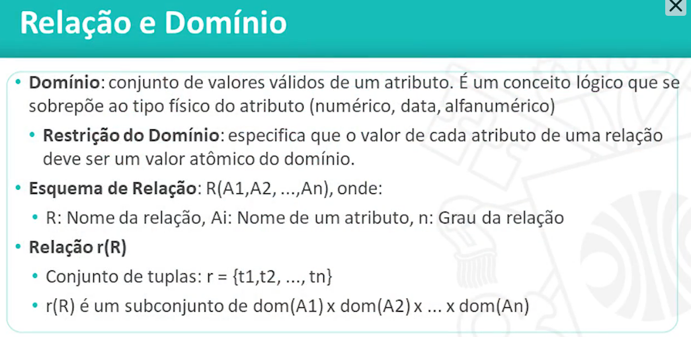

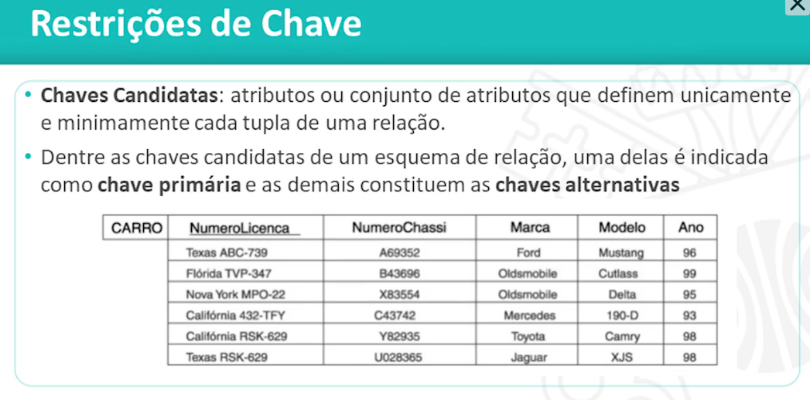

#### Integridade Referencial

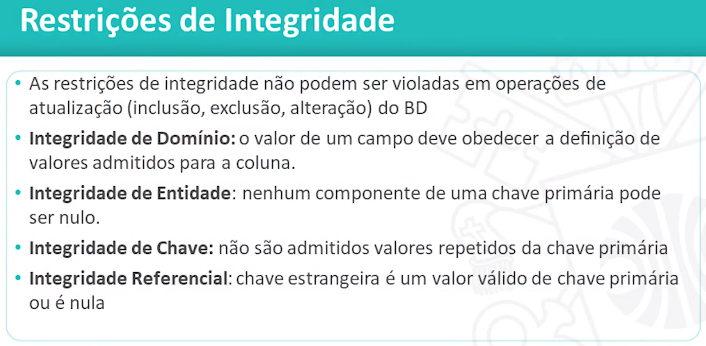

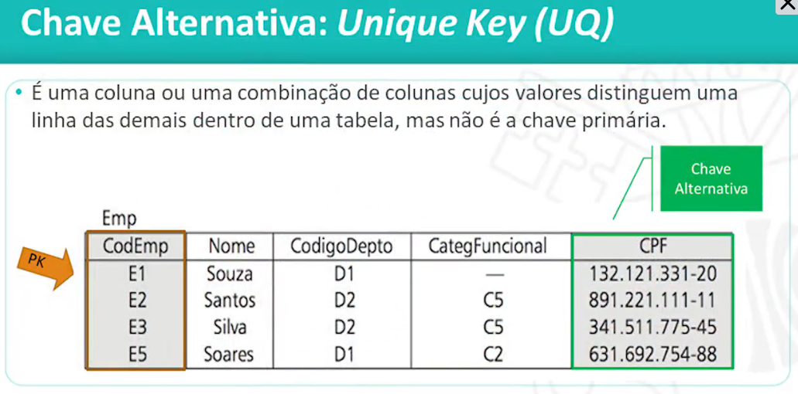


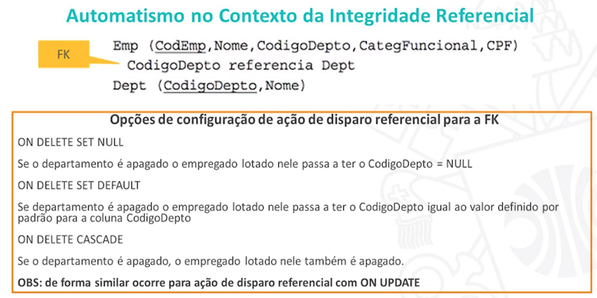

#### Normalização

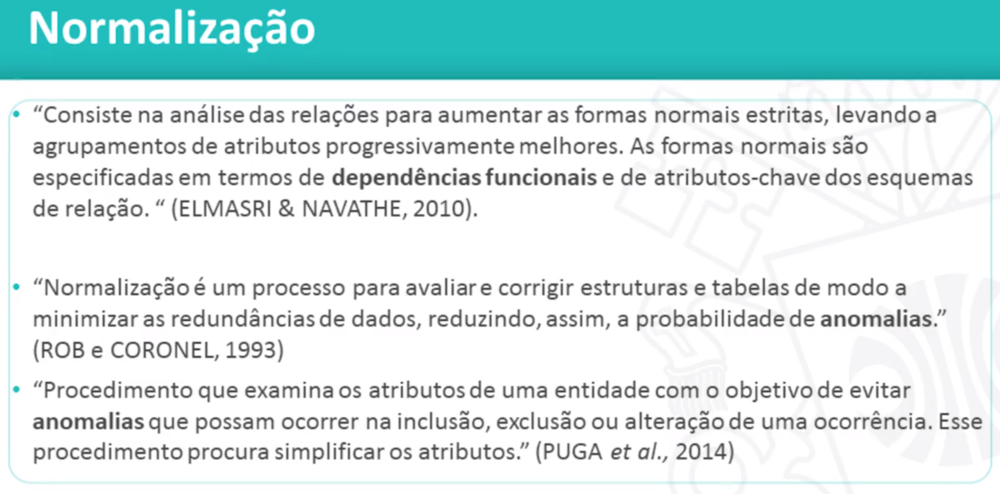

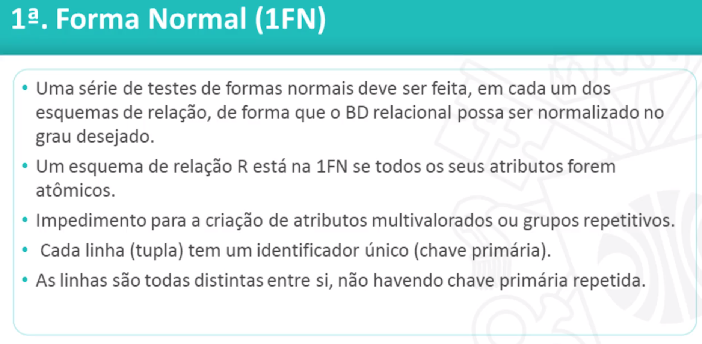

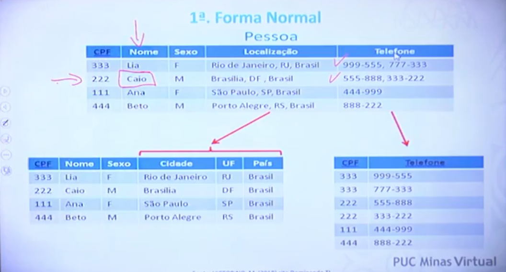

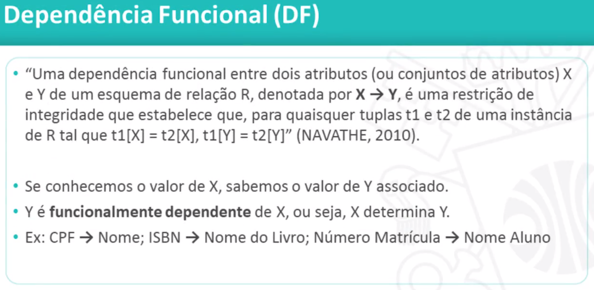


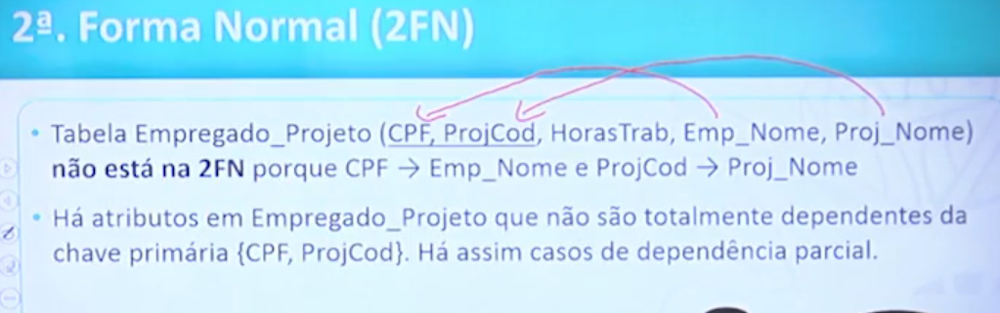

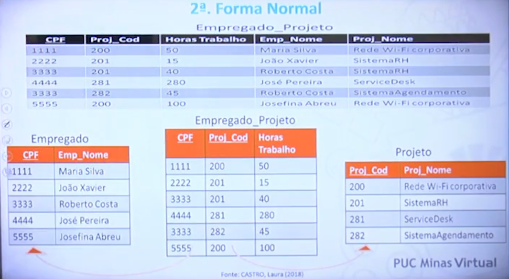

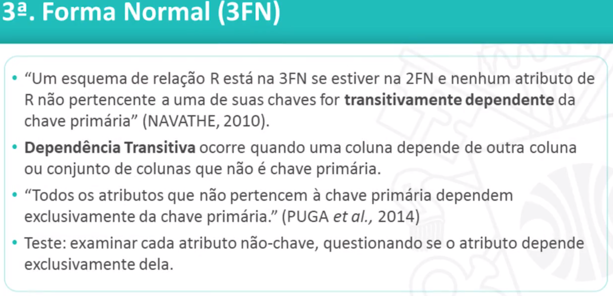

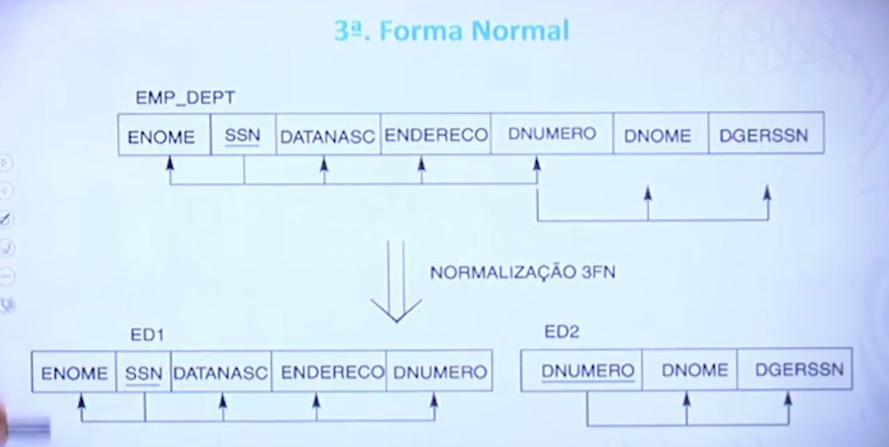


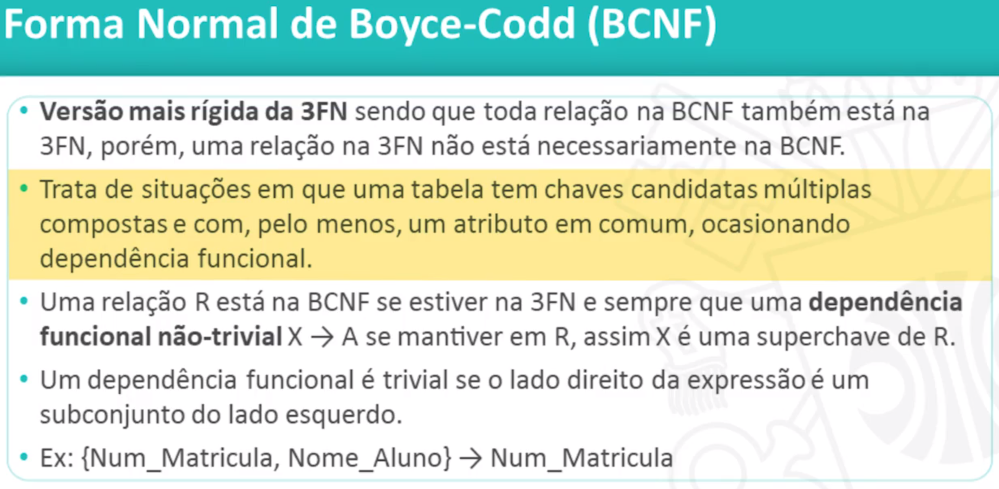

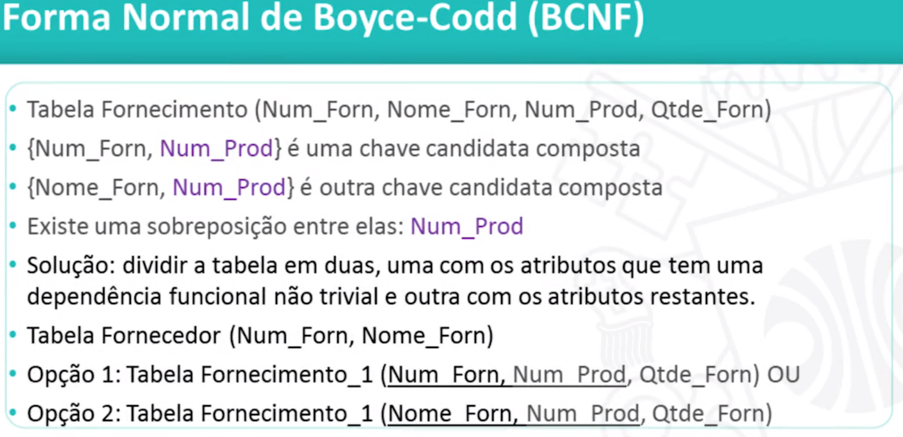

---

## Aula 8 - 28/04

#### SQL Básico

---

## Aula 9 - 05/05

#### Comandos DML básicos


