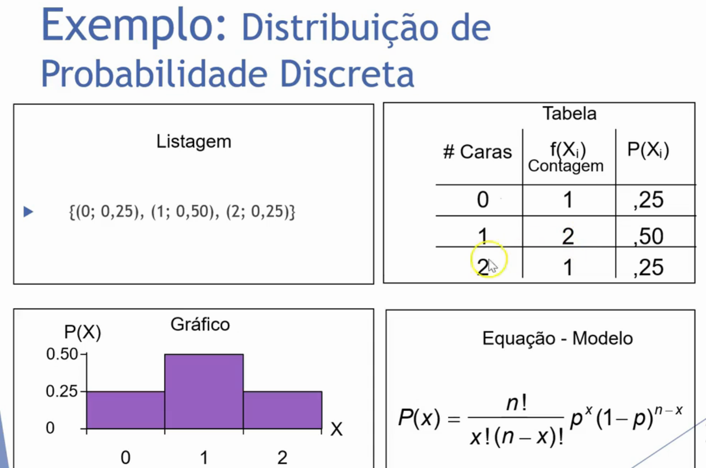
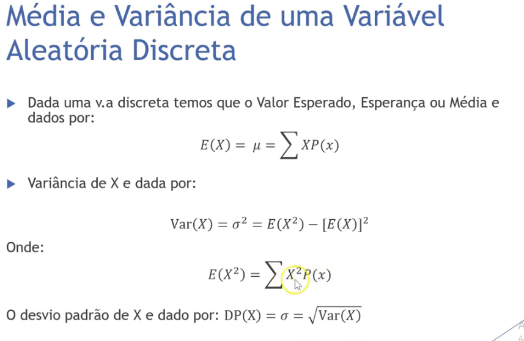
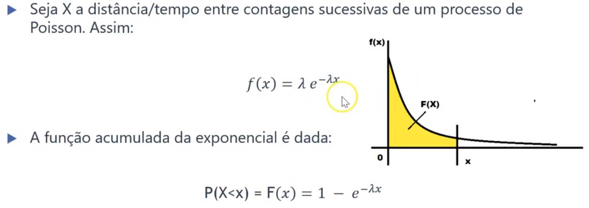
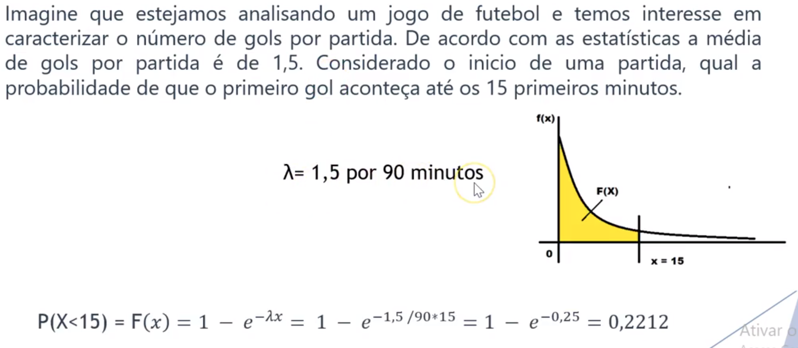

## Notes

Ta tudo no caderno :)

---

## Aula 1 - 09/02

#### Apresentação da disciplina

#### Conceitos básicos

---

## Aula 2 - 23/02

*Vídeos sugeridos na aula anterior: Modulo 1 -> aula 2 e aula 3, com foco na 3.*

---

---

## Aula 13 - 13/04

#### Poisson

Na teoria da probabilidade e na estatística, a distribuição de **Poisson** é uma distribuição de probabilidade de variável aleatória discreta que expressa a probabilidade de uma série de eventos ocorrer num certo período de tempo se estes eventos ocorrem independentemente de quando ocorreu o último evento.

![Distribuição de Poisson - Uma fórmula para calcular a distribuição de  probabilidade | Cibersistemas.pt](data:image/png;base64,iVBORw0KGgoAAAANSUhEUgAAAUMAAACcCAMAAADS8jl7AAABnlBMVEX///8AAADx8fHV1dU6Ojr6+vr19fXDw8MUFBSKiorNzc1OTk7u7u7r6+uioqL8/PxjY2NtbW3a2trj4+OEhIQ/Pz9ERESYmJjm5uZbW1saGhozMzOSkpIQEBDY2NhoaGi2trZ5eXlTU1MoKCisrKwhISH///ixsbF9fX0sLCy9vb2mpqZKSkpzc3Pr/P/1/////+P///H54citmIqLpMvYq4BUNBhXsODptIJUIQAAZLn/67V8XlV4qM//8sB3RBwARanQm4mavNTRf0clV64ydcHAaj48lNXv5dbCrJN+gqTL4/Hnw5dwY3Sk2fb415xYKwBsOQAlg7/i8v7lsWodAAAAQLV8Si1twebFt6qdi3EAAF6z3vFSNTw8MSWiaEIAABxwu8WbYE5imNHBils0DQAJJBkAAEZ0Vi8iWEgyZKVJKAAAE0Z4jWUtMnMpAACqfmx/mK/mxpVhPxUAACRFRo2ceHLvtGcpVonck1dPHhM2AAAPQW1sjKk6GQAAKlbqxa6gXzyFUG1yXGopf6pYg7C3kW21dEc9aZVaZngf6H9PAAAMR0lEQVR4nO2d+4PaxhHHGUASbyGJlwAdQjyPh33n1qkT20nb1PalvtpNbTdx49Zp3DZu7NZxk6bPNE7bJM1/3Z2VAAFaYfAdGLSfHwwCCYsvszOzs48LhTgcDofD4XA4HA6Hw+FwOBwOh8PhcDgcDofD4XA4nMBz7jvfPbPpe9hu2udfAfje2U3fxlZz4VUAeI0b4gtw8dLlM6+/8f1bm76PLab9gx8SE3zzR1zD1WmLMvn3zSsBb8uy69/VaF+9FqyYIouiKE8Ojt768XWiwvFPbqz+kTd/Gqy4nOrvQzkzEvH4bRJUf3YrdPsO/HxlGV5/B94NkoZakogG+x3n8OjuL16B9+7d/GXhV1dWleHg/p33bwRIQy0KYBARc5OXzj+CX3/w4Ky6alQ4/M1vf/fhvRO5u61ArIFe71qGW8OLD+H3Hy0WMJx2Ex571MPzjx7/4Y8B0tCEqhgKlWpQF8avHdx/8v5id3bwcdbN01E+2P7TJ58+uP3n66d1xy8dqViRPiZASU1evfDo8WJ3dvCZ4qL2dCTauYfw0a2/BCjFrur2YwSG4cmrtz+Ba6s6w3P37/z1XuhvVwKkYcR+jEB38uK5j/8Oq9rR0df/+OeNs+2rJDsKtYXF5+8QEVdMOTz/+Qf/eu/e4SoqHp5/9QvSXT68eo1c/SxAcSWEGsbpYzsltI+/vXfhEbx788HyGd7h8duPLxP1Dr587Vbo3L+DpaEENLa0n8WfvvWfy2cuvgP//Wz5rl77+OGnX2FsOfjyw6d33whWlzkcj/Xx8eDrJ/DFV7dCh9/cefxg6ajSPncf/kfD8+E3T8B5GhSETrli4pP2s0vf0kTv+NLnHgqkpH6xmOlLovfHtI/u9q/btoefEygJ5UQUChJ92j5SqQiH6nxEUTPDgV7PxiBfDc+9OUP7KBKc5AZRLQArsuAksZM19M5eWsuQDrYZrKxlMakaAGRL/ieVco1yVcM+cZicPkz5nx00hC7Wvob+Vev0EBpFuwWLClE8vY472x4ygMWvru85qTrEqk4kkQoAfd6W3fTKAIWMu/Q1jxifNHaZPC+r67izrUHdB2iYCaj6nCNL5JyMc9AkFzS5GboQ80BaqdCDjM9JKdJ6a7YzlJsVgOLC1CZQkKwGaoKQKTfZ5wh9Yoa0GxPSui2I9hgpdkCpEwkLIunqVXrsk1Kk9VoaeaLFSWoY115k3Hn3IAYGLRIr0krBJ8XeQ1vVOvVCjOQ3GneFUyQwMUyQJ6UktTNvhCpQKsOmJnAbnCYVI8rQWKJVsmwfFyYNuFUVZS6fByTCgkKfacaQfVoYbdBczy1tGxiSK/ZTFRwNI5n5No0aRs313dcWkUMf5zxXHXuU47n5YgJq2HCnj7LGkxtKB53hyOhU0GlPrtMy588MN8ZtnlLK6uwAtGaWjXHySWYVERRmnBOqpK8iC2KnXPeogNG4PDZEuRfVF5TJTgJZcMOIZ7Kqm8zLnEuEqVcSXenEVEyTLp6ri6zixC+9AVHJ62QNW30rExYFUYxkIb6Onp7azLjom4lUeO7Li8XYcNqrpM3JNY5YkxeapPWEi+Vc6WQSDFHHquvkWLMzQEaHTyjSd1tKTtknEXotOU5PSZZhCquZnv6ftUHZnLlKrRcM+5voSofKK9SsmH33hS4tNvX2kydjirlyzBi4fsJUnSbRrKqgmKvYt2ZE42toxw5mC//LrJKLx3M6tpuB5BJRjlT2PVqN0N/Hq9zGgPXRSn18rpQ3TqLsVCqS25oSo9S1rHqCfUWibg0GllJca92w4MocEjhekXeJlqgYnvdr96rcbxENLXc1oFc5rdrdoggnamvPaND29NFBukZ77aNDtQAZ7zvuVdzRkvqp7N7UGf1yOShjaiqKYY4PsXNf7jsHpSxYjNBWGpIT4+M0V7RAmfE/xHNFF41i7ggZDCoT21dJtx26tnBCzgCJ1XDQ/w1GBitWoTY3ftbLQzcYA5PYeKOTQw37plnbIfeiEGUGNxPt17EzseghYUjsAnSC0JrFwlQKay9fsD0b+sYM0zurWRiN+BAJPcfNm/uQD8KwWg+TFNcXVTHVqVOj6pNO1h7rOjrwCAqeKGYg69kt1Uh+XA1Ap5+4PCi7jiXMWegEvxSJGgOfPLVPsuqGalsho2dPGnPrpen0nx7YlXJVNWk3wE4Q0eF51JfGSAOaIaKErAZbNYIwwBvB7HCSU8s9ug4J2x9tq349TrRTKJZ8JAzhCG9y50NzEd3fJAVMYFTWqSY0Zvjmd9hVSdZ9JAwlBtPOdjdRULOxsUk0sbGFw6ZssENKyJ6KYYDuo3N6ErvdryZYbGWzL2Emo9huPyXlSJ5j5JwgQGsIvja0h7406Wuq+BPVZyKz3CskvXl5is7L0MFEuWUNc/F4N4uuUZGcXJm6w6T/l8LZgLqvu0OXmZ/pLQpNYLGVzR5He/aLCi1kQUXJJMa5TBoDdM23BCeiQmXfKZJ0zuVsj7sksdjGXFJEf9VNpTVV3VNVLe36Dnv0LT+BxGp5tv41Bx2R28oW+txIeaYINKT6pYckL9SxPuHbEanGFqnMRtYiG0FdrjUU0ZK8bY3K66MhkdDaQzMb+DlEaqqeo0eLKXUr0U1g+cwr8wAdGmP6ygINUcKIHZL82jv9kXqrDQ2VaszYc6p4DVyzwcUe0PH+hjgdnK0hkTCZcAplfhK9iIayGN4MS2WpmCQDI/TS3jArpjgS2oY89PEftC2v6A+3A3RnBYapRTCBni3vOwgZGNjCoEYtPw1j841d6EDME8M/pX8poYuOWGE1RRNoz7SESFhwbIt6TZ/cheY2M78SO8eObZ+GPRSA2SPGGQN5L3lcEoZktNYq29/V0UfP5NhyhPSKPFm8PvGlA+suLWZPJGPYJdZZRJeEtkgNdmP2Cfw7gYjfX2FmL3TMad5KiYTuMXwcL2A3ZhG9xS4XYalIff8xp7mQmopPtttCIpgC1VmNmSZPO9zVk6m/9ylUVz1sSCOGNbXkME13MWPJ1COdwfyu1rEFUbRnHdU1kWWJZnQ0wDe6Ji1hyx2mRjsQyqNP2dfColeLxSr5rjbldKdbMAzMyaCixBkihuvTgdkcNgCvMfJxJ9Qk4gP7UwzQ416ZNMmPYuubwbZe1OokvcjFWYbSbEwNqBRH1+RG89LM3Phjcl0PDTEBZf1CAQHHSdnzHJ6DToW08hO7ne1EKkD+BZqi3H3B32AnKJZ9R5gXkLD4Zgq4SBMKKzdGoQp+Szw3QGojaRYxpZWDgpRvrFg5XIm5ar5rLCFBxZPinsnDqZNIgs+ydT+0bIPdCToFulZ+QNGHGSpZOJMdFMhxIT+g0w5whm9lIw0joRudxWfNoyr55lrjidSkHS8odCSVmr8YMetYAq50M3RLAiwxGf77upwWkVyrv3yTjNQsc90hGXcEAsO9cwv2NYc9p6JGR3J1zytPnVQzX13SGYdNJRdZ/0JsdUZDoWrAZKVPY4MaYp9uSTeiZcxNhEABx4Bqk+Ne1HD9+vim+901E15SEXEztRq5Q1RKjuvGEQuKLn+CtUyjvon72ipKWEMaLa7ZyxpTOwThJKyy3x5NHAS3YhrVN9XatIQhHAprrZioBQgBbS1LlVMVY2aIC/NDr/WbnGkimCCiTqoCs6OEaVg0KZWDpHGlSJGOWcyvocfB3sCXkRYTprMmvSVEDQsbuKdtg86hyPZqkPMY7m8BWOu/pe0Dt3soV0YLX6cZTG0MwWGRxqm53hKSJJun2M9DGIs3jOWDcYjxFPt5wCxw4J0F9lk7unCmCOPslLL3jrEJaPEUezEinbri/IGVWUp8pPY5EAegY+3GexmmDBW+ueQiiIRZWoj13kdSdu9bwfEEJZTtDSmKXu/LrcG6b2nbIL4QVxGHcc5f16tfLA82NhKwJaCEdPYVZjeW10CyPNzMqN7WMJYwpDZYtVaVV778COsjCe1dtHiHZGlSEwmd2g03uSVJEwknUQQdYsOcP0su8VloTFR9agcYlW6/Nb8nq6nUT26b2h0jUZjeCYI6xORcZMYODO8we1LCdTb77ldUnJ0EudkZvLgcx715NsdGk8whrTI0JUcyUerZ879AMaWpv59C54rwIuwcnZpl6UhSd9quWtPtV8hDdurP+PRaMFoyzHHh2jbDkSvl3t5iOg6bxSJ3hxwOh8PhcDgcDofD4XA4HA7nNPg/roL3XFGXDUwAAAAASUVORK5CYII=)

---

## Aula 14 - 20/04

#### Distribuição exponencial

Essa distribuição contínua que pode ser utilizada para descrever as **probabilidades envolvidas no tempo que decorre para que um determinado evento aconteça.** Existe uma conexão muito próxima entre a distribuição exponencial e a de Poisson. Ou seja, é Utilizada para descrever o tempo entre as ocorrências de sucessivos eventos de uma distribuição de Poisson. As relações entre as distribuições podem ser associadas a um processo estocástico, chamado deprocesso de Poisson.

Como exemplo podemos estar interessados em algumas quantidades, como onúmero de chegadas em um determinado intervalo (contínuo). Essa quantidade é descrita por umavariável aleatória Poisson. Outra quantidade de interesse poderia ser adistribuição do tempo entre chegadas, onde essa quantidade é umavariável aleatória Exponencial.

Seja X a distância/tempo entre contagens sucessivas de um processo de Poisson.

- Exemplo 
  - o tempo entre as chamadas telefônicas
  - o tempo entre as avarias de um equipamento.
  - o tempo entre as chegadas de táxis a uma interseção movimentada.
  - o tempo entre as chegadas de aeronaves a um aeroporto específico.

Exemplo:

