## Notes

#### Pensar na hora de modelar a classe:

1. Atributo ou método?
2. static? final?
3. Visibilidade
4. Revisa o fluxo de sistema

---

## Aula 1 - 04/02

#### Apresentação da disciplina

#### Revisão de conceitos

- **Valor**: Dado atribuido a uma posição na memória para ser operado/usado. Valor é usado no programa. Valor representa um dado contido em uma posição na memória.
- **Variável**: Nome dado à representação do valor. "Ponteiro para o valor".
- **Tipo da variável**: Indica como a variável vai ser usada. Também indica quanto espaço vai usar na memória.
- **Vetores e matrizes**: Para alocar mais de uma variável, criar um conjunto de variáveis, do mesmo tipo e relacionadas.
- **Métodos**: Conjunto de instruções com uma finalidade.

---

## Aula 2 - 05/02

#### Criação de um sisteminha do jogo de dados (Par ou Ímpar)

*Só pra ter uma ideia de POO.* 

---

## Aula 3 - 11/02

#### Fundamentos de POO

*Orientação por objetos abstrai o mundo real utilizando objetos que interagem entre si.*

**Análise orientada para objetos** (OOA/AOO): Examina os requisitos de um sistema de uma perspectiva de classes e objetos, usando o vocabulário do domínio do problema.

**Projeto orientado por objetos** (OOD/DOO): Projeto no qual o processo da decomposibilidade em objetos é utilizado e modelos físicos e lógicos de objetos são descritos.

**Programação orientada por objetos** (OOP/POO): Implementar o planejamento.

- POO, segundo *Alan Kay:*
  - Troca de mensagens
  - Proteção e retenção local e ocultamento do estado (dados) ou processo
  - Associação tardia e dinâmica de tudo o que for possível

**Procedural x POO**

- Procedural: Instruções executadas em um fluxo que visa o desempenho de uma tarefa específica.
- POO: Conjunto de objetos que interagem entre si, porém preserva sua individualidade e tem um papel específico na execução de uma tarefa.

#### Análise e projeto OO

**Tipo abstrato de dados** (TDA): reúne na mesma estrutura, informações sobre dados, e comportamento de uma entidade representada a partir do mundo real.

**Classe**: Descrição padronizada de um tipo abstrato de dados. Modela um conjunto de entidades do mundo real que possuem características e comportamentos semelhantes.  É o esquema/representação/modelo de uma "entidade genéria". Constituída por atributos e métodos. Ex: Classe caneta, classe carro... 

**Objeto:** É a instância de uma classe, é um "exemplar" daquela classe. Ex: Classe usuário - Objeto João.

---

## Aula 4 - 12/02

#### Exercício de modelação de classe

**UML**: Linguagem de modelagem universal.

---

## Aula 5 - 18/02

#### Modularidade

É a divisão do sistema em partes distintas. Um módulo é um **grupo de comandos** com uma **função/propósito** bem definida e o mais **idependente** possível em relação ao resto do algoritmo. *Unidade identificável na compilação.*

Consequentemente mais seguro, pois divide o sistema e permite modificar um lugar sem alterar o outro. Facilitando o desenvolvimento e reúso da solução;

##### Coesão

As classes precisam ser coesas, não pode ter pontas soltas (precisa ter ligação com o sistema, e de forma lógica/inteligente). Um sistema com alta coesão:

- Facilita e acelera a manutenção;
- Reduz efeitos colaterais e propagação de erros;
- Dependência deve ser intra-modular: uso e dependência resumidas ao máximo nas estruturas internas ao módulo.

##### Abstração 

Uma classe deve incluir somente os atributos de importância em um contexto **particular**. Precisa ter os atributos (dados) necessários para a utilização daquela entidade no sistema. 

- Conceito da caixa-preta: Entrada e saída bem conhecidas, mas com detalhes ocultos.
- *A ideia principal é não ser necessário saber os detalhes do funcionamento de um objeto para utilizá-lo.*

#### Encapsulamento

**Proteger!** É o princípio da ocultação de informação e do conceito de caixa preta. Seguir regras (validações) para manter os dados...

- Proteger os dados do acesso direto a partir de um código externo (oculta). Garantindo que as regras sejam seguidas, permitindo o acesso e uso deles somente da forma correta/definida.
- Os atributos de uma classe só deveriam ser acessador e modificados por meio de seus métodos, deixando os atributos sempre 'private'. Geralmente usando getters e setters (métodos de acesso) para retornar e setar os valores. Isso impede alterações indevidas, por exemplo.

---

## Aula 6 - 19/02

#### Getters and Setters

#### Atividade prática

---

## Aula 7 - 25/02

#### Revisão/Discussão da atividade proposta

#### Construtor

Método especial responsável pela implementação de ações necessárias para criar um objeto. Instruções pré-definidas para que uma classe sempre seja criada de maneira válida.

---

## Aula 8 - 26/02

#### Atributos 'de classe' - static

Atributos que dizem respeito à toda coleção de objetos, e não a um objeto específico. Compartilhado por todos os objetos daquela classe.

- Escopo local (delimitado pela visibilidade declarada);
- Tempo de vida global (vai ficar vivo enquanto o programa rodar);
- Inicializado pelo 1º objeto ou pelo carregamento da classe.

Úteis para implementar contadores ou identificadores de autoincremento. Também usado para constantes (**Economia de memória**). Declarados com a palavra chave **'static'**.

Exemplos: Armazenar última matrícula de um aluno cadastrado no sistema, poderia servir para criar a próxima (levando em consideração que a matrícula é uma sequência).

**Atributos finais ou selados (final):** Não podem mudar de valor após inicializados.*

*Nomenclatura em maiúsculo quando a variável é 'static final'.*

#### Métodos 'de classe' - static

São funções que não dependem de nenhuma variável de instância, quando invocados executam uma função sem a dependência do conteúdo de um objeto ou a execução da instância de uma classe, conseguindo chamar direto qualquer **método** da classe.

**Obs:** Se uma classe só possui métodos e atributos estáticos, logo ela é considerada uma **classe estática**, nunca irá precisar de instância. Ex: System, Math (Libs de funções) - Integer.parseInt (Manipulação de tipos) - Conversor de medidas...

---

## Aula 9 - 04/03

#### Relacionamento entre classes

Objetos compostos

Geralmente objetos não funcionam sozinhos, usam e comunicam com outros objetos. Isso leva á: 

- Reduzir custos - Aumentar confiabilidade - Modularidade => alto grau de reusabilidade.

##### Associação

Objeto usa outro, mas não tem relação de pertinência, um não pertence à outro. Ex: Um carro usa uma estrada

##### Agregação

Objeto definido em termos dos seus componentes (um contém). Ex: Turma contém alunos.

- A existência da "parte" faz sentido, mesmo não existindo o "todo". Ex: Alunos -> Turma; Atleta -> Time.
- Representação UML: Losango (no lado do "todo").

##### Composição

O objeto é formado por outros objetos (está contido). Dependência do tempo de vida entre parte e todo, um só existe se o outro existir (Relacionamento mais forte). Ex: Um livro é formado por capítulos; Um pedido é formado por vários itens.

- A existencia da parte não faz sentido sem o todo!
- Representação UML:  Losango preenchido (no lado do "todo");
- Se o objeto todo for apagado, as partes também são.

---

## Aula 10 - 05/03

#### Cardinalidade

##### Um para um

Único objeto de cada lado. Ex: Curso tem um coordenador.

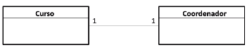

##### Um para muitos

Um dos lados pode ter múltiplos objetos. Ex: Um departamento possui muitos professores, mas um professor está alocado a um departamento apenas.

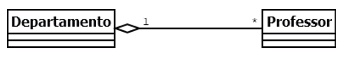

##### Muitos para muitos

Podem haver múltiplos objetos em ambos os lados. Ex: Um aluno pode realizar emprestimos de vários livros. Cada livro pode, a seu tempo, ser emprestado para vários alunos.

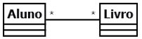

Pode gerar uma classe de associação. Ex: Empréstimo.

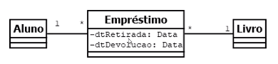

##### Cardinalidade na UML

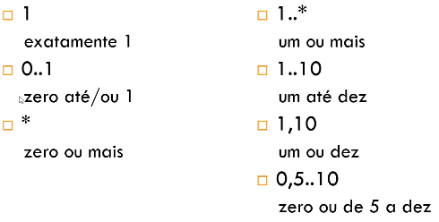

##### Implementação de relações

Unidirecional ou bidirecional?
- Unidirecionais sugerem a implementação de atributos apenas na origem (uma das partes). Ou seja, somente uma das partes vai ter uma referência da outra parte;
- Em alguns casos exigem análise mais aprofundada.

---

## Aula 11 - 11/03

#### Modularidade - Acoplamento

Cenário ideal: Manter baixo acoplamento.

##### Indicadores

- Tamanho da classe, quanto maior, mais coisas ela está fazendo. *Quantidade de parâmetros e métodos públicos*. Geralmente quando tem mais métodos, significa que tem mais objetos utilizando/dependendo dela;
- Visibilidade. Uso de parâmetros x Uso de variáveis globais. Mesmo os parâmetros sendo um possível indicador de acoplamento, usar parâmetros é ainda mais desacoplado que a chamada de variáveis globais por outras classes... 
- Flexibilidade. Facilidade na chamada (Especialização - Subclasse).

#### Destrutores

##### Coletor de lixo

Processo que libera automaticamente memória que não está sendo mais utilizada. Java -> Garbage collector.

- Eliminam a necessidade de se desalocar memória explicitamente ("manualmente");
- Eliminam o vazamento de memória;
- Eliminam referências pendentes (dangling - Ponteiros que não estão apontando pra ninguém).

##### Destructors

São métodos especiais invocados quando um objeto é finalizado, para garantir que não ficará nenhum resto mortal do objeto.

- Só há um destrutor por classe;
- Um destrutor não tem parâmetros;
- Não deve ser chamado diretamente. É chamado de forma indireta (quando um objeto é finalizado);
- É autônomo.

Objetivo principal: Liberação de recursos usados pelo objeto. Ex: Memória, conexão de rede, conexão com banco de dados...

A classe Object em Java tem um método **finalize**. Ele é executado automaticamente quando a área do objeto da classe que a contem estiver para ser liberada pelo coletor.

Pode escrever o finalize para sua própria classe, passando regras de finalização particulares da sua classe. Ex: close() pro Scanner...

---

## Aula 12 - 12/03

#### Exercícios de implementação e UML

---

## Aula 13 - 18/03

#### Revisão do exercício para prova

---

## Aula 14 - 19/03

#### Prova

---

## Aula 15 - 26/03

#### Especialização / Herança

Reaproveitamento de código. Mais alto nível de abstração. Especializar uma classe genérica. Ex: Um professor é uma *pessoa*. Um aluno é uma *pessoa*.

Essa especialização tradicionalmente é implementada por meio do mecanismo de herança - Classe mãe e classe filha.

> Classes filhas herdam métodos e atributos públicos ou protegidos da classe mãe.
>
> Classes filhas podem sobrescrever métodos herdados -> especialização - @Override  

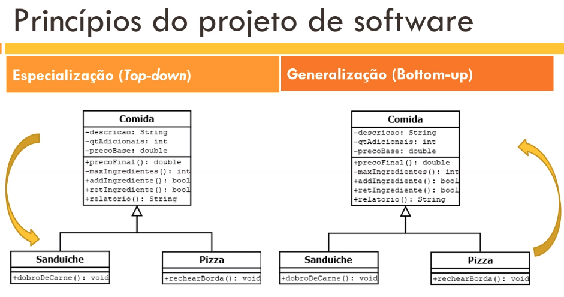

*Todo construtor da classe filha chama o da mãe, só devemos escolher qual construtor usar!* A palavra *super* representa o construtor da classe mãe, e eles são diferenciados pela parametrização.

---

## Aula 16 - 08/04

#### Exercício prático

---

## Aula 17 - 09/04

#### Polimorfismo

Definimos Polimorfismo como um princípio a partir do qual as classes derivadas de uma única classe base são capazes de invocar os métodos que, embora apresentem a mesma assinatura, comportam-se de maneira diferente para cada uma das classes derivadas.

Com o **Polimorfismo**, os mesmos atributos e objetos podem ser utilizados em objetos distintos, porém, com implementações lógicas diferentes.

Em outras palavras: O polimorfismo permite que referências de tipos de classes mais abstratas representem o comportamento das classes concretas que referenciam. Assim, é possível tratar vários tipos de maneira homogênea. O termo polimorfismo é originário do grego e significa "muitas formas". 

**Método abstract:** É o método de uma classe **abstrata** que não possui implementação. Na classe **abstrata**, é definido o **método abstrato** com palavra reservada abstract e sua assinatura. Isso é implementado quando o código depende 100% de particulares/regras das classes filhas. *É só uma ideia*.

---

## Aula 18 - 15/04

#### Exercício prático

---

## Aula 19 - 16/04

#### Herança múltipla

Capacidade de uma classe herdar de duas ou mais superclasses. Ou seja, combinar características de várias classes na definição de uma nova classe.

*Exemplo hipotético: Uma pessoa é um mamífero e um bípede.*

Heranca_Multipla

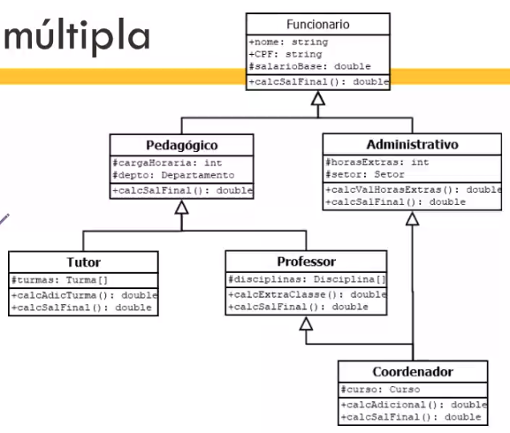

*O que é foodtruck? Herança múltipla das calsses Caminhão e Restaurante :)*

- Porém se herda de duas, depende de duas, ou seja, aumenta o acoplamento.
- Outro problema é a ambiguidade, piora o encapsulamento: 

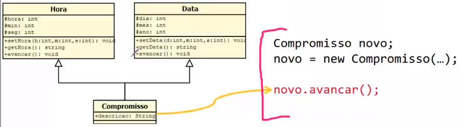

Mesmo se vc fizer um Override para unificar esse avançar, isso é ruim pois piora a abstração, muda a regra fixa da classe mãe.

E...

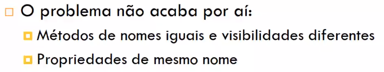

##### Problema do diamante

Qual equals ele vai  usar?

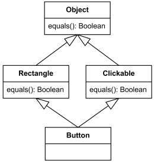

##### Solução

*O ornitorrinco é a prova de uma herança divina. Ou seja, há solução :)*

Porém, nem Java nem permite herança multipla :)

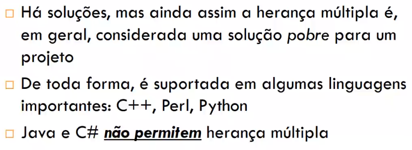

---

## Aula 20 - 22/04

#### Interface

Em seu significado conceitual é a "parte visível de um módulo a outros módulos". Tudo o que é *public* é a interface de uma classe.

- Coesão: A interface deve oferecer um grupo de métodos coerentes;
- Abstração: Se uma interface é definida e sempre é mantida, o sistema ganha em extensibilidade e em baixo acoplamento. Ou seja, se ela for atualizada... todas as classes que estiverem utilizando ela, utilizarão as atualizações.

Exemplo mundo real: Um controle remoto, a parte visível são todos os botões para o usuário utilizar e controlar a televisão.

##### what is

É uma entidade do nosso projeto usada para definir um protocolo de comportamento que pode ser implementado por qualquer classe em qualquer hierarquia de classes.

- São declaradas, mas não podem ser instanciadas.

- Abstração: implementação fica a cargo de cada especialização da interface.

Basicamente é um contrato que define **tudo o que uma classe deve fazer** se quiser ter um determinado **status**. Ou seja, obrigações que uma classe precisa fazer para ser considerada uma classe válida do tipo definido. Exemplo: Para a classe calculadora ser considerada realmente uma calculadora, ela precisa saber somar, dividir, multiplicar... Ex2: Para a classe Jogo ser considerada um jogo, ela deve saber calcular o preço dele...

O **benefício** é que se temos classes com comportamento similares, logo temos o mesmo conjunto de métodos, mesmo que tenham implementações diferente. 

> Então temos os mesmos métodos, com os mesmos nomes (com a mesma assinatura), porém com implementações particulares e específicos de cada classe que "assina esse contrato", que utiliza a interface. Isso é vantagem por que dessa forma temos uma **comunicação padronizada**. E isso facilita MUITO para o programador. Isso trás:
>
> - Flexibilidade
> - "Polimorfismo"
> - Baixo acoplamento. Utilizamos os "mesmos comandos" definidos pela interface para várias classes 

##### Aplicação

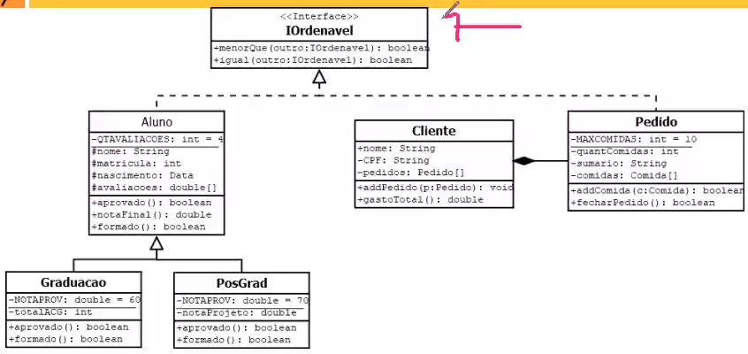

Em Java:

- Possuem prioritariamente declarações (assinaturas) de métodos e atributos constantes (public statis final). *Não é muito recomendável utilizar atributos na interface, aumenta o acoplamento;*
- Podem incorporar outras interfaces, utilizando-se extends;
- São 'assinadas' por meio do uso de *implements*;
- Java permite implementação de múltiplas interfaces e combinação de herança.

##### Utilizando interfaces

*Como ela pode ajudar a resolver um problema :)*

###### 1º exemplo

"Um banco possui 4 tipos de funcionários: atendimento em caixa, analistas financeiros, gerentes de contas e diretores..."

>  A primeira ideia é criar uma classe *Funcionario*, com classes para cada tipo de funcionário herdando dela.

Evoluindo o sistema: "Agora o sistema interno do banco pode ser acessado por gerentes e diretores que desejam observar dados dos clientes ou indicativos de desempenho dos funcionários subordinados, Este acesso é feito por meio de uma senha numérica de 4 dígitos"

> Logo pensamos em um método "autenticar" ou "login" para as duas classes (gerentes e diretores). Porém, dessa forma não podemos usar a funcionalidade com esse polimorfismo, pois a classe *Funcionario* não tem esse método.
>
> 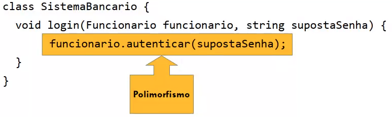
>
> Podemos resolver esse problema com uma sobrecarga, MAS se surgir um novo cargo com acesso ao login a manutenção fica o ó, vai ter que criar várias versões do método...
>
> Outra alternativa é um novo nível de abstração:
>
> 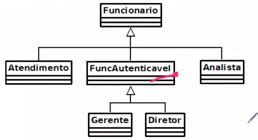
>
> Muito bom :)

Evoluindo o sistema mais ainda: "Haverá uma integração dos sistemas e agora os clientes podem acessar os próprios dados usando o mesmo sistema."

> Agora não tem como a classe *Cliente* herdar da classe de autenticação, pois ela não é um funcionário. Logo a proposta é criar um "contrato" que estabeleça o comportamento de qualquer classe autenticável (*Interface*).
>
> ```java
> interface IAutenticavel {
> 	boolean autenticar(String pwd)
> }
> ```
>
> 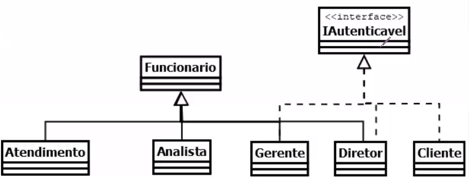

---

## Aula 21 - 23/04

#### Substituindo herança por composição

Com herânça ainda temos um certo nível de acoplamento e perde um pouco de encapsulamento. 

Por meio do uso de interfaces e composição de classes, podemos **injetar** comportamento em classes. *(Injeção de dependência)*.

- Delegação de responsabilidades;
- Mudança de comportamento em tempo de execução.

##### Exemplo

Um banco oferece três tipos de contas a seus clientes: conta corrente, poupança e investimentos. Com 3 operações básicas: Sacar, depositar e consultar saldo.

*Herança básica:*


*Pra melhorar:*


