## Notes

Baixar: BizAgi

---

## Aula 1 - 08/02

#### Orientações gerais

BPMs (Business Process Management System): O Gerenciamento de Processos de Negócio é um conceito que une gestão de negócios e tecnologia da informação com foco na otimização dos resultados das organizações por meio da melhoria dos processos de negócio.

---

## Aula 2 - EAD

#### Conceito de processos

Um processo é um conjunto de atividades que por meio de uma sequência lógica transforma matéria prima (recursos disponíveis) em um produto final (agregação de valor, seja por serviço ou produto). *Transforma entradas em saídas.* Uma sequência de atividades para chegar em um resultado final. Entrega valor aos cliente, direto ou indiretamente. Ex: Fábrica de carros - Entrada: matéria prima | Processo: Linha de montagem | Saída: Carro pronto para uso. Ex2: Algoritmo. Ex3: Processo revolucionário do McDonalds.

**Instância:** *É cada instância de um processo, cada execução de um processo. Ex: Cada carro que está na linha de montagem é uma instância daquele processo.*

#### Tipos de processos

Um processo é sempre algo contínuo na empresa? Sim, diferente de projeto, é algo rotineiro dentro da empresa, mas não imutável. Eles vão sustentar seu negócio.

- **Primário**: É o principal, são os processos essenciais de uma organização. Aqueles que passam a percepção de valor para o cliente final por estarem diretamente ligados à experiencia de consumo do produto/serviço final. São os processos que mais tem contato com os clientes. Ex: Processos de venda e maketing, logistica, processos de pós-venda. Em uma universidade seria os processos de ensino, por exemplo.
- **Suporte**: São processos que dão suporte à outros processos, principalmente os primários. Não estão diretamente ligados ao cliente final. Ex: Administração de recursos humanos, que vai contratar os funcionários para exercerem os processos primarios, por exemplo. Administração financeira, a empresa ter recursos suficientes para a aquisição da matéria prima necessária para o produto final...
- **Gerenciamento**: São processos destinados a medir, monitorar e administrar as atividades de uma empresa para certificar que ela opere de forma adequeada e de qualidade. Ex: Gestão de desempenho da linha de montagem, dos funcionários... Gestão de qualidade da matéria prima e produto final (certificar que os produtos alcancem a qualidade desejada).

#### Elementos de um processo

Componentes que podemos identificar em todos os processos. Matéria prima, fornecedores, executores, participantes dos processos, tecnologias e recursos utilizados, políticas...

**Cliente**: Aqueles os quais os resultados dos processos se destinam, aqueles que se beneficiam com esses resultados. Podem ser pessoas fisicas e/ou organizações.

- Clientes internos: São setores internos de uma organização que recebem resultados de processos de realizados em setores.
- Clientes externos: Aqueles que vão se beneficiar do produto/serviço final daquela organização.

**Produto**: Resultado de um processo da organização. Pode ser, ao mesmo tempo, um ou todos os tipos abaixo.

- Serviços: Transporte, assinaturas...
- Informações: São "produtos" intangíveis, normalmente no formato de atas, regras, informações de processos. Tudo que ensina, ou informa algo.
- Materiais e equipamentos: Parte mecânica de um motor. Produtos tangíveis.
- Materiais processados: Iogurte, queijo... (que passam por processos industriais). Geralmente denominados como materiais de bens.

#### Hierarquia de processos

1. Macroprocessos: Visão geral, de cima. Overview geral dos processos chaves da organização. 

2. Processos

3. Subprocessos: Subdivisão de um processo que ainda pode ser dividido em mais de um processo.

4. Tarefas: Atividades simples incluidas em um processo. Não tem como dividir mais, não existem outros subprocessos abaixo dessa atividade.

---

## Aula 2 - 22/02 - "Presencial"

#### Visão sistêmica dos processos

Pode-se definir como uma capacidade que o profissional tem que o permite ver a empresa como um  todo, e diante disso consegue identificar os **processos**, como  funcionam, como os setores se integram, como é a produção e a entrega  dos produtos ou serviços ao consumidor e ao mercado.

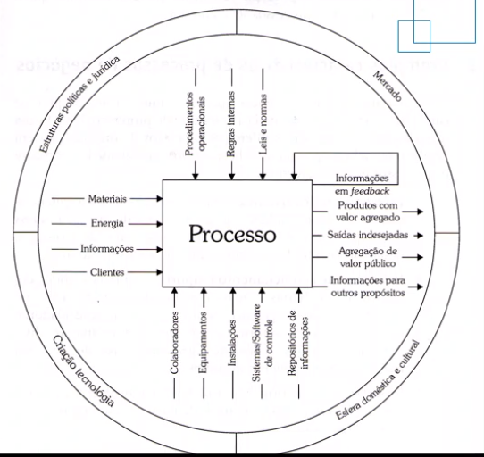

Processos bem definidos, esquematisados e bem pensados (otimizados da melhor forma...) podem definir o sucesso de um negócio.

---

## Aula 3 - EAD

#### Modelagem de processos

**O que é:** Conjunto de atividades envolvidas na criação de representações de processos de negócio existentes ou que ainda serão propostos. Propósito: ter uma pespectiva completa do processo, uma representação completa e precisa sobre seu funcionamento. *O nível de detalhamento varia entre organizações.* Permite compreender, comunicar e gerenciar componentes de processos de negócio.

**Modelo:** Representação simplificada de uma coisa, conceito ou atividade. Simplificação da realidade. Ex: Maquete de um prédio, uma planta baixa...

**Níveis de detalhamento**

- Diagrama: Visão macro.
- Mapa: Mais detalhado que o diagrama.
- Modelo: Mesmo tendo um nível de detalhamento considerável, ele normalmente objetiva a simulação.

**Modelo de negócio:** Visão simplificada do negócio. Permite compreende-lo, e identificar problemas e melhorias. Servindo de objeto de análise.

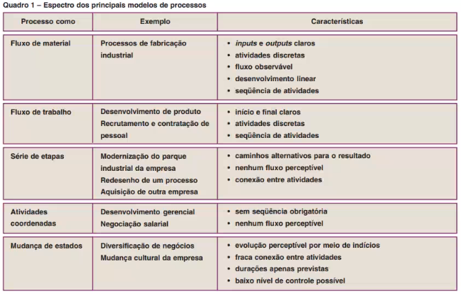

Com foco nos dois primeiros. 

#### Notação BPMN

BPMN **(Business Process Model and Notation)**: desenvolviva especificamente para representar **processos**.

**O que é notação:** É um conjunto padronizado de símbolos e regras que determinam o significado desses símbolos. Com o objetivo de facilitar o entendimento do modelo por todos os envolvidos no negócio. Exemplo de notação voltado à negócio: BPMN, fluxograma, EPC, UML...

**Principais características:**

- Ícones organizados em conjuntos descritivos e analíticos para atender a diferentes necessidades de utilização
- Permite indicação de eventos de ínicio, intermediário e fim; comunicação intranegócio e colaboração internegócio.

---

## Aula 3 - 01/03 - "Presencial"

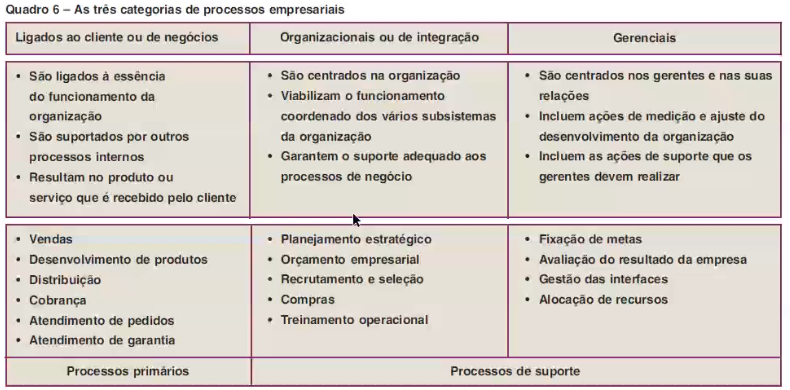

#### 5W2H

É uma espécie de *checklist* de atividades específicas que devem ser desenvolvidas com o máximo de clareza e eficiência por todos os envolvidos em um projeto. Essa sopa de caracteres corresponde, na verdade, às iniciais (em inglês) das sete diretrizes que, quando bem estabelecidas, eliminam quaisquer dúvidas que possam aparecer ao longo  de um processo ou de uma atividade. São elas:

- **W**hat (o que será feito?)
- **W**hy (por que será feito?)
- **W**here (onde será feito?)
- **W**hen (quando será feito?)
- **W**ho (por quem será feito?)
- **H**ow (como será feito?)
- **H**ow much(quanto vai custar?)

*Só registra ações da empresa, não do cliente.*

---

## Aula 4 - EAD

#### Categoria Swinlanes

Contém as simbologias Piscinas e Raias:

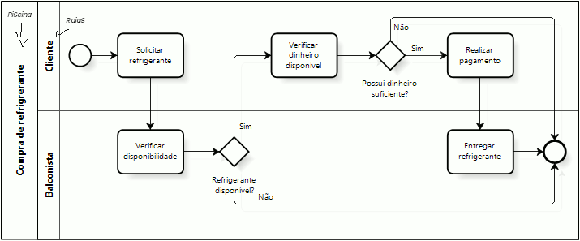

##### Piscinas (Pools)

Representação BPMN: Caixa retangular. Representam processos e participante. *Cada piscina contém um único processo!* 

- Piscinas Caixa-branca (White-box pool) acomodam representação dos processos, em seu interior.
- Piscinas Caixa-preta (Black-box pool) apresentam um participante ou processo que não se deseja representar, por ser desconhecido ou que ainda não se conhece. *Fica vazia, sem objeto dentro dela.*

##### Raias (Lanes)

São subdivisões dentro de uma pscina de processo. Organizam e categorizam as atividades, e atribuem determinados papéis para a execução das atividades. Representam participante, papel, área e funções de atores do processo. Ou seja, somente as funções e papeis de cada participante ficaram somente na sua respectiva raia.

#### Atividades

Atividade é a representação daquilo que é **executado** dentro de um processo. Representação BPMN: Quadrado.

- Consome tempo para ser executada;
- Envolve um ou mais recursos da organização;
- Requer algum tipo de entrada;
- Produz uma ou mais saídas.

Símbolos:

- Tarefa: atividade atômica. 
- Subprocesso: conjunto de tarefas. **Representação BPMN: Quadrado +.**

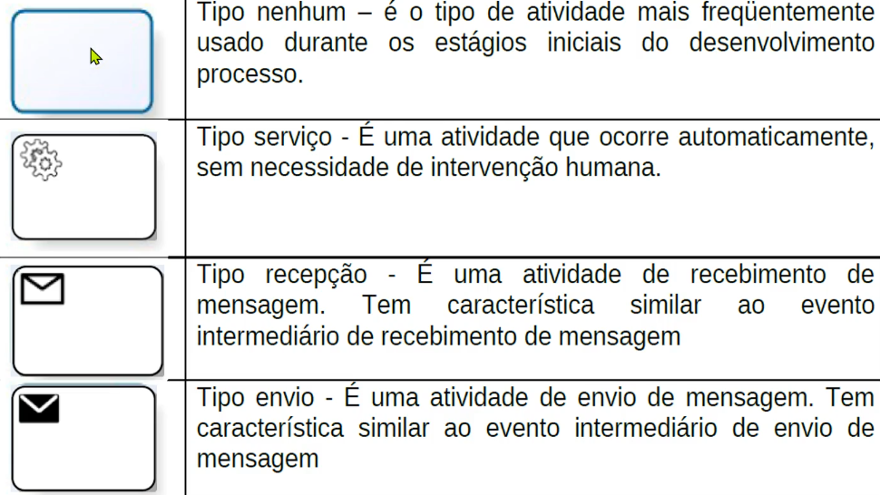
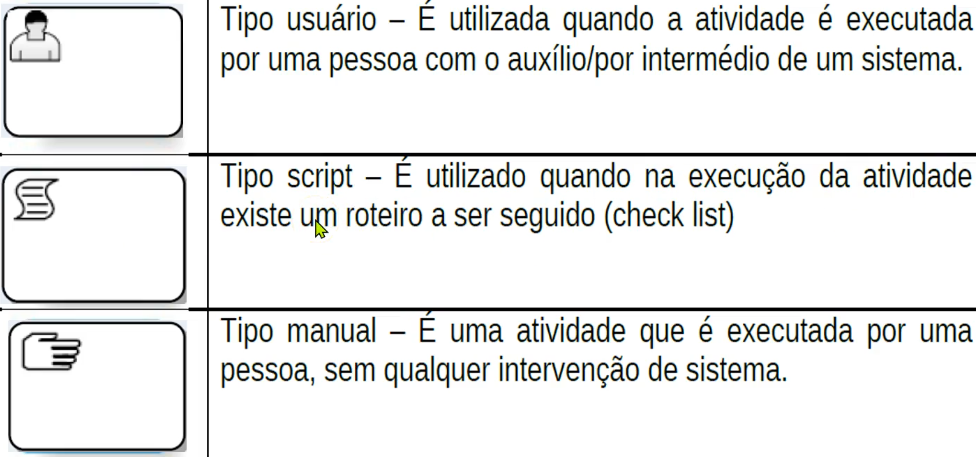

---

## Aula 4 - 08/03 - "Presencial"

#### Exercício prático

---

## Aula 5 - EAD

#### Eventos

Podem iniciar, suspender o fluxo ou finalizar um processo.

fluxo de mens

### Gateway

- elementos utilizados para controlar os pontos de divergência e convergência do fluxo, tais como as decisões, as ações em paralelo e os pontos de sincronização do fluxo;
- são representados por losangos;
- não toma decisão.

→ Gateway Exclusivo

indica que a decisão será tomada com base em uma condição, que utiliza dados fornecidos em algum passo anterior ao gateway.

→ Gateway Paralelo

utilizado quando várias atividades podem ser realizadas concorrentemente ou em paralelo.

→ Gateway Inclusivo

utilizado quando, em um ponto do fluxo, são ativados um ou mais caminhos, dentre vários disponíveis.

### Dados

- Objeto de dados:

  → fornece informações sobre o que as atividades precisam para serem executadas ou o que elas produzem;

  → os seus estados, também, podem ser exibidos;

  → não tem nenhum efeito direto no fluxo de sequência ou de mensagem do processo, mas informam quem precisa ou gera informações;

  → geralmente, associados com objetos de fluxo (eventos, atividades, gateways);

  → podem ser, também, entrada e saída de uma atividade

  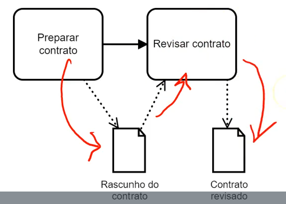

- Depósito de dados:

  → representa um depósito de dados (tabela banco de dados, arquivos, etc.)

  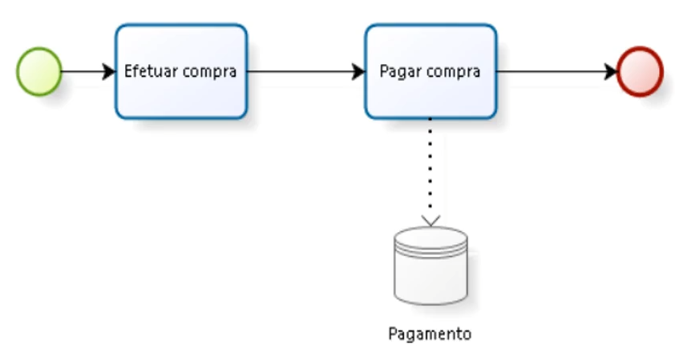

### Objetos de conexão

- fluxos de sequência: mostram a ordem em que as atividades são executadas em um processo, seta contínua
- fluxo de mensagem: mostram a troca de mensagens entre Participantes, entre si por meio de setas tracejadas (vídeo "Colaboração")
- associações: usadas para associar objetos aos fluxos, linha tracejada podendo ser uma seta ou não (artefatos), dependendo do objeto

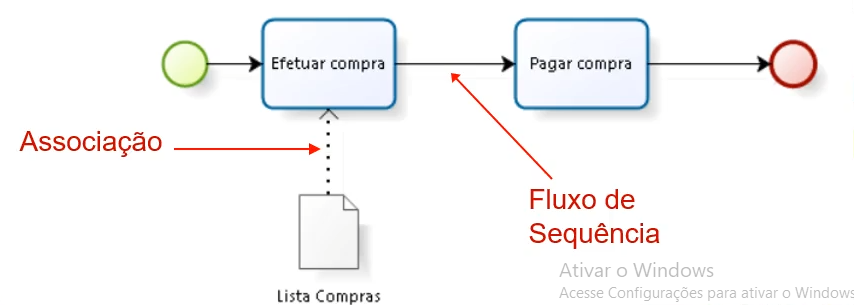

### Artefatos

- permitem complementar o modelo com informações adicionais sobre o processo
- são eles: Group, text annotation
- text annotation: mecanismo que oferece informação adicional para o leitor do diagrama. É vinculado a uma associação
- group: agrupamento de elementos gráficos que estão dentro da mesma categoria (potilhado)

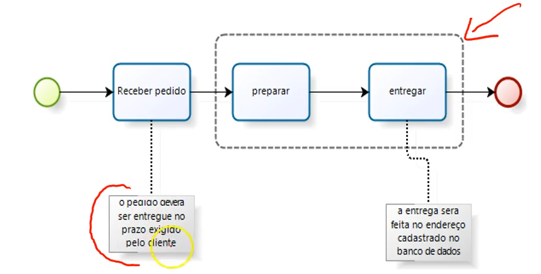

### Colaboração

- usualmente, envolve duas ou mais piscinas, representando a interação entre participantes

- há troca de mensagem entre eles, utilizando o elemento "fluxo de mensagem", que irá conectar as piscinas ou os objetos que estiverem dispostos dentro delas

- as mensagens associadas podem ser mostradas no Fluxo de Mensagem

- as piscinas envolvidas podem ser do tipo "black-box pool" ou "white-box pool".

  → Exemplo de black-box pool:

  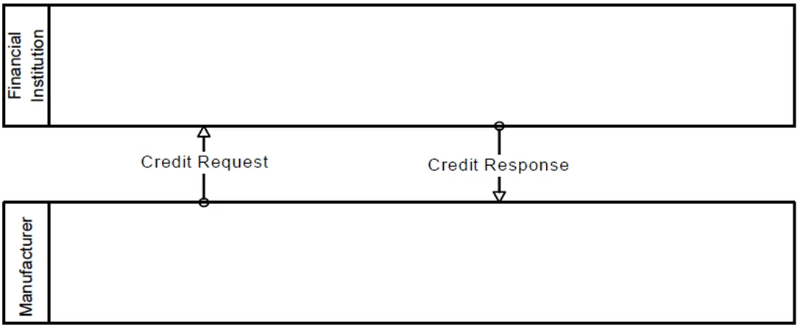

  → exemplo de white-box pool:

  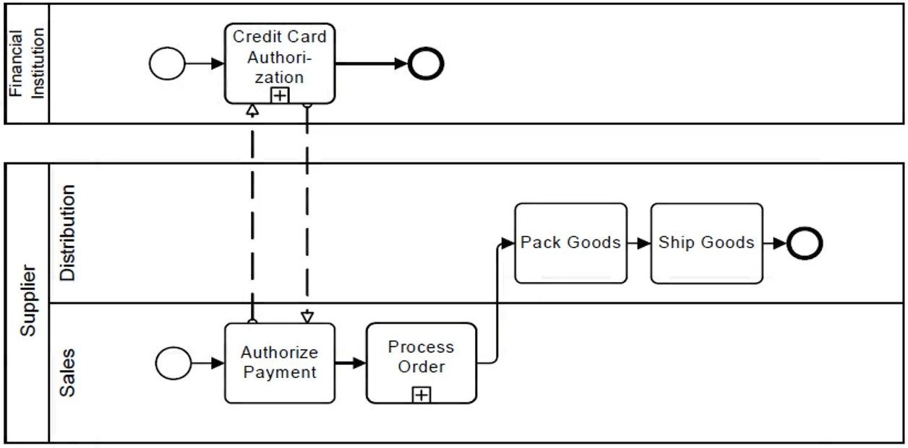

  → exemplo de white-box pool e black-box pool:

  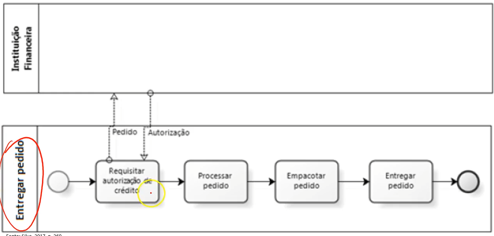

- obs: colaborações de white-box pool "tocam" na borda da atividade pertencente a mesma e de black-box pool "tocam" somente a borda da piscina

---

## Aula 6 - 15/03 - "Presencial"

#### Exercício avaliativo 

https://camunda.com/bpmn/reference/#events-escalation