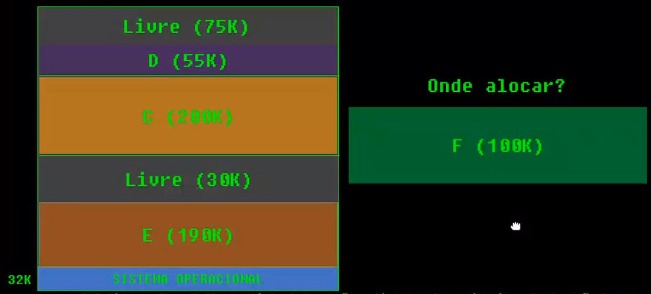

## Notes

Primeira aula do semestre ja começa com uma abertura de fogos de artifício com trilha de star wars. Então meu prof abre a cam com fundo de um cruzador espacial (star wars), depois muda pra um fundo de Mordor.

---

## Aula 1 - 03/02

#### Apresentação da disciplina

---

## Aula 2 - 08/02

#### Respostas das perguntas solicitadas

**Qual sua área preferida no Curso?** -> Tudo relacionado à desenvolvimento, e codificação. Ex: POO, BD, Testes, Segurança.

**Você tem experiência prévia com SO?** -> Não.

**O que é um Sistema Operacional?** -> Basicamente é a ligação entre o Hardware e Software, fazendo toda gerência de processos em execução, uso de memória para uma melhor performace... Além de possibilitar a utilização do computador através de uma interface gráfica.

**Como um sistema operacional atinge seus objetivos?** -> Se o objetivo for uma melhor performace, com o melhor uso do hardware disponível, então ele faz toda uma gerência de todos os processos em execução, pode alterar o uso de memória, entre outros. Por exemplo, se tiverem somente processos leves em execução o SO pode alocar parte da memória RAM livre para ser usada como CACHE acelerando a busca de dados. Outro exemplo e a utilização de SWAP, parte da memória secundária é usada como memória principal quando o uso de RAM chega em um limite. Entre outros exemplos. 

**Quais são os três principais componentes de um sistema computacional na arquitetura de von Neumann?** -> CPU; Memória; Instruções de entrada e saída.

**Quais tipos de memória você conhece? Quais são as características de cada uma?**  -> **Registradores:** Memórias internas na CPU. Armazena temporariamente as instruções passandas para a CPU antes de serem processadas (como uma fila). **Memória Cache:** está entre a CPU e a mamória principal. Ou seja, a CPU procura na cache antes de procurar na principal, por isso mais rápido acesso. **Memória RAM (Principal):** É um exemplo de memória volátil. Permite leitura e escrita, com armazenamento temporário. **Memória secundária:** Armazenamento de dados permanentes (não se perdem com o desligamento da máquina, por exemplo). Exemplos: HD, SSD, Pendrive...

**O que são IRQs ?** -> Um sinal de interrupção enviado do hardware ao processador para "chamar a atenção" do processador para a execução de algum processo em específico, por exemplo: caracteres digitados no teclado, movimentos do mouse, operações de leitura e escrita no HD, entre outros.

**Como funciona um HD / disco rígido?** -> De forma eletromagnética. O disco do HD é composto por trilhas (organização e localização dos dados no disco). Para o registro, a cabeça de leitura se movimenta até a trilha desejada e envia um sinal magnético para o disco, positivo ou negativo, que pode ser entendido como 0 ou 1 (bits).  Por isso pode ser considerado um processo relativimente lento, pois é mecânico, analógico.

#### Estrutura de um SO

- Software básico: Configurações (coisas básicas do sistema).

#### Conceitos básicos

- **SO**
  - Como *gerente de recursos*.
  - Como *máquina estendida*. Significa que ele te da algo além do hardware, exemplo: criar arquivos, receber dados da rede... Ele fornece um conjunto de instruções para os programas e /ou programadores para executar essas tarefas anteriores (Comandos java para ler arquivos por exemplo, ele manda um comando para o SO - O SO que converte para binário para se "comunicar" com o hardware). Ele também já fornece APIs do sistema, como o GPS do android.
- **Kernel:** é o núcleo do sistema operacional, responsável por fazer as interações de hardware e software. Executa as funções básicas de um sistema. É o SO em sí. Ele que aloca memória... Só ele que acessa o hardware!
  - **Funções básicas:** Alocar memória, ver disco rigido
- Execução em **modo kernel** (supervisor): Acesso total ao hardware. Operações que necessitam da comunicação com o hardware Ex: new (necessário alocar memória - só no modo kernel é possível)
- Execução em **modo usuário**: Acesso restrito ao hardware. Somente instruções lógicas e aritméticas do programa.
- **Transição modo usuário - modo kernel - modo usuário:** Switch entre os modos para fluxos que necessitam de cada um.

---

## Aula 3 - 10/02

#### Continuação de conceitos

- **Chamadas de sistema:** Procedimentos disponibilizados pela API do SO para request de serviços pelos usuários (programas -> programadores). 
  - API do windows -> Win32.
  - POSIX: padrão definido pela IEEE para a manutenção de compatibilidade entre sistemas.
  - Programas de sistema/utilitário (config. de rede, gerenciador de arquivos...) usam chamadas de sistema.
- Ambiente operacional = interface gráfica para o usuário final;

**Shell:** Interpretador de linhas de comando, comunica com o kernel para execução dos comandos solicitados;

*SO é como Sauron, faz tudo nas sombras, a gente só vê a interface gráfica.*

#### Arquitetura de SO

**Sistemas monolíticos:** Estrutura única, masisa, *a grosso modo é só o main*. É executado um único programa em modo núcleo, com uma coleção de rotinas (métodos). 

- Se ta tudo junto e misturado todas as rotinas estão sempre disponíveis e visíveis. 
- Manutenção e entendimento complicado.
- Uma falha boba pode derrubar o SO todo.
- Exemplo: Microsoft MS-DOS.

**Sistemas em camadas:** Dividir o Kernel em camadas independentes, com funções específicas.

- Existe uma hierarquia das camadas, para a comunicação entre elas.
- Pode ser mais lento por causa da hierarquia. O sistema é inteiramente escrito em camadas, logo a comunicação tem que trafegar entre elas sempre.
- Por outro lado a hierarquia proporciona segurança.
- Exemplo: MULTICS - Deu origem ao UNIX.
- Hoje é usado como subsistemas. Não é usado como o MULTICS mais, como o SO inteiro.

**Microkernel:** É um Kernel que executa só as funções básicas. É o kernel menor possível. 

- Só é usado como modo kernel. Para comunicação com o hardware.
- As outras coisas são executadas como serviço. *"Tudo terceirizado - User mode"*.
- Como alternativa para diminuir ao máximo o tamanho da parte principal do sistema, delegando o resto, deixando com os serviços (programas/utilitários/softwares). O sistema é composto em cima do microkernel.
- Exemplo: Minix. Apesar de ter alguns exemplos ainda é dificil achar hoje. O kernel linux pode ser considerado como microkernel, mas para muitos essa definição não se aplica.

**Sistemas cliente/servidor:** Sistemas em rede. Variação de microkernel, por ser a mesma ideia de delegar/distribuir as funções. Algumas funções vão ser providas pela rede, vindas de outro computador.

- Prestadores de serviço (servidores) e usuários de serviço (consumidores). Ex: Lab da puc, Teams...
- Comunicação por meio de mensagens, entre as máquinas da rede (Client, Process server, File server...).
- Praticamente todo SI que usamos hoje é um cliente/servidor. pela "onipresença da rede". Sistema na web e computação em nuvem.

**Máquinas virtuais (VM):** Cópia exata do hardware.

- Tradicionalmente utilizada para possibilitar compatibilidade entre sistemas.
- Basicamente faz a tradução do hardware desejado, para o hardware "real" da máquina que está rodando.
- Emulador é uma VM. 
- Importância hoje: 
  - Java roda em uma VM :)
  - Necessidade de execução de múltiplos servidores;
  - Isolar servidores -> isolar falhas;
  - Computação em nuvem (lembrar da AWS).

**Exonúcleos:** Em vez de clonar a máquina real, como nas VMs, outra estratégia é dividi-la ou dar a cada usuário um subconjunto de recursos. Divisão do hadware em vários kernels (núcleos) - Computação em nuvem geralmente é assim, a cada solicitação de criação de uma máquina, os recursos do hardware são divididos e parte dele é usado em cada nova máquina. 

---

## Aula 4 - 22/02

#### Diferença entre arquitetura Android - Linux - Win

#### Histórico resumido

- Multiprogramação e Time-sharing (slide)

---

## Aula 5 - 24/02

#### Continuação do histórico

Por que e o que desencadeou a evolução do TCP/IP e a rede?

#### Desafios atuais

- Compatibilidade: Compatibilizar dados. Linux mantem dados de uma forma diferente que o Windows, por exemplo. Outro exemplo: SO conversar com server (hoje utiliza protocolos de rede pra isso).
- Portabilidade: Um sistema ser capaz de executar em mais de um local (hardware). Ex: Android tem alta portabilidade.
- Abertura: Sistemas abertos são mais facilmente compativeis e portateis. Mais dificil fazer um SO conversar com outro fechado. Os protocolos de rede (TCP>>HTTP...), por serem abertos, possibilitam a grande escala de comunicação entre sistemas que temos hoje. Foi quase que necessário tais protocolos serem aberto para isso. 
- Escalabilidade: Capacidade de um sistema crescer.

---

## Aula 6 - 01/02

#### Processos

É um programa em execução. Programa é o código fonte, mas quando começa a executar ele começa a ser tratado pelo SO como um processo. *Para execução é necessário estar na memória principal.*

Conceito central de SO
- Execução de tarefas solicitadas pelo usuário;
- Tudo ocorre a partir de necessidades dos processos. Tudo gira em torno dos processos.

Estrutura básica de um processo na memória principal: 

1. Pilha: Os últimos passos do algoritmo são executados primeiro, ou seja, as "dependências", os métodos chamados em uma parte do algoritmo, é executada primeiro que a parte do código onde foi chamada; 
2. Dados; 
3. Código (parte mais baixa, ou seja o primeiro a ser executado).

##### Multiprogramação 

Em um sistema de multiprogramação a CPU fica se alternando entre a execução de vários processos. Uma das principais tarefas do SO, ele precisa gerenciar qual programa vai executar primeiro e por quanto tempo. Por mais que parece estar tudo sendo executado ao mesmo tempo, não está, só é muito rápido. Pseudoparalelismo ou Paralelismo em multiprocessadores (nesse caso também tem que decidir em qual processador irá executar).

- Controle simultâneo de diversas tarefas
  - Alternância por bloqueio e prioridade
  - Retomada de execução

##### Estados de um processo

- Ciclo de vida na gerência de processos (Boi psicodélico)

*Só vai para o bloqueio quando o processo "pede algo que não é dele", algo externo.*

##### Bloco de controle do processo (PCB)

Objeto de sistema para representar um processo. Armazena informações associadas a um processo:

- Estado do processo (Pronto, espera...);
- Registradores : contador de programa, acumuladores, ponteiro de pilha, base, limite e endereço de memória;
- Prioridade;
- Contabilidade (Tempo que passou no bloqueio, tempo de processado...).

Tabela de processos: Basicamente uma tabela hash de PCB, para na hora de precisar de algo ele localizar rapidamente.

##### Troca de contexto

- Multiprogramação, alternância e troca de contexto

##### Pseudoparalelismo

Parece que os processos estão sendo executados em paralelo, ao mesmo tempo, mas não é dessa forma que ocorre, há a troca de contexto, troca de processos em execução. E só parece estar executando ao mesmo tempo porque é muito rápido.

#### Threads

Unidade básica de utilização/controle da cpu. É uma forma de um processo dividir a si mesmo em duas ou mais tarefas (multithread) que podem ser executadas concorrencialmente.

Modelo de processo tradicional: Fluxo de controle único -> monothreads.

Processo multithread:
- Divisão de tarefas em fluxos independentes;
- Pode realizar mais de uma tarefa concorrentemente, ou simultaneamente.

##### Qual sua importancia?

  - Responsividade (execução de vários processos ao mesmo tempo, muito importânte em jogos);
      - Compartilhamento e economia de recursos (compartilhamento/economia de código...). Por outro lado temos maior consumo de recursos de gerência (overhead);
  - Aproveitamento de arquiteturas multiprocessadas (vários núcleos de processamento, por exemplo);
  - Como consequência de tudo isso, temos o ganho de tempo;

*Exemplo 1: Editor de texto. Em single-thread, cada processo abaixo seria executado após a finalização do anterior. Com multithreads tudo isso trabalha de forma concorrencial.*

- *Usuário digita o texto;*
   - *Verificação ortográfica/correção automática;*
- *Formatação de páginas não visíveis;*
- *Cópias de segurança.*
  

*Exemplo 2: Servidor web.*

  - *Despachante;*
  - *Trabalhadores.*
    

*Exemplo 3: Save de arquivo, pode utilizar uma thread para ir salvando o arquivo aos poucos.*

##### Modelo de threads no SO

- Processos leves (LWP);
  - ciclo de vida equivalente.
- Possuem contador de programa, registradores e pilhas próprias;
- Compartilham código e dados;
- Mais leves para criar e destruir.

---

## Aula 7 - 03/03

#### Implementação e gerencia de threads

SO deve decidir como gerenciar threads

- **Espaço de usuário (muitos para um).** Outras threads são implementadas pelo processo e gerenciadas por ele. O próprio executável gerencias as threads usadas por ele. *Ex: Java, Linux*;
  - Como consequência a gerência dos processos, por parte do SO, é mais simplificado;
  - Não necessita alternar de processo para trocar de thread;
  - Como quem cuida das threads é o processo, não há paralelismo de fato. Somente as threads internas desse programa.
  - Como o SO não reconhece as threads, ele pode bloquear um processo inteiro e todas suas threads mesmo quando alguma delas poderia executar.
- **Espaço do núcleo - kernel (um para um).** Cada thread do processo é associada a uma thread de kernel.
  - Maior concorrência, paralelismo real em multiprocessadores;
  - Maior consumo de recursos de gerência (overhead). Atraso na criação de uma thread, tabela de threads...
  - Paralelismo real: suposta melhora de desempenho;
  - *Importância de limitar o nº de threads possíveis: um software malicioso pode sair criando várias threads, usando todos os recursos, e derrubar o sistema.*
- **Hibrido (muitos para muitos).** Tenta resolver o problema de gestão com uma threadpool.
  - Criar uma *thread* custa um pouco caro. Manter controle de todas ativas não é uma tarefa tão simples. Ter um objeto que gerencie isso ajuda muito, e com ele viabiliza usar *threads* de execução mais curta, já que o custo é minimizado por não ter que ficar criando e destruindo várias *threads*.
  - Thread pool:
    - Criar várias threads na inicialização e alocá-las em um banco;
    - Tarefas novas: “acordam” threads do banco;
    - Se há falta de threads: espera.
  - Agilidade;
  - Flexibilidade;
  - Controle de recursos.

#### Escalonamento de processos (e/ou threads)

Multiprogramação: muitos processos ou threads aptos a executar.

Problema: Não há processadores/núcleos livres para todos.

Objetivo: Manter os processadores/núcleos ocupados e finalizar as tarefas o quanto antes.

##### Escalonador

Ou scheduler, decide quem será o próximo processo da *fila de prontos a executar*. O algoritmo de escalonamento segue regras para determinar as escolhas.

- Escalonamento **não-preemptivo**: Quando um processo em execução **não** pode ser interrompido pelo S.O. Ou seja, espera um processo acabar para começar o outro.
  - Menos custoso, porque: O processo retém a CPU - Sem decisão ativa do escalonador
- Escalonamento **preemptivo**: O S.O. pode interromper a execução de um processo. Ou seja, em uma tentativa de aumentar a vazão, ele pode interromper os processos e começar a executar outro, e assim vai.
  - O processo pode ser temporariamente suspenso - Decisão ativa do escalonador

##### Tipos de sistema

*Tudo depende do sistema de destino, seus objetivos!*

- Sistemas em **lote**: Os processos são processados em lote. Não há interação contínua com os usuários. Tarefas periódicas. Comum em computadores de grande porte.
- Sistemas **interativos**: Interação contínua com os usuários. Determinada solicitação tem uma resposta instantânea. Ex: Sistemas web em geral, equipamentos pessoais, IDEs, Teams (sincroniza audio e video sem parar)... 
- Sistemas de **tempo real**: Necessidade de interação, mas também de restrições de prazos. Ex: Controle de sinais de trânsito, radar de aeroporto, monitoramento no geral. *Acontece no tempo do "mundo"*. 
  - Hard real-time: Sistemas em que prejuízos (não cumprimento de prazo por exemplo) não são aceitáveis, o erro pode ser catastrófico. Ex: Controle de sinais de trânsito.
  - Soft real-time: quando os prejuizos são aceitável. Ex: Um jogo da uma travada leve.
  - Tem como característica ciclos curtos.

##### Critérios/Objetivos do escalonamento

Se aplica em **todos os sistemas**!

- Justiça: Dar a cada processo uma fração justa da CPU;
- Política: Sistema deve cumprir regras estabelecidas;
- Equilíbrio: Todas as partes do sistema computacional devem estar ocupadas.

Se aplica em nos **sistemas em lote**!

- Vazão (Thorughput): Número de tarefas executadas por unidade de tempo;
- Tempo de retorno: Tempo entre submissão de um processo e seu término;
- Uso da CPU: Manter a CPU trabalhando o tempo todo.

Se aplica em nos **sistemas interativos**!

- Tempo de resposta: Tempo de resposta a um (primeiro) pedido;
- Proporcionalidade: Tempo de atendimento de uma requisição em relação à expectativa do usuário.

Se aplica em nos **sistemas de tempo real**!

- Cumprimento de prazos: Evitar perda de dados;
- Previsibilidade: Regularidade e tempo de execução de tarefas repetitiva. Disivão do processo em tarefas/threads com comportamento previsível.

---

## Aula 8 - 08/03

#### Algoritmos de Escalonamento - Em lote

##### FCFS

First come, first served. Fila de processos. Bem simples, porém o ponto negativo é que não é justo, um processo relativamente pequeno pode demorar muito para ser executado, por estar no fim da fila por exemplo. Consequentemente uma vazão pequena.

- Tipicamente usado em sistemas em lote;
- Não-preemptivo.

##### SJF

Tarefa mais curta primeiro (**shortest job first**). Ordenar os processos pelo tempo de execução (trabalho necessário). Consequentemente a vazão aumenta. O problema é saber por quanto tempo o processo será executado :) Funciona melhor com tarefas previsíveis, ou seja, que dê para calcular um tempo previsto de processamento, tarefas específicas que são sempre executadas (pegar o tempo médio...).

- Também não-preemptivo.

##### SRT

Menor tempo restante (***Shortest remaining time***). Variação do SJF. na chegada de outro processo, é avaliado o tempo de execução do novo processo, se for menor que o tempo restante do processo atual, o escalona-dor interrompe o processo, e o novo processo começa a ser executado. Se o novo processo tiver um tempo maior, a fila é reorganizada (geralmente usando método de inserção).

- O problema é se começar a chegar muitos processos novos. Tem que tomar cuidado para não ficar no "Adiamento infinito" - *starvation*. Para isso pode ser feito o agendamento de tarefas longas (exemplo de política de emergência).
- Preemptivo.

#### S.Interativos - Prioridades

Nos sistemas interativos o objetivo é executar as tarefas mais **importantes** primeiro. Diferente dos em lote que o objetivo é finalizar os processos mais rapidamente. Logo precisamos definir prioridades.

- Preemptivo.

Simplesmente é atribuido um valor numérico ("etiqueta") a cada processo, para na hora da execução ser visivél qual é prioritário.

- Prioridades - Valores estáticos: regra pré-definida por fatores externos;
- Prioridades - Valores dinâmicos: em geral, modificados pelo SO para bom andamento do sistema.

##### Round-robin

Ou escalonamento circular. Esse algoritmo atribui a cada processo um tempo máximo para processamento: **quantum**. Ou seja, ao fim do quantum, o processo sofre preempção. Com isso conseguimos aplicar justiça ao nosso algoritmo.

- Tamanho do quantum: Responsividade x Desperdício. Um quantum grande pode fazer a resposta demorar, e um pequeno pode ser um desperdício pelo fato de ter que trocar de processo, e isso gasta tempo.
- Em consequência o quantum chega a ser insignificante, pois o menor processo sempre vai ser o que finaliza primeiro, logo todos os demais devem ser executados naquele tempo (tempo de execução do menor processo). 

*O retorno médio pode ser maior, porém o tempo de resposta é maior!* É a socialização do processador.

##### Filas de prioridades

Precisamos de prioridades para os processos, logo é feita uma mesclagem de round-robin com prioridades. Processos com prioridades iguais são executados em round-robin, o resto segue na prioridade.

- Importânica + justiça.

---

## Aula 8 - 10/03

#### Exercício de fila de prioridades

 

#### Sistemas de tempo real

Cenário ideial: processos homogêneos com eventos periódicos.

Antes de aceitar o processo precisa decidir se é possível escalonar em tempo real. Isso é calculado: 

##### Taxa monotônica - RMS

"Nada muda". Nesse algoritmo cada processo tem prioridade fixa relativa à sua frequência. *Frequencia = período/total*. Ou seja, quem for executar mais vezes, com um ciclo mais curto, tem prioridade.

---

## Aula 9 - 15/03

#### Continuação - Sistemas tempo real

##### EDF

Prazo final primeiro (Earliest deadline first). A prioridade é quem vai encerrar primeiro. É dinâmico.

##### RMS x EDF

RMS: Dependendo das cargas... por causa da prioridade, um processo ou outro pode perder prazo. *O calculo para decidir se vai executar um processo, ou nao, só diz se é possível executar ele, mas não garante o cumprimento dos prazos.*

Porém o EDF é mais complicado, exige mais do sistema...

#### Escalonamento em multiprocessadores

**Multicomputadores**: CPUs estreitamente acopladas que não compartilham memória.

- Escalonamento "simples", pois cada CPU é independente, logo é só distribuir as tarefas;
- Tem que saber fazer o balanceamento da carga e distribuição de processos.

**Multiprocessadores**: Sistema de computadores no qual duas ou mais CPUs compartilham acesso total a uma RAM comum. 

- Questão bidimesional, qual processo? E em qual processador?
- Tem que gerenciar se os processadores vão processar tal processo de forma independente (um único processador pra ele), ou relacionado (mais de um processador para o processo).

Cenário "simples": 

##### Tempo compartilhado.

  - Considerar processos e threads como independentes;
  - Estrutura única de escalonamento;
  - Eventos e interrupções: uso do algoritmo escolhido.

Sobre o exemplo de cima:

- Simples e eficiente;
- Permite o balanceamento entre processadores;
- Tempo compartilhado em processadores;
- Porém, para essa eficiência toda os processos precisam estar independentes, se tiver dependência, perde um pouco de eficiência. 
- Porém 2, quando muda processos de processador, é perdido a cache, consequentemente eficiência. 

##### Escalonamento por afinidade

Força o aproveitamento de cache dividindo os processos por processador antes de começar a execução.

- Essa afinidade por ser manual (usuário) ou do algoritmo (SO);
- Cada CPU usa a regra do algoritmo definido.

---

## Aula 10 - 17/03

#### Continuação de multiprocessadores

##### Escalonamento por compartilhamento de espaço

Threads que se comunicam muito devem ser executadas ao mesmo tempo. Quando threads são inicializadas juntas, cada uma é alocada para uma única CPU. Inicialização deve esperar até que haja CPUs suficientes.

- Não preemptivo;
- Quant. de threads x nº de CPUs livres;
- FCFS para gerenciar fila de pedidos por CPUs

*Mais comum em servidores e em sistemas em lote.*

Cada grupo equivale à um processo, ou seja, threads inicializadas juntas, que compartilham espaço de memória (buscam nos mesmos endereços) e são executadas em CPUs reservadas à cada uma.

##### Escalonamento de bando

Gang scheduling. Mistura escalonamento de tempo (round-robin) com escalonamento de espaço. 

- Evitar perda de desempenho por comunicação bloqueada.
- Escalonamento síncrono
  - Todos os membros do bando executam simultaneamente em tempo compartilhado
  - Todos os membros do bando iniciam e terminam ao mesmo tempo seus quanta
  - A cada quantum, todas as CPUs são reescalonadas

#### Comunicação e sincronização entre processos e threads

##### SO e cenário atual

Cenário comum: multiprogramação, tempo compartilhado, paralelismo real, multithreading.

- Colaboração 
- Dependência
- Concorrência de theads

##### CPI

Comunicação interprocessos. Comunicação e sincronização de acesso de processos a recursos são fundamentais para evitar problemas:

- Inconsistência de dados. Ex: Processo de débito e crédito na conta do banco ao mesmo tempo, com saldo inconsistênte no final;
- Dados usados em duplicidade.

*Regiões críticas > Condições de corrida > Necessidade de exclusão mútua.*

##### Condição de corrida

Quando dois ou mais processos compartilham recursos e o resultado final depende de uma ordem de execução.

**Região crítica:** Trecho(s) dos processos nos quais os dados compartilhados são acessados. Potencialmente perigosos.

**Exclusão mútua:** Mecanismo para garantir que, se um processo está em sua região crítica, outros processos serão impedidos de estar em suas regiões crítica.

Princípios da boa exclusão mútua:

1. Somente um processo pode estar na região crítica a cada momento;
2. Não se pode fazer suposições sobre velocidade e ordem de execução de processos (Lei de Murphy);
3. Nenhum processo fora da região crítica pode impedir outros processos de entrarem em suas regiões críticas;
4. Um processo não pode esperar indefinidamente para entrar em sua região crítica.

*Obs: 1 e 2 são obrigatórios, ou não funciona. 3 e 4 são desejados, ou teremos alguns problemas.*

##### Espera ocupada

Busy waiting. Sem ajuda ou interferência do SO. Não há estado de bloqueio nem chamadas de sistema. Processo que não pode adentrar a região crítica gasta o tempo de processador inutilmente até o fim do quantum.

Alternativa 1: Desabilitar interrupções antes do processo começar a executar, e habilita ao sair (ao finalizar).

- Não segue o 4º princípio (Espera indefinida);
- Segurança comprometida;
- Pode ser usado pelo próprio SO. Ex: Enquanto aloca memória, ninguém pede mais nada.

Alternativa 2: Variável de bloqueio. Usar variável boolean, enquanto ela for false, o processo fica em "stand-by", assim que ela ficar true o processo segue o fluxo.

O problema que essa lógica não funciona, porque o 1º processo pode fazer boolean = true antes de executar seu processo, e o outro começar a executar logo em seguida. 

Alternativa 3: Alternância estrita. Variável controla quem tem o direito de executar naquele turno. A ação é de ceder a vez, não de tomar. Só no final da execução do 1º processo que essa variável muda seu valor para que o 2º comece a executar.

- Funciona, mas não garante desempenho;
- Bloqueio desnecessário. O sistema sempre vai executar no tempo do processo mais lento.

---

## Aula 11 - 22/03

#### Sleep/Wakeup

Chamadas de sistema para que o processo peça a ida ao bloqueio. Vai dormir se o processo **depender** de outro recurso. Ou quando o sleep é por período, por um tempo pré-determinado. *Recurso provido pelo SO.*

É importânte pelo fato de não ocupar o processador!

##### Produtores e consumidores

Modelo clássico de CPI. É um cenário metafórico.

*Buffer: Área de memória limitada e compartilhada. Alguém coloca para alguem tirar.*

Produtores de itens (escrevem na memória) e Consumidores de itens (retiram na memória). Streamming é um exemplo, não precisa de uma grande quantidade de memória para ver tal filme, o sistema vai enviando os dados e a placa de vídeo vai lendo e retirando da memória ao exibir o filme. 

Basicamente o produtor libera a operação do consumidor, e vice-versa.

Porém, essa única verificação - if(cont==0) - pode ocupar o tempo do *quantum* e não mandar o consumidor dormir na hora devida. Consequêntemente o sistema trava, vai chegar um ponto que ambos vão estar dormindo. Uma hora isso vai acontecer (Lei de Murphy).

#### Semáforos

Resolve o problema anterior. Variáveis especiais (de sistema) para controlar o número de sinais pendentes. Só permite duas operações indivisíveis (não tem como dividir a operação no meio, tem que começar e terminar): 

- Up (Incrementar o sinal);
- Down (Testar o sinal).

O semáforo é oferecido por meio de chamadas de sistema (essas operações são executadas assim). Ou seja, operação em modo kernel, e sem interrupções do sistema (detalhe que resolve o problema anterior).

Algumas linguagens de programação de alto nível o semáforo é disponibilizado por meio de bibliotecas. No caso do Java, o semáforo é controlado pela JVM.

Comportamento geral:

- Down: Tenta decrementar o contador. Se tiver 0 manda o processo para o bloqueio;
- Up: incrementa o contador e libera processos pendentes.

##### Mutex

Mutual exclusion é um semáforo simplificado: valores 0 ou 1 apenas. *Semáforo binário*.

##### Produtor/Consumidor com semáforo

Precisa proteger em três cenários:

1. Buffer cheio (produtor) - Produtor não pode executar;
2. Buffer vazio (consumidor) - Consumidor não pode executar;
3. Escrita/retirada do buffer (ambos).

É Eficiente e elegante (simples). Porém deve ser realizada com extremo cuidado, tracing e depuração de erros é muito difícil.

*Tracing: Logs para mapear bug.* 

---

## Aula 12 - 24/03

#### Monitores

Solução de alto nível de abstração, provida pela linguagem. Determina uma região como região monitorada, e que terá dados e códigos compartilhados por threads. Somente um processo pode estar ativo em um monitor em um instante de tempo.

Esquema geral:

- Variáveis de condição para controlar a espera;
- Dois sinais: wait e signal (libera a variável);
- Signal é sempre a última instrução do monitor.

Diferente do Sleep/Wakup as operações de "dormir e acordar" estão no monitor, logo ele já controla tudo para você.

Em resumo:

- Garante uma exclusão mutua "automática";
- Solução simples;
- Menos probabilidade de erro, pela linguagem fazer o controle, e não nós;
- Mas depende da linguagem de programação, nem toda tem.

#### Problemas clássicos - CPI

São cenários que modelam problemas recorrentes em SO e outros sistemas de software.

##### Leitores e escritores

Professor é escritor, e aluno é leitor.

Outro exemplo é uma reunião no teams. Uma tela compartilhada é manipulada pelo proprietário, e somente visualizada pelos outros da reunião.

Premissa para solução básica: Leitores novos podem entrar se já há um ou mais leitores. Escritores entram se os dados estiverem totalmente liberados.

O problema é que para o escritor entrar, os leitores precisam abandonar, e isso não garante a execução do escritor, pois pode estar sempre chegando um novo leitor, e os dados nunca vão ser liberados. (Starvation)

---

## Aula 13 - 29/03

#### Jantar dos filósofos

Metáfora para demonstrar a efetividade do uso de semáforos.

1. Thinking = processando, executando;
2. Eating = Usando recursos compartilhados - Mexendo nos dados;
3. Hungry = Estado de espera. 

> Thinking >> Hungry >> Eating. Precisa passar pelo estado de espera para usar os dados.

Modelo para situações de competição por acesso exclusivo a recursos compartilhados. Ex: Uso de várias fontes de dados para gerar um relatório.

---

## Aula 14 - 31/03

#### Deadlocks

>  Cenário atual: Multiprogramação || Multithreading || Compartilhamento e concorrência por recursos
>  E alguns desses recursos são exclusivos, ou seja, há uma necessidade de sincronização e espera.

Situação na qual nenhum processo em um grupo consegue avançar, todos estão bloqueados, esperando. Ex: Programa congelado.

> A Legislatura do Estado do Kansas dos Estados Unidos da América aprovou um estatuto que decretou que “Quando dois trens se aproximarem um do outro em um cruzamento, ambos deverão parar completamente e nenhum dos dois deverá ser acionado até que o outro tenha partido”. Esse estatuto ilustra uma situação de *deadlock* ou impasse.

Felizmente só ocorre deadlock quando as 4 coisas acontecem ao mesmo tempo:

- Exclusão mútua;
- Retenção e espera (hold and wait) - Um processo tem um recurso, outro processo tem outro recurso, ambos precisam do recurso do outro, mas ninguém sede;
- Sem possibilidade de preempção;
- Espera circular.

##### Prevenção de deadlocks

O SO tenta impedir pelo menos uma das 4 condições de ocorrência.

- Prevenir a espera circular: Protocolos obrigando uma espera linear.
  - Ex: Numerar os recursos e só permitir alocação ordenada. 
  - Fácil para o sistema, difício para o programador :) Logo ninguém vai querer programa para esse sistema. Ex: Windows phone.

Ou seja, prevenir o deadlock não da certo, é muito custoso, e acaba dando errado :)

##### Evitar os deadlocks

Não fiz nada para prevenir, ela pode acontecer, porém vou tomar atitudes para minimizar a chance de acontecer.

Conceito de **estado seguro** do sistema: SO pode alocar recursos a um processo se puder garantir que não acontecerá um deadlock, ou seja, descobrir se vai ter falta de recurso. Se for o caso, coloca o processo para dormir até ser seguro.

1. Alternativa: Usando grafos. Monta ele, e analisa. Se for perigoso, faz o fluxo explicado acima.
2. 

Na prática é muito complicado também.

Ou seja, evitar deadlock também é muito caro, SO não vai fazer isso também.

##### Detecção e recuperação de deadlocks

Depois que acontecerem, tentar solucionar o problema causado por um deadlock. Destravar o sistema e recuperar o estado consistente.

Alternativas para recuperação:

- Se possível -> Suspensão e preempção do processo que está travado. Geralmente não da, pois não da pra parar algo no meio;
- Retrocesso (backtracking). Andar para trás, CTRL+Z do sistema até o momento anterior ao problemático;
- Eliminação de processos, matar os programas. E torcer para matar o cara certo. Ou vai matar quem chegou por último (fez menos coisas e é menos provável de ser o problemático), ou quem chegou primeiro (fez e ta usando muita coisa, mais provável de ser ele, porém vai ter que refazer muita coisa).

Ou seja, tudo isso pode custoso também :):

##### Algoritmo do avestruz

Linux e Windows utilizam. Enfia a cabeça na areia e finja que não há nenhum problema. O custo das alternativas para lidar com os deadlocks é considerado alto para o sistema. Confiam que o programador faz programas sem deadlocks (usando semáforos corretamente). Ou te avisa que o programa não ta respondendo e tu resolve o que fazer.

---

## Aula 15 - 05/04

#### Dúvidas para prova

---

## Revisão

#### Pergunta 1

**O que é uma chamada de sistema? Qual a relação entre chamadas de sistema e execução em modo kernel?**

Chamadas de sistema são procedimentos disponibilizados pela API do sistema operacional para a requisição de serviços por parte dos usuários (programas). Somente no modo kernel é possível a comunicação com o hardware, logo é preciso uma chamada de sistema para o kernel executar (em modo kernel) a operação desejada. Por exemplo, alocação de memória, uso de periféricos, criação e finalização de processos, entre outros.

#### Pergunta 2

**Por que é necessário um bloco de controle do processo (PCB) para cada processo nos sistemas de tempo compartilhado?**

No sistema de tempo compartilhado é necessário que os processos sejam independêntes para uma boa eficiência. Logo, precisamos de um PCB para representar e armazenar todas as informações associadas a cada processo de forma independênte.

#### Pergunta 3

**Qual a diferença entre processos que estão em bloqueio e processos na fila de prontos?**

Processos que estão em bloqueio estão esperando "algo que não é dele", ou seja, ele tem algum impedimento, esperando algo recurso externo à esse processo para poder continuar sua execução. Processos que estão na fila de prontos já estão totalmente prontos para serem executados, sem nenhum impedimento.

#### Pergunta 4

**Escolha duas arquiteturas de sistemas operacionais e faça um resumo sobre elas, apontando vantagens, desvantagens e exemplos de uso de cada uma. (ou faça sobre todas, melhor ainda!)**

- Arquitetura monolítica: Estrutura única, masisa, a grosso modo é só o main. É executado um único programa em modo kernel, com uma coleção de rotinas (métodos). Se ta tudo junto e misturado, todas as rotinas estão sempre disponíveise visíveis para todos. A desvantagem disso tudo é que um grande bloco de código dificulta o entendimento e manutenção do sistema, e uma falha boba pode derrubar todo o SO. 
  - Exemplo: Microsoft MS-DOS.
- Sistemas em camadas: Divide o Kernel em camadas independentes, com funções específicas. Existe uma hierarquia entre essas camadas, e a comunicação entre elas depende da hierarquia. A vantagem é que essa hierarquia proporciona uma maior segurança. Por outro lado pelo mesmo motivo essa arquitetura tende a ser mais lenta, pois a comunicação tem que trafegar entre várias camadas para alcançar seus objetivos.
  - Exemplo: MULTICS - Deu origem ao UNIX. Hoje nenhum SO é inteiramente arquitetado dessa forma, geralmente esse tipo de arquitetura é usado como subsistemas.
- Microkernel: É um Kernel que executa só as funções básicas, é o kernel menor possível. A ideia é só é usado como modo kernel, ou seja, para comunicação com o hardware, as outras coisas são executadas como serviço. "Tudo terceirizado - User mode". Como alternativa para diminuir ao máximo o tamanho da parte principal do sistema, delegando o resto, deixando com os serviços (programas/utilitários/softwares). O sistema é composto em cima do microkernel.
  - Exemplo: Minix. Apesar de ter alguns exemplos ainda é dificil achar hoje. O kernel linux pode ser considerado como microkernel, mas para muitos essa definição não se aplica.
- Cliente/Servidor: Sistemas em rede. Variação de microkernel por ser a mesma ideia de delegar/distribuir as funções. Algumas funções vão ser providas pela rede, vindas de outro computador. Ou seja, temos os prestadores de serviço (servidores) e usuários de serviço (consumidores). Comunicação por meio de mensagens, entre as máquinas da rede (Client, Process server, File server...). Praticamente todo SI que usamos hoje é um cliente/servidor, pela "onipresença da rede". Sistema na web e computação em
  nuvem. 
  - Exemplos: Laboratório da PUC, Microsoft Teams, entre
    muitos outros.
- Máquinas virtuais (VM): Cópia exata do hardware, basicamente faz a tradução do hardware desejado, para o hardware "real" da máquina que está rodando. Tradicionalmente utilizada para possibilitar compatibilidade entre sistemas.
  - Exemplos: Java roda em um VM; Emulador; Muito utilizado em
    computação em nuvem.
- Exonúcleos: Em vez de clonar a máquina como na arquitetura anterior, esse sistema divide o hardware em vários kernels, da para cada usuário um subconjunto de recursos. 
  - Computação em nuvem geralmente é assim, a cada solicitação de criação de uma máquina, os recursos do hardware são divididos e parte dele é usado em cada nova máquina.

#### Pergunta 5

**O que é um sistema de tempo real? Quando dizemos que um sistema de tempo real é escalonável?**

Um sistema de tempo real é caracterizado pela necessidade de cumprimento de prazos, ou seja, possui restrição para a execução dos processos. Exemplo: Controle de sinais de trânsito, radas de aeroporto, entre outros. É muito comum em sistemas de monitoramento. Podemos dizer que a execução de processos nesse sistema acontece no tempo do "mundo". 

Antes da execução dos processos em um sistema de tempo real serem executados, é calculada a possibilidade de sua execução, para saber se é possível cumprir os prazos necessários daquele sistema. Logo, só é escalonável quando há previsibilidade do tempo de execução e chegada das tarefas, para que se possa determinar se o conjunto de processos pode ser executado, ou não no tempo previsto. Em outras palavras, determinar se o conjunto de processos é escalonável, ou não.

A soma dos requisidos de tempo real não podem dar mais que 1, pq se der mais não vai conseguir cumprir o prazo.

#### Pergunta 6

**Considere um sistema de tempo real com duas chamadas de voz de periodicidade de 5ms cada, com tempo de uso de CPU de 1ms por chamada, e um stream de vídeo de periodicidade 33ms com tempo de CPU de 11ms por execução. Mostre como ficariam os 3 primeiros ciclos de execução destes processos em um sistema usando RMS e EDF.**

#### Pergunta 7

**Como threads podem ajudar um programa a executar mais eficientemente? Dê um exemplo, evitando os que já foram mencionados em sala de aula.**

Thread é uma forma de um processo dividir a si mesmo em duas ou mais tarefas que podem ser executadas concorrencialemente. Ou seja, dividimos as tarefas para serem executadas em threads diferentes, que por sua vez possuem seus próprios recursos, como registradores, pilhas... mas acessam os mesmo dados e recursos. 

Dessa forma podemos fazer com que vários processos sejam executados ao mesmo tempo, com compartilhamento e economia de recursos (apesar de ter um maior consumo de recursos de gerência). Como consequência de tudo isso, temos o ganho de tempo na execução dos processos. 

Exemplo: Os navegadores (browsers). Podemos fazer o download de vários arquivos e ainda continuar interagindo e trafegando entre as páginas da web enquanto esses arquivos estão sendo carregados.

#### Pergunta 8

**Aponte uma vantagem e uma desvantagem de cada abordagem para a implementação de exclusões mútuas:**

a) Alternância estrita

Essa abordagem funciona e é simples de implementar, porém não garante desempenho, o sistema sempre vai executar no tempo do processo mais lento, ocupando o processador de forma inútil.

b) Semáforos

 As únicas duas operações possível são executadas em modo kernal, e sem interrupções do sistema, ou seja, essas duas operações são indivisíveis, uma vez iniciada, ela é finalizada. É eficiente e simples de implementar, porém deve ser realizada com extremo cuidado, pois qualquer erro mínimo de lógica pode fazer o sistema não funcionar, além de ser difícil de fazer o tracing e depuração desses erros.

c) Monitores

Monitores são uma solução com um alto nível de abstração e providas pela linguagem, ou seja, basicamente nós determinamos uma região critica como região monitorada, e o monitor já garante uma exclusão mútua "automática", sem a possibilidade de erro lógico de implementação, pois a linguagem que faz esse controle. O ponto negativo é que depende da linguagem de programação, nem todas possuem monitores.

#### Pergunta 9

**Analise a descrição dos sistemas de software a seguir e relacione cada um dos sistemas a um modelo de comunicação interprocessos estudado, apresentando as características similares em cada caso.**

**a) A receita federal libera mensalmente um novo lote de restituição de imposto de renda. Cerca de 25 milhões de contribuintes têm interesse em verificar, via Web, se suas restituições foram liberadas.** 

​	Facilmente  identificamos  aqui  leitores  (contribuintes  que  querem  verificar  o  status  da  declaração)  e  escritores (servidores  da  receita  que atualizam  de  acordo  com  os  lotes).  O  ideal  seria  que,  na  data  da  atualização,  o  sistema  fique indisponível por um tempo para que os escritores possam atualizar toda a base de dados, sendo esta depoisliberada para os contribuintes. Não há problema em milhares de contribuintes consultarem seus dados simultaneamente.

**b) Para o cômputo do resultado das eleições, devem ser enviados ao servidor e somados ao resultado os resultados parciais de todas as seções eleitorais do país. Os eleitores, a imprensa e os próprios candidatos podem consultar o resultado em tempo real.** 

​	Podemos pensar, num primeiro momento, em outro problema de leitores (imprensa, candidatos, eleitores) e escritores (sistema atualizando o resultado da votação). Em algum momento, o resultado precisa ser bloqueado para consultaspara que o sistema de votação atualize o total recebido das seções eleitorais. Se cada seção eleitoral puder, por si só, atualizar o resultado, teremos  milhares  de  escritores.  Assim,  considerando  somente  os  processos  das seções  eleitorais,  podemos enxergar  também  uma variaçãodojantar filósofos:  as  seções  concorrem  com  algumas  seções “vizinhas”(totalização  porcidade ou estado, por exemplo) e concorrem também todas entre si para uma totalizaçãonacional, se for o caso.

**c) Um gravador de discos Blu-ray deve ler dados do HD do sistema a uma taxa tal que permita que a escrita no disco óptico seja feita sem interrupções.** 

​	Aqui  temos  um  clássico  de  produtor/consumidor. A  leitura do  discoproduzdados  em  memória  temporária,  os  quais serão  lidos  pelo  gravador  de  Blu-ray  para  gravar  o  disco (consumidor).  Neste  caso  em  específico,  o  ideal  é  garantir  uma memória  grande  o bastantepara  termos  um  bom  nível  de  confiança  de  que  o  consumidor  nunca  irá  bloquear:  se  isso acontecer, a gravação será interrompida e causará um erro, de acordo com adescrição do problema.

---

## Aula 16 - 12/04

#### Implementação prática de threads

Classe Thread do java :)

##### Sincronização de threads

É necessário tratar os cenários com disputa, concorrência de threads. Se dois consumidores quiserem, ao mesmo tempo, acessar os mesmos recursos e dados, vai dar pau.

Basicamente utiliza-se semáforo, monitores... 

---

## Aula 17 - 19/04

#### Gerência de memória

Gerência de trocas -> Ta usando muito uma variável específica, então o sistema joga para a cache, entre outros exemplos.

O SO para fazer qualquer coisa na memória, precisa de todos os tópicos acima, ou seja, depende do processador. 

##### Conceitos

- P = Pilha
- D = Dados 
- C = Código

Cada processo tem essas três áreas de forma independênte, cada processo só sabe dele mesmo.

Para um processo entrar em execução, ele precisa estar na memória principal, na memória fisica.

A primeira coisa que o SO precisa fazer é o endereçamento de memória para começar a executar o procesos em algum endereço da memória principal. A **MMU** que faz a tradução, o mapeamento do endereço lógico para o físico.

#### Técnicas básicas - Gerência M. Principal

> Veremos que a evolução da gerência segue o mesmo caminho que aprendemos programação:
> 1. Utilizará uma variável base para a gerência;
> 2. Um vetor;
> 3. Uma lista;
> 4. Árvore/Hash

##### Monoprogramação

Somente um processo, além do sistema, executa por vez. E temos dois processos na memória (SO + 1 processo).

- Endereçamento simplificado: registrador de base -> Somar o valor da base ao endereço lógico

Exemplo: 

- Gerência simples, quase inexistente. Porém ineficiênte.

##### Partições fixas

Se um processo não ocupa a partição por completo, de duas uma. Ou ele usa para expandir-se futuramente, ou aquela memória fica meio que perdida/atoa.  

###### Endereçamento

Cada processo terá:

- Registrador de base: marca o início da partição (processo) na memória principal;
- Registrador de limite: marca o tamanho da partição na memória principal. (quantos bytes para frente a partição vai usar).

Proteção primeiro - Relocação depois.

*Obs: Caso não tenha partição que caiba um determinado processo, o mesmo não será alocado. Ou seja, esse tipo de gerência pode desperdiçar muita memória :(*

###### Fragmentação de memória

- Externa: Entre um processo e outro (entre duas partições usadas) há memória que não conseguimos usar (partição livre que não conseguimos usar).
- Interna: Quando há memória dentro de uma partição utilizada que não será utilizado por mais ninguém.

*Obs: Em partições fixas pode ocorrer os dois tipos de fragmentação. Em partições variáveis, só da pra acontecer a fragmentação externa.*

---

## Aula 16 - 26/04

#### Continuação - Gerência M. Principal

##### Partições variáveis

As partições são criadas à medida em que são necessárias pelos processos. **Partições livres vizinhas podem ser unificadas.**

Para o cenário a seguir temos algumas alternativas: 

###### Alternativa 1: 

Como são partições variáveis, é possível a relocação de processos para o processo *F* poder entrar. **Isso chama compactação de memória**:

> Porém1: É necessário parar todos os processos para a relocação.
> Porém2: É necessário copiar byte por bype de cada processo para o endereçamento desejado. E isso pode levar tempo.

*Utiliários para limpar memória do sistema, além de retirar o lixo da memória, ele realoca todo mundo.*

###### Alternativa 2:

Fazer a troca de memória (**SWAP**). Nesse caso, a troca de um processo inteiro, ou seja, se não tem lugar pra um processo prioritário, retira um da memória (coloca em bloqueio), e coloca o prioritário na memória.

> Porém: Pode ocorrer a fragmentação externa, por não fazer a relocação de memória.

###### Endereçamento

*A leitura é mais lenta que nas partições fixas :(*

---

#### Paginação

Para fugir de possíveis fragmentações utilizamos a paginação. Nada mais é que os processos divididos em páginas lógicas de tamanho **igual** e **fixo**. Ou seja, divide um processo em N páginas de mesmo tamanho.

A memória principal é dividida em páginas físicas de tamanho igual ao das páginas lógicas. Chamadas de: *Molduras de memória* por ficarem vazias esperando encaixar uma página de dados la dentro.

> Página lógica: Páginas do processos (dados do mesmo);
> Páginas da memória principal onde os dados vão ser armazenados. 

*Os processos são carregados página por página.*

-  Ainda pode ocorrer fragmentação interna, porém somente na última página, mas geralmente perde muito pouco. Ou seja, aproveitamento de quase 100% da memória principal;
- E não temos fragmentação externa, toda página lógica pode entrar em qualquer página física.

> Porém: A complexidade de endereçamento de páginas aumenta. Uma vez que o SO precisa encontrar a página lógica e física que ele quer (nº da página, posição dentro da página).
>
> Para isso precisamos de uma **tabela de páginas para cada processo.**

- Calcular o nº da página = endereço lógico / tamanho da página
- Deslocamento = endereço lógico % tamanho da página *(o deslocamento é "o quão pra frente" na página o processo está, ou seja, quantos bytes pra frentes ele está)*.

Agora para encontrar o endereço físico o processo tem uma tabela de suas páginas para referenciar cada localização na memória física:

Esse rolê todo é o preço que se paga para resolver os problemas anteriores :) Tudo isso é feito de uma forma rápida (mais lento que os outros, porém ainda rápido). Geralmente, em um clock, é possível passar todo endereçamento de memória que precisamos. 

---

## Aula 17 - 28/04

#### Memória virtual

E se tivermos a necessidade de executar processos maiores que a memória principal? *R.: Será que precisamos de um processo inteiro em memória principal durante todo o tempo de sua execução? (Suponha um editor de textos...) Com certeza não!*

A ideia da memória virtual é essa, nunca usamos tudo do processo ao mesmo tempo na memória. Logo, já temos o processo dividido em páginas, então mantemos em memória principal **somente o necessário** para a execução dos processos em um **dado momento**.

> SO utiliza espaço em memória secundária (disco) para "complementar" a memória principal. Ex: **SWAP** do linux S2. Isso é uma memória virtual.
>
> Ou seja, é uma área reservada do sistema. Quando necessário, o SO faz a troca entre memória principal e memória virtual. (Execução de processos que excedam o tamanho da memória principal).

No exemplo a seguir, meu sistema tem reservado 2GB do disco reservado para, se precisar, ser utilizado  como memória virtual.

---

#### Algoritmos de paginação na memória virtual

##### Substituição de páginas

Em caso de uma página lógica não estar alocada em uma página física, e precisarmos alocar ela, se tiver página livre pode alocar em qualquer uma dessas páginas livres. Mas se não tiver, precisamos substituir uma página.

Ou seja, se acontece uma falta de página e não há espaço na memória principal, é necessário substituir uma página da memória principal. E para isso precisamos de uma **regra de substituição**. E um bom algoritmo faz a melhor escolha possível para a retirada de uma página.

###### Melhor escolha

Tirar uma página que nunca mais será usada :) O problema é saber qual página seria essa. E a única forma de saber isso, é essa:

Logo, a alternativa é fazer um palpite levando em consideração os dados que temos agora.

**Simulação:** Simular diferentes regras a partir de uma sequência de acessos de referência. Ou seja, escrever diversas regras (algoritmos) com um cenário simulado, e comparar com um algoritmo ótimo (um algoritmo fictício que sabe todas as páginas que vão ser usadas e quando vão ser usadas), mas também utilizando o mesmo cenário. Dessa forma sabemos qual regra mais se aproxima do algoritmo ótimo.

###### Algoritmo 1 - FIFO

A primeira página a entrar será a primeira a sair. *Premissa: Quem entrou primeiro deixará de ser importante mais cedo.*

O problema é que essa premissa nem sempre ta correta, e pode ocasionar em várias faltas de página. Exemplo, atributos *static*.

###### Algoritmo 2 - NRU

Ou seja, retira a página mais antiga, a que foi utilizada a mais tempo.

Exemplo:

*Legenda: 4 faltas de página.*

###### Algoritmo 3 - Segunda chance

Junta os dois último algoritmos:

Porém essa lógica mexe na memória, e ficar realocando é ruim. Logo:

Ou seja, não realocamos as páginas para o fim da fila, só voltamos a verificar a medida que for executando. Exemplo:

Mesmo tendo acabado com o mesmo nº de faltas do último algoritmos, em uma grande escala pode ser mais benéfico. Sem contar que é bem mais rápido, antes tinhamos que procurar quem tirar, agora **é só retirar quem o relógio estiver apontando ou o seu vizinho.**

###### Algoritmo 4 - LFU - [Não funciona]

A página menos frequente utilizada (Least Frequently Used) sai primeiro. Contador de acessos a cada página: sai a que tiver menor contador. *Premissa: uma página pouco usada até o momento provavelmente será pouco importante no futuro.* 

> Essa lógica parece boa, mas não funciona nessa ideia básica.
> - Problema 1: Quem acabou de entrar tem chance de sair de cara por ter o contador ainda em 1.
> - Problema 2: Gasta memória por ter um contador.
> - Problema 3: Pra atualizar o contador, a operação gasta tempo do processador, enquanto ele tiver incrementando, ele poderia estar processando um processo, perdendo desempenho.

###### Algoritmo 5 - LFU com envelhecimento

Para resolver os problemas anteriores. Ele não vai contar quantas vezes a página foi utilizada. Conta intervalos de uso (simulação do contador real).

*Envelhecimento: tentativa de "esquecer" valores de acessos antigos. A página é importante se continuar sendo utilizada.*

- Uso do *bit R* para implementação. 

Dessa forma matamos os dois ultimos problemas, limitamos a memória, não gasta tempo incrementando contador...

Ou seja, vai envelhecendo, perdendo valor com o tempo.

Exemplo:

###### Existem 2 tipos de substituição:

- Algoritmos globais: Escolhem uma página de qualquer processo em memória principal para substituir. Verifica páginas do sistema como um todo.
- Algoritmos locais: Escolhem uma página do próprio processo em memória principal para substituir, ou seja, do proceso que teve falta de página. Ideia de conjunto de trabalho.

###### Conjunto de trabalho (working set)

*Algoritmo local.* Tenta prever o conjunto mínimo de páginas necessárias para que determinado processo faça seu trabalho. Exemplo: tal página precisará ser usada nos próximos 10s, logo ela irá fazer parte do conjunto mínimo de trabalho para que o processo seja capaz de fazer o que ele quer/está fazendo agora.

A estimativa é a partir de um intervalo de tempo passado, ou seja, somente as páginas utilizadas no último intervalo de tempo (igual ao que eu quero prever) são incluidas no conjunto de trabalho mínimo. Exemplo: Nos últimos 10s as páginas *1,5,8 e 10* foram utilizadas, logo para os próximos 10s elas fazem parte do meu conjunto de trabalho.

Se meu processo quer utilizar um página que não esteja na MP, ele "olha" para esse intervalo de tempo, e caso meu processo tiver alguma página fora desse intervalo, ela é substituida.

> Proteção de uma página do conjunto com **Bit L (lock)**. Todas as páginas que estiverem no intervalo vão ser protegidas com esse bit.

###### Algoritmo 6 - WSClock

Usa o conceito de conjunto de trabalho e método de implementação do relógio (lista circular). *Essa lista circular é, provavelmente, bem menor que a lista circular original, pois a original é usada para toda a memória, já essa é utilizada só para o processo.*

Se Bit M = 1, ele só marca a página "pronta para morrer", mas não é substituida de imediato, pois para ser marcada é necessário salvar seus dados em disco e isso demora, logo compensa mais procurar outra página mais pra frente com o Bit M = 0. Em outras palavras, ela está disponível para ser substituida, porém se tiver alguém melhor ainda para ser substituido, esse outro alguém é retirado. E outra, tem uma thread que quando o sistema tiver "menos coisas para fazer", ela passar verificando a existência de páginas marcadas setando o bit M delas para 0, e tais páginas, ou vão ser retiradas de uma vez da memória, ou ela permanece até ser a vez dela de sair.

*Array [página, bit R, bit M, horário de uso]*

---

## Aula 18 - 03/05

#### Algoritmos de paginação na MV [Continuação]

---

#### Projeto do sistema de paginação

Antes do uso da paginação por parte do SO, seus projetistas precisam tomar uma série de decisões acerca de sua implementação e funcionamento.

- Algoritmo de substituição;
- Política de alocação (global ou local);
- Compartilhamento e limpeza de páginas;
- Tamanho das páginas;
- Informações armazenadas;
- Implementação da tabela.

:arrow_down:

##### Politica de alocação

Em geral, algoritmos globais têm melhor resultado, pois podem ter páginas de outros processos que não estão sendo usadas à muito tempo. Porém: 

1. Não é adequado em alguns cenários (ex: WSClock). 
2. A quantidade de páginas por processo pode gerar **thrashing**.

> **Thrashing**: é um problema que consiste em processos que com poucas páginas na memória começam a sofrer perdas ou faltas dessas páginas, o tratamento de falta de páginas geralmente é lento e consome recursos de processamento. Fazer/refazer paginação demora muito mais do que o simples acesso à memória, ou seja, se um processo começa a ocupar muitas páginas, outro processo começa a sofrer muitas faltas de página, e isso necessita de várias operações de paginação. Ou até mesmo quando acaba o quantum do processo que estava ocupando a memória, e é necessário fazer toda a paginação dos processos que foram retirados e estão com falta de página, e isso precisa ser feito rápido, mas são operações demoradas. Resumindo: perde desempenho.

Caso o sistema perceba que algum processo está causando thrashing, temos algumas soluções:

1. Aumentar o conjunto de trabalho daquele processo (caso seja um processo prioritário, necessite de mais páginas...). Ou seja, se ele tiver mais páginas no seu grupo, consequentemente gera menos faltas de página;
2. Priorizar um processo. Caso ele seja um processo prioritário, necessite de mais páginas... prioriza ele na memória para sair do estado de thrashing, termina logo e libera a MP para outros processos. *Estratégia muito usada pelo Linux.*;
3. Suspender inteiramente um processo (trocar), ou seja, jogar para a memória virtual, abrindo espaço na MP para outros processos. E quando outros processos terminarem, ele volta para a MP. *Estratégia muito usada pelo Windows.*

:arrow_down:

##### Compartilhamento e limpeza da páginas

Ainda pode ocorrer thrashing, logo temos algumas técnicas para evitar isso:

###### Compartilhamento

É natural que muitos processos utilizem algumas áreas de memória em comum (processo que querem fazer a mesma coisa). Exemplo: 

- Muitos usuários acessando o Canvas;
- Diversos programas enviando dados pela rede.

Esse compartilhamento parece natural, mas nem toda página é compartilhável. Códigos e **dados** não têm a mesma política de compartilhamento.

- Endereçamento de instruções e dados de forma separada: processos podem compartilhar **tabelas inteiras de páginas de dados**. Mas no caso de um algoritmo atuando num processo querer retirar páginas compartilhadas usadas por outro processo, isso precisa ser tratado.

###### Limpeza

Não é todo sistema que faz a limpeza das páginas igual ao WSClock, logo o sistema que não faz isso precisa implementar uma thread de serviço - daemon - de paginação, que roda periodicamente e seleciona molduras para uma lista de disponibilidade. Ou seja, pega aqueles processos "marcados para morrer" e grava os dados da página no disco, setando seu status para *disponível*. Tais páginas podem ser utilizadas novamente pelo fato de terem seus dados salvos, mas caso outra página precisar ser alocada, a substituição é feita. 

Os status podem ser *livre* (moldura sem página alocada) - *ocupada* (moldura ocupada por página sendo utilizada) - *disponível* (moldura ocupa, porém acessível para troca).

*A thread pode usar o mesmo algotirmo da substituição regular.*

:arrow_down:

##### Tamanho das páginas

- Páginas pequenas
  - Melhor aproveitamento da memória :blush:
  - Porém, leva à tabelas de páginas maiores (que gastam memória) :cry:
- Páginas maiores
  - Leitura mais eficiente do disco :blush:
  - Porém, lavem à mais fragmentação interna na última página :cry:

###### Proposta

###### Informações armazenadas na tabela de páginas

A tabela tem mais informações do que a própria localização física e número da página. Informações necessárias para o algoritmo e para o sistema.

Exemplo de uma tupla na tabela de páginas:

##### Implementação da tabela de páginas 

Simplesmente é um vetor com os registros, mas isso não é bom, não é muito performático, logo geralemente é implementado de outras formas.

###### Tabelas multiníveis

Árvore B+

A vantagem é que só o índice fica na memória, o resto só ta na memória caso esteja sendo utilizado. Porém, demora mais para localizar a página.

###### Tabelas invertidas

É invertido, por que ao invés de procurar pelo índice, tu vai informar o valor, e ele te retorna um grupo de possibilidades, ai é só escolher um.

Usa uma tabela hash para a tabela da MP, e informa a hash da página que quero encontrar, se der colisão só tratar.

---

## Aula 19 - 05/05

#### Projeto do sistema de paginação [continuação]

---

#### Segmentação - Gerência de MP

A paginação tem um problema: 

> Cada "pedaço" do processo tem um idendificador.

##### Benefícios

Se aumentar a quantidade de armazenamento de um segmento, o resto não precisa ser recalculado.

Dados não são executados....

##### Problema

##### Segmentação x Paginação

A partir daí é só fazer o mesmo cálculo para descobrir a página, deslocamento...

---

## Aula 20 - 10/05

#### Sistemas de arquivos [M. secundária]

- Armazenamento de grandes quantidades de informações;
- Armazenamento não-volátil (longo prazo);
- Acesso simultâneo.

Arquivo pe um recurso de software que não existe no hardware.

- Arquivos como sequência de bytes;
- Blocos de disco x arquivos lógicos.

O arquivo é uma abstração, uma sequência de bytes que usaremos depois.

O usuário não precisa ser técnico em informática para saber utilizar arquivos, ou seja, fazer download, copiar e colar pastas, colocar arquivos dentro de pastas, renomeia um arquivo, deleta um arquivo...

##### Arquivos

De forma mais detalhada:

- Arquivo para o usuário
  - Abstração de dados reais, ou seja, mostra os arquivos da maneira mais leiga possível, mais fácil de ser manipulada e entendida possível.
- Arquivo para o programa
  - Dados estruturados. Ele precisa saber o que cada linha siguinifica, tira informações delas, precisa ler uma string, uma linha de texto entendível.
- Arquivo para o SO
  - Em geral, o conteúdo é indiferente, o SO não sabe se é um arquivo de música, foto... só um conjunto de bytes.

Arquivo executáveis, quer dizer que estamos dizendo ao SO que ele pode usar aqueles bytes para serem processados no processados, e resultando na execução de um programa.

- Acesso sequencial (linha por linha);

Quanto mais atributos à definir, mais informações, porém mais trabalho para armazenar.

