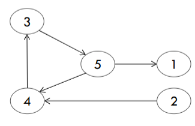
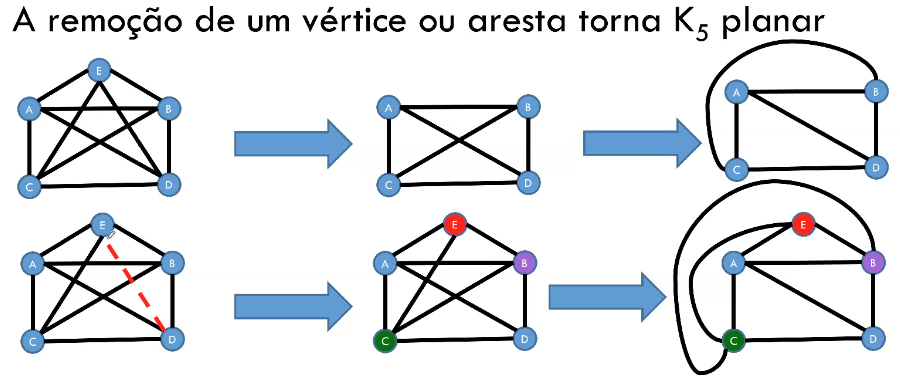

# Introdução

Estrutura matemática utilizada para trabalhar com problemas do mundo real.

**Motivação:** Pontes de Konigsberg

Passar por todas as pontes uma única vez e voltar para a área inicial.

**Motivação:** Algoritmos em grafo podem ser utilizados em redes sociais, jogos, engenharia... Como por exemplo:

- Transporte aéreo (Objeto: cidades, Relacionamento: vôo comercial entre duas cidades);
- GPS para definir o menor caminho;
- Entre outros.

---

# Definições

05/08 :watch:

Grafo é uma estrutura abstrata que representa um conjunto de elementos denominados vértices (v) e suas relações de interdependências entre eles, ou chamados de arestas (e).

> Exemplo: Vértice: Cidades - Arestas: Rodovias entre as cidades

**G = (V,E)**   -   V = { A,B,C,D}   -   E = { (A;B);(A;D);(C;D) }

> Note: Programar um vértice (objeto - classe)

- A **ordem** de um grafo G é a cardinalidade (nº de elementos) de V 
- O **tamanho** de um grafo G é a cardinalidade de E

#### Grafo valorado / ponderado

É dito valorado se existem **valores** associados aos vértices ou arestas desse grafo. Tais valores são denominados **pesos**.

Exemplo: Custo de se movimentar entre dois pontos.

#### Grafo não direcionado / não orientado

Por padrão, duas arestas são consideradas a mesma. Ou seja, não possui direção obrigatória definida, seu sentido não é importante. 

#### Grafo direcionado / orientado / digrafo

Agora o sentido da aresta importa e é marcado por uma seta. Seu sentido é importante, pois pode ter significados diferentes. 

> Exemplo: Linha de montagem, um processo só pode executar após o término de outra.

Pode ter correspondencia em ambos os sentidos, porém nesse caso teríamos que ter **duas arestas**.

#### Laço (Loop)

Aresta que liga um vértice a si mesmo.

#### Arestas paralelas

Duas ou mais arestas associadas ao mesmo par de vértices.

#### Grafo simples

Não possui nem arestas paralelas nem laços.

#### Vértices adjacentes (vizinhos)

Dois vértices são ditos adjacentes se existe uma aresta que os liga, logos esses vértices serão vizinhos/adjacentes.

#### Vértices sucessores e antecessores

Somente em **grafos direcionados**!

#### Incidência 

Quando um vértice Vi é o vértice final de alguma aresta Ei, Vi e Ei são incidentes.

#### Arestas adjacentes

Duas arestas *não paralelas* compartilhando um vértice.

#### Grau de um vértice (d)

Em um grafo *não direcionado*, o grau de um vértice é igual ao nº de arestas incidentes no vértice.

- Vértices com grau 0 são chamados **isolados.**
- Grafos que possuem somente vértices isolados são chamados de **grafos nulos.**
- Vértice de grau 1 é chamado de **pendente.**
- Um laço conta como duas arestas!

> *Arestas paralelas contam também!*

#### Teorema 1

A soma dos graus de todos os vértices de um grafo G é duas vezes o nº de arestas de G.

> Ao contar os graus dos vértices, contamos cada extremidade de arestas uma vez. como cada aresta tem duas extremidades, cada aresta foi contada duas vezes.

#### Teorema 2

O nº de vértices de grau ímpar em um grafo é sempre **par**.

#### Passeio em um grafo

Um passeio entre os vértices 1 e 2 é uma sequência alternada de vértices e arestas que começa no vértice 1 e termina no vértice 2 . 

> Poderíamos pensar que apenas a ordem dos nós é importante, porém podemos ter passeios diferentes com a mesma sequência de vértices.

#### Caminho em um grafo

Um caminho é um passeio sem vértice repetido. Exemplo: Caminhos entre os vértices 1 e 4:

#### Grafo regular

Todos os vértices tem o mesmo grau.

#### Grafo completo

Para cada par de vértices existe uma aresta entre eles. Consequentemente, quaisquer dois vértices distintos são adjacentes (vizinhos).

> Note: Um grafo completo com n vértices é dito: Kn 

> Como achar o grau dos vértices -> n-1
>
> Como achar o nº de arestas -> (d * n) / 2

#### Grafo conexo

Existe pelo menos um caminho entre todos os pares de vértices, ou seja, se sai de um vértice, consegue chegar em qualquer outro.

#### Grafo desconexo

Consiste de dois ou mais grafos conexos. Cada um dos *subgrafos* conexos é chamado de *componente.*

---

# Representação e Operações

10/08 :watch:

Como representar um grafo em um algoritmo, em uma estrutura de dados?

Principais estruturas:

- Matriz de adjacência;
- Lista de adjacência;
- Matriz de incidência.

## Matriz de adjacência

> Se as arestas tiverem pesos (grafo valorado), suas posições na matriz poderiam ter os valores respectivos.

Em um **grafo direcionado** a posição na matriz só recebe valor no vértice "de chegada".

## Lista de adjacência

Como se fosse uma hash, uma lista de vetores, e cada vetor tem uma lista de adjacências. Ou seja, cada elemento do vetor contém dois campos: a identificação de um vértice e um ponteiro para uma lista encadeada contendo os **vizinhos** do vértice correspondente.

> - Cada vértice é um elemento de uma lista ;
> - Cada vértice contém uma lista de arestas, indicando o outro par que a compõe.

Grafos não direcionados também podem ser representados por uma lista de adjacência, só criar a sublista com todos os vetores vizinhos de cada vértice.

## Matriz de incidência

- Índice = +1, se a aresta tem **origem** no vértice i;
- Índice = -1, se i é o vértice **destino** da aresta;
- Índice = 0, se a aresta **não incide** no vértice i.

>  Em um grafo **não direcionado** a gente só marca os vértices de incidência e origem, com 0 ou 1.

## Isomorfismo

Grafos "idênticos" em relação ao nº de arestas, vértices, graus e nº de componentes. Porém só isso não basta, para o grafo ser isomorfo a relação de incidência precisa ser preservada.

Grafos que possuam todas as características menos a preservação de incidência:

Observe que é necessário associar o vértice X do grafo G ao vértice Y do grafo H, pois não existe nenhum outro vértice com grau 3 em H. Mas o vértice Y é adjacente a apenas um vértice de grau 1, enquanto que X em G é adjacente a dois vértices de grau 1.

## Grafo complementar

Um grafo é complementar de outro quando:

- Todos os vértices de C(G) são todos os vértices de G;
- E as arestas de C(G) são exatamente as arestas que faltam em G para formarmos um grafo completo.

> Arestas do grafo G não vão fazer parte do C(G), ou seja, C(G) é um grafo que contém todas as arestas faltantes para G ser um grafo completo. 

## Subgrafos

12/08 :watch:

Um grafo H é dito ser um *subgrafo* de um grafo G se todos os vértices e todas as arestas de H estão em G.

- Todo grafo é subgrafo de si próprio;
- O subgrafo de um subgrafo de G é subgrafo de G;
- Um vértice simples de G é um subgrafo de G;
- Uma aresta simples de G (com suas extremidades) é subgrafo de G.

### Subgrafos induzidos por arestas

Um subgrafo obtido por um subconjunto de arestas (e seus respectivos vértices).

Ex.: Mapear e manter somente as lanchonetes cuja distância é < 1km.

### Subgrafos induzidos por vértices

Subgrafo obtido por um subconjunto de vértices (e suas respectivas arestas). 

Exemplo: Manter somente os times que tem características em comum.

### Subgrafos disjuntos de arestas

Dois (ou mais) subgrafos de G são disjuntos de arestas se ambos não tiverem arestas em comum.

### Subgrafos disjuntos de vértices

Dois (ou mais) subgrafos de G são disjuntos de vértices se ambos não tiverem vértices em comum.

## Operações

### União e Soma

- União: Considerando dois grafos distintos, a união G1 ∪ G2 é formada pelo grafo que contém o conjunto de vértices V1 e V2, e o conjunto de arestas E1 e E2. Ou seja, basicamente dois grafos são considerados um.
  - G: Vg= {1, 2}; Eg= {(1, 2)} 
  - H: Vh= {3, 4}; Eh= { } 
  - G ∪ H: Vg∪h = {1, 2, 3, 4}; Eg∪h = {(1, 2)}
- Soma: É a união com todos os vértices de G1 vão ter arestas ligando a todos os vértices de G2.
  - G: Vg= {1, 2}; Eg = {(1, 2)} 
  - H: Vh = {3, 4}; Eh = { } 
  - G + H: Vg+h = {1, 2, 3, 4};  Eg+h = {(1, 2), (1, 3), (1, 4), (2, 3), (2, 4)}

### Interseção

Resulta em um grafo formado pela interseção das arestas e vértices, ou seja, só aqueles cujo ambos tenham. Ex.:

### Ring sum

Basicamente é a união de dois grafos sem incluir a interseção. Ex.:

### Remoção de aresta e vértice

- **Remoção de aresta:** Se e é uma aresta de um grafo G, denota-se G-e o grafo obtidop pela remoção da aresta e de G.
- **Remoção de vérice:** Mesma ideia, porém além de retirar o vértice, é necessário retirar todas as arestas incidentes nele.

### Contração de aresta

Retirar uma aresta desejada e unir os dois vértices incidentes nela.

> Denota-se por **G/e** o grafo obtido pela contração da aresta *e*. Significa remover *e* de G e unir suas duas extremidades v, w de tal modo que o vértice resultante seja incidente às arestas originalmente incidentes a v e w.

### Propriedades

### Grafo transposto

Seja um grafo direcionado (apenas direcionados) G = (V, E), seu grafo transposto Gt = (V, E1), cujo todas as arestas tem sentido oposto.

### Grafo bipartido

É um grafo não orientado que pode ser dividido em dois subconjuntos de vértices, cujo não possuem arestas ligando dois vértices do mesmo subconjunto.

- Se diz bipartido um grafo G de tipo (p, q) se for um grafo simples de ordem p+q;

Temos também o **grafo bipartido completo**, nada mais é que um grafo bipartido tal que cada vértice de um subconjunto está associado a cada vértice do outro subconjunto.

> O grafo bipartido completo com partições de tamanho |V1| = m e |V2| = n é chamado Km,n.

#### Teorema

Um grafo é bipartido se, e somente se, todo ciclo de G possuir comprimento par.

> Obs: Ciclo -> Todo caminho cujo vértice inicial e final são os mesmos sem repetição de vértice, ou seja, sai e volta pro mesmo vértice sem repetir nenhum a não ser o inicial.

---

# Caminhos e Circuitos - Parte 1-2

17/08 :watch:

> Vale lembrar os conceitos de:
>
> - Passeio (pode voltar no mesmo vértice).
> - Caminho
>   - **Caminho aberto:** Vértices inicial e final são diferentes;
>   - **Caminho fechado ou circuito**: nenhum vértice (exceto o 1º e o último) aparece mais de uma vez.

## Grafos Eulerianos

**Problema do explorador:** um explorador deseja explorar todas as estradas entre um nº de cidades. É possível encontrar um trajeto fechado que passe por cada estrada apenas uma vez e volte à cidade inicial? (Ex.: Pontes de Konigsberg).

Em grafos **conexos**, se é possível encontrar um trajeto fechado que passe por **todas** as **arestas** uma única vez, dizemos que G é um **grafo euleriano**.

- Um **trajeto fechado** que utilize todas as arestas de um grafo, **uma única vez**, é chamado de **percurso euleriano fechado**.

### Teorema

Um grafo conexo, **não orientado** é euleriano se, e somente se, **todos** os seus vértices tiverem **grau par**.

> Bastante útil na produção de algoritmos de reconhecimento.

#### Lema 1 - Resultado auxiliar

Se todos os vértices de G possuem grau >= 2, então G contém um ciclo.

Se achar um ciclo que não passa por todas as arestas do grafo, podemos dividir esse ciclo do grafo, e  verificar se os componentes possuem um trajeto euleriano fechado, se possuirem, o grafo é euleriano. 

### Algoritmo de Hierholzer (1873)

Algoritmo para encontrar o caminho euleriano:

---

# Caminhos e Circuitos - Parte 2-2

19/08 :watch:

## Problema do carteiro chinês

Um carteiro deseja entregar cartas ao longo de todas as ruas de uma cidade, e retornar ao ponto inicial. Como ele pode planejar as rotas de forma a minimizar o caminho andado? 

> Consiste em encontrar um caminho mais curto ou circuito fechado que visite cada aresta de um grafo não-direcionado..

- Se o grafo for euleriano, basta percorrer o ciclo de Euler.
- Caso contrário, algumas arestas serão percorridas mais de uma vez. Será utilizado o conceito de arestas artificiais.

> O exemplo acima é um grafo unicursal.

### Grafos semi-eulerianos ou unicursais

Um grafo é dito unicursal ou semi-euleriano se ele possui **pelo menos um Trajeto Euleriano aberto.**

> Se adicionarmos uma aresta conectando os vértices iniciais e finais do trajeto euleriano, o grafo passa a ser euleriano.

- Um grafo é unicursal se, e somente se, ele possuir **exatamente 2 vértices de grau ímpar**.

#### Teorema

Em um grafo conexo G com exatamente 2K vértices de grau ímpar, existem K subgrafos disjuntos de arestas, todos eles unicursais, de maneira que juntos eles contêm todas as arestas de G. 

Ex.: 2*3 = 6 vértices de grau ímpar = 3 subgrafos unicursais.

## Grafos hamiltonianos

24/08 :watch:

Um **Circuito de Hamilton** em um grafo conexo é um percurso que passa por todos os **vértices** do grafo **uma única vez**, voltando ao vértice inicial. Ou seja, euler passa por todas as arestas, e hamilton passa por todos os vértices.

Uma vez que precisa passar por todos os vértices **uma única vez**, para grafos com **mais de 3 vértices**, só podemos ter um caminho de Hamilton se for um grafo simples, pois loops e arestas paralelas obrigam a voltar no mesmo vértice. 

> 1. O circuito de Hamilton em um grafo com n vértices, contém n arestas. 
> 2. Se um grafo é hamiltoniano, então a inclusão de qualquer aresta não atrapalha essa condição.

Não existe teorema para **TODO** grafo, e **eficiente** para acharmos o circuito hamiltoniano, igual temos Hierholzer para euler. Mas temos um técina para mostrar que um grafo **NÃO** possui um circuito Hamiltoniano (mas também **não garante** que não tenha).

Há um circuito hamiltoniano em G se:

- Se G tem um circuito hamiltoniano, então G tem um subgrafo H que:
  1. H contém cada vértice de G;
  2. H é conexo;
  3. H tem o mesmo nº de arestas e de vértices;
  4. Cada vértice de H tem grau 2.

### Teoremas

Há alguns teoremas que proveem **condições suficientes**, mas **não necessárias**.

1. Seja G um grafo simples com n vértices  (n ≥ 3). Se para todo par de vértices não adjacentes v e w, a soma de seus graus for maior ou igual a n, então G é hamiltoniano.

2. Seja G um grafo simples com n vértices (n ≥ 3). Se o grau de cada vértice for n/2 no mínimo, G é hamiltoniano.

3. Em um grafo **completo** com n vértices, **n ímpar** e (n ≥ 3), existem **(n-1) / 2** circuitos hamiltonianos disjuntos de arestas.
4. Em um grafo **completo** com n vértices, **n par** e (n ≥ 4), existem **(n-2) / 2** circuitos hamiltonianos disjuntos de arestas.

### Problema do caixeiro viajante

Dado um conjunto de cidades a serem visitadas por um vendedor, qual é o **caminho mínimo** que pode ser realizado sem repetir cidades e retornar ao ponto de partida? Menor ciclo hamiltoniano.

> Arestas ponderadas! (valoradas)

Aplicações:

- Entrega de encomendas / correspondências;
- Recolhimento de objetos;
- Planejamento de viagens;
- Leitura de contadores de consumo (luz elétrica);
- ...

#### Uso de heurística

Para resolver esse problema podemos utilizar força bruta, porém na maioria dos casos isso se torna inviável, logo podemos utilizar heurísticas para solucionar.

> Heurística: Forma rápida de solucionar um problema, porém muitas vezes imperfeito. Algoritmos aproximados, acham uma resposta que pode não ser a solução ótima, mas pode ser próxima dela.

Exemplo:

1. escolha um vértice arbitrário como vértice atual.
2. descubra a aresta de menor peso que seja conectada ao vértice atual e
   a um vértice não visitado V.

3. faça o vértice atual ser V.
4. marque V como visitado.
5. se todos os vértices no domínio estiverem visitados, encerre o algoritmo.
6. Se não vá para o passo 2.
7. A sequência dos vértices visitados é a saída do algoritmo.

>  Isso é o que chamamos de **Heurística gulosa**, ou seja, que só se preocupa com a melhor forma para aquela instância, daquele momento.

Exercício:

---

# Caminhamentos

26/08 :watch:

Algumas são de simples verificação, rodando alguns algoritmos da pra fazer essas verificações:

- Verificação de graus dos vértices;
- Determinação se o grafo é euleriano;
- Determinação se o grafo é compleo;
- (...)

Outras propriedades já são mais difíceis, são relacionadas às arestas e aos caminhos existes. **Caminhar** em um grafo é mover-se entre seus vértices, verificando propriedades enquanto se caminha. 

Alguns algoritmos de busca proocuram caminhos com objetivos específicos, como:

- **Conectividade** - Busca de um vértice específico (estado);
- **Caminho mínimo** - Existência de um caminho.

Uma busca em grafos nada mais é que tentar encontrar uma sequência de passos (caminhos/ações) para chegar à um objetivo.

### Aplicações

- Rotas em redes de computadores;
- Caixeiro viajante e variações;
- Jogos digitais;
- Navegação de robôs;
- (...)

*A busca de uma saída de um labirinto também é um problema de busca em grafos!*

## Busca em largura

> Notes: Também há uma explicação na aula do dia 14/09.
>
> [Link de vídeo aula](https://www.youtube.com/watch?v=u834GA3725M)

Basicamente mapea os caminhos (caminho mínimo) de um vértice de origem até qualquer outro vértice possível de ser alcançado, gerando uma **árvore**.

- Funciona em grafos não direcionados e digrafos.

### Propriedades dos vértices

- Antecessor ou pai;
- Estado:
  - **branco**: ainda não explorado;
  - **cinza:** explorado, mas com vizinhos não explorados;
  - **preto:** explorado e sem vizinhos explorados.
- Distância até o vértice de origem.

### Funcionamento

Inicialização: Seta os valores *default* para todos os meus vértices.

Busca principal: Basicamente verifica cada vizinho de cada vértice, a partir do inicial. Vai utilizar uma fila e dois arrays para auxilio e armazenamento dos resultados. Cada vizinho vai ser enfileirado, e desenfilerado quando for sua vez. Cara vizinho verificado vai contabilizar 1 + a distância ao vértice inicial.

### Custo e Complexidade

14/09 :watch:

## Busca em profundidade

*Depth First Search (DFS)*

A partir de um vértice de origem, busca *recursivamente* um vértice adjacente, até que não existam mais vértices a visitar.

> Pode gerar várias árvores de profundidade (floresta de busca).

### Estados dos vértices

Mantém os mesmos estados do algoritmo anterior, porém teremos mais duas novas propriedades: *timestamps* (tempo da busca).

- **Timestamp de descoberda** - Tempo em que eu chego no vértice;
- **Timestamp de término** - Tempo em que eu pinto o vértice de preto.

### Funcionamento

Inicialização:

Visita:

Organização:

### Classificação de arestas

- Arestas de árvore: Quando a aresta leva à um vértice branco, quando encontra um branco com ela.
- Arestas de retorno: Fecha um ciclo na busca, ou seja, quando um vértice **cinza** encontra outro **cinza** (inclui loops).
- Arestas de avanço: Não pertence à árvore de busca em profundidade, mas conecta um vértice a um descendente que pertence à árvore de busca. Ou seja, **quando encontra um vértice preto.**
- Arestas de cruzamento: De um cinza para um preto.

## Ordenação topológica

Um vértice precisa do resultado de outro antes - Para ir para um vértice precisa passar por outro antes.

- **Impossível ser cíclico**, pois não tem início, todo mundo depende de todo mundo.

> Note: DAG -> Dígrafo acíclico. 
>
> É necessário ser um dígrafo.

A ordenação topológica é a ordenação **linear** de vértices na qual cada vértice precede o conjunto que forma seu **fecho transitivo direto** (FTD - conjunto de todos os vértices que podem ser atingidos por algum caminho iniciado no vértice atual).

### Teorema

Se um grafo for acíclico, ou seja, não possuir cíclos, logo ele apresenta uma ou mais ordenações topológicas.

### Algorítmo de Kahn (1962)

Existem algoritmos com complexidade linear para determinar uma ordenação topológica de um DAG, o algorítmo de Kahn é um deles.

Retorna uma lista de ordenação topológica OU detecta a existência de um ciclo.

Baseado em duas listas:

- S: conjunto de vértices sem arcos de entrada, ou seja, vértices que não tem nenhuma aresta "chegando" nele.
- L: lista de vértices ordenados topologicamente (inicialmente zerada).

> Legenda: "Remover arco v,w" -> significa remover a aresta do vértice v ao w.

A ideia é ir removendo as arestas que saem dos vértices sem arcos de entrada primeiro, e ir adionando os vértices que ficam sem arco de entrada na lista de ordenação, dessa forma teremos uma "ordem de chamadas" de cada vértice, e no final uma lista que mostra essa ordem topológica. Ou um ciclo caso ainda possua aresta que não foi retirada.

Exemplo resolvido:

### DFS e ordenação

Outro dos algoritmos citados no último tópico, porém utilizando da busca em profundidade, levemente alterada para o mesmo objetivo.

Basta, ao finalizar um vértice preto, inseri-lo no início de uma lista L.

Neste caso se eu tiver uma aresta de retorno, eu fecho um cíclo, logo não há ordenação topológica.

> Os algorítmos podem gerar diferentes ordenações topológicas!

### Aplicações de ordenação topológica

- Planejamento e sequenciamento de tarefas;
- Compilação de módulos;
- Dicionários;
- Pré-requisitos;
- Verificação de dependências (bibliotecas, etc).

## Algoritmo de Dijkstra

:building_construction:

Baseado na busca em largura.

# Conectividade

16/09 :watch:

> Notas: 
>
> - Um grafo é conexo quando existe **pelo menos** um caminho entre todos os vértices.
>- Um grafo desconexo e componentes conexos -> Cada componente de um grafo desconectado é chamado de componente conexo.

- Como saber se um grafo é conexo? Ou, como saber quantos componentes conexos há em um grafo?
- Busca em profundidade forma árvores. Esta informação pode ser utilizada para contarmos os componentes de um grafo.
  - É só adionar um contador após cada "loop recursivo", ou seja, toda vez que ele voltar marcando os vértices de preto, conta +1, e assim sabemos a quantidade de componentes, consequentemente se ele é conexo ou não.

## Conceitos básicos

**Vértice de corte:** Vértice de um grafo conexo que, quando removido, produz mais de uma componente conexa. A remoção de um vértice implica a remoção de todas as arestas que incidem nele.
obs: grafo conexo, existe um caminho entre cada par de vértices;

**Aresta de corte:** Aresta de um grafo conexo que, quando removida produz mais de uma componente convexa;

**Conjunto de corte:** Conjunto contendo vértices/arestas que ao serem removidas de um grafo conexo G produz mais de uma componente conexa;

**Conectividade de vértice K(G):** menor número de vértices do grafo cuja remoção (em conjunto com suas arestas adjacentes) o desconecta;

**Conectividadede aresta λ(G):** menor número de arestas do grafo cuja remoção o desconecta. É o número de arestas do menor cut-set;

**Cut-set:** particionar o grafo em dois subgrafos disjuntos. Também pode ser definido como o conjunto de arestas em um grafo conexo cuja remoção reduz o rank do grafo em 1 unidade.

**Rank ou posto:**

---

**Grafo K-conexo:** grafo de conectividade de vértice igual a K.

**Grafo separável:** grafo com conectividade de vértice igual a 1.

**Cut vertex:** Vértice que desconecta um grafo separável (também chamado cut vertex ou ponto de articulação);

**Desconexo:** Um grafo é não-conexo ou desconexo se nem todo par de vértices é unido por uma cadeia;

**S-conexo:** Um grafo é simplesmente conexo ou s-conexo se todo par de vértices é unido por ao menos um caminho no grafo correspondente não direcionado;

**SF-conexo:** Um grafo é semi-fortemente conexo ou sf-conexo se em todo par de vértice do grafo, um deles é atingível a partir do outro (ou seja, entre eles existe um caminho em ao menos um dos dois sentidos possíveis);

**F-conexo:** Grafo fortemente conexo ou f-conexo: é um grafo no qual todo par de vértices é mutuamente atingível. Assim, a todo par de vértices está associado a um par de caminhos de sentidos opostos.

- Todo vértice é atingível a partir de um vértice dado e todo vértice atinge todo vértice dado.

## Teorema

# Fluxo em rede

Uma rede é um grafo no qual teremos um fluxo, podendo ser modelado para uma rede de distribuição de água, rede social com tráfego de informações, rodoviárias com o máximo de veículos possível de se locomover lá, etc.

*Sempre queremos maximizar a quantidade de informações transmitidas, conseguir a maior capacidade do fluxo.*

Nesse grafo as **arestas serão ponderadas** e seu peso indicará sua **capacidade** de transporte, o máximo de dados que pode para o próximo vértice.

Os dados percorrem uma rede desde uma **fonte** (source), onde ele é produzido, até um **sorvedouro** ou sumidouro (target), onde ele é **consumido**.

**Fluxo máximo:** Calcular a maior taxa pela qual se pode despachar material da fonte até o sorvedouro sem infringir quaisquer restrições à capacidade.

## Conceitos básicos

- **Rede de fluxo:** É um grafo conexo dirigido ponderado (capacidade não negativa).
  - Laços não são permitidos!
- **Fluxo em grafos:** É uma função com restrições -> G = (V, E).
  - O fluxo não pode exceder a capacidade de nenhum arco (aresta);
  - O fluxo de entrada em um vértice é igual ao fluxo de saída (**conservação de fluxo**);
    - Os dados podem se dividir entre as arestas de saída possíveis, porém **não podem se acumular**, ou seja, a  taxa de dados que chegou em um vértice, precisa ser a mesma taxa que irá sair do vértice.
  - O somatório do fluxo em todos os vértices é o **valor total do fluxo**.

## Corte

O problema do fluxo máximo está relacionado ao conceito de **corte**: Um corte (S,T) - (Source, Target) em uma rede de fluxo G = (V, E) é uma partição de vértices em dois conjuntos S e T. Ou seja, eu vou desconectar o grafo em dois conjuntos, um conjunto de vértices que fazem parte do **source**, e um conjunto de vértices que fazem parte do **target**.

O corte é basicamente um cut-set, ou seja, vai desconectar meu grafo e com isso já obtemos os dois conjuntos. Todos os vértices ligados ao source será desse grupo, e todos que levam ao target, será desse grupo.

A **capacidade do corte** será a soma das capacidades das arestas retiradas que se iniciam no conjunto S e terminam no conjunto T.

Outro exemplo:

Já o próximo exemplo não é um corte, pois o conjunto de source consegue chegar ao conjunto do target:

### Fluxo total líquido pelo corte

Consiste de fluxos positivos em ambas as direções. Ou seja, no momento da execução do fluxo teremos a quantidade de dados que passarão pelas arestas de corte, e fazemos uma conta para chegar ao **fluxo total líquido**, sendo: somar a quantidade atual de dados das arestas de corte que tem origem no conjunto source, e subtrair pela quantidade atual de dados das arestas de corte que tem origem no conjunto da target.

Exemplo:

## Teorema de Ford e Fulkerson

A capacidade do corte mínimo é igual ao fluxo máximo - Fluxo máximo x Corte mínimo.

Como encontrar o maior fluxo que pode percorrer um fluxo em redes (fluxo máximo)?

- Iniciamos com um fluxo total nulo, ou seja, será menor do que a capacidade de qualquer corte.
- Aumentamos gradativamente este fluxo e comparamos o seu valor com os das capacidades dos cortes. Em um momento o fluxo se tornará igual à capacidade de algum corte.
  - **Corte de capacidade mínima:** Corte cuja capacidade pode se tornar igual ao valor de um fluxo.
- A partir daí, o fluxo não pode aumentar mais, portanto este fluxo será máximo.

### Funcionamento

Depende de três ideias importântes:

1. **Redes residuais:** Capacidade residual é a capacidade que você ainda consegue transmitir em determinada aresta para chegar à sua capacidade máxima. Uma rede residual consistem em arestas que podem admitir mais fluxo.
   1. Capacidade residual do caminho é a menor capacidade residual entre os arcos desse caminho.
2. **Caminhos de aumento:** Se nenhum arco do caminho está cheio (utilizando a capacidade máxima), então podemos chamá-lo de caminho de aumento, ou seja, ainda tem capacidade residual.
3. **Cortes**

A cada iteração aumenta-se o valor do fluxo em G determinando um "caminho de aumento" em uma "rede residual" associada.

Isso se repete até que a rede residual não tenha mais caminhos aumentadores.

> - Se o fluxo em uma aresta é igual à sua capacidade dizemos que essa aresta está **saturada!**
>
> - Embora cada iteração aumente o valor do fluxo, o fluxo em algumas arestas pode diminuir.

# Árvores

:building_construction:

# Floresta

:building_construction:

---

# Planalidade

21/10 :watch:

:building_construction:

[Problema das 3 casas]

Um grafo é **planar** se existe uma representação gráfica de G no plano sem cruzamento de arestas (*vale redesenhar, só precisa ter a possibilidade*).

## Aplicações

- Circuitos digitais;
- Malhas de transporte terrestre;
- Contrução de viadutos;
- Malha de transporte aéreo.

## Grafos planares e Kuratowski

:building_construction:

Existem grafos não planares que serão importantes (kuratowski)............................................

São importantes, pois o K5 por exemplo, é um grafo não planar com o menor nº de vértices, ou seja, para um grafo completo ser planar ele precisa ter menos que 5 vértices.

Outro exemplo, K3,3: é um grafo não planar com o menor nº de vértices também.

Propriedades entre os dois grafos citados anteriormente:

1. Ambos são regulares;
2. Ambos são não planares;
3. A remoção de uma aresta ou um vértice torna ambos os grafos planares.

## Região (ou face)

Uma representação gráfica planar de um grafo divide o plano em regiões ou faces. Cada região é caracterizada pelas arestas que a contornam.

- Cada aresta de G pertence à fronteira de uma ou duas faces de G (faz fronteira com até duas regiões);
- O grau (comprimento), de uma face f de G, representado por d(F) é igual ao nº de arestas da fronteira de F.
- Cada face da representaçção planar de um grafo corresponde a um passeio fechado do grafo constituído pelos vértices e arestas que delimitam a face. Chamamos **grau da face**, d(f), ao comprimento do passeio correspondente.

## Teorema 1 - Fórmula de Euler

Seja G um grafo conexo planar com N vértices e E arestas. O nº de faces do grafo é: **f = 2 - N + E**

## Grau de uma região

:building_construction:

## Corolário - Fórmula de Euler

:building_construction:

[São dois corolários]

[inequações]

## Detecção de planaridade

:building_construction:

[Técnica de redução]

## Contração de aresta

:building_construction:

## Detecção de planaridade: remoção de aresta

:building_construction:

[Outro]

26/10 :watch:

## Homeomorfismo

:building_construction:

### Teorema

Um grafo G é planar se, e somente se, nenhum subgrafo seu for homeomorfo a K5................................

## Dualidade

:building_construction:

Para cada face eu desenho um vértice.........

# Coloração de grafos

:building_construction:
