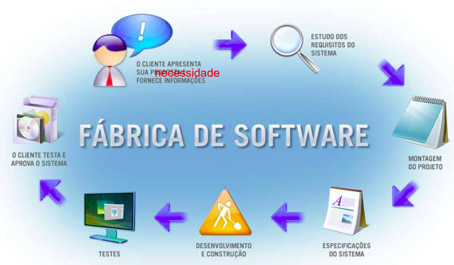
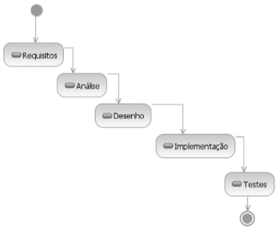
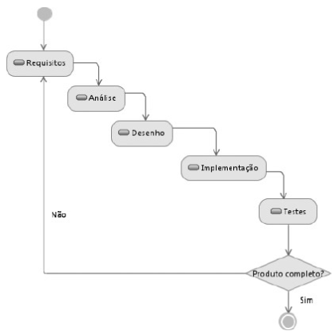

# Introdução

02/08 - 03/08 :watch:

**Software como produto/solução!**

**O que é requisito?** É definido como *uma condição ou uma capacidade com a qual o sistema deve estar de acordo*. Precisamos garantir a consistência entre os requisitos e a solução entregue, e para isso fazemos o gerenciamento de requisitos.

Gerenciamento de requisitos trata-se de uma modelo sistemático para:

- Identificar, organizar e documentar os requisitos do sistema.
- Estabelecer e manter acordo entre o cliente e a equipe do proejto nos requisitos variáveis do sistema.

**Construção de um software:** 1. Planejar - 2. Fazer - 3. Verificar - 4. Agir

"A aplicação de um **método sistemático, disciplinado e quantificável** ao desenvolvimento, operação e manuntenção de software; isto é, a **aplicação da engenharia ao software.**"

**Principais modelos de referência:**

- Processo Unificado da Rational/IBM (RUP)
- Corpo de conhecimento da Engenharia de Software do IEEE (SWEBOK)
- Áreas de processo de modelo de maturidade CMMI

## Problemas/Dificuldades no desenvolvimento

- Aumento da demanda por novos softwares;
- Demandas diferentes:
  - Softwares devem ser construídos e entregues mais rapidamente;
  - Softwares maiores e mais complexos.
- Documentação insuficiente;
- Falta de processos e métodos;
- Dependencia de **sistemas legados** que necessitam de modificações;
  - mas possuem código e/ou documentação ilegíveis ou inexistentes.
    - Manutenção difícil, cara e demorada de software já existente.
- Coleta de dados sobre produtividadade inexistente ou insuficiente;
  - Comprometendo as estimativas de prazo, esforço e custo;
  - não permitindo a avaliação de novas ferramenteas, técnicas e padrões.

---

# ICEI Talks - Eng. Requisitos (Google)

09/08 :watch:

> Note: Utilização de métricas para medir a aceitação e utilização do produto/funcionalidades. em produção, com o produto lançado. Porém, geralmente isso é mais benéfico quando se deseja lançar rapidamente para ficar a frente dos concorrentes, pois se der errado, e não tiver muita adesão, pode ter sido um gasto muito grande de tempo e dinheiro. 

### Etapas da criação de requisitos

- Elicitação: Entender a dor do cliente, entender o problema dele, *descobrir os requisitos do software*. (Design thinking)
  - *Sempre perguntar a dor do cliente, e não o que ele quer!* Se não, ficamos limitados ao que ele quer, não o que ele precisa.
- Especificação: Descrever, documentar os requisitos levantados no tópico anterior. 
- Análise: Analisar os requisitos documentados e procurar problemas, requisitos inclompletos, inconcistências, conflito entre requisitos, entre outros. 
- Validação: Validar tudo que descreveu com o cliente. Uma boa ideia é prototipar, ajuda ao cliente entender a proposta.

### Requisitos funcionais VS não funcionais

**Requisitos funcionais:** Funcionalidades que o software tem que ter, *o que o software tem que fazer*. Exemplo: Gerar relatório.

**Requisitos não funcionais:** Características de qualidade que  o software tem q ter, *como o software tem q fazer aquilo.* Exemplo: capacidade de suportar inúmeros clientes gerando relatório ao mesmo tempo.

---

# Processo de desenvolvimento de software

10/08 :watch:

*Forma metódica para se desenvolver um software (desenvolvimento e manutenção). Sequência de passos executados com um determinado objetivo.*

*Software como produto, como solução para uma necessidade negócio.*

#### Ciclo de vida de software

- É concebido a partir de uma necessidade;
- É desenvolvido e entregue a um cliente;
- Entra em operação, sendo usado dentro de um processo de negócio e sujeito a manutenção;
- É retirado de operação no final de sua vida útil.

Geralmente acaba pela tecnologia, com a manutenção que não vale a pena mais (muito cara talvez), ou ficou muito desatualizada e limitada (não atende as necessidades mais).

O ponto de partida para a arquitetura de um processo é a escola de um modelo de ciclo de vida, podendo ser eles:

- Modelo em cascata

- Modelo em espiral

> Métodos ágeis, como o XP ‒ Extreme Programming e o Scrum, geralmente não contêm elementos suficientes para se qualificarem como processos completos. Na prática, os processos deles derivados também utilizam alguma das variantes do modelo em espiral.

#### RUP 

*RUP - Rational Unified Process*

É uma metodologia que utiliza UML para ilustrar os processos. [O que é RUP?](https://www.treinaweb.com.br/blog/o-que-e-rup-rational-unified-process)

---

# Requisitos

23/08 :watch:

> Voltar no início.

O que é:

- São características que definem os **critérios de aceitação** de um produto, ou seja, como a funcionalidade tem que funcionar? Um carrinho que só cabe um produto em um e-commerce é aceitável?
- Propriedade que um software deve exibir para resolver um problema do mundo real;
- Condição ou capacidade que o sistema deve contemplar, que pode ser derivada diretamente das **necessidades do usuário** e/ou definida em contrato, padrão, especificação ou outro documento formal imposto;
- Característica do sistema ou a descrição de **algo que o sistema é capaz de realizar** para atingir os seus objetivos;
- Restrição.

Para que servem:

- 

Por que são importantes:

## Aspectos relevantes

- **Domínio**: Tudo aquilo ligado ao ambiente em que a solução de software é executada, será aplicada. Ex.: Ambiente financeiro, entretenimento, entre outros.
- Problema existe no mundo real, não no software. Ou seja, ......................................
- Ter uma istinção clara entre problema e solução. Dessa forma podemos definir uma solução adequada para o problema.
  - Sub............

- Identificar as **partes interessadas**, ou seja, todas as pessoas envolvidas no projeto, para ter várias pespectivas diferentes.

## Qualidade de software

## Dificuldades na obtenção de requisitos

## Qualidade dos requisitos

> Rastreável: pq foi criado isso? quando? em qual versão? ainda é necessário?

- Requisitos imprecisos (Ambíguos)
- Requisistos mal escritos
- Propriedades de um bom requisito

De onde surgem os requisitos?

Como identificar requisitos?

----

# Tipos de requisitos

24/08 :watch:

O que o sistema tem que fazer e como deve fazer. Funcionais e não funcionais.

## Requisitps de cliente x Requisitos de sistema.

## Requisitps Funcionais x Não funcionais

- Tipos......

---

# Desenvolvimento dos requisitos

[Definição]

**Evolução dos requisitos:**

# Elicitação de requisitos

30/08 :watch:

Entender a dor do cliente, entender o problema dele, *descobrir os requisitos do software*.

Busca **proativa** da obtenção dos requisitos a partir das fontes (cliente, normas, sistemas já usados...), considerando as **necessidades, expectativas e restrições** impostas pelo ciente.

> *Sempre perguntar a dor do cliente, e não o que ele quer!* Se não, ficamos limitados ao que ele quer, não o que ele precisa.

Essa atividade se inicia com a aplicação de técnicas apropriadas para identificar requisitos do cliente, considerando as necessidades, expectativas e restrições impostas pelo cliente.

> **Atenção:** Evitar requisitos implícitos, ou seja, não está sub-entendido. Ex.: O cliente não falou que queria banheiro no projeto da casa por que achava que tava implícito.

## O que fazer nessa etapa

1. Definir as fontes de obtenção dos requisitos;
   1. Ex.: Se um sistema vai substituir outro, uma fonte é o sistema antigo.
   2. Legislação, ou seja, existem leis no campo de aplicação do sistema?
2. Definir a forma de elicitação de requisitos;
3. Levantar/descobrir/elicitar os requisitos.

## Fontes

[O que é]

> Se não definir todas as fontes, podemos ter requisitos não identificados.

[Fontes típicas]

Uma fonte sempre presente é a LGPD.

### Técnicas de elicitação de requisitos

- **Brainstorming:** asdasd
- **Brainwriting:** dgfsdfsd
- **Entrevistas:** asdasdasd
  - Pergunta básica: Essa solução vai substituir outra?
  - Estruturada: Conduz na sequência planejada, segue o roteiro a risca. Garante que as mesmas perguntas serão feitas para todos.
  - Não estruturada: O roteiro é só uma base, a medida que a entrevista acontece o entrevistador pode seguir caminhos diferentes.
  - Estruturas
    - Pirâmide: Inicia com questões fechadas, à medida que avança, questões abertas são colocadas. Usada para quebrar o gelo, ou quando o entrevistado parece relutante sobre um assunto.
    - Funil: Inicia com questões abertas e à medida que abança, faz-se perguntas fechadas. O entrevistado precisa "desabafar" logo ou deseja ir direto ao ponto. Meio não ameaçador para começar.
    - Diamante: Combinação das anteriores, inicia com fechadas, passa para abertas, e encerra a entrevista com questões fechadas. Em geral é a melhor forma de estruturar a entrevista. Contudo, tende a ser mais longa.
  - Registros: Para não esquecer, e facilitar o compartilhamento dos resultados com a equipe. Papel é bom, mas tende a perder contado visual e o ritmo do diálogo. Gravador não interrompe, e traz um registro fiel e exato da entrevista, porém o entrevistado pode ficar desconfortável, e a documentação também fica mais demorada. E mesmo gravando precisa anotar as ideias...
- **JAD (Joint Application Development):** 
- **Prototipagem:** 
  - Só nao pode dar entender que a aplicação ta pronta, pq pode ser só o front.
- **Questionários:** Com um grupo muito grande não da pra ficar fazendo reunião com todo mundo...
- **Cenários:** 
- **Observação - Etnografia:** Estudo Etnográfico é uma técnica em que o analista...

Outras formas de levantar requisitos:

- Tornar-se um aprendiz:
- Documentos existentes:
- Engenharia reversa:
- Observação de produtos existentes:
- Mudança de perspectiva:
- Análise de redes sociais (Comunidades virtuais):
- Modelagem de casos de uso:
- Análise de informações internet:

## O que levantar?

[Tópicos]

[Memórias de levantamento]

[**Registrar** de alguma forma] - Parte da **especificação**.

---

# Análise de requisitos

31/08 :watch:

Com os resultados e materiais gerados na primeira etapa, precisamos analisa-los. Verificar se tem algum problema, se está completo, se tem alguma inconsistência, algum conflito entre requisitos, entre outros problemas.

Também vamos priorizar os requisitos.

1. **Definição do escopo do projeto:** Limite do que a solução contempla.............

## Negociação e priorização de requisitos

Consiste no exame dos requisitos coletados e negociação com os stakeholders............

[Esquema - Foto]

[O que fazer?]

- Resolver conflitos.....

- Equilíbrio entre funcionalidades, recursos e tempo......
- Priorização.....
  - Garantir que o essencial seja entregue.

### Priorização

- IEEE:
- Benjamin Kovitz:
- MoSCoW:
- Fotinha la:

#### Técnicas de priorização

- Comparações aos pares (Pairwise): Entre esse e esse, vai esse............... tendo 100$ para usar, e cada requisito custa um pouco. 
  - Foda é em um sistema com muitos requisitos, ai fica dfícil.
  - Vantagens, desvantagens.....
- Modelo de Kano: 
