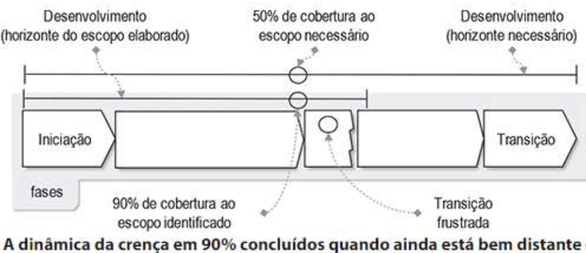

# Introdução

02/08 - 03/08 :watch:

**Software como produto/solução!**

**O que é requisito?** É definido como *uma condição ou uma capacidade com a qual o sistema deve estar de acordo*. Precisamos garantir a consistência entre os requisitos e a solução entregue, e para isso fazemos o gerenciamento de requisitos.

Gerenciamento de requisitos trata-se de uma modelo sistemático para:

- Identificar, organizar e documentar os requisitos do sistema.
- Estabelecer e manter acordo entre o cliente e a equipe do proejto nos requisitos variáveis do sistema.

**Construção de um software:** 1. Planejar - 2. Fazer - 3. Verificar - 4. Agir

"A aplicação de um **método sistemático, disciplinado e quantificável** ao desenvolvimento, operação e manuntenção de software; isto é, a **aplicação da engenharia ao software.**"

**Principais modelos de referência:**

- Processo Unificado da Rational/IBM (RUP)
- Corpo de conhecimento da Engenharia de Software do IEEE (SWEBOK)
- Áreas de processo de modelo de maturidade CMMI

## Problemas/Dificuldades no desenvolvimento

- Aumento da demanda por novos softwares;
- Demandas diferentes:
  - Softwares devem ser construídos e entregues mais rapidamente;
  - Softwares maiores e mais complexos.
- Documentação insuficiente;
- Falta de processos e métodos;
- Dependencia de **sistemas legados** que necessitam de modificações;
  - mas possuem código e/ou documentação ilegíveis ou inexistentes.
    - Manutenção difícil, cara e demorada de software já existente.
- Coleta de dados sobre produtividade inexistente ou insuficiente;
  - Comprometendo as estimativas de prazo, esforço e custo;
  - não permitindo a avaliação de novas ferramentas, técnicas e padrões.

---

# ICEI Talks - Eng. Requisitos (Google)

09/08 :watch:

> Note: Utilização de métricas para medir a aceitação e utilização do produto/funcionalidades. em produção, com o produto lançado. Porém, geralmente isso é mais benéfico quando se deseja lançar rapidamente para ficar a frente dos concorrentes, pois se der errado, e não tiver muita adesão, pode ter sido um gasto muito grande de tempo e dinheiro. 

### Etapas da criação de requisitos

- Elicitação: Entender a dor do cliente, entender o problema dele, *descobrir os requisitos do software*. (Design thinking)
  - *Sempre perguntar a dor do cliente, e não o que ele quer!* Se não, ficamos limitados ao que ele quer, não o que ele precisa.
- Especificação: Descrever, documentar os requisitos levantados no tópico anterior. 
- Análise: Analisar os requisitos documentados e procurar problemas, requisitos inclompletos, inconcistências, conflito entre requisitos, entre outros. 
- Validação: Validar tudo que descreveu com o cliente. Uma boa ideia é prototipar, ajuda ao cliente entender a proposta.

### Requisitos funcionais VS não funcionais

**Requisitos funcionais:** Funcionalidades que o software tem que ter, *o que o software tem que fazer*. Exemplo: Gerar relatório.

**Requisitos não funcionais:** Características de qualidade que  o software tem q ter, *como o software tem q fazer aquilo.* Exemplo: capacidade de suportar inúmeros clientes gerando relatório ao mesmo tempo.

---

# Processo de desenvolvimento de software

10/08 :watch:

*Forma metódica para se desenvolver um software (desenvolvimento e manutenção). Sequência de passos executados com um determinado objetivo.*

*Software como produto, como solução para uma necessidade negócio.*

#### Ciclo de vida de software

- É concebido a partir de uma necessidade;
- É desenvolvido e entregue a um cliente;
- Entra em operação, sendo usado dentro de um processo de negócio e sujeito a manutenção;
- É retirado de operação no final de sua vida útil.

Geralmente acaba pela tecnologia, com a manutenção que não vale a pena mais (muito cara talvez), ou ficou muito desatualizada e limitada (não atende as necessidades mais).

O ponto de partida para a arquitetura de um processo é a escola de um modelo de ciclo de vida, podendo ser eles:

- Modelo em cascata

- Modelo em espiral

> Métodos ágeis, como o XP ‒ Extreme Programming e o Scrum, geralmente não contêm elementos suficientes para se qualificarem como processos completos. Na prática, os processos deles derivados também utilizam alguma das variantes do modelo em espiral.

#### RUP 

*RUP - Rational Unified Process*

É uma metodologia que utiliza UML para ilustrar os processos. [O que é RUP?](https://www.treinaweb.com.br/blog/o-que-e-rup-rational-unified-process)

---

# Requisitos

23/08 :watch:

> Voltar no início.

O que é:

- São características que definem os **critérios de aceitação** de um produto, ou seja, como a funcionalidade tem que funcionar? Um carrinho que só cabe um produto em um e-commerce é aceitável?
- Propriedade que um software deve exibir para resolver um problema do mundo real;
- Condição ou capacidade que o sistema deve contemplar, que pode ser derivada diretamente das **necessidades do usuário** e/ou definida em contrato, padrão, especificação ou outro documento formal imposto;
- Característica do sistema ou a descrição de **algo que o sistema é capaz de realizar** para atingir os seus objetivos;
- Restrição.

## Para que servem

- Provê a base para o plenejamento do projeto.

- Podem ser utilizados como base:
  - para que potenciais fornecedores apresentem suas propostas;
    - descrição em alto nível.
  - de um contrato;
    - descrição em maior nível de detalhamento.

## Por que são importantes

- Nenhuma outra parte do trabalho prejudica tanto o sistema final, se feita incorretamente. Nenhuma outra parte do trabalho é mais difícil de se reparar a posteriori;
- O que acontece quando os requisitos não estão ok?
  - O sistema pode ser entregue com **atraso** e com **custos além do orçamento**;
  - Os clientes podem não ficar satisfeitos e até **abandonar** o projeto ou mandar reconstruir;
  - O sistema pode ficar inviável de ser utilizado devido aos **defeitos** apresentados;
  - Se o sistema continuar em uso, o **custo** de **manter e evoluir** o sistema pode ser muito significativo.
- Erros introduzidos durante a etapa de requisitos podem causar:
  - prejuízos financeiros;
  - atrasos nas entregas;
  - aumento de riscos;
  - baixa qualidade.

## Aspectos relevantes

- **Domínio**: Tudo aquilo ligado ao ambiente em que a solução de software é executada, será aplicada. Ex.: Ambiente financeiro, entretenimento, entre outros.
- Problema existe no mundo real, não no software. Ou seja, requisitos descrevem os efeitos do sistema no ambiente, não o sistema em si!
- Ter uma distinção clara entre problema e solução. Dessa forma podemos definir uma solução adequada para o problema.
  - Falta de entendimento do problema real;
  - Falta de capacidade de se definir o escopo do sistema e compreender as funções que devem ser incluídas;
  - Discussões centradas no sistema (descritas em termos das soluções);
  - Dificuldade de se encontrar soluções ótimas devido à falta de liberdade no projeto.

- Identificar as **partes interessadas**, ou seja, todas as pessoas envolvidas no projeto, para ter várias pespectivas diferentes.

## Qualidade de software

Conformidade com os respectivos requisitos! Cada requisito não atendido é um defeito.

## Dificuldades na obtenção de requisitos

Talvez... :building_construction:

## Qualidade dos requisitos

Qualidades de um requisito [IEEE-890-1998]

- **Correta**: Requisito faz realmente parte do produto a ser construído;
- **Precisa**: requisito possui uma única interpretação, aceita tanto pelos desenvolvedores quanto pelos usuários-chave;
- **Completa**: Conjunto dos requisitos reflete todas as decisões de especificação tomadas;
- **Consistente**: não há conflitos entre nenhum subconjunto de requisitos;
- **Priorizado**: requisito é classificado de acordo com sua importância, estabilidade e complexidade;
- **Verificável**: requisito é verificável;
- **Modificável**: Organização dos requisitos permite a mudança de qualquer requisito, de maneira fácil, completa e consistente;
- **Rastreável**: permite a fácil determinação dos antecedentes e as consequências do requisito. pq foi criado isso? quando? em qual versão? ainda é necessário?
- **Identificação única:** não existem dois requisitos com o mesmo identificador.

Aspectos negativos:

- **Requisitos imprecisos (Ambíguos).** 
  - Ex.: O sistema deve emitir uma mensagem de atenção visual ou auditiva no evento de falha do sistema de refrigeração.
- **Requisistos mal escritos.**
  - Ex.: Incompletos -> O sistema deve acompanhar os projetos.
  - Múltiplos -> Cadastro das atividades de um projeto e produtos e funcionário alocados na atividade.

Propriedades de um bom requisito:

- Não ambíguo -> Ex.: O sistema não deve aceitar senhas mais longas que 15 caracteres.
- Testável -> Ex.: O sistema deve porder ser utilizado por muitos usuários. Quantos são muitos? 100? 1000?

:building_construction:

De onde surgem os requisitos?

Como identificar requisitos?

----

# Tipos de requisitos

24/08 :watch:

## Requisitos de cliente x Requisitos de sistema.

Um requisito basicamente é criado na visão do cliente, visando resolver seu problema, mas posteriormente ele precisa ser detalhado para prosseguirmos com seu desenvolvimento completo. Ou seja, os requisitos de usuário descrevem os problemas, as dores do cliente, as soluções, as características desejáveis, etc. Já os requisitos de sistema são mais detalhados, mais próximos à linguagem técnica, descrevem o comportamento do sistema, delimitam as interfaces, etc.

Ex.:

- Necessidades do cliente:
  - Construir um sistema para predição do movimento do mercado de ações da BOVESPA com taxa de acerto de 70%.
- Funcionalidades a serem cumpridas pelo sistema:
  - Treinar o sistema com dados históricos;
  - Gerar modeos matemáticos para conjunto de ações;
  - Compilar portifólios;
  - (...)

## Requisitos Funcionais x Não funcionais

O que o sistema tem que fazer e como deve fazer. Funcionais e não funcionais.

Usando uma analogia: Compra de um carro:

O comprador quer um carro para conseguir se deslocar dentro de sua cidade, e de uma forma confortável, ou seja, que tenha ar condicional, direção elétrica, entre outros. Agora podemos ver que a **necessidade** de se locomover é um requisito funcional, pois descreve o que o sistema/produto **deve** fazer, a dor que deseja resolver. E as características que descrevem o conforto que o comprador deseja são os **não funcionais,** pois descreve **como** o sistema/produto deve realizar as tarefas.

---

# Desenvolvimento dos requisitos

[Definição]

**Evolução dos requisitos:**

# Elicitação de requisitos

30/08 :watch:

Entender a dor do cliente, entender o problema dele, *descobrir os requisitos do software*.

Busca **proativa** da obtenção dos requisitos a partir das fontes (cliente, normas, sistemas já usados...), considerando as **necessidades, expectativas e restrições** impostas pelo ciente.

> *Sempre perguntar a dor do cliente, e não o que ele quer!* Se não, ficamos limitados ao que ele quer, não o que ele precisa.

Essa atividade se inicia com a aplicação de técnicas apropriadas para identificar requisitos do cliente, considerando as necessidades, expectativas e restrições impostas pelo cliente.

> **Atenção:** Evitar requisitos implícitos, ou seja, não está sub-entendido. Ex.: O cliente não falou que queria banheiro no projeto da casa por que achava que tava implícito.

## O que fazer nessa etapa

1. Definir as fontes de obtenção dos requisitos;
   1. Ex.: Se um sistema vai substituir outro, uma fonte é o sistema antigo.
   2. Legislação, ou seja, existem leis no campo de aplicação do sistema?
2. Definir a forma de elicitação de requisitos;
3. Levantar/descobrir/elicitar os requisitos.

## Fontes

Definem os representantes oficiais e canais apropriados para o surgimento dos requisitos.

> Se não definir todas as fontes, podemos ter requisitos não identificados!

**Fontes típicas:**

- Usuário e Cliente (Partes interessadas);
- Documentos, leis, regimentos. Uma fonte sempre presente é a LGPD!
- Sistemas existentes.

### Técnicas de elicitação de requisitos

- **Brainstorming:** Chuva de ideias. Geração de ideias em grupo. Levantamento dinâmico de ideias, onde nenhuma ideia deve ser descartada a priori. 
  - Duas fases:
    - Na fase de Geração de Ideias os participantes são encorajadosa propor ideias sem críticas pelos demais.
    - Na fase da Consolidação é feita a avaliação de viabilidade e a priorização das ideias propostas.
- **Brainwriting:** Geração de ideias em grupo na forma escrita e compartilhada. Cada um dos 6 participantes começa escrevendo 3 ideias emum papel em 5 minutos. Após isso, ele repassa para o colega à esquerda e o prazo começa a contar novamente para escrevermais 3 ideias baseadas na que ele acabou de receber.
  - Vantagem está na **equidade das ideias** e da **facilitação da participação** de pessoas tímidas
- **Entrevistas:** asdasdasd
  - Pergunta básica: Essa solução vai substituir outra?
  - Estruturada: Conduz na sequência planejada, segue o roteiro a risca. Garante que as mesmas perguntas serão feitas para todos.
  - Não estruturada: O roteiro é só uma base, a medida que a entrevista acontece o entrevistador pode seguir caminhos diferentes.
  - Semiestruturada: consiste em um modelo de **entrevista** flexível. Ou seja, ela possui um roteiro prévio, mas abre espaço para que o candidato e entrevistador façam perguntas fora do que havia sido planejado.
  - Estruturas
    - Pirâmide: Inicia com questões fechadas, à medida que avança, questões abertas são colocadas. Usada para quebrar o gelo, ou quando o entrevistado parece relutante sobre um assunto.
    - Funil: Inicia com questões abertas e à medida que abança, faz-se perguntas fechadas. O entrevistado precisa "desabafar" logo ou deseja ir direto ao ponto. Meio não ameaçador para começar.
    - Diamante: Combinação das anteriores, inicia com fechadas, passa para abertas, e encerra a entrevista com questões fechadas. Em geral é a melhor forma de estruturar a entrevista. Contudo, tende a ser mais longa.
  - Registros: Para não esquecer, e facilitar o compartilhamento dos resultados com a equipe. Papel é bom, mas tende a perder contado visual e o ritmo do diálogo. Gravador não interrompe, e traz um registro fiel e exato da entrevista, porém o entrevistado pode ficar desconfortável, e a documentação também fica mais demorada. E mesmo gravando precisa anotar as ideias...
- **JAD (Joint Application Development):** Também chamados de workshops. 
  - Modo rápido de elicitar requisitos;
  - Benefício: resolução antecipada de conflitos;
  - Participantes: Desenvolvedores; Usuários; Patrocinador (sponsor); Facilitador (mediador); Relator, que toma notas do que é discutido e decidido; Observadores.
  - Pode ter o seguinte fluxo:
    - Reunir os participantes em ambiente propício;
    - Estruturar a reunião;
    - Apresentar objetivos;
    - Apresentar documento de requisitos iniciais ou conjunto de cenários;
    - Encorajar críticas e interação entre grupos;
    - Processar as alterações e sugestões;
    - Produzir uma nova versão.
- **Prototipagem:** “Eu sei o que quero quando vejo”. Físico ou digital.
  - De grande valor quando sistemas são novos;
  - Problemas:
    - Desenvolvedores se entusiasmam e gastam muito tempo e esforço;
    - Pode levar à discussão de detalhes de implementação;
    - Só nao pode dar entender que a aplicação ta pronta, pq pode ser só o front.
- **Questionários:** Com um grupo muito grande não da pra ficar fazendo reunião com todo mundo.
  - Levantam muita informação com pouco tempo;
  - Somente capaz de identificar requisitos que o Analista já conhece ou supõe.
- **Cenários:** Orientado a pontos de vista. Um cenário começa com o esboço de uma interação. Durante o processo de elicitação, são adicionados detalhes ao esboço, para criar uma descrição completa dessa interação. 
  - Pessoas geralmente acham mais fácil se relacionar com exemplos da vida real do que com descrições abstratas;
  - Elas podem compreender e criticar um cenário de como elas podem interagir com um sistema de software.
- **Observação - Etnografia:** Técnica em que o analista de requisitos se insere no meio onde funcionará o sistema e observa o que acontece:
  - **Forma passiva:** o observador não interfere;
  - **Forma ativa:** o observador solicita que se demonstre:
    - como algo é feito;
    - o que acontece em certas situações;
    - criando cenários para facilitar o entendimento dos envolvidos.

Outras formas de levantar requisitos:

- Tornar-se um aprendiz:
- Documentos existentes:
- Engenharia reversa:
- Observação de produtos existentes:
- Mudança de perspectiva:
- Análise de redes sociais (Comunidades virtuais):
- Modelagem de casos de uso:
- Análise de informações internet:

## O que levantar?

- Contexto onde a solução existe;
- Objetivos do sistema;
- Papéis que utilizam o sistema;
- Requisitos funcionais;
- Requisitos não-funcionais;
- “Critérios de aceitação” da implementação dosrequisitos.

**Perguntas para se levantar requisitos:**

- Quais são alguns motivos pelos quais você e seus colegas usariam o novo sistema?
- Que objetivos você tem em mente que esse sistema o ajudaria a cumprir?
- Que aspecto do sistema você acha mais interessante?
- Que aspecto terá mais valor para você? E menos valor?
- Que problemas você espera que esse sistema resolva para você?
- Que palavras você usaria para descrever o sistema?
- Como você vai julgar se o sistema é um sucesso?
- Em que aspectos você imagina que o sistema deva ser semelhante à forma como você trabalha hoje? Como ele deve ser diferente?
- Que aspectos dos seus processos de negócios você quer manter? Quais você quer substituir?
- Que eventos externos estão associados ao sistema?
- Você pode descrever o ambiente onde o sistema vai ser usado?
- Algumas partes do produto são mais importantes que outras por motivos de desempenho, segurança, robustez,  disponibilidade,  ou  alguma  outra característica?
- Há alguma restrição ou regra a qual o sistema deve estar de acordo?

**Memórias de levantamento:**

- Gravações;
- Atas: registros de entendimentos;
- E-mails;
- Notas;

---

# Análise de requisitos

31/08 :watch:

:building_construction:

Com os resultados e materiais gerados na primeira etapa, precisamos analisa-los. Verificar se tem algum problema, se está completo, se tem alguma inconsistência, algum conflito entre requisitos, entre outros problemas.

Também vamos priorizar os requisitos.

Organizar a partir do exame, decomposição e síntese. Definição de:

- Manter o fluxo operacional existente;
- Inovar em relação ao fluxo operacional existente;
- Modelar e usar modelos para refinar a informação;
- Especificar para documentar os requisitos;
- Verificar se o processo e os produtos observam boas práticas;
- Validar se a solução satisfaz o cliente.

**Definição do escopo do projeto:** Atendimento ao escopo identificado no levantamento X escopo necessário ao projeto.

## Negociação e priorização de requisitos

Consiste no exame dos requisitos coletados e negociação com os stakeholders............

[Esquema - Foto]

[O que fazer?]

- Resolver conflitos.....

- Equilíbrio entre funcionalidades, recursos e tempo......
- Priorização.....
  - Garantir que o essencial seja entregue.

### Priorização

- IEEE:
- Benjamin Kovitz:
- MoSCoW:
- Fotinha la:

#### Técnicas de priorização

- Comparações aos pares (Pairwise): Entre esse e esse, vai esse............... tendo 100$ para usar, e cada requisito custa um pouco. 
  - Foda é em um sistema com muitos requisitos, ai fica difícil.
  - Vantagens, desvantagens.....
- Modelo de Kano: 

# Product Backlog

13/09 :watch:

- DEEP
  - Detalhado
  - Estimável
  - Emergent
  - Priorizado

- No mínimo uma sprint.
- Product Owner gerencia o Product Backlog

# Manifesto ágil

1. Se as pessoas não trabalham juntas adequadamente, nem as melhores ferramentas e os melhores processos ajudarão;
2. A maioria dos desenvolvedores prefere **escrever código** a documentos. O software funcionando é mais importante do que artefatos intermediários. *Nem sempre uma boa prática.;
3. Somente **clientes** e usuários podem dizer o que eles realmente querem e precisam. Eles provavelmente não pedem as coisas certas da primeira vez. Contratos são importantes, mas o entendimento do papel de cada um, com adequada comunicação, é mais importante ainda;
4. Pessoas mudam suas prioridades, mudança é uma realidade do desenvolvimento de software.

**Agilidade:** 

Agilidade tornou-se a palavra da moda quando se descreve um moderno processo de software. Todo mundo é agil. Uma equipe ágil é aquela rápida e capaz de responder apropriadamente a mudanças. Mudanças têm muito a ver com desenvolvimento de software. 

## Processos de desenvolvimento ágeis

Caracterizados como informais e minimamente documentados. Dão mais destaque à comunicação verbal e social e à equipe de desenvolvimento. Ex.: XP; Scrum; LSD; AUP; ASD; DSDM; FDD.

- **Comunicação:**
  - Ter o cliente disponível para ajudar a equipe de desenvolvimento e ser uma parte do mesmo processo;
  - Esclarecimento e detalhamento das histórias de usuários;
  - Priorização;
  - Realização de testes de aceitação baseados nos “Critérios de Aceitação”,

- **Equipe:**
  - Multifuncionais;
  - Auto-organizadas

# Histórias de Usuários

User Story ou “história de usuário” é uma descrição concisa de uma necessidade do usuário do produto (ou seja, de um “requisito”) sob o ponto de vista desse usuário. A User Story busca descrever essa necessidade de uma forma simples e leve.

- Devem ser escritas de maneira a serem compreendidas por usuários e desenvolvedores (por todos do negócio);
- Focam no valor definido pelo usuário em vez de uma decomposição hierárquica funcional;
- Podem ser escritas em post it, pois o tamanho dele é pequeno, igual deve ser a história;
- Detalhes do comportamento do sistema não aparecem na história;
- Compõem o Product Backlog;
- São escritas pelo PO;
- Devem permitir a estimativa de prazo.

Exemplos:

## Estrutura

## Quem?

Para definir **"quem"**  no user story é utilizado as personas do negócio.

Personas são personagens fictícios criados a partir da pesquisa e observação dos comportamentos de usuários reais. Representam motivações, objetivos ............. e necessidades de um determinado grupo.

## Detalhamento

Detalhes são alcançados principalmente pela conversação. Se mais detalhes são necessários, podem ser providos por anexos (Mock-up, planilha ou algoritmos). Detalhes são coletados na medida em que se tornam necessários (just in time).

## Processo completo de uso

Relacionada à abordagem de entrega de valorao cliente:

1. Defina uma história de valor para o usuário;
2. Implemente e teste em uma iteração curta;
3. Demostre ou entregue para o usuário.

## Diretrizes para boas histórias

**INVEST:**

- **Independentes**: História pode ser desenvolvida, testada e até entregue isoladamente;
- **Negociáveis**: Não são contrato de implementação de algo. Oportunidade de discussão dos requisitos. Processo de colaboração;
- **Valor**: Backlogs são priorizados por valor.
- **Estimáveis**: Equipe deve ser capaz de prover uma estimativa de sua complexidade e quantidade de trabalho necessário para terminar a história.
- **São de tamanho pequeno (Small):** Histórias pequenas provêm maior agilidade.
- **Testáveis**: TDD, abordagem de se escrever o teste antes. Se equipe sabe como testar uma história, eles sabem como codificá-la.

---

# Documentação

27/09 :watch:

*Nem que seja no papel de pão com uma caneta Bic, mas documente!*

## Para quê?

Desenvolver uma visão da solução. Detalhar especificamente as tarefas e o comportamento do que se espera da solução.

Provê:

- Levantamento e avaliação dos requisitos do software - Antes que o projeto do sistema comece reduzindo o retrabalho na fase de construção;
- uma base consistente para a realização de **estimativas** relacionadas ao produto e ao projeto;
- Uma base para **manutenções futuras** e **melhoramento posterior** do software.

Ou seja, já te trás o escopo (o que fazer), ajuda a orçar de forma mais acertiva, e também ajuda a melhorar o software em sí.

## Como?

- **Mínimo:** requisitos identificados no nível do objetivo do usuário, tipo histórias do usuário.

Formas para especificação:

- **Textuais:** Documentação de visão, histórias de usuário, descrições de UML, etc.
- **Notações gráficas:** UML, Casos de uso, Decomposição funcional, fluxos de dados, Modelagem de processos, modelo de domínio, etc.

### Documento de visão

Trás as características e informações essenciais sobre o sistema. Ex.: Portal de notícias.

Deve conter:

- :building_construction:

> **Estrutura:** Sujeito + verbo + objetivo do usuário

#### Exemplos

:building_construction:

### Escrevendo requisitos

1 requisito = 1 objetivo.

A terminologia deve ser compreensível para todas as partes interessadas. Se necessário uso de glossário.

:building_construction:

Tipos: 

- **Autônomos:** ""
- **Interação com o usuário:** ""
- **Requisitos de interface:** ""

Características:

- Evite longos textos;
- Evite cláusulas de exclusão ("se necessário");
- Evite especulação;
- Evite palavras vagas (usualmente...);
- Evite termos ambíguos (amigável...);
- Evite ser extremamente otimista e agradável (100% confiável...).

## Resultados

:building_construction:

Resultados -> Lista de requisitos. Ainda não foram detalhados. Aspectos relevantes...........................

## Qualidade

- Correta
- Consistente

# Ferramenta Case

*“Ferramentas CASE (do inglês Computer-Aided Software Engineering) é uma classificação que abrange todas as ferramentas baseadas em computadores que auxiliam atividades de engenharia de software, desde análise de requisitos e modelagem até programação e testes. Podem ser consideradas como ferramentas automatizadas que tem como objetivo auxiliar o desenvolvedor de sistemas em uma ou várias etapas do ciclo, de desenvolvimento de software”.*

# Detalhamento de requisitos

25/10 :watch:

Detalhamento através de modelagem.

## UML - Casos de Uso

