---

title: Interação humano-computador (Puc-Minas - 4º Período)
author: Arthur P. Braga
period: 2/2021
---

# Introdução

04/08 - 05/08 :watch:

**In.te.ra.ção:** Ação recíproca entre o usuário e um equipamento. Ou seja, o que antes era chamado de interface onde as informações só eram mostrados na tela (sentido de meio), agora é integração, toda ação/interação do usuário com o sistema computacional (algo muito mais abrangente).

*Ajudar o ser humano a conseguir acompanhar mais a tecnologia, com tecnologia! (Acessibilidade, UX...). O que podemos fazer para melhor a interação do humano com o sistema computacional.*

*Além de deixar mais agradável, sempre dar segurança ao usuário!*

### Benefícios de IHC e UX

- Aumentar a qualidade de uso de sistemas computacionais interativos
- Aumentar a produtividade dos usuários
- Reduzir o número e a gravidade dos erros cometidos pelos usuários
- Reduzir custo de treinamento
- Reduzir o custo de suporte técnico
- Aumentar as vendas e a fidelidade do cliente
- Reduzir o custo de desenvolvimento

---

# Conceitos básicos

11/08 :watch:

## Perspectivas de interação usuário-sistema

Temos algumas formas/perspectivas para uma interação entre usuário e sistema, que serão aplicados para diferentes objetivos e perfis de usuário.

- Perspectiva de sistema:  Aprender "comandos", atalhos...
- Parceito de discurso:
- Mídia: 
- Ferramenta: Manipulação de uma ferramenta utilizada para algum fim. Exemplo: Word, Canvas...

> Um mesmo sistema pode ter mais de uma perspectiva!

## Interface

Contato físico, aquilo que conecta o usuário ao sistema.

- O **contexto** de uso e as características do usuário influenciam a forma como eles percebem e interpretam a interface, e seus objetivos. 
  - Exemplo: Uso de resposta sonora para usuários surdos, ou que estaram em local barulhento, não faz sentido.
  - Exemplo 2: Um analfabeto não aprenderá a usar uma interface lendo instruções na tela.

## Affordance

Capacidade de revelar aos seus usuários as operações e manipulações possíveis de serem realizadas. Ou seja, bater o olho e entender o que pode ser feito ali.

No exemplo acima nós já entendemos que precisamos digitar algo no campo, apertar o botão e isso.........................

- Affordance reais:
- Affordances percebidas: Não é regra, mas é convenção.

> *Se **coisas simples** precisam de etiquetas ou instruções, quer dizer que o design falhou!* Deve tomar cuidado para não criar *falsas affordances*, ou seja, quando da a impressão de funcionar de um jeito, mas funciona de outro.
>
> 
>
> 

## Outros conceitos

- Usabilidade 
  - Está relacionada com a facilidade de aprendizado e uso da interface, bem como a satisfação do usuário com esse uso.
  - Não precisa lembrar como usar, tem que ser fácil.
  - Deixar o usuário tranquilo, seguro de que não vai cometer erros.
- Experiência do usuário (UX)
  - Teoria do fluxo (Flow Theory): Representa o sentimento do usuário com a utilização do sistema, podendo ser de prazer e realização, tédio, apatia...
- Acessibilidade
  - Não só para quem tem deficiência, mas para todos que podem utilizar o sistema em um momento que "vá ter a deficiência" temporariamente.
- Comunicabilidade
  - Relação com a usabilidade
- Qualidade de uso em IHC
  - 

---

# Fatores Humanos

12/08 :watch:

*Entender melhor essa parte "humano" da interação humano-computador.*

Nós, como humanos, temos limitações, nós não lembramos de tudo, nos distraimos, cometemos erros muito facilmente, entre outros. E como isso pode afetar a interação? 

## Percepção

Como os usuários entendem as informações dispostas no sistema, como fazer com que ele ache o que está procurando de forma mais rápida e intuitiva.

Informações adquiridas por meio de nossos sentidos e transformadas em experiências.

>  Note: Para os que enxergam, a visão é o sentido dominante...

Fatores que afetam a percepção:

### Princípios de Gestalt

Como os seres humanos percebem as coisas, e como podemos utilizar ao nosso favor, deixar a interface mais perceptível à ideia dela em sí, **mais fácil de entender o conteúdo da interface.**

*Fazer projetos mais adequados aos seres humanos, como identificação de padrões, etc.*

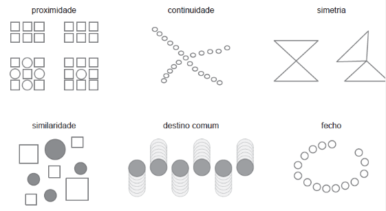

- **Proximidade:** Entidades visuais que estão próximas umas das outras são percebidas como um grupo;

  - Podemos relacionar esse tópico com a **Região comum**, que fala que objetos dentro de uma região espacial confinada (grupos, bordas...) são percebidos como um grupo.

  

- **Continuidade:** Traços contínuos são percebidos mais prontamente do que contornos que mudem de direção rapidamente;

  - Podemos relacionar esse tópico com a **Conectividade**, que fala que objetos conectados por traços contínuos são percebidos como relacionados.

  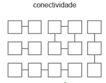

- **Simetria:** Objetos simétricos são mais prontamente percebidos do que objetos assimétricos;

- **Similaridade:** Objetos semelhantes, com características visuais semelhantes, são percebidos como um grupo;

- **Destino comum:** Objetos com a mesma direção são percebidos como um grupo;

- **Fecho:** A mente tende a fechar contornos para completar figuras regulares.

> Exemplo: As pessoas demoram menos tempo para localizar itens em informações agrupadas, as vezes muito espaço em branco dificulta o processo de pesquisa.
>
> - Para o agrupamento, utilização de borda (2ª opção), utilização de contraste (1ª opção).

**Alguns exemplos:**

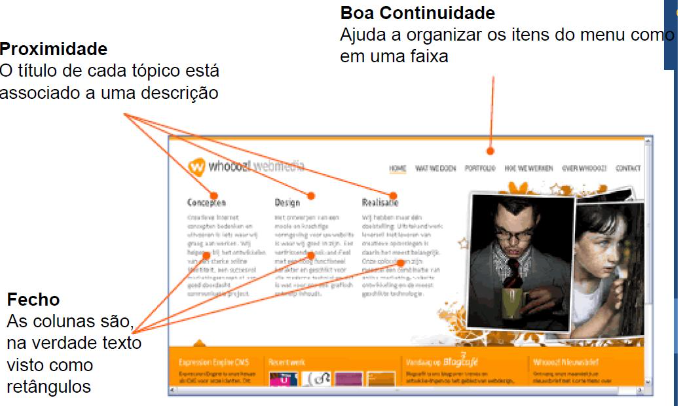

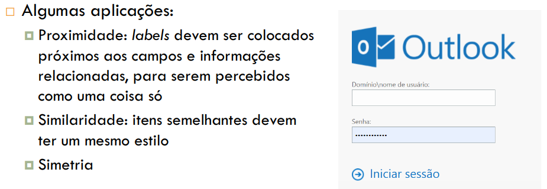

### Implicações do design para melhor percepção

- O texto deve ser legível;
- Os ícones devem ser fáceis de distinguir e de entender o significado;
- Fronteiras e espaçamento são formas visuais eficazes de agrupar informação;
- Os sons devem ser audíveis e distinguíveis;
- Pesquisar técnicas adequadas de contraste de cor ao conceber uma interface:
  - Amarelo sobre preto ou azul é bom;
  - Amarelo sobre verde ou branco não é bom.
- Feedback tátil deve ser utilizado criteriosamente.

## Cognição 

Está associada ao processo de aprendizagem e elaboração de conhecimento.  É a partir do processo cognitivo que o ser humano consegue desenvolver suas capacidades intelectuais e emocionais, isto é, atenção, percepção, memória, aprendizado, leitura, fala e audição, resolução de problemas, planejamento, raciocínio e tomada de decisões

## Memória

- Envolve a recordação de vários tipos de conhecimentos que permitem às pessoas agirem adequadamente;
  - Por exemplo, reconhecer o rosto de alguém ou recordar o nome de alguém.
- Processo: primeiro codificar e depois recuperar conhecimentos;
- O contexto é importante quanto à forma como nos lembramos (isto é, onde, quando, como, etc.);
- Não nos lembramos de tudo – envolve filtrar e processar o que é observado.

### Memória de longo prazo

Tem capacidade ilimitada e pode ser indelével (podedurar toda a vida)

Tipos de codificações:

- **Memória semântica:** a informação armazenada tem um significado, tem uma informação contida.
  - Ex.: a codificação olfativa e gustatória permitem reconhecer comida estragada.
- **Memória procedimental:** conhecimento de como fazer algo, ações que costumávamos fazer e armazenamos na memória.
  - Ex.: andar de bicicleta, tocar piano.
- **Memória biográfica:** lembranças de histórias pessoais.
  - Ex.: dia da formatura, morte de um parente.

### Memória de trabalho

Mantém lembranças por aproximadamente 30s, se não houver ensaio. Tipo memória RAM, como é limitada, se for preciso acrescentar mais itens a essa memória será necessário eliminar alguns itens.

A capacidade de memória de trabalho pode ser aumentada utilizando **chunking**, que consiste em organizar o material em grupos (chunks). Ex.: ao invés de pensar no número 993953072, pensar em 2 chunks 99395-3072.

Há o problema do "7+-2", um estudo que diz que a capacidade de memória imediata das pessoas é limitada a 7+-2 itens, logo a ideia era mostrarno máximo 7 itens em um menu, por exemplo. Mas como a escolha de um itens em um menu não precisa ser lembrada, podemos ter mais itens. Porém, às vezes um pequeno nº de itens é bom dependendo da tarefa e do espaço de tela disponível.

### Implicações de design

- Reduzir a carga cognitiva, **evitando procedimentos longos e complicados** para a realização de tarefas;
- Projetar interfaces que promovam o **reconhecimento** em vez de lembranças;
  - Por exemplo: menus, ícones, objetos localizados em posições que façam sentido.
- Fornecer aos usuários várias maneiras de **rotular informações** digitais para ajudá-los a identificá-las facilmente novamente. Ou seja, deixar o usuário fazer sua própria organização.
  - Por exemplo: pastas, categorias, cores.

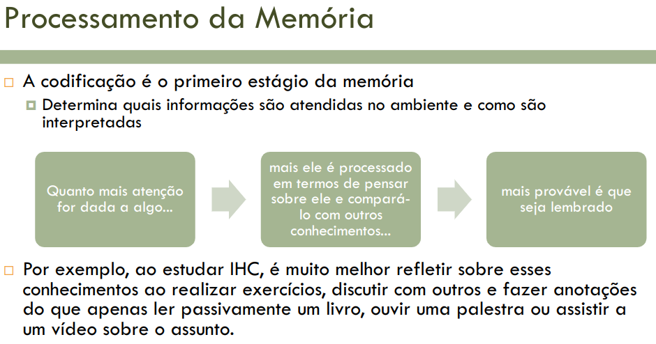

## Atenção

Consite em selecionar elementos em que se concentrar, apresentar informações ou formas de apresentação que facilite o usuário a dar foco no que o interessa.

- Ex.: buscar uma notícia sobre um assunto específico em uma página de jornal ou aguardar alguém falar o seu nome quando está em uma sala de espera.

**Busca de um quarto nas sequintes listagens:**

**Formas básicas de atenção:** Seletiva ou focalizada, dividida (multitarefa).

### Implicações de design

- Contexto: Tornar a informação saliente (evidente) quando precisa de ser atendida numa determinada fase de uma tarefa;
- Utilizar técnicas como cor, ordenação, espaçamento, sublinhado e animação;
- Evitar a desorganização das interfaces visuais com demasiada informação.
  - Cor, som e gráficos demais distraem.

## Carga de trabalho mental

## Busca visual

Não há um padrão para a busca de um elemento específico em um contexto, mas há estudos para aplicações específicas, como:

- A busca tende a ser da esquerda para a direita. Será cultural?
- Indícios de que operadores tendem a concentrar-se no centro do painel de exibição.

A atenção visual será atraída por atributos **grandes, vivos e que mudam.**

18/08 :watch:

## Erro humano

Erros humanos são responsáveis por 60 a 90% dos acidentes. Ou seja, devemos criar designs que minimizam as chances de ações que desviam do que o usuário pretendia (lapsos de ação). Um bom exemplo são os famosos tutoriais de instalação de programas, ou realização de tarefas (wizards - deve ser algo bem feito, claro, e opcional).

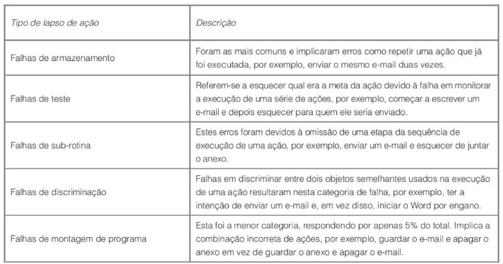

## Computação afetiva

Detectar as emoções/reações e lidar com ele, comportar-se de acordo. Criar sistemas que provoquem resposta emocional das pessoas ou que permitam que elas expressem emoções.

*“O afeto preocupa-se em descrever toda a gama de emoções, sensações, sentimentos, ânimos e outros aspectos das pessoas que podem ser considerados como **não cognitivos** (que não procuram descrever como chegamos a conhecer e entender as coisas) e **não conativos** (que não procuram descrever intenção ou vontade).”*

- Que humor combina com que tipos de interfaces?
- Como você projetaria uma interface para quando alguém está feliz, bravo, triste, entediado ou concentrado?

Ex.: Estresse e raiva estão entre os principais fatores de acidentes em estradas.

- Sensores podem detectar se o motorista está zangado ou estressado, medindo pressão sanguínea e batimentos cardíacos.
- O veículo pode oferecer aconselhamento ou recusar-se a dar partida ou telefonar para alguém.

### Teorias psicológicas sobre emoção

Detectar mudanças é mais fácil, o difícil é relacionar com uma emoção específica.

Oito emoções básicas ou primárias podem ser combinadas para produzir emoções secundárias. Por exemplo, Aceitação e Alegria se combinam para criar Amor. Podemos ver isso na roda das emoções:

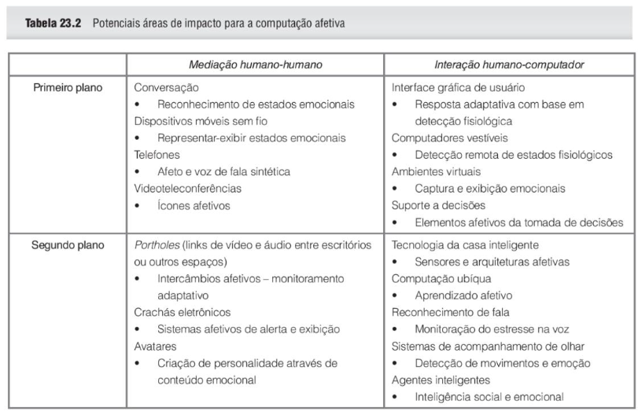

## Expressar emoção

O sistema pode "sintetizar emoções", deixando tudo em capslock, por exemplo, fornecendo feedbacks reconfortantes que são divertidos e informativos (iFood); Cores, icones, elementos gráficos e animações são usados para tornar o "look and feel" (veja e sinta) de uma interface atraente.

As pessoas estão preparadas para suportar certos aspectos de uma interface (por exemplo, taxa de downloadlenta) se o resultado final for atraente e estético.

### Interfaces frustantes

Em algumas situações, interfaces podem causar respostas emocionais negativas. Isso é comum ocorrer quando algo que deveria ser simples se torna complexo. Ex.: Encontrar um botão desejado em um controle remoto; Alterar a hora em um relógio digital.

Causas possíveis:

- Quando uma aplicação não funciona corretamente ou falha;
- Quando um sistema não faz o que o usuário quer que ele faça;
- Quando as expectativas de um usuário não são atendidas;
- Quando um sistema não fornece informações suficientes para permitir que o usuário saiba o que fazer;
- Quando surgem mensagens de erro que são vagas ou condenatórias;
- Quando a aparência de uma interface é espalhafatosa, paternalista ou chama a atenção porém sem valor real;
- Quando um sistema exige que os usuários executem muitas etapas para realizar uma tarefa, apenas para descobrir que um erro foi cometido no começo e que eles precisam começar tudo de novo.

### Interfaces expressivas x interfaces frustantes

- Quando uma interface não é suficientemente clara e intuitiva, o usuário pode ter medo de realizar uma tarefa;
- Se a interface possui excesso de elementos gráficos e cores, pode levar o usuário a sentir-se frustrado ou cansado;
- Se o sistema enviar uma mensagem de erro justamente no momento em que o usuário estiver realizando uma tarefa importante, isso, sem dúvida, o fará ter raiva desse sistema;
- Uma das principais vantagens competitivas da Apple, por exemplo, foi sempre apresentar interfaces à frente dos concorrentes.

### Mensagens de erro

Não é pra condenar o usuário, é pra ser gentil, explicar de forma clara o que é o erro, o que rolou.

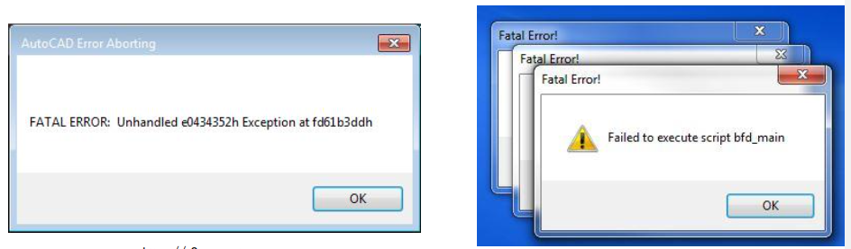

- Ao invés de explicar o que aconteceu, eles devem declarar a causa do problema e o que o usuário precisa fazer para resolvê-lo;
- Ao invés de condenar os usuários, as mensagens devem ser gentis;
- Evite usar termos como FATAL, INVALID, ILLEGAL ou BAD;
- As mensagens devem ser precisas em vez de vagas;
- Evite LETRAS MAIÚSCULAS e números de código longos;
- Avisos de áudio devem estar sob o controle do usuário;
- As mensagens devem permitir ajuda sensível ao contexto;
- As mensagens devem ser fornecidas em vários níveis, para que mensagens curtas possam ser complementadas com explicações mais longas.

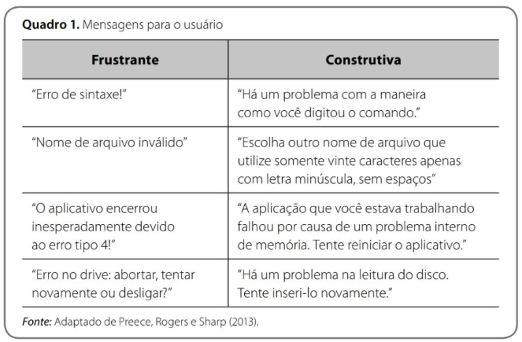

### Antropomorfismo

Atribuição de qualidades humanas a objetos inanimados (por exemplo, carros ou computadores). Fazer as pessoas se sentirem à vontade, reduzindo a ansiedade. Aplicar simpatia e comunicação afetiva na interação com o usuário.

> Início de atividade:
>
> - “Olá, Carlos! Prazer em vê-lo novamente. Então, o que estávamos fazendo da última vez? Oh sim, Exercício 5. Vamos começar de novo”.
> - “Usuário 24, comece o Exercício 5”.
>
> Feedback
>
> - “Então, Carlos, isso não está certo. Você pode fazer melhor do que isso. Tente novamente”.
> - “Incorreto. Tente de novo”.

A emoção pode estar diretamente ligada ao aprendizado, ou seja, se o usuário se sente empolgado, encorajado e motivado, a probabilidade de aprender a utilizar o sistema é bem maior. Ex.: Um sistema de realização de atividade que utiliza de feedbacks que motivam o aluno, faz com que ele se sinta mais disposto a continuar com os exercícios.

---

# Abordagens teóricas em IHC

19/08 :watch:

Embora IHC seja uma área de cunho bastante prático, muitos dos métodos, modelos e técnicas utilizadas em IHC se baseiam em teorias de base:

- Psicológica (principalmente cognitiva);
- Etnográfica;
- Semiótica.

## Abordagem da psicologia experimental

Permitem mensurar e modelar o comportamento humano e prever o desempenho.

- Lei de Hick-Hyman: tempo de reação de escolha;
- Lei de Fitts: capacidade de processamento de informação do sistema motor humano.

### Lei de Hick-Hyman

A lei de Hick-Hyman estabelece o tempo de reação a partir do número de escolhas possíveis.

Esta lei indica que uma pessoa subdivide o conjunto total de opções em categorias, eliminando aproximadamente metade das opções a cada passo, em vez de considerar todas as escolhas uma a uma.

Esta lei pode ser utilizada para fazer uma estimativa de quanto tempo uma pessoa levará para encontrar uma dentre diversas opções disponíveis numa interface.

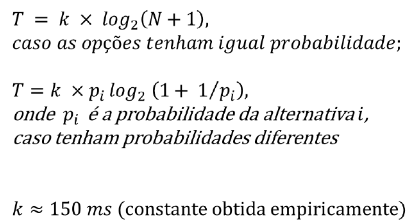

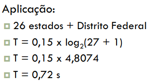

**Aplicabilidade:**

Com ela da para fazer uma estimativa de quanto tempo uma pessoa levará para encontrar uma dentre diversas opções disponíveis numa interface.

> Quando a complexidade das tarefas aumenta, a aplicabilidade da lei diminui. Ex.: a lei não se aplica a menus complexos ou hierarquias de opções.

Quando precisar simplificar processos complexos, ai se aplica a lei. Ex.: Ao invés de mostrar o processo completo de pagamento, dividir em subprocessos.

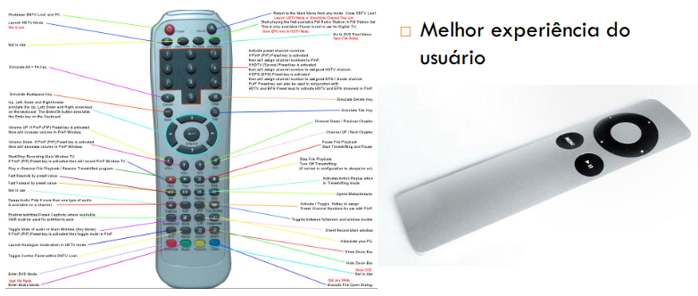

### Lei de Fitts

Relaciona o tempo (T) que uma pessoa leva para apontar para algo com o tamanho (S) e com a distância (D) entre a mão da pessoa e esse objeto-alvo.

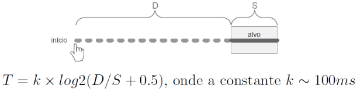

Variações desta lei são utilizadas para modelar o tempo que leva para um mouse ou outro dispositivo de entrada semelhante atingir um objeto numa tela.

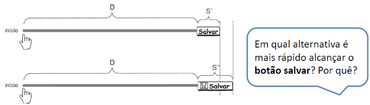

Quanto maior o botão, mais fácil e rápido seu acesso.

- Outro exemplo são as opções de ferramentas na lateral do sistema;

- Ou acesso ao menu no topo da tela é, em média, em torno de cinco vezes mais rápido do que um menu semelhante em uma aplicação Windows;
- Um menu pop-up circular (pie menu) tem como vantagem sobre um menu pop-up horizontal o fato de que todas as opções estão equidistantes e próximas do ponto em que o menu foi acionado;
- Áreas clicáveis estendidas;

## Engenharia Cognitiva

25/08 :watch:

A engenharia cognitiva foi concebida por Norman (1986) como uma tentativa de aplicar conhecimentos de ciência cognitiva, psicologia cognitiva e fatores humanos ao design e construção de sistemas computacionais. Centrado no modelo de processador humano de informações (MHP).

Ou seja, tenda entender o desempenho humano, e como ele age para desenvolver o design adequado, de forma que engaje os usuários de forma prazerosa.

O MHP é composto de três subsistemas:

- Perceptivo: transmite as sensações do mundo físico para representações mentais internas.
- Cognitivo: recebe a informação codificada simbolicamente na memória de trabalho e utiliza informações previamente armazenadas na memória de longo prazo para tomar decisões.
- Motor: traduz o pensamento em ação.

Ou seja, ele recebe, entende e age.

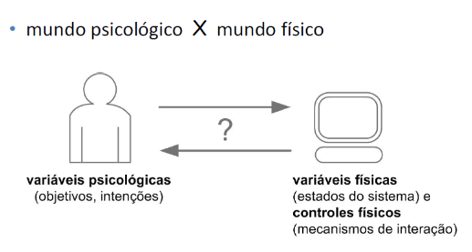

[Exemplos]

### Teoria da ação - Golfos

Mede a dificuldade de atuação e avaliação para alcançar seu objetivo inicial.

- Golfo de execução: se refere à dificuldade de atuar sobre o ambiente e ao grau de sucesso com que o artefato apoia essas ações. 
- Golfo de avaliação: se refere à dificuldade de avaliar o estado do ambiente e ao grau de sucesso com que o artefato apoia a detecção e interpretação desse estado. 

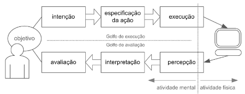

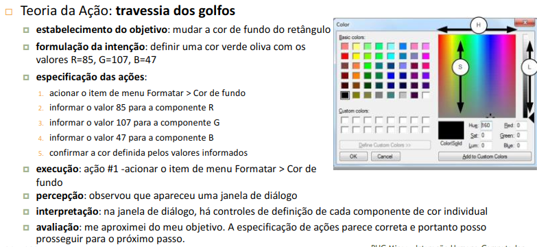

Considerações: 

- Feedback é de extrema importância, pois se o usuário não conseguir identificar, de forma clara, qualquer mudança ou feedback após sua ação, ele interpreta como "nada aconteceu" e pode acabar desistindo de atingir seus objetivos iniciais.
- Nem sempre a travessia dos golfos é iniciada pelo golfo de execução. Um usuário cuja atividade envolva monitorar alguma operação fica observando a saída do sistema até perceber que houve uma mudança. Quando alguma mudança ocorrer, o usuário deve diagnosticá-la e tomar as providências necessárias, percorrendo os golfos de execução e avaliação. Nesse caso, a avaliação inclui não apenas verificar se as ações desejadas foram executadas adequadamente e as intenções satisfeitas, mas se o diagnóstico original foi adequado.
- O designer deve tentar abreviar os golfos de execução e de avaliação, reduzir a necessidade de treinamento tanto quanto possível.

### Modelo mental

Um modelo mental é uma representação do mundo real, uma abstração a partir da leitura que o sujeito faz do mundo. Em IHC, o usuário deve facilmente construir um modelo mental do sistema mais próximo possível da realidade.

O modelo do usuário é o resultado da sua interpretação da imagem do sistema. Tudo o que o designer construir na imagem do sistema pode auxiliar ou prejudicar essa interpretação, tal como: elementos de interface (widgets) para entrada e saída de dados; documentação, instruções, ajuda on-line e mensagens de erro.

> - Por que apertar o controle remoto com mais força quando a pilha está fraca?
> - Por que apertar o botão do elevador mais vezes?
> - Por que clicar em um ícone várias vezes, quando um programa demora para abrir?
>   - Enfim, por que as pessoas constroem modelos mentais errados?
>     - Pressionar, girar, bater mais vezes ou com mais força causa o efeito desejado em várias situações no mundo físico: abrir uma torneira, martelar um prego. 

Ou seja, quanto menor a distância entre o "modelo de design" e o "modelo do usuário", maior a usabilidade do sistema.

Como ajudar o usuário?

- Instruções claras e fáceis de usar;
- Tutoriais apropriados e orientação sensível ao contexto;
- Fornecer vídeos on-line e janelas de chat para quando precisar de ajuda;
- Usar metáforas:
  - Apagar arquivo arrastando-o para uma lixeira;
  - Mover arquivo de pasta arrastando-o de uma pasta para outra.

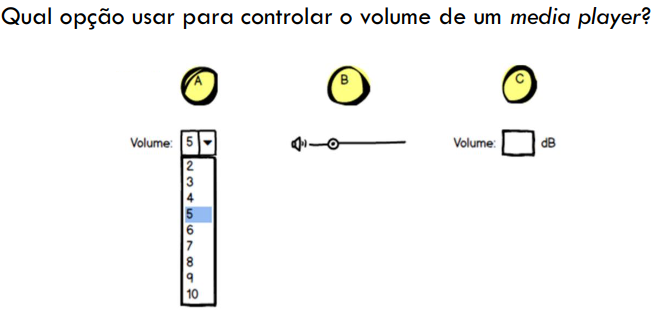

## Abordagens Etnometodológicas

A ação humana têm uma relação essencial com suas circuntânicas concretas particulares e suas interações dinâmicas com o mundo material e social. Ou seja, deslocou o foco do usuário individual para o contexto social do uso do computador.

Algumas das principais iniciativas:

- ações situadas (Suchman) × ações planejadas (Norman);
- análise da conversação entre pessoas;
- estudo da comunicação usuário-sistema;
- estudos de campo no trabalho, em casa, em movimento etc.

### Ação planejada x situada

- **Ação planejada:** Tudo vai ter um plano e as pessoas vão seguir esse plano. Para entender como as pessoas agem, bastaria entender como elas seguem um plano predefinido. 
- **Ação situada:** Não da pra prever tudo, não é possível projetar em detalhes como um comportamento vai se desdobrar antes que os participantes se engajem nas suas interações sociais. A cada instante é feita uma avaliação das circunstâncias concretas particulares e do valor das ações mediante contingências. 
  - Busca identificar recursos que possibilitam a comunicação bem sucessida, pois **a comunicação é sensível às circusntâncias.**

### Análise da conversação

Basicamente é analisar a comunicação humana, a conversa humana para aplicarmos isso aos sistemas. Ex.: Precisamos manter a coerência na conversa, assim como não começamos a falar sobre viagem quando alguém nos pergunta quantos anos tempos, um sistema quando o usuário pede para salvar o arquivo só deve perguntar o nome do arquivo, formato, etc. Não deve fugir disso para não correr uma ruptura na comunicação. 

### Comunicação usuário-sistema

Diferente de antigamente que os usuários eram como operadores que só precionavam botão, etc. Hoje, o sistema deve ser capax de se expressar, ou expressar a intenção por trás de suas ações. O designer controla unilateralmente a interação, mas de forma condicional às ações do usuário.

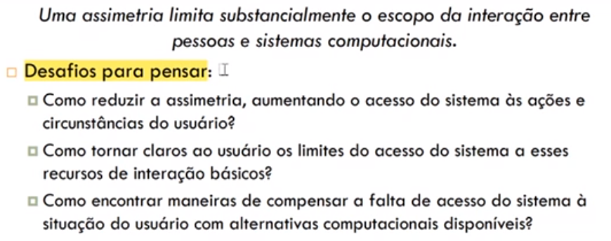

Da mesma forma que a comunicação humana, a usuário-sistema não é livre de problemas.

### Estudo de campo

Estudos fundamentados em etnometodologia têm sido aplicados em IHC de diversas maneiras:

- para analisar o impacto que um sistema teve no trabalho realizado no ambiente em que o sistema é introduzido;
- para analisar princípios e métodos organizacionais subjacentes a um domínio de trabalho;
- para analisar os impactos de um sistema sobre esses métodos;
- para criticar o design do sistema quando entra em conflito com esses métodos.

Nós descobrimos se essa comunicação está boa justamente com o estudo de campo, abservar a utilização do sistema com os usuários, no dia a dia deles.

## Teoria da Atividade

Permite analisar a adequação de uma ferramenta para uma **prática**, bem como estudar de que maneira a introdução de um artefato particular modifica a prática e como a prática pode modificar o uso do artefato. Explica o comportamento humano em termos de nossa atividade prática com o mundo, muito ligado à prática de aprendizagem.

Fornece um framework que focaliza a análise em torno do conceito de “atividade” e ajuda a identificar tensões entre os diferentes elementos do sistema.

Possui dois modelos chave:

- Um delineia o que constitui uma atividade
- Outro modela o papel mediador dos artefatos. 
  - Um artefato pode ser físico ou abstrato

Conjunto de atividades/necessidades que são realizadas por ações, que por sua vez são completadas por operações. 

Sempre que uma ação fica automatizada, ela se torna uma operação. E vise versa.

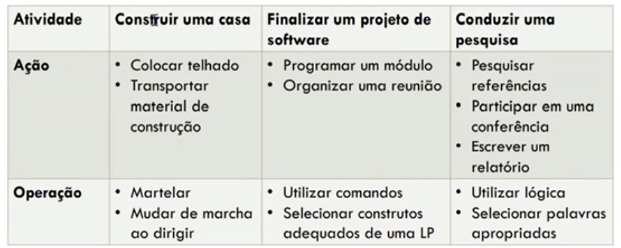

Uma crítica é que não há prescrição clara de um procedimento, a identificação dos elementos dependerá da interpretação individual.

Por outro lado, uma coisa boa é que permite identificar necessidades para uma nova ferramenta e analisar problemas existentes em um trabalho.

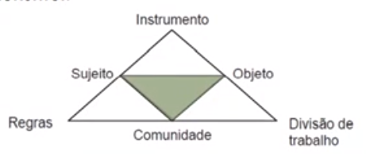

Perturbação (disturbance): Problemas identificados no modelo da atividade. Ex.: Para um agendamento de consulta Online, caso o médico não tenha agenda livre, o usuário terá que seguir um caminho diferente do que ele costuma traçar. Ele teria que entrar em um fila de espera ou buscar outro médico.

## Cognição distribuída

26/08 :watch:

Diferente das teorias cognitivas tradicionais, a cognição distribuída amplia a semântica de cognitivo para abranger as interações entre pessoas, recursos e materiais no ambiente.

Surgiu de uma necessidade de entender o trabalho que extrapola o indivíduo, entender como o processamento de informação e a resolução de problemas incorporam o uso de ferramentas e envolvem outras pessoas. 

Uma análise de cognição distribuída envolve:

- descrever o contexto da atividade, os objetivos do sistema funcional e seus recursos disponíveis;
- identificar as entradas e saídas do sistema funcional;
- identificar as representações e os processos disponíveis;
- identificar as atividades de transformação que ocorrem durante a resolução de problemas para atingir o objetivo do sistema funcional.

## Engenharia semiótica

Signo: É uma coisa que serve para transmitir alguma informação.

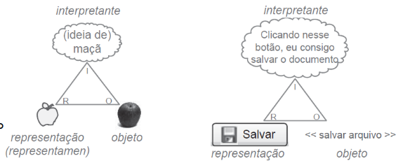

> Sempre que há convenções sociais ou culturais que nos permitem interpretar signos, temos um sistema de significação e, portanto, um código. 

Os produtores de signos podem utilizar:

- signos conhecidos (culturalmente convencionados) de formas convencionais;
- signos conhecidos de formas criativas ;
- inventar signos.

A representação de um objeto pode ser: 

- Icônica: baseada nas semelhanças e características comuns ao objeto a que se refere.
  - Ex.: desenho de uma impressora na interface de determinado software é um ícone para a impressora real e para a tarefa de imprimir. 
- Indicial: guarda a relação de causa e efeito.
  - Ex.: fumaça usada para indicar fogo ou o desenho de uma ampulheta “significando” o correr do tempo.
- Simbólica: baseada em convenções estabelecidas.
  - Ex.: linguagem natural, formalismos lógico e matemático, palavras reservadas em linguagens de programação.

### Semiose

O interpretante de um signo é, ele próprio, outro signo. Sendo assim, é passível de ser, ele próprio, interpretado, gerando outro interpretante, e assim sucessivamente. Esse processo interpretativo que nos leva a associar cadeias de significados (interpretantes) a um signo é denominado semiose. Trata-se de um processo potencialmente ilimitado.

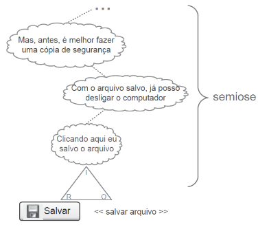

Na prática, a semiose é interrompida quando o intérprete:

- fica satisfeito com o interpretante gerado (i.e., o significado temporariamente atribuído ao signo) ou
- não tem mais tempo ou 
- não tem outro recurso necessário para continuar gerando novos significados. 

---

# Processos de design de IHC

01/09 :watch:

Artefato são os produtos artificiais, fruto da inteligência e do trabalho humano, construídos com um determinado propósito em mente. Ex.: Bicicleta, geladeira, entre outros.

Um artefato pode trazer consequências positivas e negativas. Ex.: Adquirir uma bicicleta:

- Aspectos positivos:
  - economia de dinheiro gasto em outros meios de transporte; 
  - a pratica de esportes para uma vida mais saudável; 
  - a ajuda na preservação do meio ambiente.
- Aspectos negativos:
  - necessidade de reservar um local para guardá-la;
  - necessidade de comprar um capacete e outros equipamentos para utilizar a bicicleta com segurança. 

## O que é design?

Desde sua concepção e durante todo o seu desenvolvimento, um sistema interativo deve ter o propósito de **apoiar os usuários a alcançarem seus objetivos.**

O design de um sistema interativo é um processo iterativo de análise, síntese e avaliação, no qual artefatos são coletados e produzidos visando não apenas à construção do sistema, mas também à promoção de uma boa experiência de uso desse sistema.

É um processo com três atividades básicas: Análise, Síntese e Avaliação.

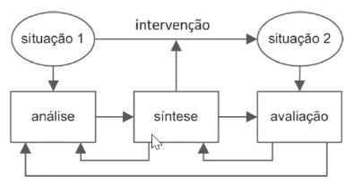

### Análise

Análise da situação atual: estudar e interpretar a situação atual.

Busca conhecer os elementos envolvidos e suas relações, como: os assuntos tratados, os objetivos das pessoas envolvidas e o tempo, orçamento e mão de obra disponíveis.

- Diferentes focos de análise contribuem para diferentes interpretações da situação atual.
  - Se o objetivo de uma organização for aumentar a produtividade dos seus funcionários: a análise da situação atual pode concentrar esforços na investigação de atividades ineficientes.
  - Se o objetivo da organização for compreender os motivos pelos quais seus funcionários não utilizam como esperado os sistemas computacionais oferecido: a análise da situação atual pode concentrar esforços em compreender a opinião dos funcionários sobre esses sistemas.PUC Minas 

### Síntese

Síntese de uma intervenção: planejar e executar uma intervenção na situação atual;

A análise da situação atual aponta as necessidades e oportunidades de melhoria para as quais será projetada uma intervenção. 

Razões para a intervenção costumam ser representadas por metas de design. Em IHC, metas de design referem-se aos objetivos dos usuários e aos critérios de qualidade de uso.

Ex.: durante a análise de uma situação, percebeu-se que os usuários gastam muito tempo processando informações que um sistema computacional poderia fazer mais rapidamente.

- Possível meta de design: aumentar a eficiência das atividades (ou tarefas) do usuário, que é um dos fatores de usabilidade. 

> Intervenção = solução desejada.

### Avaliação

Uma vez definida uma intervenção, é preciso avaliar se ela modifica a situação atual da forma desejada.

A avaliação de uma intervenção pode ocorrer em vários pontos do processo de desenvolvimento:

- Durante a concepção e o desenvolvimento da intervenção, para tentar prever seus possíveis impactos na situação atual;
  - Ex.: inspecionando as telas produzidas durante o projeto da interface com usuário.
- Logo antes da introdução da intervenção, para identificar consequências negativas ou problemas que possam ser evitados;
  - Ex.: fazendo testes com usuários e produzindo material de treinamento a partir dos seus resultados.
- Depois da intervenção ter sido aplicada, para verificar os impactos ocorridos.
  - Ex.: avaliando como os usuários se apropriaram do sistema interativo desenvolvido e quais mudanças ocorreram na sua prática de trabalho.

Em IHC, os esforços de avaliação se concentram na experiência vivenciada pelos usuários durante a interação com a interface de um sistema interativo, ou seja, durante o uso do sistema. 

Sempre que possível, deve-se avaliar a qualidade de uso desde o início do processo de design dos sistemas interativos, pois o custo de correção de eventuais problemas será menor.

## Perspectivas de design

São formas de interpretar a atividade de design.

- Racionalismo técnico: Pensa e aplica o que a técnica diz. Busca uma solução geral.
- Reflexão em ação: Pensar em soluções específicas para cada problema. Melhor solução para cada caso.

### Reflexão em ação

Durante a concepção de uma solução o designer explora várias diferentes ideias para poder compara-las.

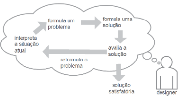

Ex.: Busca filtrada por tags ou paginação?

É como se o designer conversasse com sua solução: E se eu fizer isso? E se eu mudar isso? E assim vai.

Caso não encontre uma solução satisfatória ele pode pensar em reformular tanto a solução, quanto a ideia do problema.

É um processo que não acaba nunca, por que sempre pode ser melhorado, alterado.

**Diferença entre cliente e usuário:** O cliente define o que quer no sistema, não necessáriamente vai utiliza-lo. O usuário é quem utiliza o sistema de fato.

### Processos

Cada processo de design detalha as atividades básicas, definindo:

- como executar cada atividade;
- a sequência em que elas devem ser executadas;
- quais atividades podem se repetir e por quais motivos;
- os artefatos consumidos e produzidos em cada uma delas.

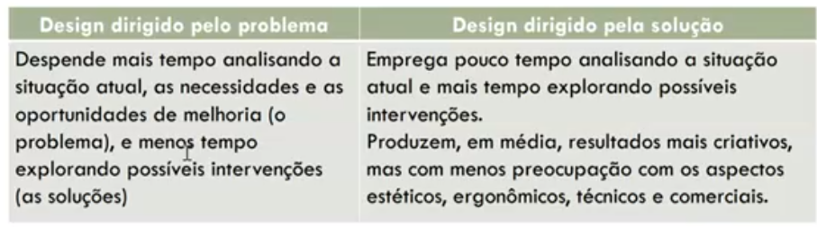

A etapa de início é definida pelo designer:

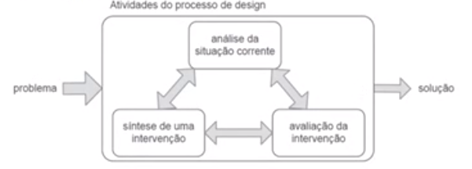

Processos centrados no usuário seguem estes princípios: 

- Foco no usuário:
  - o designer deve projetar a interação e a interface de um sistema interativo para atender às necessidades dos usuários e ajudá-los a alcançarem seus objetivos. 
  - o designer deve estudar quem serão os usuários do sistema, seus objetivos, suas características físicas, cognitivas e comportamentais, sua formação educacional e o que costumam fazer para alcançar seus objetivos.
- Métricas observáveis:
  - o processo de design deve permitir a realização de experimentos (estudos empíricos) em que representantes dos usuários usem simulações ou protótipos do sistema para realizarem suas atividades e alcançarem seus objetivos. 
- Design iterativo:
  - quando problemas forem encontrados durante os experimentos com usuários, eles deverão ser corrigidos.

Quanto mais cedo os usuários forem envolvidos no processo de design, mais cedo será possível aprender sobre suas necessidades.

### Tipos de processos

#### Ciclo de vida simples

Design centrado no usuário, pois desenvolve a partir das necessidades do usuário e pode envolve-lo no processo de avaliação. 

Nesse modelo a Sintese foi dividida em duas etapas, o desing e a construção interativa, logo temos uma versão mais construida do design.

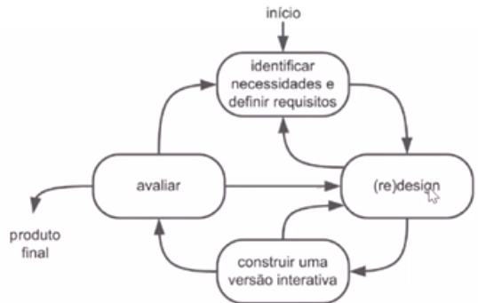

#### Ciclo de vida em estrela

Como decidir por qual atividade começar? Depende do que estiver disponível quando iniciar o processo. Por exemplo, se a intenção for projetar uma nova versão do sistema, o designer pode começar o projeto da nova versão pela avaliação da versão atual. 

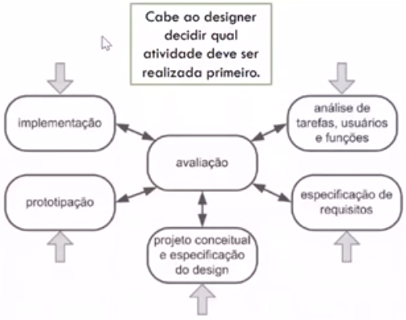

#### Engenharia de usabilidade de Nielsen

Nielsen (1994) definiu engenharia de usabilidade como um conjunto de atividades que devem ocorrer, ressaltando que muitas delas ocorrem nos estágios iniciais do projeto, antes que a interface com usuário em si seja projetada. 

Ele propõe o seguinte conjunto de atividades em seu ciclo de vida:

- **Conheça seu usuário**
  - Os usuários não serão os mesmos após a introdução do sistema. O sistema modifica os usuários e, à medida que isso ocorre, eles usarão o sistema de novas formas. Embora seja impossível prever todas as mudanças, um design mais flexível, adaptável ou extensível tem mais chances de apoiar esses novos usos.
- **Realize uma análise competitiva**
  - Aprender com o que já existe. A análise competitiva consiste em examinar produtos com funcionalidades semelhantes ou complementares. Como resultado, o designer pode obter um conjunto de informações sobre o que funciona e o que não funciona naquele domínio, o que pode ser aperfeiçoado e por quê.
- **Defina as metas de usabilidade**
  - Fatores de qualidade de uso (metas de usabilidade); Como serão avaliados ao longo do processo de design; Quais faixas de valores são inaceitáveis, aceitáveis e ideais para cada indicador de interesse.
- **Faça designs paralelos**
  - Consiste em elaborar diferentes alternativas de design, de preferência por três ou quatro designers trabalhando de forma independente, para então selecionar as que vão ser detalhadas nas atividades seguintes do processo.
- **Adote o design participativo**
  - Consiste em a equipe de design ter acesso permanente a um conjunto de usuários tidos como representativos da população-alvo. 
- **Faça o design coordenado da interface como um todo**
  - Para evitar inconsistências na interface com usuário projetada, é importante haver um responsável pelo design coordenado da interface.
- **Aplique diretrizes e análise heurística**
  - A equipe de design deve seguir diretrizes, princípios bem conhecidos para o design da interface. 
  - À medida que a interface for projetada, deve ser feita uma avaliação heurística. 
- **Faça protótipos**
  - Podem ser desenvolvidos rapidamente e a um custo baixo, para que sejam avaliados junto a usuários e modificados. O mínimo para o usuário entender como será a utilização. Pode ser até em papel.
- **Realize testes empíricos**
  - Os testes empíricos consistem principalmente na observação dos usuários ao utilizarem os protótipos para realizar certas tarefas.
- **Pratique design iterativo**
  - A cada iteração de design e avaliação, alguns problemas são corrigidos (e infelizmente outros podem ser introduzidos) e o processo deve se repetir até que as metas de usabilidade tenham sido alcançadas. 
  - É importante registrar as decisões tomadas para que, no futuro, não sejam tomadas decisões que sacrifiquem metas de usabilidade importantes ou que introduzam inconsistências por falta de informação sobre o histórico do projeto.

#### Engenharia de usabilidade de Mayhew

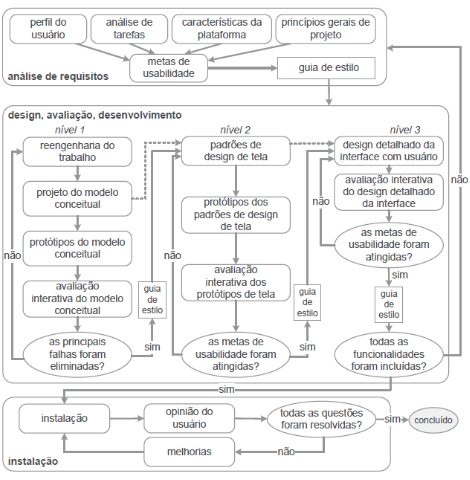

#### Design contextual

O design contextual (contextual design) é um processo de design de IHC que orienta o designer a compreender profundamente as necessidades dos usuários por meio de uma investigação minuciosa do contexto de uso.

As atividades do design contextual são: 

1. Investigação contextual;
2. Modelagem do trabalho;
3. Consolidação - Usado o diagrama de afinidade;
4. Reprojeto do trabalho;
5. Projeto do ambiente do usuário;
6. Prototipação;
7. Teste com usuários.

#### Design thinking

Design Thinking é um método de solução de problemas centrado no usuário. 

Pilares importantes: 

- Empatia
  - Tentar compreender o que o usuário pensa e sente, seus interesses. 
- Colaboração
  - Trabalhoemequipe multidisciplinar.
- Experimentação
  - Fazer experimentos para diminuir o risco em fases mais avançadas da criação. 

02/09 :watch:

---

# Identificação de necessidade dos usuários

NoprocessodedesigndeIHC,oprincipal objetivo da atividade de análise é identificar os requisitos dos usuários e as metas de design de IHC.

Pontos principais envolvidos na coleta de dados:

1. definição dos objetivos da coleta de dados;
2. relacionamento com participantes;
3. triangulação;
4. estudos-piloto.

## Definição dos objetivos

Envolve identificar as razões para coleta de dados. Ex.: 

- como a tecnologia se encaixa no cotidiano de um grupo de pessoas;
- quais dificuldades elas encontram no seu dia a dia que podem ser reduzidas com a introdução de novas tecnologias;
- qual dentre duas ou mais alternativas de design melhor satisfaz os desejos de uma classe de usuários.

Os objetivos da coleta de dados determinam **quais dados** devem ser coletados e **quais técnicas** de coletas de dados podem ser utilizadas. 

## Relacionamento com participantes

Os participantes que fornecerão os dados devem ser informados sobre esses objetivos e consentir com a sua coleta, com as condições de privacidade e anonimato previstas, com a forma como os dados serão utilizados, por quem e para quê. 

Esse esclarecimento ajuda a formar um relacionamento profissional entre as partes, bem como assegurar aos participantes o uso adequado das informações que eles forneçam. 

Em geral, a autorização dos participantes e obtida através da assinatura de um formulário de consentimento. 

## Triangulação

É uma estratégia de utilizar mais do que uma técnica de coleta ou análise de dados para obter diferentes perspectivas e confirmar as descobertas, permitindo obter resultados mais rigorosos e válidos. 

- Por exemplo: utilizar observação para entender o contexto de realização das tarefas, realizar entrevistas para endereçar grupos de usuários específicos e distribuir questionários para alcançar uma população mais ampla

Com a triangulação descobrem-se complementaridades e inconsistências entre o que as pessoas dizem e o que elas fazem, revelando que uma única forma de coleta de análise de dados seria insuficiente para obter os resultados necessários.

## Estudos piloto

É uma pequena prévia do estudo principal, com o objetivo de assegurar que o estudo é viável e permitirá coletar os dados desejados e realizar as análises planejadas. 

Idealmente, os participantes do estudo-piloto deveriam ser membros da população-alvo do estudo. Entretanto, ha situações em que o acesso à população-alvo é limitado. 

Nesses casos, pode-se pedir para pessoas de perfil semelhante ou mesmo colegas participarem do estudo-piloto. É importante observar que qualquer pessoa envolvida num estudo-piloto não deve estar envolvida no estudo principal, pois poderão distorcer os resultados.

## Que dados coletar?

- O próprio usuário;
  - Dados demográficos: idade, sexo, status socioeconômico;
  - Educação: grau de instrução, área de formação, cursos realizados.  O quão bom seu usuário lê...
  - Idiomas e jargões: que idiomas o usuário conhece e utiliza fluentemente?
- Sua relação com tecnologia;
  - Experiência com computadores;
  - Experiência com um produto específico ou ferramentas semelhantes;
  - Tecnologia disponível: hardware (tamanho da tela, velocidade de processamento...).
- Seu conhecimento do domínio do produto;
  - Conhecimento do domínio: o que e quanto o usuário conhece sobre o assunto em questão? É especialista? É esperado que se torne um especialista?
- Seu conhecimento das tarefas que deverá realizar;
  - Objetivos: como eles são alcançados atualmente?
  - Tarefas: quais tarefas do usuário precisam ser apoiadas? Quais dessas são consideradas primárias e quais são secundárias? Há quanto tempo realiza essas tarefas? São tarefas frequentes ou infrequentes? São tarefas inovadoras? Que experiência ele possui em tarefas semelhantes?
  - Experiência no cargo que ocupa: cargo atual, experiência nesse cargo, tempo na empresa, responsabilidades, trabalhos e cargos anteriores, plano de carreira;
  - Gravidade dos erros: em geral, as possíveis consequências dos erros de um usuário.
- Suas motivações e valores.
  - Motivação para o trabalho: o usuário se limita a cumprir a carga horária ou trabalha além do expediente, por prazer? Gosta da interação social no local de trabalho? Tem ambição de ser promovido?
  - Treinamento: o quanto o usuário valoriza treinamento? Prefere um estilo de aprendizado visual, auditivo ou outro? Pode investir tempo aprendendo a utilizar o produto em questão?
  - Atitudes e valores: preferências de produto, medo de tecnologia etc. O usuário costuma assumir riscos e explorar novas formas de fazer o mesmo trabalho? Ou evita novas experiências, preferindo caminhos já percorridos e testados? Ou prefere que alguém lhes mostre cada passo de uma nova tarefa sendo aprendida?

### De quem coletar?

Dos usuários finais e de pessoas interessadas no sistema (stakeholders)

Para identificar as partes interessadas que podem fornecer informações relevantes é importante investigar:

- Quem utilizará o sistema? 
- Quem será afetado por ele? 
- Quem é responsável por decidir quais objetivos o sistema deve apoiar e quais funcionalidades ele deve ter? 
- Quem definiu os processos a serem apoiados pelo sistema?

Caso o projeto em questão seja de melhoria ou expansão de um sistema existente, é importante conhecer também: 

- Quem utiliza o sistema atualmente? 
- Além dos usuários atuais, quem passará a utilizá-lo?
- Quem são os usuários satisfeitos com o sistema? E quem são os insatisfeitos? 
- Quem concebeu o sistema?
- Quem preparou a documentação do sistema? 
- Quem dá treinamento aos usuários? 
- Quem dá suporte aos usuários? 
- Quem faz a manutenção do sistema? 
- Quem projetou o sistema?

Outros:

- Feedback dos usuários;
- Arquivos de log;
- Análise competitiva;
- Processos e normas

## Aspectos éticos

Precisamos cuidar dos aspectos éticos em qualquer pesquisa envolvendo pessoas direta ou indiretamente.

> Resolução nº 66/2012 do Conselho Nacional de Saúde.

Explicamos os objetivos aos participantes:

- Garantimos a confidencialidade e a privacidade dos dados brutos coletados;
- Garantimos o anonimato nos dados divulgados;
- Solicitamos permissão para gravar dados dos usuários;
- Realizamos o estudo apenas com o consentimento livre e esclarecido, geralmente atestado com um termo de consentimento assinado;
- Asseguramos que os participantes têm o direito e a liberdade de recusar ou desistir de participar da pesquisa a qualquer momento.

> No Brasil não é permitido qualquer remuneração ou brinde para os usuários que acordarem participar da pesquisa.

## Como coletar dados dos usuários?

**Entrevistas** -> Mais informações no resumo de "Engenharia de requisitos".

09/09 :watch:

### Grupos de Foco

- Entrevista com um grupo de pessoas (3 à 10 pessoas geralmente).
- Sendo que o moderador precisa ser experiente, pois precisa saber controlar a discussão, deixar todo mundo falar e manter o foco.
- É bom pois gera mais informação, teoricamente, pois gera discussão. Ex.: Um pode lembrar de uma coisa que o outro não lembrou, opiniões diferentes, preferências diferentes...
- Questões típicas: 
  - um “dia típico” de um usuário ou o dia de trabalho mais recente;
  - as tarefas que os usuários realizam e como eles as realizam;
  - o domínio em geral (terminologia, procedimentos etc.);
  - preferências e aversões dos usuários;
  - resultados desejados ou objetivos dos usuários;
  - reações, opiniões ou atitudes dos usuários sobre um determinado produto ou conceito.
- Apresentar e discutir protótipos.
- Evitar tópicos polêmicos, política e valores morais.
- Bom que economiza tempo também, pois já entrevista várias pessoas de uma vez.

### Questionários

- Permite coletar rapidamente dados de muitos usuários;
- Geralmente é mais fácil e barato (prático) se obter e analisar dados em **maior escala**;
- Tende a ser menos detalhado e mais superficial, quando comparado a entrevistas e grupos de foco, pois não da pra tirar dúvidas, gerar discussões, etc;
- Quem elaborar o questionário deve ser experiente para **evitar perguntas ambíguas** ou que **induzam certas respostas**;
- Tipos de perguntas:

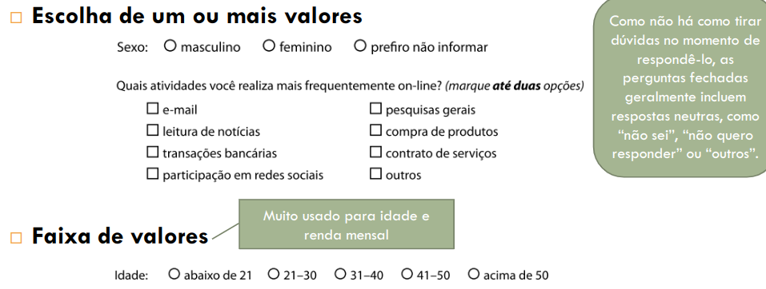

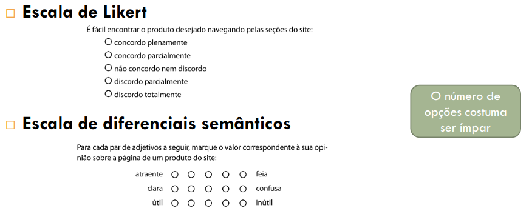

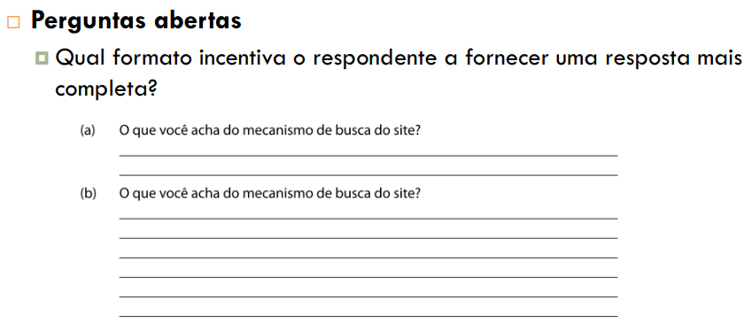

A opção A deixa mais "confortável" para responder, mas a B ajuda a trazer mais detalhes, uma resposta mais trabalhada.

- Não se deve fazer muitas perguntas abertas, porque isso reduz a taxa de respostas. 
- Em geral, questionários são usados quando se tem uma boa noção das respostas mais prováveis e deseja-se conhecer a proporção de respostas numa amostra mais ampla da população de usuários.
- Muitas vezes os questionários são utilizados em conjunto com entrevistas. 
- Questionários podem ser utilizados para corroborar os resultados das entrevistas.
- Caso as estatísticas coletadas por meio de questionários sejam inesperadas, novas entrevistas podem ser formuladas para descobrir os motivos das “surpresas”.
- A ordem das perguntas deve ser cuidadosamente projetada.
  - Perguntas gerais costumam preceder perguntas específicas.
- Quando um questionário é longo, suas perguntas podem ser **agrupadas em tópicos** relacionados, formando uma estrutura lógica e de preenchimento mais fácil. 
- Quando se deseja obter informações de grupos distintos de usuários (e.g., professores e alunos, gerentes e técnicos), pode ser necessário elaborar um questionário diferente para cada grupo.
- Colocar as frases sempre na afirmativa.
- Que contenham apenas uma pergunta ou conceito.
  - Contra-exemplo: *“A ferramenta CASE ajudou você ou a sua equipe na sua habilidade de especificar projetos complexos e a entender as especificações de outras equipes?”*

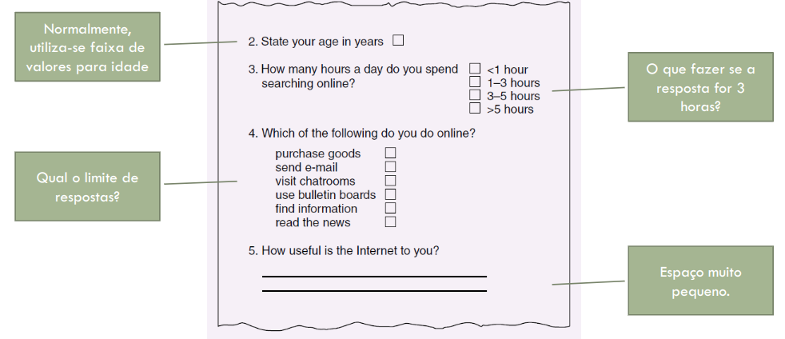

#### SUS - System Usability Scale

- http://www.measuringux.com/SUS.pdf
- Como analisar a pontuação?
  - Para itens ímpares: subtraia 1 da resposta do usuário.
  - Para itens pares: subtraia 5 menos as respostas do usuário 
    - Este procedimento deixa todos os valores entre 0 e 4, sendo o 4 a resposta mais positiva.
  - Some os resultados obtidos e multiplique por 2,5.
    - Isso converte o intervalo de valores possíveis de 0 a 100 em vez de 0 a 40.

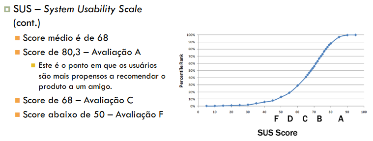

- Questionários que alternam questões positivas e negativas são mais difíceis de serem respondidos.
- Uma crítica aos questionários somente positivos é o usuário marcar, de forma aleatória, as opções de resposta
- Há poucas evidências de que as supostas vantagens de incluir itens negativos e positivos em questionários de usabilidade superem as desvantagens.
  - Deve-se evitar a inclusão de itens negativos.

#### ASQ –After Scenario Questionnaire

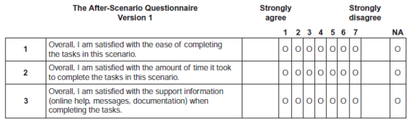

#### User Experience Questionnaire

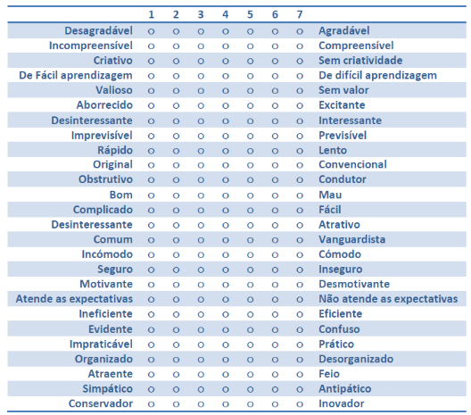

#### TAM – Technology Acceptance Model

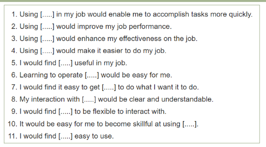

#### SAM –Self Assessment Manikin

- **Brainstorming de Necessidades e Desejos dos Usuários;**
- **Classificação de cartões (card sorting);**
- **Estudos de Campos;**
- **Investigação Contextual.**

# Identificação de necessidades do usuário 2

/09 :watch:
