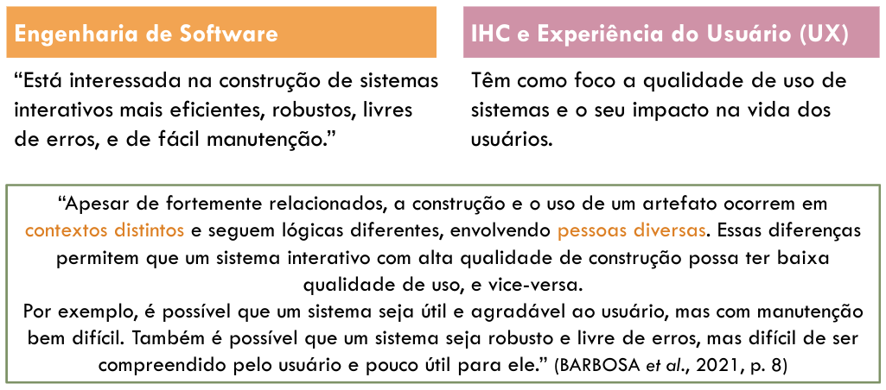
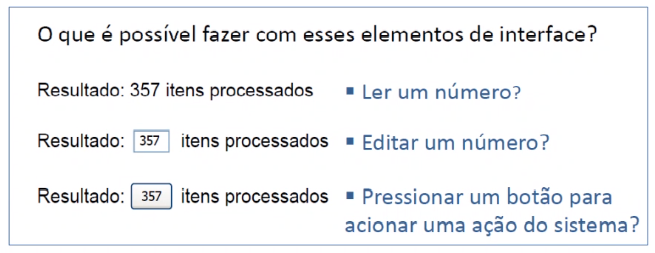

# Introdução

04/08 - 05/08 :watch:

**In.te.ra.ção:** Ação recíproca entre o usuário e um equipamento. Ou seja, o que antes era chamado de interface onde as informações só eram mostrados na tela (sentido de meio), agora é integração, toda ação/interação do usuário com o sistema computacional (algo muito mais abrangente).

*Ajudar o ser humano a conseguir acompanhar mais a tecnologia, com tecnologia! (Acessibilidade, UX...). O que podemos fazer para melhor a interação do humano com o sistema computacional.*

*Além de deixar mais agradável, sempre dar segurança ao usuário!*

### Benefícios de IHC e UX

- Aumentar a qualidade de uso de sistemas computacionais interativos
- Aumentar a produtividade dos usuários
- Reduzir o número e a gravidade dos erros cometidos pelos usuários
- Reduzir custo de treinamento
- Reduzir o custo de suporte técnico
- Aumentar as vendas e a fidelidade do cliente
- Reduzir o custo de desenvolvimento

---

# Conceitos básicos

11/08 :watch:

## Perspectivas de interação usuário-sistema

Temos algumas formas/perspectivas para uma interação entre usuário e sistema, que serão aplicados para diferentes objetivos e perfis de usuário.

- Perspectiva de sistema:  Aprender "comandos", atalhos...
- Parceito de discurso:
- Mídia: 
- Ferramenta: Manipulação de uma ferramenta utilizada para algum fim. Exemplo: Word, Canvas...

> Um mesmo sistema pode ter mais de uma perspectiva!

## Interface

Contato físico, aquilo que conecta o usuário ao sistema.

- O **contexto** de uso e as características do usuário influenciam a forma como eles percebem e interpretam a interface, e seus objetivos. 
  - Exemplo: Uso de resposta sonora para usuários surdos, ou que estaram em local barulhento, não faz sentido.
  - Exemplo 2: Um analfabeto não aprenderá a usar uma interface lendo instruções na tela.

## Affordance

Capacidade de revelar aos seus usuários as operações e manipulações possíveis de serem realizadas. Ou seja, bater o olho e entender o que pode ser feito ali.

No exemplo acima nós já entendemos que precisamos digitar algo no campo, apertar o botão e isso.........................

- Affordance reais:
- Affordances percebidas: Não é regra, mas é convenção.

> *Se **coisas simples** precisam de etiquetas ou instruções, quer dizer que o design falhou!* Deve tomar cuidado para não criar *falsas affordances*, ou seja, quando da a impressão de funcionar de um jeito, mas funciona de outro.
>
> 
>
> 

## Outros conceitos

- Usabilidade: Está relacionada com a facilidade de aprendizado e uso da interface, bem como a satisfação do usuário com esse uso.
  - Não precisa lembrar como usar, tem que ser fácil.
  - Deixar o usuário tranquilo, seguro de que não vai cometer erros.
- Experiência do usuário (UX): 
  - Teoria do fluxo (Flow Theory): Representa o sentimento do usuário com a utilização do sistema, podendo ser de prazer e realização, tédio, apatia...
- Acessibilidade
