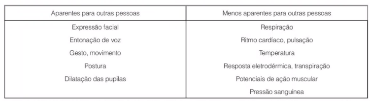
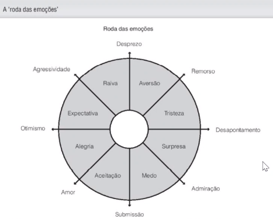
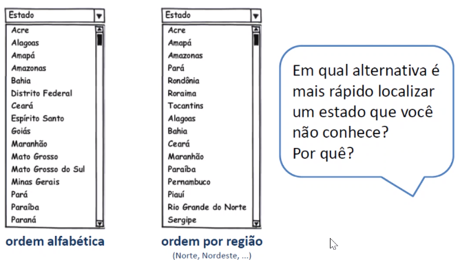

# Introdução

04/08 - 05/08 :watch:

**In.te.ra.ção:** Ação recíproca entre o usuário e um equipamento. Ou seja, o que antes era chamado de interface onde as informações só eram mostrados na tela (sentido de meio), agora é integração, toda ação/interação do usuário com o sistema computacional (algo muito mais abrangente).

*Ajudar o ser humano a conseguir acompanhar mais a tecnologia, com tecnologia! (Acessibilidade, UX...). O que podemos fazer para melhor a interação do humano com o sistema computacional.*

*Além de deixar mais agradável, sempre dar segurança ao usuário!*

### Benefícios de IHC e UX

- Aumentar a qualidade de uso de sistemas computacionais interativos
- Aumentar a produtividade dos usuários
- Reduzir o número e a gravidade dos erros cometidos pelos usuários
- Reduzir custo de treinamento
- Reduzir o custo de suporte técnico
- Aumentar as vendas e a fidelidade do cliente
- Reduzir o custo de desenvolvimento

---

# Conceitos básicos

11/08 :watch:

## Perspectivas de interação usuário-sistema

Temos algumas formas/perspectivas para uma interação entre usuário e sistema, que serão aplicados para diferentes objetivos e perfis de usuário.

- Perspectiva de sistema:  Aprender "comandos", atalhos...
- Parceito de discurso:
- Mídia: 
- Ferramenta: Manipulação de uma ferramenta utilizada para algum fim. Exemplo: Word, Canvas...

> Um mesmo sistema pode ter mais de uma perspectiva!

## Interface

Contato físico, aquilo que conecta o usuário ao sistema.

- O **contexto** de uso e as características do usuário influenciam a forma como eles percebem e interpretam a interface, e seus objetivos. 
  - Exemplo: Uso de resposta sonora para usuários surdos, ou que estaram em local barulhento, não faz sentido.
  - Exemplo 2: Um analfabeto não aprenderá a usar uma interface lendo instruções na tela.

## Affordance

Capacidade de revelar aos seus usuários as operações e manipulações possíveis de serem realizadas. Ou seja, bater o olho e entender o que pode ser feito ali.

No exemplo acima nós já entendemos que precisamos digitar algo no campo, apertar o botão e isso.........................

- Affordance reais:
- Affordances percebidas: Não é regra, mas é convenção.

> *Se **coisas simples** precisam de etiquetas ou instruções, quer dizer que o design falhou!* Deve tomar cuidado para não criar *falsas affordances*, ou seja, quando da a impressão de funcionar de um jeito, mas funciona de outro.
>
> 
>
> 

## Outros conceitos

- Usabilidade 
  - Está relacionada com a facilidade de aprendizado e uso da interface, bem como a satisfação do usuário com esse uso.
  - Não precisa lembrar como usar, tem que ser fácil.
  - Deixar o usuário tranquilo, seguro de que não vai cometer erros.
- Experiência do usuário (UX)
  - Teoria do fluxo (Flow Theory): Representa o sentimento do usuário com a utilização do sistema, podendo ser de prazer e realização, tédio, apatia...
- Acessibilidade
  - Não só para quem tem deficiência, mas para todos que podem utilizar o sistema em um momento que "vá ter a deficiência" temporariamente.
- Comunicabilidade
  - Relação com a usabilidade
- Qualidade de uso em IHC
  - 

---

# Fatores Humanos

12/08 :watch:

*Entender melhor essa parte "humano" da interação humano-computador.*

Nós, como humanos, temos limitações, nós não lembramos de tudo, nos distraimos, cometemos erros muito facilmente, entre outros. E como isso pode afetar a interação? 

## Percepção

Informações adquiridas por meio de nossos sentidos e transformadas em experiências.

>  Note: Para os que enxergam, a visão é o sentido dominante...

Fatores que afetam a percepção:

- asdsadasdasdsa

### Princípios de Gestalt

Como os seres humanos percebem as coisas, e como podemos utilizar ao nosso favor, deixar a interface mais perceptível à ideia dela em sí, mais fácil de entender o conteúdo da interface.

*Fazer projetos mais adequados aos seres humanos.*

### Implicações do design para melhor percepção

#### Cognição 

#### Memória

- Chunking:

#### Atenção

Dar destaque em certas informações, agrupar.....

#### Busca visual

18/08 :watch:

#### Erro humano

Erros humanos são responsáveis por 60 a 90% dos acidentes.

- Wizards: 
  - Algo claro, bem feito;
  - Opcional

## Computação afetiva

Detectar as emoções/reações e lidar com ele, comportar-se de acordo. 

### Teorias psicológicas sobre emoção

> Detectar é mais fácil, o difícil é relacionar com uma emoção específica.

> Periféricos que captam a mudança de emoção para adaptação dos sistemas.

### Expressar emoção

O pc pode "sintetizar emoções", deixando tudo em capslock....

É ético 

### Interfaces expressivas

Como faz isso com o que temos agora?

interfaces frustantes...

Causas possíveis:

- asadsdas

#### Interfaces expressivas x interfaces frustantes

#### Mensagens de erro

Não é pra condenar o usuário, é pra ser gentil, explicar o que é o erro, o que rolou.

Computador deve pedir desculpas?

#### Antropomorfismo

> Computação afetiva e aprendizado

---

# Abordagens teóricas em IHC

19/08 :watch:

Abordagens teóricas......

## Abordagem da psicologia experimental

### Lei de Hick-Hyman

A lei de Hick-Hyman estabelece o tempo de reação a partir do número de escolhas possíveis.

Esta lei indica que uma pessoa subdivide o conjunto total de opções em categorias, eliminando aproximadamente metade das opções a cada passo, em vez de considerar todas as escolhas uma a uma.

Aplicabilidade: Serve para.........................

Com ela da para fazer uma estimativa de quanto tempo uma pessoa levará para encontrar uma dentre diversas opções disponíveis numa interface.

[FORMULA.........................................................................................................................................................]

### Lei de Fitts

opções de ferramentas estão na lateral.................

## Engenharia Cognitiva

25/08 :watch:

A engenharia cognitiva foi concebida por Norman (1986) como uma tentativa de aplicar conhecimentos de ciência cognitiva, psicologia cognitiva e fatores humanos ao design e construção de sistemas computacionais.

[Exemplos]

### Teoria da ação - Golfos

- Golfo de execução:
- Golfo de avaliação: 

## Abordagens Etnometodológicas

## Teoria da Atividade

26/08 :watch:

## Cognição distribuída

## Engenharia semiótica

Signo: É uma coisa que serve para transmitir alguma informação.

> Sempre que há convenções sociais ou culturais que nos permitem interpretar signos, temos um sistema de significação e, portanto, um código. 

Os produtores de signos podem utilizar:

- signos conhecidos (culturalmente convencionados) de formas convencionais
- signos conhecidos de formas criativas 
- inventar signos

A representação de um objeto pode ser: 

- Icônica: baseada nas semelhanças e características comuns ao objeto a que se refere.
  - Ex: desenho de uma impressora na interface de determinado software é um ícone para a impressora real e para a tarefa de imprimir. 
- Indicial: guarda a relação de causa e efeito.
  - Ex: fumaça usada para indicar fogo ou o desenho de uma ampulheta “significando” o correr do tempo.
- Simbólica: baseada em convenções estabelecidas.
  - Ex: linguagem natural, formalismos lógico e matemático, palavras reservadas em linguagens de programação.

### Semiose

O interpretante de um signo é, ele próprio, outro signo. Sendo assim, é passível de ser, ele próprio, interpretado, gerando outro interpretante, e assim sucessivamente. Esse processo interpretativo que nos leva a associar cadeias de significados (interpretantes) a um signo é denominado semiose. Trata-se de um processo potencialmente ilimitado.

Na prática, a semiose é interrompida quando o intérprete:

- fica satisfeito com o interpretante gerado (i.e., o significado temporariamente atribuído ao signo) ou
- não tem mais tempo ou 
- não tem outro recurso necessário para continuar gerando novos significados. 

---

# Processos de design de IHC

01/09 :watch:

[Contexto]

​	[artefato]

Artefato são os produtos artificiais, fruto da inteligência e do trabalho humano, construídos com um determinado prósito em mente.

Um artefato pode trazer consequências positivas e negativas....

[O que é design]

​	[Processo iterativo]

É um processo com três atividades básicas:

- **Análise** da situação atual: estudar e interpretar a situação atual;
  - ....
- **Síntese** de uma intervenção: planejar e executar uma intervenção na situação atual;
- **Avaliação** da nova situação.

[perspectivas de design]

​	[reflexão em ação]

[diferença - Cliente x Usuário]

[Métricas]

[Ciclos - Técnicas....]

02/09 :watch:

[IHC - ES]

​	[Diferença]

​	[Princípios-chave]

​	[IHC e Métodos ágeis]

---

# Identificação de necessidade dos usuários

Conhecer o usuário -> Coleta de dados

[Relacionamento com participantes]

[Triangulação]

[Estudo-piloto]

[Que dados coletar?]

[De quem coletar?]

[Aspectos éticos]

[Entrevista]
