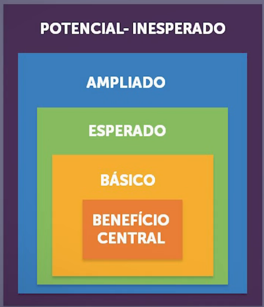
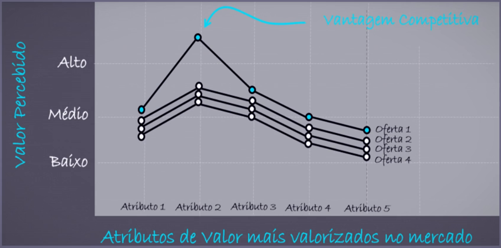
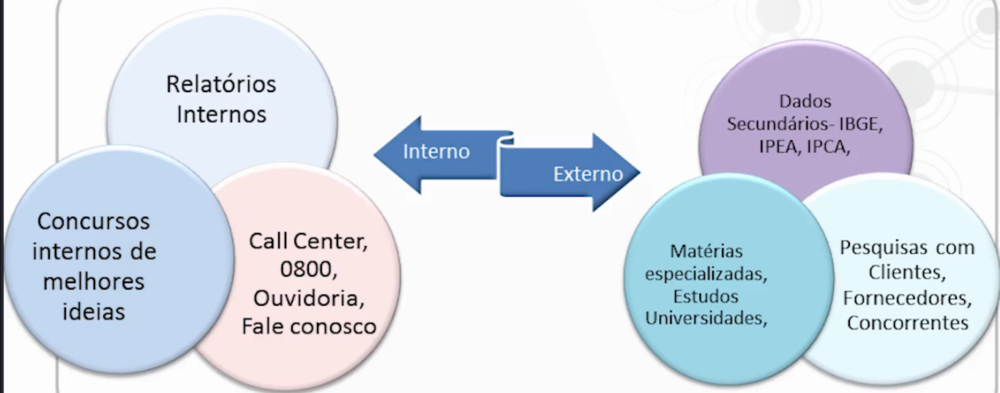
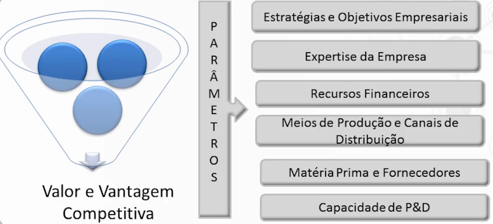
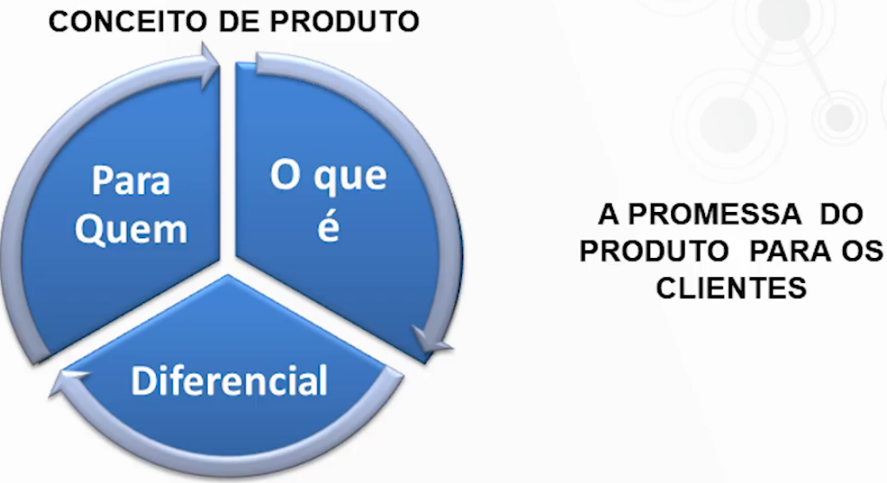
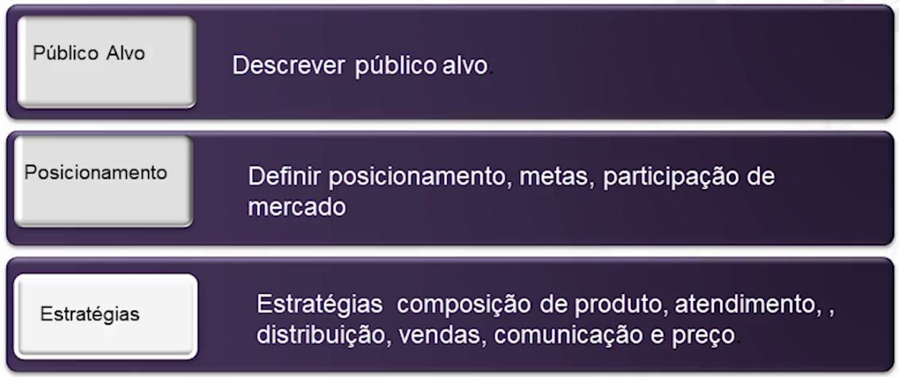
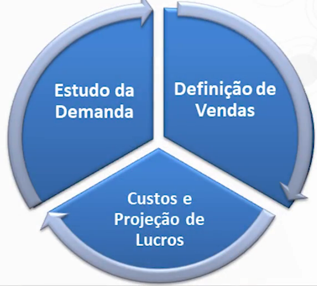
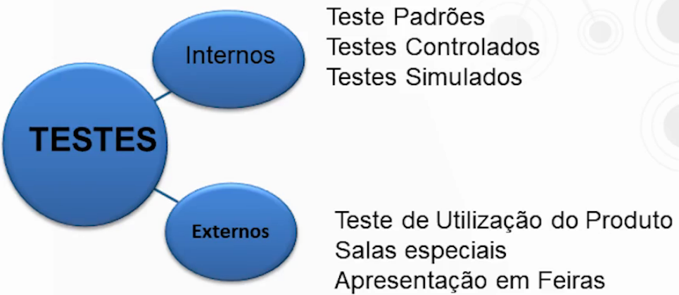
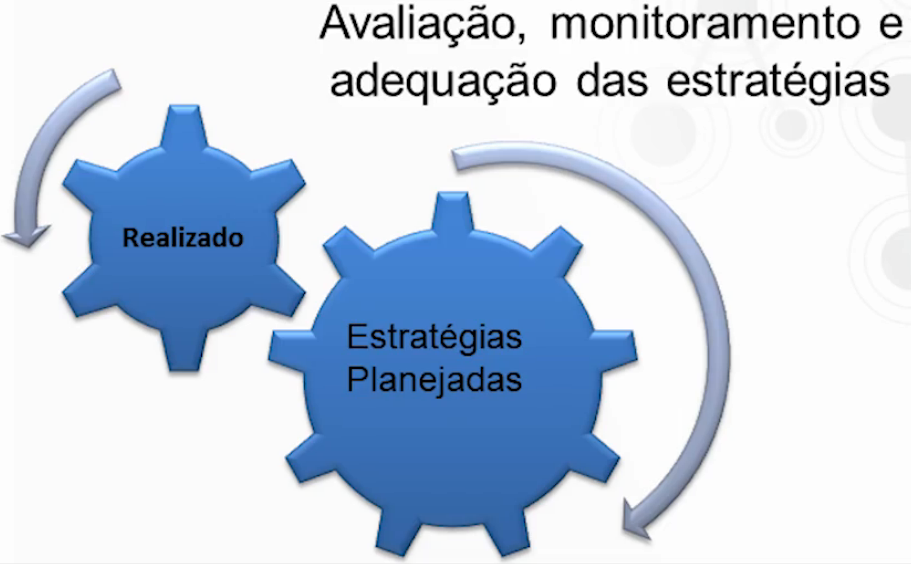
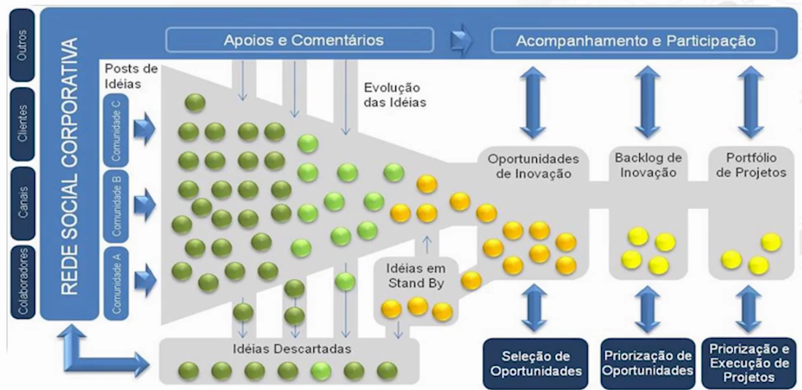

# Promover o benefício inesperado

*Benefício inesperado: Um produto criado faz algo além do esperado.*

Pesquisas indicam que as pessoas compram mais os benefícios inesperados, ainda mais se estiver  vinculado a categoria do produto. Isso sugere que os profissionais de marketing só devem anunciar que um benefício é inesperado se ele for coerente com as expectativas do cliente para a categoria de produto.

---

# Produto x Serviço

- Produto: é algo que pode ser oferecido a um mercado como **apreciação, aquisição, uso ou consumo** e para satisfazer um desejo ou uma necessidade. *Produtos são mais do que bens tangíveis.*

- Serviço: é definido como qualquer ato ou desempenho, essencialmente intangível, que uma parte pode oferecer à outra e que não resulta na propriedade de nada. *A execução de um serviço pode estar ou não ligada a um produto concreto.*

Geralmente as pessoas querem mais que o produto em sí, querem uma experiência. Ex.: Dar um presente, é o ato de carinho; Quero me locomover de um ponto à outro, eu prefiro muito mais quando é rápido, confortável (comodidade), entre outros adtributos que vão além da ação de ir e vir.

Porém esses atributos precisam ser percebidos pelo cliente para proporcionar valor ao cliente, se não, não é valor.

## Hierarquia de valor 

Para a composição do produto/serviço temos uma hierarquia de valor para o cliente:

1. **Benefício central** - Foco principal do produto ou serviço - Motivo da compra.

   - Ex.: Hotelaria -> Hospedar as pessoas.

2. **Básico** - Básico necessário para produto ou serviço existir.

   - A partir da necessidade central, eu agrego para se tornar *servível.*

   - Ex.: Hotelaria -> Quarto, banheiro, toalhas...

3. **Esperado** - Como o consumidor espera receber o produto ou serviço.

   - Com um certo nível de exigência as pessoas esperam um certo nível de qualidade. Compôe toda a espectativa do cliente.
   - Ex.: Hotelaria -> Esperam uma cama arrumar, toalhas limpas, banheiro relativamente bom.

   > Sempre bom fazer uma pesquisa para descobrir o que esperam, o quão exigêntes são.

4. **Ampliado** - Quando agrega ao produto e ao serviço um **algo á mais** que o cliente não está esperando.

   - Ex.1: Hotelaria -> Voltou 3 vezes, ganhou uma hospedagem de graça.
   - Ex.2: Produto com embalagem boa, com uma experiência de umboxing boa. Ou Um produto que chegou muito antes do previsto.

5. **Potencial ou inesperado** - Acrescentar ao produto/serviço básico, esperado ou ampliado algo que o torne inesperado.

   - Agrega algo muito diferenciado ao nível, vai muito além da concorrencia.

> Note: A vantagem competitiva está em valorizar/ampliar o atributo de valor mais perceptível pelo cliente. Ou seja, conheça o que seu cliente mais percebe como valor para ele, e o ganhará.

---

# Desenvolvimento de Produto e Serviço

É fato que muitas empresas fracassam no lançamento dos produtos, mas por quê os produtos fracassam?

Causas internas a organização:

- Mercado super estimado;
- Produtos mal projetados;
- Lançamento de produtos mesmo com resultados negativos da pesquisa de mercado.
- Posicionamento inadequado;
- Custos de desenvolvimento são maiores que os esperados;
- Reação da concorreência é sub estimado.

Causas fora da organização:

- Escassez de idéias - Produtos similares, mas sem coisas novas;
- Mercados fragmentados;
- Restrições sociais e governamentais;
- Custo de manutenção do departamento de P&D;
- Escassez de capital;
- Diminuição do tempo de criação de novos produtos.

## Processo de desenvolvimento de produtos

### Geração de ideias

### Seleção de ideias

Nem sempre uma boa ideia funciona, então precisamos pesquisar.

### Desenvolvimento e Teste de conceito

É um marco, pois aqui defini o publico alvo, a promessa desse produto para com seus clientes, o que ele tem que atender, se os cliente querem aquele produto, entre muitas outras definições. 

Se descobrirmos algum gap, ou refutamos a ideia, ou remodelamos.

### Elaboração de estratégias

### Análise comercial

> Envolve o levantamento do lucro dos concorrentes, estimativa de demanda, quantidade de consumidores...

### Desenvolvimento do produto

Após toda a análise, agora é hora de prototipar, materializar o produto. É a transformação do conceito de produto, em produto físico.

### Testes de marketing

Essa fase é importante por que aqui descobrimos o que precisamos melhor no nosso produto antes do lançamento de fato.

### Comercialização/Lançamento

## Funil de inovação de Produtos e Serviços

---

