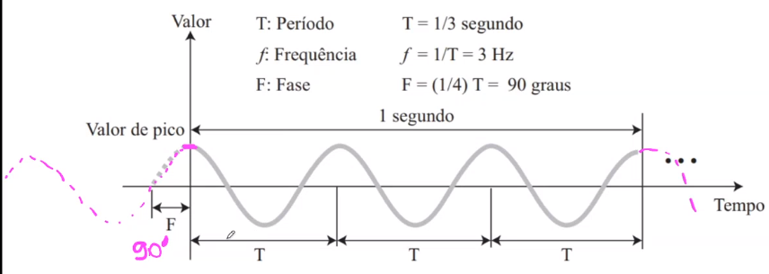
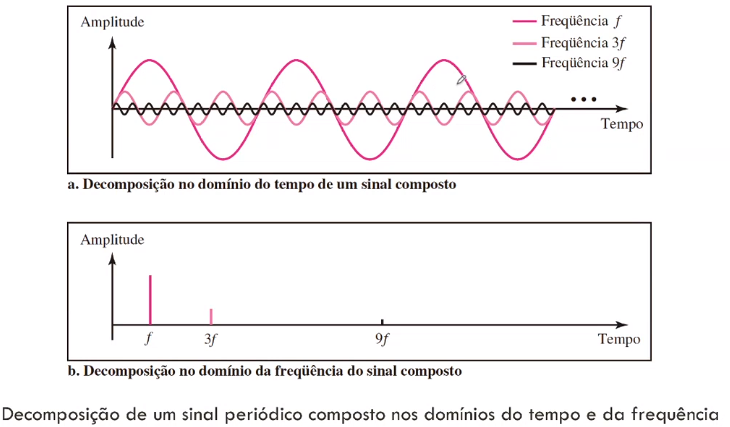

# INTRODUÇÃO

04/08 :watch:

Com a evolução da tecnologia, nós vimos a necessidade de transmitir informações, dados para outros lugares. *Redes: Conjunto de computadores autônomos interconectados por uma única tecnologia.*

**Aplicações comerciais:**

- Compartilhamento de recursos;
- Comércio eletrônico;
- IOT;
- Conectividade.

**Aplicações residenciais:**

- Redes sociais e Entretenimento interativo;
- Conectividade (Alexa...);
- Trocas de mensagens;

## Modelos

### Modelo Cliente-Servidor

Comunicação hierárquica. Servidores com hardware diferenciado e com centralização de serviços. Os clientes fazem solicitações aos servidores, através de requisições pela rede (link pelo navegador...). *Faz uma requisição, e recebe uma resposta (protocolo HTTP).*

### Modelo Peer to Peer

**P2P - Par a Par.** Não existe diferenciação entre clientes e servidores. Comunicação não hierárquica. Os usuários são cliente e servidores, podendo atuar como ambos ao mesmo tempo.

## Tecnologia de Transmissão de Dados

### Redes Ponto a Ponto

Comunicação entre pares de máquinas individuais. Um pacote pode passar por uma ou mais máquinas até atingir o seu objetivo. Existem esquemas de roteamento que escolhe o melhor caminho entre os vários possíveis.

### Redes de Difusão

Canal único de comunicação compartilhado por todas as máquinas de rede. Mensagens são transmitidos na forma de pequenos pacotes e recebidos por todas as máquinas da rede. Todas as máquinas recebem o pacote, e o processam ou não, dependendo do endereço.

Algoritmo para recebimento de msgs executado por cada máquina:

``` Java
// Computador verifica endereço de destino;
if(endereço no quadro = meu endereço) {
    processa o quadro
} else {
	descarta o quadro	
}
```

- É possível enviar mensagem para todos computadores da rede (mensagem de difusão)
- Permite dois tipos de operação relacionadas ao campo endereço:
  - **Broadcasting** ou difusão - a mensagem é endereçada a todas as máquinas da rede
  - **Multicasting** ou multidifusão - a mensagem é endereçada a um grupo de máquinas da rede

---

> Restante da introdução no slide.


---

# CAMADA FÍSICA

11/08 :watch:

*Essa camada fará todo transporte dos dados, na forma eletromagnética, através de um meio de transmissão (cabo par trançado, fibra...).*

Geralmente os dados, inicialmente, não estão em um forma possível de transporte, então é necessário fazer esse tratamento/transformação. Transformar em sinais eletromagnéticos.

## FUNDAMENTOS DE COMUNICAÇÃO

Os dados podem ser uma das duas seguintes formas:

- Analógicos: Forma contínua de ter essa informação. Apresentando um nº infinitamente grande de níveis de intensidade em um intervalo de tempo, ou seja, entre A e B pode assumir um nº infinito de valores;
- Digitais: Assumem valores discretos, ou seja, valores específicos, um nº limitado de valores definidos (geralmente em binário, 0 e 1).

Tanto um sinal analógico quanto digital, pode assumir uma de duas formas:

- Periódico: Tem um padrão que se repete dentro de um intervalo de tempo, e repete esse padrão nos intervalos posteriores.
- Aperiódico: Não tem padrão ou ciclo que se repete ao longo do tempo.

> Obs: Um ciclo é definido como um padrão da onde dentro de um intervalo de tempo (T). Exemplo: O sinal passa de positivo para negativo, e chega volta para o positivo.
>
> 

### SINAIS ANALÓGICOS

Sinais analógicos **periódicos** podem ser classificados como: **simples ou compostos**. 

A onda simples é a forma mais fundamental (base) de um sinal analógico periódico (não pode ser decomposto em sinais ainda mais básicos). E o sinal analógico periódico composto é a combinação de diversas ondas senoidais.

#### SINAIS SIMPLES (ONDA SENOIDAL)

> Aplicações: Envio de energia elétrica de um lugar para outro. Sensores de portão... Não são muitos casos.

Uma onda senoidal pode ser representada por 3 parâmetros:

- **Amplitude de pico (máx)**: corresponde ao valor absoluto de sua intensidade mais elevada. É proporcional à energia que o sinal transporta (topo e fundo da onda).

- **Frequência**: medida em Hertz (Hz), refere-se ao nº de períodos em 1 segundo.

  - Período: quantidade de tempo (seg.) que um sinal leva para completar um ciclo.

  - F = 1/T e T = 1/F (Frequência é o inverso do período)

  - Como a frequência é a taxa de mudança em relação ao tempo, uma mudança em curto espaço de tempo significa alta frequência. E mudanças ao longo de espaço de tempo prolongado significa baixa frequência.

    

- **Fase**: descreve a posição da forma de onda em relação ao instante de tempo 0. Medida em graus ou radianos (360º corresponde a 2π radianos). Vai nos dizer o estado do início do 1º ciclo da onda em um intervalo de tempo (a quantidade de deslocamento). Exemplo: Podemos dizer que ela está defasada em 90º, ou em 180º, e por ai vai.



- **Comprimento da onda (λ)**: corresponde à distância que um sinal simples pode viajar em um período. Depende tanto da frequência, quanto do meio em que está sendo propagado. *Existe em qualquer tipo de sinal.*
  - **λ = c / f** = **c x T**
  - c: velocidade de propagação (valocidade da luz)
  - f: frequência

##### DOMÍNIOS DO TEMPO E DA FREQUÊNCIA

Como trabalhar com as duas grandezas, tempo e frequência, ou seja, podemos representar nossa onda de duas formas, nesses dois domínios diferentes.

> Note: No domínio do tempo consigo visualizar cada ciclo. No domínio da frequência a representação é mais simples, e mais fácil de representar várias ondas senoidais de uma vez.


#### SINAIS COMPOSTOS

> Aplicações: É mais comum que as ondas simples para a transmissão de dados.

É uma combinação de ondas senoidais simples com diferentes frequências, amplitudes e fases.

Diferente dos sinais simples, o composto pode ser **periódico ou aperiódico**.

- **Periódico**: A decomposição desse sinal fornece uma série de sinais com frequências discretas;
- **Aperiódico**: A decomposição fornece uma combinação de um nº infinito de ondas senoidais com frequências contínuas. Ou seja, se eu não tenho padrão, posso ter um nº infinito de ondas com frequência contínua.




> Note: 3f significa que essa onda tem 3x a **frequência fundamental** (ou 1ª harmônica), sendo ela f. Ela é chamada de 3ª harmônica.

##### LARGURA DE BANDA

A largura de banda de um sinal composto é a diferença entre a maior e a menor frequência contida nesse sinal. Ou sjea, refere-se à quantidade de dados que podem ser transmitidos em um período de tempo fixo.


A diferença é que em um sinal periódico temos todas as frequências definidas, e no aperiódico temos as frequências contínuas.

### SINAIS DIGITAIS

Valores discretos.

- *Um bit 1 pode ser codificado como uma tensão positiva e um bit 0 como tensão nula.* 
- *Um sinal digital pode ter mais de dois níveis: enviar mais de 1 bit com cada nível.*

Agora não iremos falar mais sobre taxa de frequência para descrever esse sinal, e sim **taxa de transferência** (ou taxa de bits). A taxa de bits corresponde ao nº de bits enviados em **1s**, expressado em bits por segundo **(bps)**.

> Exemplo: considere que precisamos receber documentos de texto a uma taxa de 100 páginas por segundo. Qual é a taxa de bits necessária para o canal? Uma página tem em média 24 linhas com 80 caracteres em cada uma. Se considerarmos que um caractere requer 8 bits, a taxa de bits será:
>
> 100 x 24 x 80 x 8 = 1.536.00 bps = 1.536 Mbps

- **Comprimento de Bits:** é a distância que um bit ocupa no meio de transmissão.
  - Comprimento = velocidade de propagação * duração dos bits.

#### ANÁLISE DE FOURIER

De acordo com a análise de Fourier, um sinal digital corresponde a um **sinal analógico composto**, e podemos usá-la para decompor qualquer sinal digital em suas harmônicas.

- Se o sinal for periódico a representação do sinal decomposto no domínio da frequência apresenta frequências **discretas**;
- Se for aperiódico, o sinal decomposto apresenta frequências **contínuas**.

### TRANSMISSÃO DE SINAIS DIGITAIS

Como podemos transmitir um sinal digital de um ponto A para um ponto B? Podemos utilizar uma das duas abordagens: transmissão banda-base ou banda larga (usando modulação). 

#### TRANSMISSÃO EM BANDA BASE

A transmissão de um sinal digital em banda base nada mais é que o envio desse sinal por um canal sem transformar o sinal digital em analógico, ou seja, ele é injetado no canal sem mudança nenhuma.

Essa transmissão requer um canal **passa-baixa**, um canal com uma banda que se inicie em zero. Toda a largura de banda do cabo é utilizada por um **único sinal** Ex.: Toda a largura de banda de um cabo que conecta dois computadores corresponde a um único canal, ou seja, um meio **dedicado** cuja largura de banda seja usada por um único canal.


#### TRANSMISSÃO EM BANDA LARGA

Há modulação do sinal, ou seja, o sinal digital é transformado em sinal analógico para a transmissão. Por esse motivo permite usar um canal **passa-faixa**, um canal com uma banda que não se inicia em zero (isso limita a frequência). Porém, é possível transmitir **múltiplos sinais** em múltiplas frequências simultâneamente usando um único canal.

Ex.: Aqueles pacotes de internet, banda larga com fibra ótica, ou seja, é feita essa modulação do sinal, e de forma simultânea e unidirecional, vários sinais podem ser enviados em um único canal. 


## PERDA DE TRANSMISSÃO

Esses meios de transmissão não são perfeitos, logo podemos ter algumas perdas ao longo da transmissão dos dados, ou seja, *o que sai, não é o que chega*.

### ATENUAÇÃO

Com atenuação nos referimos à **perda de energia**, ou seja, parte da energia é usada para superar a resistência do meio, seja elétrica, refração de luz... Isso é evidênte na amplitude da onda que diminui.

- Amplificadores são usados para aumentar o sinal (equipamento eletrônico). Ex.: Repetidores, amplificadores dentro dos roteadores, entre outros.

Para mostrar que um sinal ganhou ou perdeu força, usa-se o decibel (dB) - unidade que mede as forças relativas de dois sinais, ou de um mesmo sinal em dois pontos diferentes.

- O decibel é negativo se o sinal for atenuado, e positivo se o sinal for amplificado.
  - dB = 10 log10 (P2 / P1)
  - P1 e P2 correspondem à potência de um sinal nos pontos 1 e 2.

### DISTORÇÃO 

Refere-se quando um sinal chega ao seu ponto de destino em seu formato distorcido, diferente. Ou seja, um sinal composto, por exemplo, cada harmônico que o compõe tem uma frequência diferente, consequêntemente uma velocidade de propagação diferente, logo se temos algum problema no meio de transmissão, algum retardo, cada harmônico pode chegar mais rápido ou mais devagar no destido (um retardo diferente para cada fase). Ao chegar no destino, o sinal composto fica distorcido, não é o mesmo sinal que foi enviado.

### RUÍDO

Temos vários tipos de ruídos, basicamente é a inserção de dado no nosso sinal por alguma interferência ou algo do tipo. 

Tipos:

- O ruído térmico é a movimentação aleatória
  de elétrons em um fio que cria um sinal extra que não foi originalmente enviado pelo transmis-
  sor. 
- O ruído induzido (mais comum) provém de fontes como motores e aparelhos elétricos. Esses dispositivos
  atuam como uma antena transmissora e o meio de transmissão como antena receptora. 
- Linha cruzada é o efeito de um fio sobre o outro. Um fio atua como uma antena transmissora e o outro, como uma antena receptora. 
- O ruído por impulso é um pico (um sinal com grande energia em um curtíssimo espaço de tempo) proveniente de cabos de força, relâmpagos e assim por diante.

#### RELAÇÃO SINAL X RUÍDO

*Signal-to-noise.* Para descobrir o **limite teórico da taxa de transferência**, precisamos conhecer a relação entre a potência do sinal e a potência do ruído.

- SNR = Potência média do sinal / Potência média do ruído

> Precisamos considerar a potência média do sinal e a potência média do ruído, pois estas
> podem mudar com o tempo.

SNR é, na verdade, a razão daquilo que é desejado (sinal) por aquilo que não é desejado (ruído). Um SNR alto significa que o sinal é menos afetado pelo ruído; um SNR baixo significa que o sinal é mais prejudicado pelo ruído. Ou seja, se a potência média do sinal for maior que a do ruído, o sinal será menos prejudicado que um cenário cuja potência do ruído é mais que a do sinal.

16/08 :watch:

## MEIOS DE TRANSMISSÃO

Um meio de transmissão, em termos gerais, pode ser definido como qualquer coisa capaz de transportar informações de uma origem a um destino. Para a comunicação de dados, podemos dividir em duas amplas categorias: 

- **Meios guiados:** São aqueles que requerem um condutor físico para interligar um dispositivo a outro. Ex.: cabo de par trançado, cabo coaxial e cabo de fibra óptica. Um sinal trafegando por qualquer um desses meios é **direcionado** e contido por **limites físicos do meio**. Cabos de par trançado e coaxiais usam condutores metálicos (cobre) que aceitam e transportam sinais na forma de corrente elétrica. A fibra óptica é um cabo que aceita e tansporta sinais na forma de luz (refração).
- **Meios não guiados:** Transportam ondas eletromagnéticas sem o uso de um condutor físico. Esse tipo de comunicação é, muitas vezes, conhecido como comunicação sem fio. Os sinais são normalmente transmitidos pelo espaço livre e, portanto, ficam disponíveis a qualquer um que tenha um dispositivo capaz de recebê-los.

### CABO PAR TRANÇADO

Famoso cabo de rede :smile:

*Barato, mas utilizado para distâncias curtas, até 100 metros (se quiser mais usa fibra).*

Tipos:

- UTP (Unshielded Twisted Pair - Par trançado sem blindagem)
  - Geralmente o mais utilizado (nas nossas casas, empresas caseiras...)
- STP (- Par trançado blindado)
  - Blindagem simples, uma malha metálica (Gaiola de Faraday).
- FTP ()
  - Proteção extra, além de estar no cabo, ele tem a malha para cada cabo.
- SSTP
  - Além de ter a proteção em cada par, tem um cabo para o aterramento.

Categorias:

[PEGAR LINK SOBRE.... Não é necessário decorar!]

Conectores:

RJ45....

### FIBRA ÓTICA

Um cabo muito mais interessante atualmente, consegue velocidades muito mais altas. Trabalha com a refração da luz.

Tipos:

- Fibra ótima multimodo de índice degrau
- Fibra ótima multimodo de índice gradual
- Fibra ótima monomodo

Janelas de transmissão:

Sofre dopagem apra diminuir a atenuação.

Vantagens da fibra:

- Largura de banda gigantesca. Não há limite para o meio e sim para a tecnologia de geração e recepção de sinais;
- Atenuação: Baixíssima atenuação;
- Imunidade à interferência eletromagnética (Não estamos usando nenhum tipo de eletricidade);
- Resistência à corrosão dos materiais (corrosão no vidro é praticamente nula);
- Peso.

Desvantagens da fibra:

- Instalação/Manutenção:
- Unidirecional:
- Custo:

Transmissores:

Transformar os sinais em luz com Laser ou LED....


### CABO COAXIAL

Era o cabo mais utilizado em redes locais no passado.

Sofre menos interferência eletromagnética, porém pela velocidade (máx de 10 Mbps), necessidade de muito repetidor (a cada 185m), e outros motivos entrou quase em desuso.

> Frequência máxima de transmissão de 10 MHz.

### REDE DE TELEFONIA

> [Página 86 da 5ª edição do livro Redes de Computadores by Andrew S. Tanenbaum]

Em 1876 sugiu o 1º telefone, puramente analogico (sinais analógicos para a transmissão da voz). Os telefones eram vendidos em par e era necessário conectar fisicamente os dois, ou seja, se o proprietário de um telefone quisesse usar o aparelho para conversar com n outros proprietários de telefone, tinha de conectar fios em todas as n residências. Funcionavam manualmente, ou seja, o residente girava uma manivela, que emitia um som na companhia telefônica, e o operador conectava manualmente o emissor da chamada com o receptor.

 Com o passar do tempo surgiu a necessidade de transferir dados além da voz, porém utilizando a mesma estrutura já em uso da rede de telefonia (circuitos terminais). Essa estrutura é limitada ao canal de rede que era utilizada para transmissão de voz, mas grande parte já foi atualizada para tecnologias de banda larga, como ADSL.

[Pag 90 - Tanenbaum]


Baseada em circuitos virtuais (abre e fecha canal).

>  Para transmitir dados além da voz (dados) foi preciso avançar na tecnologia (mesclagem de dados analógicos e digitais).

Cabo par trançado ligando o telefone à central telefonica (central local).

Tronco geralmente é fibra.

Hierarquias:

[COMPLETAR>>>>>>>>>>>>>>>>>>]

Estações de comutação:

[FOTO]

Problemas:

Atenuação..........

#### MULTIPLEXAÇÃO

(Divide) - Transportar mais de um sinal ao mesmo tempo (em paralelo).

- **FDM** - Multiplexação
  - Da um pedacinho da faixa de frequência (largura da banda - 3.100Hz) para cada canal.
  - [FOTO]
- **TDM** - Multiplexação por Divisão de Tempo
  - (codec) converte sinal analógico em digital.....
  - TIPO round robin.
  - [FOTO]

> Note: 7 bits para dados para cada canal, e 1 em comum para controle.

### ADSL

Linha digital do assinante assimétrica.

> Assimétrico -> transmissão de mais de 56 Kbps.
>
> Utilizamos mais canais no download que no upload (depende do provedor, pode ser personalizado). Por isso que é Assimétrico.


16/08 e 18/08 :watch:

### TV A CABO

Ler parte do livro!!!

> Note: CATV usava coaxial de cabo à rabo. Por causa da atenuação, ter que usar muito amplificador... era tudo feito direcionalmente, sai da estação e vai para a casa do cliente. Porém com o avanço veio o Hybrid fiber - coaxial (trabalha tanto com fibra, quanto com coaxial).
>
> Utilização da rede de tv e telefonia para internet...
>
> Note: Para deixar o circuito oferecendo internet !!!!!!!!!!!!!!!!!!!!!!!!!!!!!!!!!!!!!!!!!!!!!!!!!!!!!!!!!!!!!!!!!!!!!!!!!!!!!!!!!!!!!!!!!!!!!!!!!!! (coaxial tem largura pequena de banda....)
>
> - Cable Modem (CM) (instalado na residência): 
> - Cable Modem Termination System (CMTS) (instalado no provedor): 

---

## UTILIZAÇÃO DA LARGURA DE BANDA

23/08 :watch:

Precisamos fazer o uso racional... Eficiência...

A eficiência pode ser atingida pela multiplexação... Espalhamento...

- 


>  Unificar os dois resumos de multiplexação

### MULTIPLEXAÇÃO POR DIVISÃO DE FREQUÊNCIA

> Podemos usar a técnica para a entrada de sinais digitais

#### APLICAÇÕES FDM

- Transmissão de rádio AM e FM;
- Tranmissão televisiva;
- Primeira geração de telefones celulares.

### MULTIPLEXAÇÃO POR DIVISÃO DE COMPRIMENTO DE ONDA

#### APLICAÇÕES

- Rede Sonet.

### MULTIPLEXAÇÃO POR DIVISÃO DE TEMPO

Tipo round robin

#### TDM SÍNCRONO

Sincronização de frames...

#### MULTIPLEXAÇÃO ESTATÍSTICA

### ESPALHAMENTO ESPECTRAL

---

# CAMADA DE ENLACE

25/08 :watch:

Principais funções:

- Controle do próprio enlace  
- Controle de acesso ao meio (como as máquinas vão acessar)

Outras funções:

- Controle de erros e fluxo -> software para o controle.
- .............

Presta serviço para camada de rede.

Além do serviço básico, outros serviços que ela provê como objetivo: 

- Entrega confiável
- Half-duplex
- .............

[Protocolos de camada de enlace.....]

[Tipos diferentesde canais de comunicação......]

[Como funciona]

[Serviços]

> Tem resumo disso pra cima

- não orientado (sem)
  - Preciso de velocidade, logo não vou ficar verificando.
  - Não vai ser feito para recuperar...
- não orientado (com)
  - Vou confirmar o recebimento de cada frame.
- com conexão
  - Vou fazer o estabelecimento prévio da conexão antes de transmitir.
  - Estabelecer parâmetros na rede, solicitação de canal...

Entrega confiável...........

[Enquadramento]

- por que é preciso?
- orientado a caracter e a bit.....

[contagem de caracteres]

[controle de fluxo]

Controle da quantidade de informação que pode ser enviado.

Um dos principais papeis dessa camada.

[Controle de erro]

Detecção e correção dos erros.

[código de detecção de erros]

