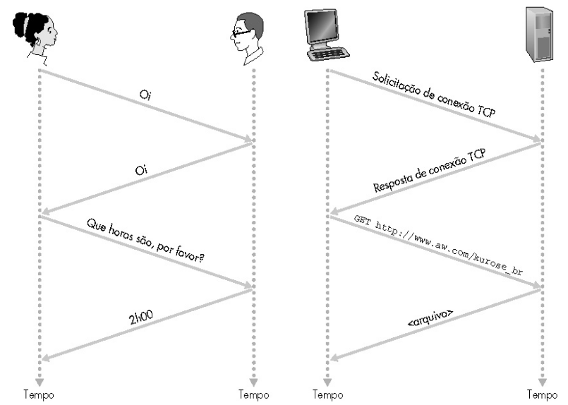
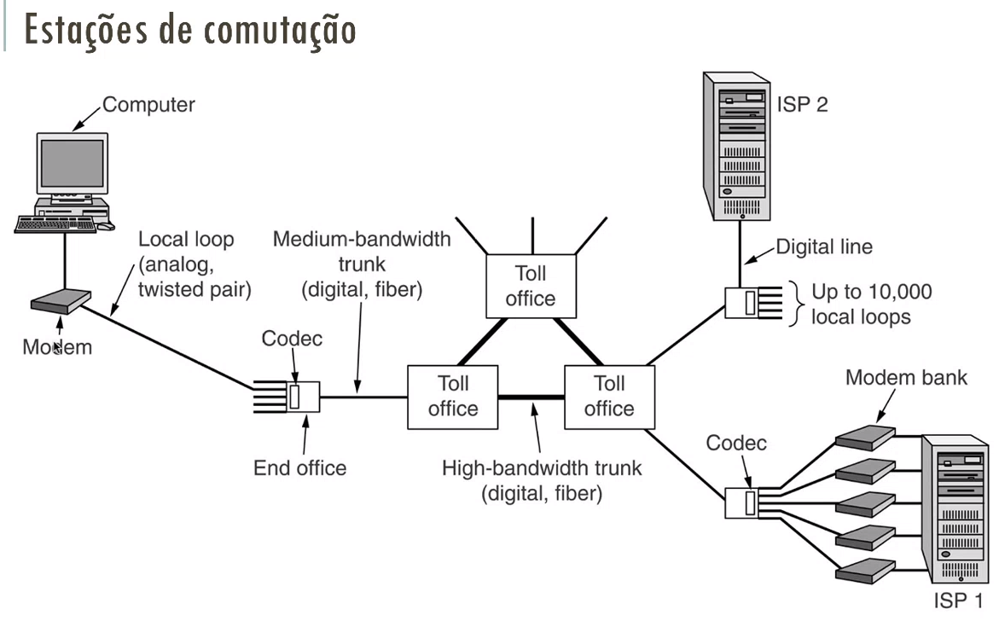
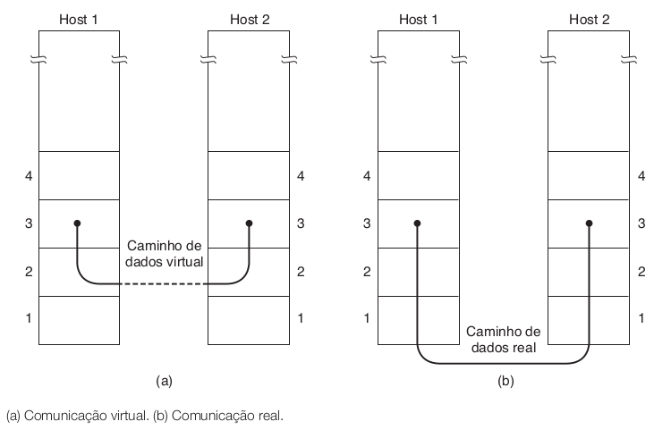
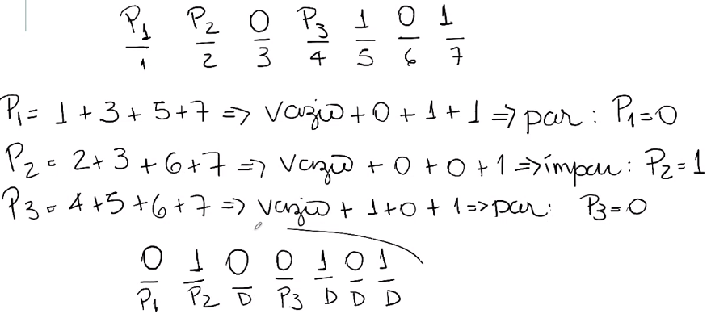

# INTRODUÇÃO

04/08 :watch:

Com a evolução da tecnologia, nós vimos a necessidade de transmitir informações, dados para outros lugares. *Redes: Conjunto de computadores autônomos interconectados por uma única tecnologia.*

**Aplicações comerciais:**

- Compartilhamento de recursos;
- Comércio eletrônico;
- IOT;
- Conectividade.

**Aplicações residenciais:**

- Redes sociais e Entretenimento interativo;
- Conectividade (Alexa...);
- Trocas de mensagens;

## Modelos

### Modelo Cliente-Servidor

Comunicação hierárquica. Servidores com hardware diferenciado e com centralização de serviços. Os clientes fazem solicitações aos servidores, através de requisições pela rede (link pelo navegador...). *Faz uma requisição, e recebe uma resposta (protocolo HTTP).*

### Modelo Peer to Peer

**P2P - Par a Par.** Não existe diferenciação entre clientes e servidores. Comunicação não hierárquica. Os usuários são cliente e servidores, podendo atuar como ambos ao mesmo tempo. *Buscar e enviar um dado ao mesmo tempo.* 

## Tecnologia de Transmissão de Dados

### Redes Ponto a Ponto

Comunicação entre pares de máquinas individuais. Um pacote pode passar por uma ou mais máquinas até atingir o seu objetivo. Existem esquemas de roteamento que escolhe o melhor caminho entre os vários possíveis.


### Redes de Difusão

Ao contrário da rede ponto a ponto, as redes de difusão terão um **único canal** de comunicação compartilhado por todas as máquinas de rede. Mensagens são transmitidos na forma de pequenos pacotes e recebidos por todas as máquinas da rede. Todas as máquinas recebem o pacote, e o processam ou não, dependendo do endereço.

Algoritmo para recebimento de msgs executado por cada máquina:

``` Java
// Computador verifica endereço de destino;
if(endereço no quadro = meu endereço) {
    processa o quadro
} else {
	descarta o quadro	
}
```

- É possível enviar mensagem para todos computadores da rede (mensagem de difusão)
- Permite dois tipos de operação relacionadas ao campo endereço:
  - **Broadcasting** ou difusão - a mensagem é endereçada a todas as máquinas da rede
  - **Multicasting** ou multidifusão - a mensagem é endereçada a um grupo de máquinas da rede

## Escala


> **PAN-Exemplo:** Mouse sem fio; impressora sem fio; Entre outros.

- **Local Area Network (LAN):** Redes privadas. Muito usada para conexão de micros e workstations em escritórios, fábricas e residências. Um cabo único ao qual todas as máquinas se conectam, entre 10 e 100 mbps de velocidade de transmissão e com poucos erros de transmissão.
  - Topologia: Barramento ou Anel.
- **Metropolitan Area Network (MAN)**: Abrangem uma cidade, TV (e Internet) a cabo.
- **Wide Area Network (WAN)**
  - Cobrem grandes áreas geográficas;
  - Possuem uma coleção de máquinas (hosts) que executam aplicações e são conectadas por uma subrede (subnet).
    - Subrede: pertence à operadora, transmite uma mensagem de um host para outro. É composta por linhas de transmissão (circuitos, canais ou troncos ) que movem os bits entre máquinas e elementos de comutação (roteador) que conectam duas ou mais linhas de transmissão.


## Software de rede

>  Essa hierarquia, conjunto de camadas, conjunto de protolos é que chamamos de arquitetura de redes.

### Hierarquia de protocolos

É necessário um *"acordo"* para as camadas, para definir como a comunicação será, e com isso temos os **protocolos**. Ou seja, os protocolos definem os formatos, a ordem das mensagens enviadas e recebidas pelas entidades de rede, e as ações a serem tomadas na transmissão e recepção de mensagens.

> Organização da rede.



#### Arquitetura em camadas

- **Simplificação e independência**: Não interessa a determinada camada como as demais implementam o fornecimento de suas funções e serviços (Modularização).

- **Facilidade de evolução**: Novas funções ou serviços podem ser implementadas em uma camada a partir de serviços já disponíveis nas camadas inferiores.

- **Facilidade de manutenção**: Uma camada pode ser alterada sem alterar as demais, desde que os serviços que ela presta sejam alterados.

#### Questões de projeto das camadas

- **Endereçamento:** meio de identificar, dentre os muitos computadores e processos, aqueles com o qual se quer comunicar.
- **Tipo de canal:** forma de tráfego dos dados na rede.
  - **simplex:** dados trafegam numa única direção (existem dois canais, um para transmissão e outro para recepção - Estilo da fibra ótica);
  - **half-duplex:** tráfego de dados em ambas direções, mas sem simultaneidade;
  - **full-duplex:** tráfego em ambas direções, simultaneamente (feito atravéz de multiplexação).


- **Detecção de erros:** receber aviso de erro e em seguida encontrar este erro.
  - **Método de repetição:** Ao enviar uma mensagem, são enviados três repetições desta mensagem  e, a partir da comparação destas mensagens detecta se há ou não erro. Porém, é sucetível à ruído, então se tivemos um ruído no transmissor a mensagem será enviada de forma errada e não será detectado o erro.
  - 
  - **Método de paridade:** Adiciona-se, pelo transmissor, um bit de redundância (bit de paridade) após ou antes da sequência de bits que pertence à mensagem. Porém, esse método só identifica que há um erro, mas não onde está. O bit adicionado segue a seguinte regra:
    - Caso apareça o bit “1” um número ímpar de vezes é adicionado 1. 
      - Exemplo: 0100101 paridade = 1.
    - Caso apareça o bit “1” número par de vezes é adicionado 0.
      - Exemplo: 010101010010100, paridade = 0.
  - 
  - **Checksum:** Serão utilizados 3 informações aqui, dois frames (conjuntos de bits), e o checksum invertido (soma dos 2 frames, com o resultado invertido). O receptor recebe essas 3 informações, realiza a soma dos dois frames, e soma o resultado com o checksum invertido recebido. Essa soma deve resultar em somente bits 1, se ocorrer algum bit 0, há falha.

- **Correção de erros:** receber informações do erro e fazer sua correção.

- **Garantia de entrega:** Sobre a camada de transporte, temos dois protocolos, TCP e UDP, com duas utilizações diferentes, sendo um confiável e outro não.

> Confiável: Garante a entrega, e em ordem correta dos dados.


- **Controle de fluxo:** Tratar de tráfego de dados. Saber a quantidade de dados que oa transmissor está injetando na rede. Controle do envio de mensagens de um remetente rápido para um destino lento (congestionamento).
- **Roteamento (camada de rede):** Decisão de qual caminho deve ser seguido pelos pacotes.

#### Classificação de transmissão

Conexão

- Protocolo **orientado a conexão**: Existe um canal entre os dois pontos conectados durante toda a comunicação de dados. Ou seja, são feitas solicitações de envio, abertura do canal, confirmações de entrega, etc. Garante sequência, garante que os dados sejam entregues aos destinatários em ordem, e completos. Ex.: Rede de telefonia.
- Protocolo **não orientado a conexão**: Cada mensagem possui o endereço do destinatário e é enviada separadamente. Neste tipo serviço não existe apresentação entre os sistemas finais. Quando um dos lados de uma aplicação quer enviar pacotes ao outro, ela simplesmente os envia, sem especificação do canal. Como não há apresentação os pacotes podem ser remetidos mais rapidamente, mais também não há confirmações de entrega. Ex.: Correio, só envia para o destinatário, e não sabemos nem a rota que será usada para a entrega.

Confiabilidade

- **Confiáveis:** garantem a entrega da mensagem. Utilizam de um sinal enviado pelo receptor, informando que recebeu a mensagem (acknowledge). Introduzem a necessidade de envio de sinais de controle juntamente com a mensagem de atrasos (overheads).
- **Não confiáveis:** não há garantia de entrega da mensagem. Mais rápidos. Sujeitos a erros.


### Serviços e Protocolos

**Serviços (entre camadas adjacentes de uma mesma máquina)**

- Conjunto de primitivas (operações) entre camadas. Um serviço se relaciona a uma interface entre duas camadas em uma mesma máquina, sendo a camada inferior o fornecedor do serviço e a superior o usuário do serviço.

**Protocolos (entre camadas de mesmo nível de máquinas diferentes)**

- Conjunto de regras que controla o formato e o significado dos pacotes ou mensagens que são trocadas pelas entidades pares (peers) contidas em uma mesma camada de máquinas distintas.

#### Modelos de referência

- **Modelo OSI:** Muito utilizado para a descrição das camadas que compõem uma rede, mas quase não utilizam os protocolos a ele associados.
- **Modelo TCP/IP:** Pouco utilizado para estudo do comportamento de uma rede, mas seus protocolos tem larga utilização nas redes atuais.

##### Modelo OSI

*OSI - Open Systems Interconection*

- Constituida de 7 camadas, de forma a que cada uma execute funções bem definidas;
- O propósido desse modelo é informar o que cada camada deve fazer;
- As camadas permitem diferentes níveis de abstração;
- A função desempenhada por uma camada se baseia nos protocolos internacionalmente padronizados;
- Minimização do fluxo de informações entre as camadas.


Camadas:

- **Física:** Essa camada fará todo transporte dos dados (bits) através de um meio de transmissão (cabo par trançado, fibra...).
- **Enlace de dados:**
  - Pega os dados da física e coloca alguns controles (erro e fluxo);
  - Divisão da sequencia de bit vinda da física em quadros (frames) de dados e a definição do inicio e fim de um quadro;
  - Controle do meio: controle de comunicação entre máquinas de uma rede.

- **Rede:**
  - Controlar por qual caminho o pacote vai passar, roteamento da origem ao destino (sendo de P2P);
  - Controle de congestionamento;
  - Conexão entre redes diferentes, roteadores;
  - Não é completamente fim a fim, pois faz pedaço por pedaço.

- **Transporte:**
  - Numeração de dados;
  - Garantia de entrega;
  - Estabelecer conexão, circuitos;
  - Isola os níveis (hardware e software);
  - Fim a fim.

- **Sessão:**
  - Permissão de comunicação entre pares;
  - Controle do sentido de tráfego;
  - Controle de token, impendindo que duas máquinas executem operações críticas ao mesmo tempo;
  - Sincronização para evitar perdas de sessão.

- **Apresentação:**
  - Codificação, sintaxe e semântica → transladar o formato do hospedeiro local para um formato independente de hospedeiro;
  - Tipos de dados abstratos.
  - 

- **Aplicação:**
  - Promove abstrações para o usuário;
  - Protocolos http, email, ftp, www.


##### Modelo TCP/IP


- Entenderam que as camadas de apresentação e sessão poderiam ser juntadas a camada de aplicação;
- Transporte, continuou distinta pelo poder de ser um divisor do modelo (hardware do software), tem os protocolos UDP e TCP como principais;
- Rede foi transformada em internet (inter-redes), vai fazer o roteamento e chaveamento dos pacotes e a viagem desses pacotes por toda a rede (podendo ter rotas diferenciadas);
- Dados e física, foi colocada em uma só (host/rede), pois não à a necessidade de definir nenhum protocolo específico, sendo exigido apenas o recebimento de pacotes IP e transmiti-los.

### Exemplos de tecnologias de rede

**Ethernet (802.3)**

- Padrão de rede LAN em que os hosts estão interligados a um mesmo meio físico (cabo). Protocolo que fala como os dispositivos dentro da LAN se comunicam;
- TCP/IP;
- Segurança e confiabilidade para trocas de informações;
- Curta distancia.

**Internet**

- Provedores de serviços (ISP);
- Ponto de acesso de usuários aos roteadores ISP's (POP);
- Canais nacionais e internacionais de alta velocidade (Backbones);
- Ponto de convergência de backbones de diferentes operadoras (NAP);
- Grupo de servidores que fornecem serviços aos usuários (server farm).

**Frame Relay**

- Transferência de dados de alta qualidade para redes de longa distância;
- Não incorpora nenhum mecanismo para verificar se o quadro de dados chegou corretamente no destino (considera número de erros baixo, devido ao canal digital;
- TCP/IP, responsável pela confirmação do recebimento.

**MPLS (Multi Protocol Label Switching)**

- Protocolo de roteamento baseado em pacotes rotulados: cada rótulo representa um índice na tabela de roteamento do próximo roteador;
- Não tem como objetivo se conectar diretamente a sistemas finais, mas sim de transportar pacotes entre pontos de entrada e saída;
- Longa distância.

**ATM**

- É uma rede que usa célula como unidade básica para troca de dados (rede celular);
- Estabelece um circuito virtual à medida em que o primeiro pacote (célula ATM) passa pelos roteadores da rede e define o caminho que todas as demais células deverão percorrer;
- Orientado a conexão e não confiável (garante sequência mas não garante entrega).

**Rede de telefonia móvel**

- Composta por células e MSC;

- Célula:

  - Cobre região geográfica
  - Estação base (BS) semelhante a 802.11 AP

  - Usuários moveis que se conectam à rede por BS

  - Interface-ar, protocolo da camada física e enlace entre a estação móvel e BS

- MSC

  - Conecta células à rede remota

  - Gerencia conf, chamada (adiante!)

  - Trata da mobilidade (adiante!)

Outros exemplos:

- Wifi
- Bluetooth
- RFID

---

# CAMADA FÍSICA

11/08 :watch:

*Essa camada fará todo transporte dos dados através de um meio de transmissão (cabo par trançado, fibra...).*

Geralmente os dados, inicialmente, não estão em um forma possível de transporte, então é necessário fazer esse tratamento/transformação. Transformar em sinais eletromagnéticos.

## FUNDAMENTOS DE COMUNICAÇÃO

Os dados podem ser uma das duas seguintes formas:

- Analógicos: Forma contínua de ter essa informação. Apresentando um nº infinitamente grande de níveis de intensidade em um intervalo de tempo, ou seja, entre A e B pode assumir um nº infinito de valores;
- Digitais: Assumem valores discretos, ou seja, valores específicos, um nº limitado de valores definidos (geralmente em binário, 0 e 1).

Tanto um sinal analógico quanto digital, pode assumir uma de duas formas:

- Periódico: Tem um padrão que se repete dentro de um intervalo de tempo, e repete esse padrão nos intervalos posteriores.
- Aperiódico: Não tem padrão ou ciclo que se repete ao longo do tempo.

> Obs: Um ciclo é definido como um padrão da onde dentro de um intervalo de tempo (T). Exemplo: O sinal passa de positivo para negativo, e chega volta para o positivo.
>
> 

### SINAIS ANALÓGICOS

Sinais analógicos **periódicos** podem ser classificados como: **simples ou compostos**. 

A onda simples é a forma mais fundamental (base) de um sinal analógico periódico (não pode ser decomposto em sinais ainda mais básicos). E o sinal analógico periódico composto é a combinação de diversas ondas senoidais.

#### SINAIS SIMPLES (ONDA SENOIDAL)

> Aplicações: Envio de energia elétrica de um lugar para outro. Sensores de portão, gravação de som e imagem, como em disco de vinil e fita cassete, entre outros. Não são muitos casos.

Uma onda senoidal pode ser representada por 3 parâmetros:

- **Amplitude de pico (máx)**: corresponde ao valor absoluto de sua intensidade mais elevada. É proporcional à energia que o sinal transporta (topo e fundo da onda).

- **Frequência**: medida em Hertz (Hz), refere-se ao nº de períodos em 1 segundo.

  - Período: quantidade de tempo (seg.) que um sinal leva para completar um ciclo.

  - F = 1/T e T = 1/F (Frequência é o inverso do período)

  - Como a frequência é a taxa de mudança em relação ao tempo, uma mudança em curto espaço de tempo significa alta frequência. E mudanças ao longo de espaço de tempo prolongado significa baixa frequência.

    

- **Fase**: descreve a posição da forma de onda em relação ao instante de tempo 0. Medida em graus ou radianos (360º corresponde a 2π radianos). Vai nos dizer o estado do início do 1º ciclo da onda em um intervalo de tempo (a quantidade de deslocamento). Exemplo: Podemos dizer que ela está defasada em 90º, ou em 180º, e por ai vai.


- **Comprimento da onda (λ)**: corresponde à distância que um sinal simples pode viajar em um período. Depende tanto da frequência, quanto do meio em que está sendo propagado. *Existe em qualquer tipo de sinal.*
  - **λ = c / f** = **c x T**
  - c: velocidade de propagação (velocidade da luz)
  - f: frequência

##### DOMÍNIOS DO TEMPO E DA FREQUÊNCIA

Como trabalhar com as duas grandezas, tempo e frequência, ou seja, podemos representar nossa onda de duas formas, nesses dois domínios diferentes.

> Note: No domínio do tempo consigo visualizar cada ciclo. No domínio da frequência a representação é mais simples, e mais fácil de representar várias ondas senoidais de uma vez.


#### SINAIS COMPOSTOS

> Aplicações: É mais comum que as ondas simples para a transmissão de dados.

É uma combinação de ondas senoidais simples com diferentes frequências, amplitudes e fases.

Diferente dos sinais simples, o composto pode ser **periódico ou aperiódico**.

- **Periódico**: A decomposição desse sinal fornece uma série de sinais com frequências discretas;
- **Aperiódico**: A decomposição fornece uma combinação de um nº infinito de ondas senoidais com frequências contínuas. Ou seja, se eu não tenho padrão, posso ter um nº infinito de ondas com frequência contínua.


> Note: 3f significa que essa onda tem 3x a **frequência fundamental** (ou 1ª harmônica), sendo ela f. Ela é chamada de 3ª harmônica.

##### LARGURA DE BANDA

A largura de banda de um sinal composto é a diferença entre a maior e a menor frequência contida nesse sinal. Ou sjea, refere-se à quantidade de dados que podem ser transmitidos em um período de tempo fixo.


A diferença é que em um sinal periódico temos todas as frequências definidas, e no aperiódico temos as frequências contínuas.

### SINAIS DIGITAIS

Valores discretos.

- *Um bit 1 pode ser codificado como uma tensão positiva e um bit 0 como tensão nula.* 
- *Um sinal digital pode ter mais de dois níveis: enviar mais de 1 bit com cada nível.*

Agora não iremos falar mais sobre taxa de frequência para descrever esse sinal, e sim **taxa de transferência** (ou taxa de bits). A taxa de bits corresponde ao nº de bits enviados em **1s**, expressado em bits por segundo **(bps)**.

> Exemplo: considere que precisamos receber documentos de texto a uma taxa de 100 páginas por segundo. Qual é a taxa de bits necessária para o canal? Uma página tem em média 24 linhas com 80 caracteres em cada uma. Se considerarmos que um caractere requer 8 bits, a taxa de bits será:
>
> 100 x 24 x 80 x 8 = 1.536.00 bps = 1.536 Mbps

- **Comprimento de Bits:** é a distância que um bit ocupa no meio de transmissão.
  - Comprimento = velocidade de propagação * duração dos bits.

#### ANÁLISE DE FOURIER

De acordo com a análise de Fourier, um sinal digital corresponde a um **sinal analógico composto**, e podemos usá-la para decompor qualquer sinal digital em suas harmônicas.

- Se o sinal for periódico a representação do sinal decomposto no domínio da frequência apresenta frequências **discretas**;
- Se for aperiódico, o sinal decomposto apresenta frequências **contínuas**.

### TRANSMISSÃO DE SINAIS DIGITAIS

Como podemos transmitir um sinal digital de um ponto A para um ponto B? Podemos utilizar uma das duas abordagens: transmissão banda-base ou banda larga (usando modulação). 

#### TRANSMISSÃO EM BANDA BASE

A transmissão de um sinal digital em banda base nada mais é que o envio desse sinal por um canal sem transformar o sinal digital em analógico, ou seja, ele é injetado no canal sem mudança nenhuma.

Essa transmissão requer um canal **passa-baixa**, um canal com uma banda que se inicie em zero. Toda a largura de banda do cabo é utilizada por um **único sinal** Ex.: Toda a largura de banda de um cabo que conecta dois computadores corresponde a um único canal, ou seja, um meio **dedicado** cuja largura de banda seja usada por um único canal.


#### TRANSMISSÃO EM BANDA LARGA

Há modulação do sinal, ou seja, o sinal digital é transformado em sinal analógico para a transmissão. Por esse motivo permite usar um canal **passa-faixa**, um canal com uma banda que não se inicia em zero (isso limita a frequência). Porém, é possível transmitir **múltiplos sinais** em múltiplas frequências simultâneamente usando um único canal.

Ex.: Aqueles pacotes de internet, banda larga com fibra ótica, ou seja, é feita essa modulação do sinal, e de forma simultânea e unidirecional, vários sinais podem ser enviados em um único canal. 

> **Modulação:** processo de conversão entre bits e sinais que os representam é chamado modulação digital.


## PERDA DE TRANSMISSÃO

Esses meios de transmissão não são perfeitos, logo podemos ter algumas perdas ao longo da transmissão dos dados, ou seja, *o que sai, não é o que chega*.

### ATENUAÇÃO

Com atenuação nos referimos à **perda de energia**, ou seja, parte da energia é usada para superar a resistência do meio, seja elétrica, refração de luz... Isso é evidênte na amplitude da onda que diminui.

- Amplificadores são usados para aumentar o sinal (equipamento eletrônico). Ex.: Repetidores, amplificadores dentro dos roteadores, entre outros.

Para mostrar que um sinal ganhou ou perdeu força, usa-se o decibel (dB) - unidade que mede as forças relativas de dois sinais, ou de um mesmo sinal em dois pontos diferentes.

- O decibel é negativo se o sinal for atenuado, e positivo se o sinal for amplificado.
  - dB = 10 log10 (P2 / P1)
  - P1 e P2 correspondem à potência de um sinal nos pontos 1 e 2.

### DISTORÇÃO 

Refere-se quando um sinal chega ao seu ponto de destino em seu formato distorcido, diferente. Ou seja, um sinal composto, por exemplo, cada harmônico que o compõe tem uma frequência diferente, consequêntemente uma velocidade de propagação diferente, logo se temos algum problema no meio de transmissão, algum retardo, cada harmônico pode chegar mais rápido ou mais devagar no destido (um retardo diferente para cada fase). Ao chegar no destino, o sinal composto fica distorcido, não é o mesmo sinal que foi enviado.

### RUÍDO

Temos vários tipos de ruídos, basicamente é a inserção de dado no nosso sinal por alguma interferência ou algo do tipo. 

Tipos:

- O ruído térmico é a movimentação aleatória
  de elétrons em um fio que cria um sinal extra que não foi originalmente enviado pelo transmis-
  sor. 
- O ruído induzido (mais comum) provém de fontes como motores e aparelhos elétricos. Esses dispositivos
  atuam como uma antena transmissora e o meio de transmissão como antena receptora. 
- Linha cruzada é o efeito de um fio sobre o outro. Um fio atua como uma antena transmissora e o outro, como uma antena receptora. 
- O ruído por impulso é um pico (um sinal com grande energia em um curtíssimo espaço de tempo) proveniente de cabos de força, relâmpagos e assim por diante.

#### RELAÇÃO SINAL X RUÍDO

*Signal-to-noise.* Para descobrir o **limite teórico da taxa de transferência**, precisamos conhecer a relação entre a potência do sinal e a potência do ruído.

- SNR = Potência média do sinal / Potência média do ruído

> Precisamos considerar a potência média do sinal e a potência média do ruído, pois estas
> podem mudar com o tempo.

SNR é, na verdade, a razão daquilo que é desejado (sinal) por aquilo que não é desejado (ruído). Um SNR alto significa que o sinal é menos afetado pelo ruído; um SNR baixo significa que o sinal é mais prejudicado pelo ruído. Ou seja, se a potência média do sinal for maior que a do ruído, o sinal será menos prejudicado que um cenário cuja potência do ruído é mais que a do sinal.

16/08 :watch:

## MEIOS DE TRANSMISSÃO

Um meio de transmissão, em termos gerais, pode ser definido como qualquer coisa capaz de transportar informações de uma origem a um destino. Para a comunicação de dados, podemos dividir em duas amplas categorias: 

- **Meios guiados:** São aqueles que requerem um condutor físico para interligar um dispositivo a outro. Ex.: cabo de par trançado, cabo coaxial e cabo de fibra óptica. Um sinal trafegando por qualquer um desses meios é **direcionado** e contido por **limites físicos do meio**. Cabos de par trançado e coaxiais usam condutores metálicos (cobre) que aceitam e transportam sinais na forma de corrente elétrica. A fibra óptica é um cabo que aceita e tansporta sinais na forma de luz (refração).
- **Meios não guiados:** Transportam ondas eletromagnéticas sem o uso de um condutor físico. Esse tipo de comunicação é, muitas vezes, conhecido como comunicação sem fio. Os sinais são normalmente transmitidos pelo espaço livre e, portanto, ficam disponíveis a qualquer um que tenha um dispositivo capaz de recebê-los.

### CABO PAR TRANÇADO

Famoso cabo de rede :smile:

*Barato, mas utilizado para distâncias curtas, até 100 metros (se quiser mais usa fibra).*

Tipos:

- UTP (Unshielded Twisted Pair - Par trançado sem blindagem)
  - Geralmente o mais utilizado (nas nossas casas, empresas caseiras...)
- STP (- Par trançado blindado)
  - Blindagem simples, uma malha metálica (Gaiola de Faraday).
- FTP ()
  - Proteção extra, além de estar no cabo, ele tem a malha para cada cabo.
- SSTP
  - Além de ter a proteção em cada par, tem um cabo para o aterramento.

Categorias:

[PEGAR LINK SOBRE.... Não é necessário decorar!]

Conectores:

RJ45....

### FIBRA ÓTICA

Um cabo muito mais interessante atualmente, consegue velocidades muito mais altas. Trabalha com a refração da luz.

Tipos:

- Fibra ótima multimodo de índice degrau
- Fibra ótima multimodo de índice gradual
- Fibra ótima monomodo

Janelas de transmissão:

Sofre dopagem para diminuir a atenuação.

Vantagens da fibra:

- Largura de banda gigantesca. Não há limite para o meio e sim para a tecnologia de geração e recepção de sinais;
- Atenuação: Baixíssima atenuação;
- Imunidade à interferência eletromagnética (Não estamos usando nenhum tipo de eletricidade);
- Resistência à corrosão dos materiais (corrosão no vidro é praticamente nula);
- Peso.

Desvantagens da fibra:

- Instalação/Manutenção:
- Unidirecional:
- Custo:

Transmissores:

Transformar os sinais em luz com Laser ou LED....


### CABO COAXIAL

Era o cabo mais utilizado em redes locais no passado.

Sofre menos interferência eletromagnética, porém pela velocidade (máx de 10 Mbps), necessidade de muito repetidor (a cada 185m), e outros motivos entrou quase em desuso.

> Frequência máxima de transmissão de 10 MHz.

### REDE DE TELEFONIA

> [Página 86 da 5ª edição do livro Redes de Computadores by Andrew S. Tanenbaum]

Em 1876 sugiu o 1º telefone, puramente analogico (sinais analógicos para a transmissão da voz). Os telefones eram vendidos em par e era necessário conectar fisicamente os dois, ou seja, se o proprietário de um telefone quisesse usar o aparelho para conversar com n outros proprietários de telefone, tinha de conectar fios em todas as n residências. Funcionavam manualmente, ou seja, o residente girava uma manivela, que emitia um som na companhia telefônica, e o operador conectava manualmente o emissor da chamada com o receptor.

Com o passar do tempo surgiu a necessidade de transferir dados além da voz, porém utilizando a mesma estrutura já em uso da rede de telefonia (circuitos terminais). Essa estrutura é limitada ao canal de rede que era utilizada para transmissão de voz, mas grande parte já foi atualizada para tecnologias de banda larga, como ADSL.

[Pag 90 - Tanenbaum]



Baseada em circuitos virtuais (abre e fecha canal).

>  Para transmitir dados além da voz (dados) foi preciso avançar na tecnologia (mesclagem de dados analógicos e digitais).

Cabo par trançado ligando o telefone à central telefonica (central local).

Tronco geralmente é fibra.

Hierarquias:

[COMPLETAR>>>>>>>>>>>>>>>>>>]

Estações de comutação:

[FOTO]

Problemas:

Atenuação..........

[Aqui falava sobre a multiplexação]

### ADSL

Linha digital do assinante assimétrica.

- Modens chegaram na transmissão máx, mesmo com multiplexação;
- Velocidade mais alta;
- Retirar o filtro padrão e substituir por um switch, permitindo assim que toda a largura de banda do cabo possa ser utilizada;
- Permite a transmissão de mais de 56 Kbps, que era o cenário atual;

> Utilizamos mais canais no download que no upload (depende do provedor, pode ser personalizado). Por isso que é Assimétrico.


16/08 e 18/08 :watch:

### TV A CABO

Ler parte do livro!!!

Surgiu pela necessidade de transmitir os sinais para pessoas que moram em locais montanhosos.


> Note: CATV usava coaxial de cabo à rabo. Por causa da atenuação, ter que usar muito amplificador... era tudo feito direcionalmente, sai da estação e vai para a casa do cliente. Porém com o avanço veio o Hybrid fiber - coaxial (trabalha tanto com fibra, quanto com coaxial).
>
> Utilização da rede de tv e telefonia para internet...
>
> Note: Para deixar o circuito oferecendo internet !!!!!!!!!!!!!!!!!!!!!!!!!!!!!!!!!!!!!!!!!!!!!!!!!!!!!!!!!!!!!!!!!!!!!!!!!!!!!!!!!!!!!!!!!!!!!!!!!!! (coaxial tem largura pequena de banda....)
>
> - Cable Modem (CM) (instalado na residência): 
> - Cable Modem Termination System (CMTS) (instalado no provedor): 

Internet a cabo:


---

## UTILIZAÇÃO DA LARGURA DE BANDA

23/08 :watch:

Precisamos fazer o uso racional e eficiênte, sem desperdício, da banda para alcançar nossos objetivos. A eficiência pode ser atingida pela multiplexação, e a privacidade e a imunidade a interferências podem ser obtidas pelo espalhamento. Veremos os dois tópicos a seguir.

### MULTIPLEXAÇÃO

Transportar mais de um sinal ao mesmo tempo (em paralelo). É o conjunto de técnicas que permite a transmissão simultânea de vários sinais por meio de um único link (meio físico) de dados, ou seja, aproveitando ainda mais a largura de banda. Ou seja, há uma divisão em "linhas" desse link, cada linha um sinal. Ex.: Full-duplex.


#### MULTIPLEXAÇÃO POR DIVISÃO DE FREQUÊNCIA - (FDM)

Basicamente pega os sinais de original e combina eles em um sinal composto para ser transmitido no meio. Lembrando que a quantidade de sinais é limitada pela largura de banda do link.


Em outras palavras: dá um pedacinho da faixa de frequência (largura da banda) para cada canal.

>  Podemos usar a técnica para a entrada de sinais digitais também, só transformar em analógico.

##### APLICAÇÕES FDM

- Transmissão de rádio AM e FM;
- Transmissão televisiva;
- Primeira geração de telefones celulares.

#### MULTIPLEXAÇÃO POR DIVISÃO DE COMPRIMENTO DE ONDA - (WDM)

É uma técnica de multiplexação analógica para combinar sinais ópticos. *Criado para ser usado na fibra ótica.* Ou seja, a ideia é a mesma da FDM, combinar os sinais, porém agora vamos combinar **sinais ópticos** (faixas de luz, e de **alta frequência.**) que vão constituir uma faixa mais larga. 


**APLICAÇÕES**

- Rede Sonet.

#### MULTIPLEXAÇÃO POR DIVISÃO DE TEMPO - (TDM)

É uma técnica de multiplexação **digital** que combina vários canais de baixa taxa de transmissão em um único canal de alta taxa. Ou seja, é a mesma ideia de antes, várias conexões compartilhando o mesmo link. É TIPO round-robin, pois vai fazendo uma rotação do uso das partições de cada conexão. 


> Podemos usar a mesma técnica para transmissão de sinais analógicos, basta converter.

Podemos dividir o TDM em dois tipos: síncrono e estatístico:

##### TDM SÍNCRONO

Nesse tipo, cada conexão, cada fluxo de dados é dividido em unidades menores, que ocuparão o que chamamos de **time-slots**. Após isso, agrupamos um time-slot de cada fluxo em um **frame**, e de forma síncrona, os frames são transmitidos.


- Em uma transmissão com n conexões de entrada (n partições), eu terei n time-slots.
- No TDM síncrono, a taxa de dados do link é n vezes mais rápida e aduração da unidade é n vezes mais curta.

Porém, a implementação não é tão simples quanto a de um sinal analógico, pois precisamos ter uma exata sincronização de **tempo** na transferência dos frames. Ou seja, se os frames não estiverem sincronizados, podemos mandar informação errada. Para isso é inserido um bit em cada frame para controlar o padrão de sincronização, e assim é transmitido frame a frame de forma sincronizada.


##### MULTIPLEXAÇÃO ESTATÍSTICA

No TDM estatístico, slots são alocados **dinamicamente** para aumentar a eficiência da largura de banda. O nº de slots em cada frame é menor que o nº de linhas de entrada. Então o multiplexador só vai alocar a linha para a transmissão dos dados, quando houver dados a serem transmitidos naquela linha, caso contrário, pula para a próxima.

##### SÍNCRONO VS ESTATÍSTICO

Além da alocação dos slots, outra grande diferença entre essas duas formas é o endereçamento deles, ou seja, no síncrono só é enviado o bit de sincronização, e o estatístico é necessário enviar o endereço do slot (a linha à qual ele pertence).


### ESPALHAMENTO ESPECTRAL

SS - Spread Spectrum: combinamos sinais de diferentes fontes para se encaixarem em uma largura de banda de maior capacidade. *Compartilhamento do meio.* 

Utilizado em aplicações wireless (sem fio) Para ambientes de redes LANs e WANs.

Vou espalhar o espectro, espalhar as frequências gerando uma sequência de números que parecem aleatórios, mas tem um padrão (pseudo-aleatório). De forma que cada sinal esteja seguro, encapsulado. 

Podemos fazer isso de duas formas: Saltos de frequência ou Sequência direta.

- **Saltos de frequência:** Alternância entre as portadoras, que por sua vez tem frequências diferentes. Por esse motivo irão ter códigos de espalhamento diferentes, gerando códigos pseudo-aleatório.

---

# CAMADA DE ENLACE

25/08 :watch:

> Links úteis: [Vídeo1](https://www.youtube.com/watch?v=myzFccYMoI8)

A camada de enlace de dados usa os serviços da camada física para enviar e receber bits pelos canais de comunicação. Em outras palavras: Presta serviço para camada de rede, traduz as informações da camada de rede em bits para que então sejam enviadas pela camada física. 

Basicamente provê comunicação eficiente e confiável de frames (quadros - Unidade de informação) entre dois nós adjacentes.

A camada de enlace pode ser sub dividida em duas subcamadas, sendo elas: Controle de enlace de dados (LLC) e Controle de acesso múltiplo (MAC).

Ela tem diversas funções, entre as quais:

- **Encapsulamento - Enquadramento** - Fornecer uma interface de serviço bem definida à camada de rede;
- **Controle de Fluxo** - Regular o fluxo de dados de tal forma que receptores lentos não sejam atropelados por transmissores rápidos. Ou seja, compatibilizar taxas de produção e consumo de quadros;
- **Controle de Erros** - Lidar com erros de transmissão causados por atenuação do sinal e por ruído - Detecção e Correção;
- **Endereçamento** (Físico - MAC).
- **Controle de acesso ao meio**: como as máquinas vão acessar. Mas isso será tratado na **sub-camada de acesso ao meio** (sub-camada dessa).

> Resumindo é o **controle do próprio enlace**.

Além desses serviços, ela provê: 

- Entrega confiável;
- Transmissão:
  - half-duplex: Um nó **não pode** transmitir e receber pacotes ao mesmo tempo;
  - full-duplex: Um nó **pode** transmitir e receber pacotes ao mesmo tempo.

*Protocolos de camada de enlace são responsáveis por oferecer tais serviços!*

Para oferecer serviços, os protocolos devem considerar os tipos de canais de comunicação (enlace):

- **Canal ponto-a-ponto:** Uma estação em cada extremidade. Requer controle simples de acesso, pois a transmissão é mais simples. Ex.: Redes de acesso domiciliares e redes entre roteadores.
- **Canal de difusão (bradcast):** Várias estações conectadas ao mesmo canal. Requer controle de acesso ao meio para coordenar as transmissões. Ex.: Rede sem-fio, todas as máquinas juntas no enlace, que no caso é o ar.

## COMO FUNCIONA

Para alcançar esses objetivos, a camada de enlace de dados recebe os pacotes da camada de rede e os encapsula em quadros para transmissão. Cada quadro contém um cabeçalho (header) de quadro, um campo de carga útil, que conterá o pacote, e um final (trailer) de quadro.

A grosso modo funciona como uma interface da camada física para a parte lógica do modelo. Ao mesmo tempo que pega as informações vindas das camadas superiores e transforma em algo coerente para ser transportado pelo meio físico, ela também pega os bits e transforma em informação (os frames).


> - Quadros encapsulam datagramas da camada de rede;
> - Nós adjacentes: Nós conectados fisicamente por um **canal de comunicação**, também chamado de enlace.
>   - Enlace entrega bits ao destinatário na mesma ordem de envio (pode ser com fio ou sem fio).

## SERVIÇOS

A função da camada de enlace de dados é fornecer serviços à camada de rede. O principal serviço é **transferir dados** da camada de rede da máquina de origem para a camada de rede da máquina de destino. Na camada de rede da máquina de origem há uma entidade, chamada processo, que entrega alguns bits à camada de enlace de dados para transmissão ao destino.



A camada de enlace de dados pode ser projetada de modo a oferecer diversos serviços. Os serviços reais oferecidos podem variar de um protocolo para outro. Três possibilidades razoáveis que consideraremos são:

- **Serviço não orientado a conexão (sem confirmação)**
  - O serviço não orientado a conexões sem confirmação consiste em fazer a máquina de origem enviar quadros independentes à máquina de destino, sem que esta confirme o recebimento desses quadros. Sem estabelecimento prévio de uma conexão antes da transmissão;
  - Se um frame for perdido, nada é feito para recuperá-lo;
  - Aproprado onde a taxa de erro é muito pequena, deixando a tarefa de recuperação de erros para as camadas superiores.
  - Encontrado na maioria das LANs, Ethernet, e em sistemas de tempo real e de voz, no qual os dados atrasados causam mais problemas que os dados recebidos com falhas.
- **Serviço não orientado a conexão (com confirmação)**
  - Quando esse serviço é oferecido, ainda não há conexões lógicas sendo usadas, mas cada quadro enviado é confirmado individualmente. Dessa forma, o transmissor sabe se um quadro chegou corretamente ou não.
  - Caso não tenha chegado dentro de um intervalo específico, o quadro poderá ser enviado outra vez.
  - Esse serviço é útil em canais **não confiáveis**, como os sistemas sem fio. O padrão 802.11 (WiFi) é um bom exemplo dessa classe de serviço.

> Talvez valha a pena destacar que oferecer recursos de confirmação no nível da camada de enlace de dados é uma questão de otimização, nunca uma exigência. A camada de rede sempre pode fazer esse papel de esperar a confirmação, e se for o caso realizar a retentativa. Porém, a camada de enlace tem todos os protocolos de controle de fluxo e erros, logo é mais eficaz, confiável e otimizado. 

- **Serviço com conexão**
  - O serviço mais sofisticado que a camada de enlace de dados é capaz de oferecer à camada de rede. Com ele, as máquinas de origem e destino **estabelecem uma conexão** entre elas antes da transmissão dos dados. 
  - Cada quadro enviado pela conexão é **numerado**, e a camada de enlace de dados garante que cada quadro será, de fato, recebido. Além disso, essa camada **garante** que todos os quadros serão **recebidos uma única vez e na ordem correta**. Assim, os serviços orientados a conexões fornecem aos processos da camada de rede o equivalente a um **fluxo de bits confiável.**
  - Se o serviço não orientado a conexões com confirmação fosse usado, é possível imaginar que as confirmações perdidas poderiam fazer com que um quadro fosse enviado e recebido várias vezes, desperdiçando largura de banda.
  - Ex.: Isso é apropriado para enlaces longos, não confiáveis, como um canal de satélite ou um circuito telefônico interurbano.

Os serviços da camada de enlace se resumem em seus objetivos listados no início do tópico, sendo eles: Controle de fluxo; Detecção e correção de erros; Half-duplex e full-duplex; Controle de acesso ao meio; Enquadramento; Entrega confiável entre nós adjacentes (similar aos mecanismos da camada de transporte. Pouco usada em canais com baixa taxa de erros, como fibra. E muito usada em canais sem-fio, cuja taxa de erros é alta).

## ENQUADRAMENTO

Basicamente é o processo de encapsulamento explicado no último tópico. Logo também delimita onde começa e onde termina um quadro. 

O serviço provido pela camada física não garante que o fluxo de bits seja livre de erros, logo podemos ter dados recebidos com valores de bits diferentes do que foram enviados, ou até em um número menor ou maior do que foi originalmente enviado. Logo, para fazer toda a detecção e, se necessário, a  correção de erros a camada de enlace divide os dados em frames para aplicar os algoritmos que farão esse trabalho posteriormente (verificação de erros por quadro).

É nessa camada que o checksum geralmente é utilizado.

### MÉTODOS PARA A MARCAÇÃO DE INÍCIO E FIM

A divisão do fluxo de bits em quadros é mais difícil do que parece à primeira vista. Um bom projeto deve tornar fácil para um receptor encontrar o início de novos quadros enquanto usa pouca largura de banda. Alguns métodos para essa marcação são:

- Contagem de caracteres;
- Inserção de bytes de flags;
- Inserção de flags no início e no final do quadro.

#### CONTAGEM DE CARACTERES

O primeiro método de enquadramento utiliza um campo no cabeçalho para especificar o número de bytes no quadro. Quando vê a contagem de caracteres, a camada de enlace de dados de destino sabe quantos bytes devem vir em seguida e, consequentemente, onde está o fim do quadro.

O problema com esse algoritmo é que a contagem pode ser adulterada por um erro de transmissão. Por exemplo, se a contagem 5 no segundo quadro da Figura se tornar 7, em virtude da inversão de um único bit, o destino perderá a sincronização e não será capaz de localizar o início do quadro seguinte. Mesmo que o checksum esteja incorreto, de modo que o destino saiba que o quadro está defeituoso, ele ainda não terá informações suficientes para saber onde começa o quadro seguinte. Enviar um quadro de volta à origem solicitando retransmissão também não ajuda, pois o destino não sabe quantos caracteres deverão ser ignorados para chegar ao início da retransmissão. **Por essa razão, o método de contagem de caracteres quase não é mais usado.**


#### INSERÇÃO DE BYTES DE FLAGS

contorna o problema de ressincronização após um erro, fazendo cada quadro começar e terminar com bytes especiais. Normalmente o mesmo byte, chamado byte de flag, é usado como delimitador de início e de fim, como mostra a Figura, na qual ele é representado por FLAG. 

Dois bytes de flag consecutivos indicam o fim de um quadro e o início do próximo. Assim, se o receptor perder a sincronização, ele poderá simplesmente procurar dois bytes de flag para encontrar ofinal do quadro atual e o início do seguinte.


Porém ainda existe um problema, é possível que o byte de flag venha nos dados, no payload, especialemente quando são transmitidos dados binários, como fotografias ou músicas.

Uma forma de solucionar esse problema é fazer com que a camada de enlace de dados do transmissor inclua um caractere de escape especial (ESC) imediatamente antes de cada byte de flag “acidental” nos dados. Assim, o byte de flag de enquadramento pode ser distinguido daquele nos dados pela ausência ou presença de um byte de escape antes dele. A camada de enlace de dados na extremidade receptora remove o byte de escape antes de entregar os dados à camada de rede (Técnica chamada de inserção de octetos ou inserção de caracteres - Usada no protocolo PPP).


#### INSERÇÃO DE FLAGS NO INÍCIO E FIM DO FRAME

Similar à inserção de caracteres. Contorna uma desvantagem do último método, que ao invés de inserir um byte inteiro o transmissor irá inserir um único bit (bit de escape) depois de uma sequência determinada de bits, e o receptor retira esse bit após as mesmas sequências. *Isso faz ter uma densidade mínica de transições, o que ajuda a camada física a manter a sincronização.* Ex.: A cada 5 bits "1" será inserido 1 bit "0".


Porém, esse modelo também tem um efeito colateral, é que o comprimento de um frame agora depende exclusivamente do conteúdo dos dados que ele carrega. Ou seja, se entre meus dados à serem transportados só possuir bits que formem a sequência, logo teremos um grande e único frame para ser transportado. Por outro lado, se só possuir bits de escape, logo teremos que utilizar mais da nossa banda, pois teremos vários bits inseridos para delimitar os frames.

## CONTROLE DE FLUXO

Um dos principais papeis dessa camada. Controla a quantidade de informação que pode ser enviado, ou seja, não permite que a fonte envie frames numa taxa maior que a capacidade de recepção do destino.

Estabelecer um protocolo em que o receptor habilite a fonte a enviar um nº definito de mensagens e aguardar a próxima liberação de envio.

## CONTROLE DE ERROS

Após resolvermos o problema da delimitação do início e do fim de cada quadro, vamos ao problema seguinte: como ter certeza de que todos os quadros serão entregues na camada de rede de destino e na ordem apropriada?

A garantia de entrega confiável é utilizada nos serviços **orientados à conexão**, pois nos serviços não orientado e sem confirmação, os quadros simplesmente podem continuar a serem enviados sem se preocupar se estão chegando corretamente.

A forma mais comum de garantir uma entrega confiável é dar ao transmissor algum tipo de **feedback** sobre o que está acontecendo no outro extremo da linha. Normalmente, o protocolo solicita que o receptor retorne **frames especiais de controle** com confirmações positivas ou negativas sobre os quadros recebidos. Se receber uma confirmação positiva sobre um quadro, o transmissor saberá que o
quadro chegou em segurança ao destino. Por outro lado, uma confirmação negativa significa que algo saiu errado e o quadro deve ser retransmitido.

Também é usado **timers**, ou seja, tem a possibilidade de um frame se perder por completo, logo quando o transmissor envia um quadro, ele inicializa um timer. Se a confirmação vier antes do final desse timer, então :+1:, se não, o timer é desativado, alertando o transmissor do problema.

Nesse caso podemos simplesmente reenviar o frame, mas ai caimos em um outro problema, que é o receptor poder aceitar o mesmo quadro várias vezes. Para evitar que isso aconteça, geralmente é preciso atribuir **números de sequência** aos quadros transmitidos, de modo que o receptor possa distinguir as retransmissões dos originais (**Controle da recepção de quadros repetidos**).


Erros de transmissão são muito comuns, principalmente em um **tráfego em rajadas**, que são muitos dados transmitidos em um curto período de tempo, o que volta até ao problema de controle de fluxo, na qual o receptor não suporta a carga.

Por outro lado erros nesse tipo de tráfego é mais fácil de detectar, pois temos MUITA informação em um curto período de tempo, uma grande quantidade de bits. Em compensação são mais difíceis de corrigir que um erro isolado.


### CÓDIGOS DE DETECÇÃO vs CORREÇÃO DE ERROS

Temos código de detecção de erros e códigos de correção de erros.

- Detecção
  - **Menor redundância**, pois só queremos detectar se tem erro. Ou seja, a carga de bits transmitidos é menor, pois não precisamos identificar o local do erro, os bits errados;
  - Usados em **canais confiáveis**, com baixas taxas de erro. Ex.: Fibra.
  - Se houver erro, a origem deve retransmitir o quadro, pois a chance de dar erro de novo é pequena.
- Correção
  - **Grande redundância** dos dados, suficiente para que o destino consiga corrigir os erros.
  - Usados em canais **não confiáveis**, que geram muitos erros de transmissão. Ex.: Enlace sem fio.
  - Se houver erro, o destino deve corrigir o quadro, uma vez que a retransmissão poderá gerar novos erros durante o reenvio, e até gerar um congestionamento na rede.

06/09 :watch:

### CORREÇÃO

#### DISTÂNCIA DE HAMMING

A partir do dado (geralmente um byte) à ser transmitido, iremos inserir o código de hamming (bits de paridade) para gerar a "palavra código" que será os bits de dados + os bits de paridade (ou bits de redundância) e será enviado para posteriormente ser verificado no receptor.

Os bits de paridade ficam em todas as posições das potências de 2. No resto dos bits são distribuidos os bits de dados à serem transferidos. Para saber o valor a ser registrado em cada paridade fazemos uma soma dos bits respectivos aquela paridade, que serão sempre os bits pulando o nº de casas do nº da paridade. Ex.: Paridade2 vai pular 2 bits e somar o próximo. 

Caso a soma for **par** coloca bit 0, se for **ímpar** bit 1.



Para verificar se ocorreu o erro a partir dessa *palavra código*, basta realizar as verificações soma novamente, como se fosse achar o valor das paridades, porém agora sem contar com o bit de paridade. Se o resultado for igual ao esperado, show, se não há um erro.

Para corrigir, basta inverter o bit em comum que as paridades erradas verificam.

### DETECÇÃO

#### CÓDIGO POLINOMIAL OU CRC

*CRC - Cyclic Redundancy Check.*

[Explicação]

[Cálculo do crc]


## PROTOCOLOS 


[Como funciona]


# SUB-CAMADA DE ACESSO AO MEIO

[INTRODUÇÃO]

A camada de enlace pode ser sub dividida em duas subcamadas, sendo elas: Controle de enlace de dados (LLC) e Controle de acesso múltiplo (MAC).

Controle de comunicação entre máquinas de uma rede............

Implementa o controle de acesso ao canal se meio for compartilhado.

Endereços físicos (MAC) são usados nos cabeçalhos dos quadros para identificar origem e destino de quadros em enlaces multiponto 

- Endereços diferentes do endereço IP. O **IP** é uma identificação que a rede atribui a cada aparelho conectado a ela(ou seja o **IP** pode mudar) já o **mac** address é um **endereço** único de cada aparelho que nunca muda e que a rede utiliza além de outras coisas para manter um registro de todos os aparelhos que já se conectaram a ela. 

## PROTOCOLOS DE ACESSO MÚLTIPLO

Conceberam alguns protocolos para esse controle........

​	[Primeiros protocolos falados...........]

### ALOHA

[Explicação]

#### ALOHA PURO

[Explicação]

#### SLOTTED ALOHA

[Explicação]


08/09 :watch:

### CSMA

[Explicação]

​	[Métodos de persistência]

​		[Persistent]

​		[Non-Persistent]

​	[CSMA/CD]

​	[CSMA/CA]

### ACESSO CONTROLADO

​	[Reservation]

​	[Polling]

​		Tem isso no bluetooth :) 

13/09 :watch:

​	[Token passing]

### CANALIZAÇÃO


[COISA PRA CRL DAQUI PRA BAIXO :cry: ]

