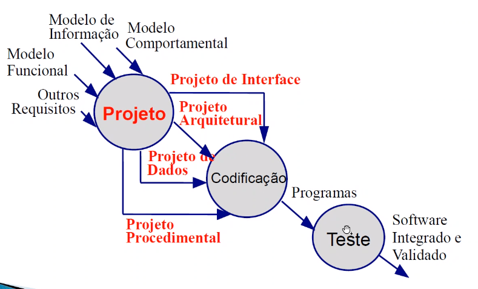

# INTRODUÇÃO

:calendar: 02/02 

## EMENTA

- Conceituação de projeto de software. 

- Introdução à Arquitetura de Software. 

- Organização e projeto das camadas de negócios, serviços e dados. 

- Modelagem estrutural e comportamental. 

- Padrões de Projeto. 

- Qualidade de projeto.

---

# INTRODUÇÃO A PROJETO DE SOFTWARE

:calendar: 07/02

## O QUE É

Projeto de software é, basicamente, a ponte entre as necessidades/requisitos e a idealização do projeto, onde vamos tomar as decisões técnicas do projeto. É o detalhamento técnico do projeto, do sistema que irá ser desenvolvido.

Abrange um conjunto de princípios, conceitos e práticas que levam ao desenvolvimento de um software de qualidade. <mark>Revisar aqui</mark>

- Princípios: filosofia que guia o trabalho que o projetista deve desempenhar???

- Conceitos: Entender o projeto antes de aplicar a prática;

- Práticas: Modelos, formas de representações do software que servem de **guia** para o desenvolvimento.

**Objetivo:** produzir um modelo que satisfaça aos requisitos. Um modelo de projeto que inclui representações de arquitetura, interface, componente e implantação. Mantendo uma avaliação pela equipe de software para ter certeza que fez corretamente (daily, por exemplo).

Ou seja, usamos a daily, por exemplo, para fazer a **verificação** (determinar se contém erros, inconsistências...), e um alinhamento recorrente com o cliente para uma **validação** ("Estamos construindo o produto correto?").

**Da análise ao projeto**: Análise (domínio do problema) x Projeto (domínio da solução). E após isso que partimos para a contrução (código).

Principais atividades realizadas na fase de projeto: <mark>Acabar aqui</mark>

1. Detalhamento dos aspectos dinâmicos do sistema; ???

2. Refinamento dos aspectos estáticos e estruturais do sistema; ???

3. Detalhamento da arquitetura do sistema;

4. Definição das estratégias para ..............

5. asd

6. asd

> Note: De 1 a 4 sendo o foco dessa disciplina.

## IMPORTÂNCIA DO PROJETO DE SOFTWARE

O projeto é necessário porque sem ele não conseguimos analisar/avaliar sua qualidade. Sem ele não sabemos ao certo como modificar e testar da melhor forma. Conseguimos até direcionar e facilitar (padrões que facilitam...) os testes automatizados e funcionais de uma melhor forma.

**Permite avaliar sua qualidade, e minimizar os riscos (encontrar incoerências...), custos... antes mesmo de começar a implementar!**

Com a elaboração de um projeto conseguimos estudar, prever e montar estratégias para contonar os impactos das limitações da tecnologia, como:

- Custo;

- Capacidade de armazenamento;

- Uso dos processadores nas máquinas;

- Serviço out;

- Falibildade;

- Etc.

## CONCEITOS BÁSICOS APLICADOS A PROJETOS

<mark>Acabar aqui</mark>

**Abstração:** É uma forma de nos concentrarmos em partes mais abstratas, com um nível maior de generalização dos problemas do software, para depois irmos refinando esse problema. *Uma forma de facilitar o entendimento e resolução do problema.*

- **Abstração procedural:** ??? <mark>Acabar aqui</mark>

**Arquitetura:** Basicamente é a estrutura, a organização dos componentes do sistema. Representa a interação entre esses elementos, etc.

- Conjunto de propriedades que devem ser especificadas, como: estruturais (dados, classes...), não funcionais (segurança, desempenho...) e famílias de sistemas (client - server...).

**Padrões:** <mark>Acabar aqui</mark> Os famosos Design Patters. Basicamente são padrões, formas de estrutura de código... que resolve algum tipo de problema. *Uma solução comprovada para problemas recorrentes em um contexto.*

**Separação por interesses:** Modularizar ajuda a resolver um problema complexo mais facilmente. Ou seja, dividir responsabilidades permite o foco em partes menores do problema ao invés de ver como um todo. Ex.: MVC (Model - View - Controller); Microsserviços.

:calendar: 09/02

**Modularidade:** <mark>Acabar aqui</mark>

**Ocultação de informações:** Basicamente é o princípio de encapsulamento, adapters, etc.

**Independência funcional:** Junção de modularidade, abstração e ocultação para tornar o código menos aclopado, com uma facilitadade maior no reuso e na manutenção. Também minimiza a probabilidade da propagação de erros.

- Coesão:

- Acoplamento:

**Refinamento:** Da pra lembrar de Clean code: nós disponibilizamos um método, ou um código mais abstrato, mais geral, e a medida que vai "entrando" a gente vai refinando, detalhando o código necessário. <mark>Não tenho certeza!!</mark>

**Refatoração:** "É o processo de mudança de um sistema de tal maneira que não altere o comportamento externo do código e ainda melhora sua **estrutura interna**."

- Ex.: Extract Method (dividir o código em outros métodos basicamente); Inline Method (Código muito repetido é unificado).

Boas práticas em projeto: <mark>Acabar aqui</mark>

- asd

- asd

- asd

---

# PROCESSO DE SW - FASES OU SUBPROCESSOS

:calendar: 14/02

1. Temos a definição <mark>Inclui a modelagem do projeto, ou só a análise de requisitos...?</mark>

2. Depois vamos para a construção, que seria o desenvolvimento em si

3. Depois que o sistema entra em uso, temos a manutenção...

## PASSOS DO PROJETO DE SOFTWARE

<mark>Corrigir path</mark>

### ASPÉCTOS TÉCNICOS

#### DADOS

asdasdasdasdasd

#### ARQUITETURAL

Desenvolver uma **estrutura modular** e **relações de controle** entre os componentes <mark>...</mark>

Particionamento estrutural: <mark>Acabar aqui</mark>

Arquitetura do software <mark>Acabar aqui</mark>

- Unidades modulares

- Poucas interfaces

###### PROPRIEDADES

- Propriedades estruturais: define os componentes do sistema.... e a maneira pela qual esses componentes são empacotados e interagem entre si.

- Propriedades extra-funcionais: como a arquitetura do projeto alcança os requisitos de desempenho, capacidade, confiabilidade, segurança........

- Famílias de sistemas relacionados:

###### MODELOS

- Modelo estrutural:

- Modelo de.....

- Modelo dinâmico:

- Modelo de processo:

- Modelo funcional:

###### CONCEITOS

<mark>Ver se vale a pena... Acho que tem mais pra cima tbm</mark>

#### INTERFACE

<mark>Acabar aqui</mark>

Estabelecer os mecanismos de interação....

#### PROCEDIMENTAL

<mark>Acabar aqui</mark>

regras de negócio...

Procedimento de software:

###### PDL

*Linguagem de projeto de programa*

### PONTO DE VISTA GERENCIAL

- Projeto preliminar: Importa mais com a visão geral dos dados e arquitetura...;

- Projeto detalhado: concentra mais na interface e projeto procedimental...
