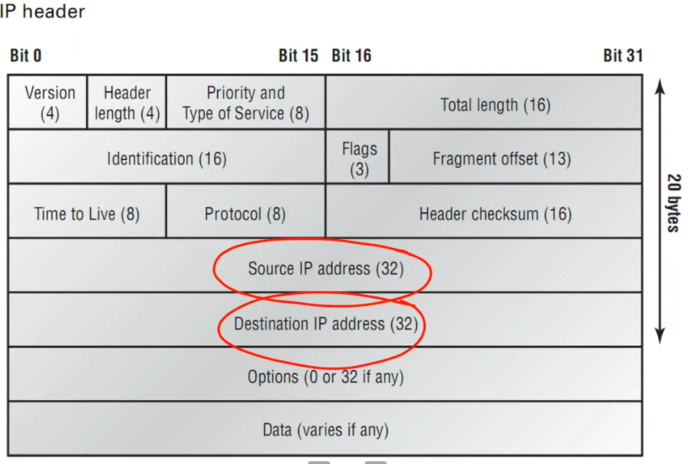
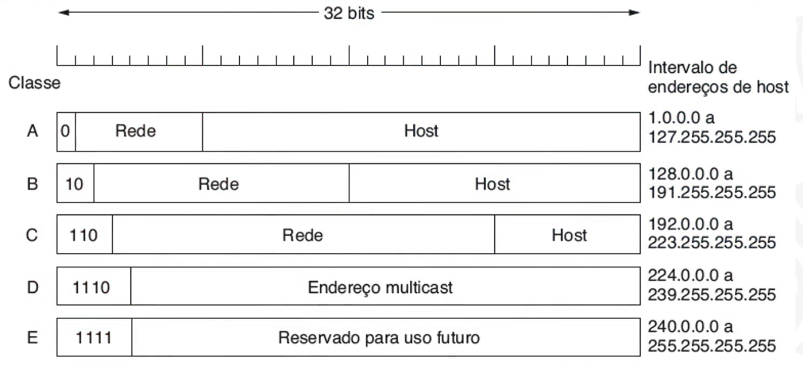
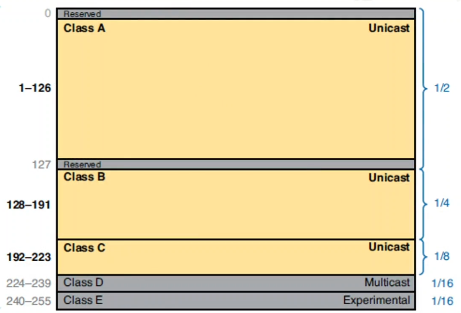
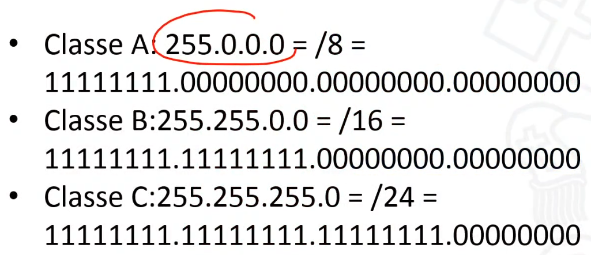

# INTRODUÇÃO

:calendar: 08/02

## EMENTA

- Projeto de redes locais e de longa distância: topologia, equipamentos e  tecnologias;

- Arquitetura de Infraestrutura de TI;

- Redes sem fio. Administração, gerência e segurança de redes TCP/IP;

- Virtualização. Computação em Nuvem. Comunicação entre dispositivos  inteligentes.

---

# UNIDADE 1

## VISÃO GERAL

:computer: virtual

## HIERARQUIA DE NEGÓCIOS

## ARQUITETURA DE TI X INFRAESTRUTURA DE TI

Basicamente a arquitetura de infraestrutura de TI é o projeto, a ciência de projetar e fornecer soluções tecnológicas. E a infraestrutura de TI em sí é a **instância** dessa arquitetura, é o que vai suportar todo o fluxo e processamento, é o hardware e o software, os dados armazenados e a rede em sí.

## TIPOS DE ARQUITETURA DE TI

- **Arquitetura Centralizada:** Tudo que compõe seu sistema está centralizado em um um único lugar, em um datacenter. Tudo é comprado, suportado e gerenciado nele;

- **Arquitetura Descentralizada:** Como o próprio nome já diz distriuí o sistema, o processamento em vários lugares, em vários computadores, servidores e dispositivos. Talvez uma arquitetura baseada em microserviços, etc;

- **Arquitetura orientada a Serviços (SOA):** Modelo de arquitetura de software que funciona na lógica de SaaS, conhecido pelas estruturas modulares e focada na reutilização de componentes para acelerar a criação de novas soluções;

- **Peer-to-peer:** Ponto à ponto é uma forma de arquitetura descentralizada, pois divide o processamento em computadores interligados entre sí, sem um servidor central;

- **BYOD:** Basicamente é uma tendência que os colaboradores irão utilizar os equipamentos pessoais e se conectar aos sistemas da empresa, ao invés da empresa fornecer um pc lá;

- **Cloud:** Só lembrar de AWS, uma infra fornecida por alguém para seu negócio. Uma infra que virou software para quem deseja utilizar. Podendo ter centralizada, distribuída, etc.

---

## MODELO DE INFRA. DE TI

:computer: virtual

Modelo proposto por Sjaak Laan:

Os processos das empresas são *suportados* pelas aplicações, que por sua vez, junto com os Middleware, os bancos de dados... tudo isso utiliza recursos da infra, como por exemplo, um database está armazenado em um servidor. 

Logo, a infra está ali para prover recursos com alta disponibilidade, performance e segurança para as aplicações que irão suportar os processos das empresas.

> **Middleware:** software que fornece algum tipo de serviço comum para as aplicações, como: Gerenciamento de dados, Mensageria, Autenticação, entre outros.

---

# REVISÃO DE REDES I

:calendar: 15/02

> Estudar essa parte pelo slide. Aqui só tem anotações.

**Computação ubíqua pervasiva:** Foi chegando no nosso dia a dia sem a gente "planejar", chegou de fininho. Ex.: Waze, iFood, Alexa, SmartWatch, Geladeira smart, etc.

**Computação ubíqua científica.** Ex.: Nanorobôs no sangue, etc.

Um **modelo hibrido** pode ser usado para solucionar problema geográfico, de latência. Por que tu pode ter as máquinas servidoras espalhadas geograficamente com um modelo P2P entre elas, e os usuários sendo os clientes.

**NPS:** analogia com Fat32 e NTFS só que em rede.

---

## DEMAIS ASPECTOS DE INFRAESTRUTURA

:computer: virtual

---

## INFRA. NO CONTEXTO DE SOFTWARE

:computer: virtual

**Infraestrutura ágil** é considerada uma resposta ao um manifesto ágil, ou seja, criar uma infra, um conjunto de automações que permitem que façamos manutenções e modificações nos ambientes sem impactos na estabilidade e segurança (**Infraestrutura sob demanda**).

---

# UNIDADE 2

## TEMA 1: ENDEREÇAMENTO

### CONVERSÃO BINÁRIA / DECIMAL

:computer: virtual

Vai colocando aonde cabe o número decimal, da esquerda pra direita:

---

### ENDEREÇAMENTO IPV4

:computer: virtual

*Protocolo de internet versão 4.*

É um identificador atribuído a cada máquina em uma rede IP. Possibilita a um host em uma rede comunicar-se com outro host de uma rede distinta e distante, e idependente do tipo de rede.

E ai podemos ver a importância de projetar, implementar e gerenciar um plano de endereçamento IPv4, pois permite que a rede opere de forma correta, ou seja, que não falte IPs para nenhuma máquina, ou que máquinas destinadas à um objetivo não fique no mesmo bloco de IPs que outras de objetivos diferentes, etc.

Cabeçalho IP:

Cada endereço é representado por 32 bits divididos em 4 blocos de 1 byte.

Cada endereço pode utilizar a noteção decimal, binária ou hexadecimal. Ex.:

> 192.168.10.31
> 
> 11000000.10101000.00001010.00011111
> 
> C0 A0 0A 1F

**Tipos de endereços IPv4:**

- **Rede:** Endereço pelo qual nos referimos à rede, ou seja, é um endereço que não pode ser usado por uma máquina, os bits de host ficam com 0;

- **Broadcast:** Endereço especial usado para enviar dados a todos os host da rede (os bits de host ficam com 1);

- **Host:** Endereços designados ao dispositivos finais da rede (os bits destinados aos host ficam com qualquer combinação diferente das anteriores).

Geralmente os **3 primeiros blocos** indentificam em qual rede **local** o host está, ou seja, é um conjunto de ips destinados aos hosts.

O **último bloco** é o identificados de um **host específico** dentro daquela rede local, ou seja, de um equipamento específico, uma máquina, um roteador, etc.

> Note: Normalmente o último bloco = .1 é destinado ao roteador, e as máquinas ficam entre 2 e 254.

> Note: Até agora falamos em um divisão dos bits para rede e host, mas também podemos fazer uma divisão de rede, subrede e host.

##### MÁSCARAS

Mas como podemos saber de fato quantos bits são usados para rede, e quantos são usados para o host? A porção de definada pela **máscara!**

Ex.: 255.255.255.0 = 24 bits para indentificar a rede, e 8 para o host.

Para dividir essa porção já foi muito usado a divisão por classes, o que hoje não é tão usado mais:

Número de possibilidades de IPs por classe:

Máscara default (em decimal):

#### IPV4 EM CLASSES

Lorem Ipsum

#### REDES - SUB-REDES, CIDR E NAT

Lorem Ipsum

#### ESGOTAMENTO IPV4

Lorem Ipsum
