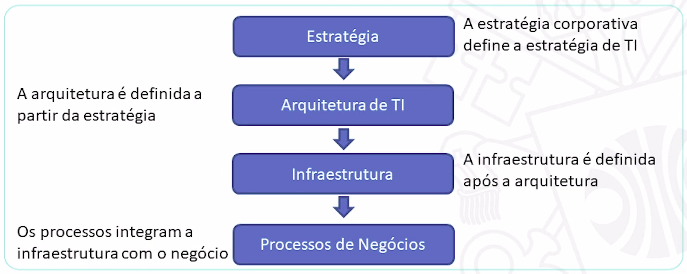
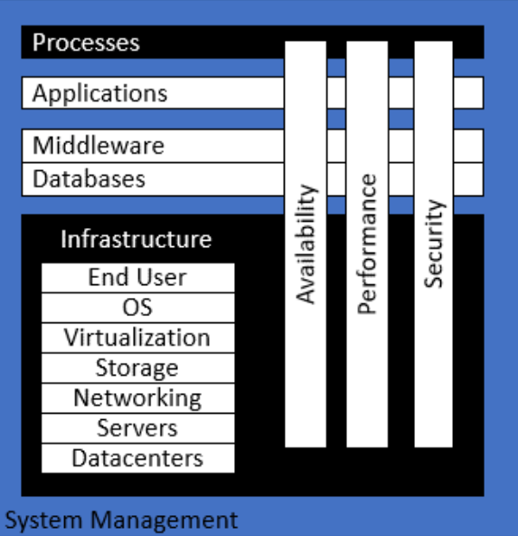
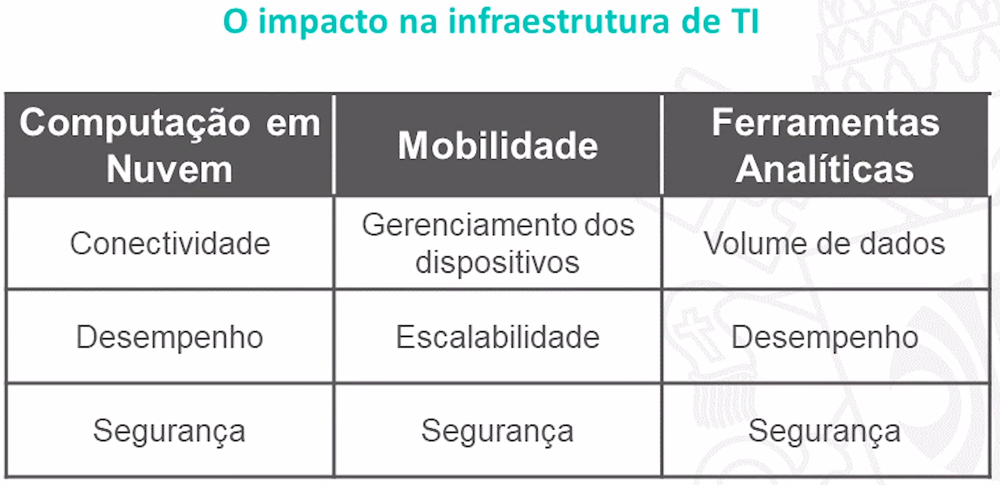
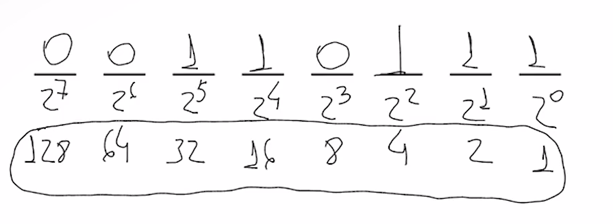

# INTRODUÇÃO

:calendar: 08/02

## EMENTA

- Projeto de redes locais e de longa distância: topologia, equipamentos e  tecnologias;

- Arquitetura de Infraestrutura de TI;

- Redes sem fio. Administração, gerência e segurança de redes TCP/IP;

- Virtualização. Computação em Nuvem. Comunicação entre dispositivos  inteligentes.

---

# UNIDADE 1

## VISÃO GERAL

:computer: virtual

## HIERARQUIA DE NEGÓCIOS

## ARQUITETURA DE TI X INFRAESTRUTURA DE TI

Basicamente a arquitetura de infraestrutura de TI é o projeto, a ciência de projetar e fornecer soluções tecnológicas. E a infraestrutura de TI em sí é a **instância** dessa arquitetura, é o que vai suportar todo o fluxo e processamento, é o hardware e o software, os dados armazenados e a rede em sí.

## TIPOS DE ARQUITETURA DE TI

- **Arquitetura Centralizada:** Tudo que compõe seu sistema está centralizado em um um único lugar, em um datacenter. Tudo é comprado, suportado e gerenciado nele;

- **Arquitetura Descentralizada:** Como o próprio nome já diz distriuí o sistema, o processamento em vários lugares, em vários computadores, servidores e dispositivos. Talvez uma arquitetura baseada em microserviços, etc;

- **Arquitetura orientada a Serviços (SOA):** Modelo de arquitetura de software que funciona na lógica de SaaS, conhecido pelas estruturas modulares e focada na reutilização de componentes para acelerar a criação de novas soluções;

- **Peer-to-peer:** Ponto à ponto é uma forma de arquitetura descentralizada, pois divide o processamento em computadores interligados entre sí, sem um servidor central;

- **BYOD:** Basicamente é uma tendência que os colaboradores irão utilizar os equipamentos pessoais e se conectar aos sistemas da empresa, ao invés da empresa fornecer um pc lá;

- **Cloud:** Só lembrar de AWS, uma infra fornecida por alguém para seu negócio. Uma infra que virou software para quem deseja utilizar. Podendo ter centralizada, distribuída, etc.

---

## MODELO DE INFRA. DE TI

:computer: virtual

Modelo proposto por Sjaak Laan:

Os processos das empresas são *suportados* pelas aplicações, que por sua vez, junto com os Middleware, os bancos de dados... tudo isso utiliza recursos da infra, como por exemplo, um database está armazenado em um servidor. 

Logo, a infra está ali para prover recursos com alta disponibilidade, performance e segurança para as aplicações que irão suportar os processos das empresas.

> **Middleware:** software que fornece algum tipo de serviço comum para as aplicações, como: Gerenciamento de dados, Mensageria, Autenticação, entre outros.

---

# REVISÃO DE REDES I

:calendar: 15/02

> Estudar essa parte pelo slide. Aqui só tem anotações.

**Computação ubíqua pervasiva:** Foi chegando no nosso dia a dia sem a gente "planejar", chegou de fininho. Ex.: Waze, iFood, Alexa, SmartWatch, Geladeira smart, etc.

**Computação ubíqua científica.** Ex.: Nanorobôs no sangue, etc.

Um **modelo hibrido** pode ser usado para solucionar problema geográfico, de latência. Por que tu pode ter as máquinas servidoras espalhadas geograficamente com um modelo P2P entre elas, e os usuários sendo os clientes.

**NPS:** analogia com Fat32 e NTFS só que em rede.

---

## DEMAIS ASPECTOS DE INFRAESTRUTURA

:computer: virtual

---

## INFRA. NO CONTEXTO DE SOFTWARE

:computer: virtual

**Infraestrutura ágil** é considerada uma resposta ao um manifesto ágil, ou seja, criar uma infra, um conjunto de automações que permitem que façamos manutenções e modificações nos ambientes sem impactos na estabilidade e segurança (**Infraestrutura sob demanda**).

---

# UNIDADE 2

## TEMA 1: ENDEREÇAMENTO

### CONVERSÃO BINÁRIA / DECIMAL

:computer: virtual

Vai colocando aonde cabe o número decimal, da esquerda pra direita:

---

### ENDEREÇAMENTO IPV4

:computer: virtual

*Protocolo de internet versão 4.*
