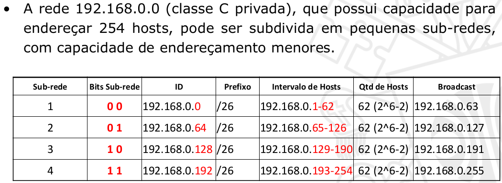
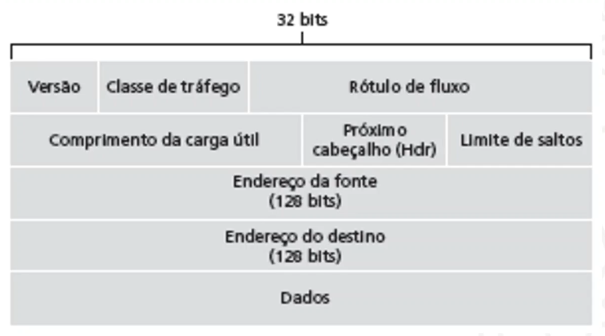
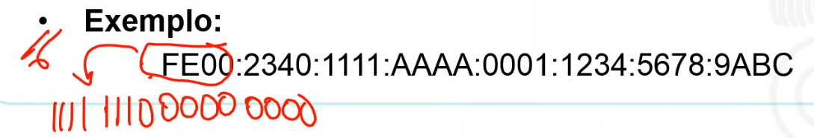
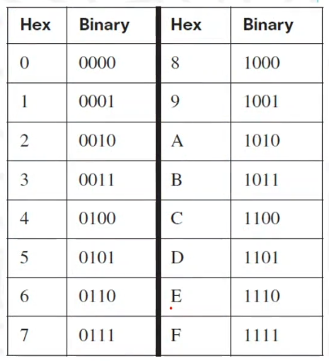
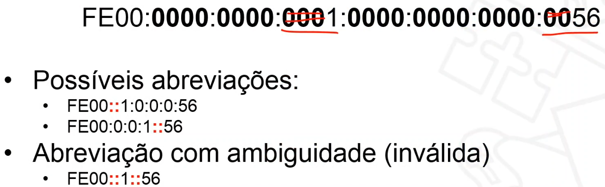
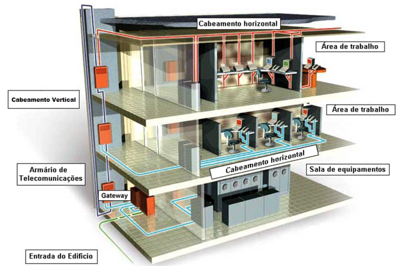

# INTRODUÇÃO

:calendar: 08/02

## EMENTA

- Projeto de redes locais e de longa distância: topologia, equipamentos e  tecnologias;

- Arquitetura de Infraestrutura de TI;

- Redes sem fio. Administração, gerência e segurança de redes TCP/IP;

- Virtualização. Computação em Nuvem. Comunicação entre dispositivos  inteligentes.

---

# UNIDADE 1

## VISÃO GERAL

:computer: virtual

## HIERARQUIA DE NEGÓCIOS

## ARQUITETURA DE TI X INFRAESTRUTURA DE TI

Basicamente a arquitetura de infraestrutura de TI é o projeto, a ciência de projetar e fornecer soluções tecnológicas. E a infraestrutura de TI em sí é a **instância** dessa arquitetura, é o que vai suportar todo o fluxo e processamento, é o hardware e o software, os dados armazenados e a rede em sí.

## TIPOS DE ARQUITETURA DE TI

- **Arquitetura Centralizada:** Tudo que compõe seu sistema está centralizado em um um único lugar, em um datacenter. Tudo é comprado, suportado e gerenciado nele;

- **Arquitetura Descentralizada:** Como o próprio nome já diz distriuí o sistema, o processamento em vários lugares, em vários computadores, servidores e dispositivos. Talvez uma arquitetura baseada em microserviços, etc;

- **Arquitetura orientada a Serviços (SOA):** Modelo de arquitetura de software que funciona na lógica de SaaS, conhecido pelas estruturas modulares e focada na reutilização de componentes para acelerar a criação de novas soluções;

- **Peer-to-peer:** Ponto à ponto é uma forma de arquitetura descentralizada, pois divide o processamento em computadores interligados entre sí, sem um servidor central;

- **BYOD:** Basicamente é uma tendência que os colaboradores irão utilizar os equipamentos pessoais e se conectar aos sistemas da empresa, ao invés da empresa fornecer um pc lá;

- **Cloud:** Só lembrar de AWS, uma infra fornecida por alguém para seu negócio. Uma infra que virou software para quem deseja utilizar. Podendo ter centralizada, distribuída, etc.

---

## MODELO DE INFRA. DE TI

:computer: virtual

Modelo proposto por Sjaak Laan:

Os processos das empresas são *suportados* pelas aplicações, que por sua vez, junto com os Middleware, os bancos de dados... tudo isso utiliza recursos da infra, como por exemplo, um database está armazenado em um servidor. 

Logo, a infra está ali para prover recursos com alta disponibilidade, performance e segurança para as aplicações que irão suportar os processos das empresas.

> **Middleware:** software que fornece algum tipo de serviço comum para as aplicações, como: Gerenciamento de dados, Mensageria, Autenticação, entre outros.

---

# REVISÃO DE REDES I

:calendar: 15/02

> Estudar essa parte pelo slide. Aqui só tem anotações.

**Computação ubíqua pervasiva:** Foi chegando no nosso dia a dia sem a gente "planejar", chegou de fininho. Ex.: Waze, iFood, Alexa, SmartWatch, Geladeira smart, etc.

**Computação ubíqua científica.** Ex.: Nanorobôs no sangue, etc.

Um **modelo hibrido** pode ser usado para solucionar problema geográfico, de latência. Por que tu pode ter as máquinas servidoras espalhadas geograficamente com um modelo P2P entre elas, e os usuários sendo os clientes.

**NPS:** analogia com Fat32 e NTFS só que em rede.

---

## DEMAIS ASPECTOS DE INFRAESTRUTURA

:computer: virtual

---

## INFRA. NO CONTEXTO DE SOFTWARE

:computer: virtual

**Infraestrutura ágil** é considerada uma resposta ao um manifesto ágil, ou seja, criar uma infra, um conjunto de automações que permitem que façamos manutenções e modificações nos ambientes sem impactos na estabilidade e segurança (**Infraestrutura sob demanda**).

---

# UNIDADE 2

## TEMA 1: ENDEREÇAMENTO

### CONVERSÃO BINÁRIA / DECIMAL

:computer: virtual

Vai colocando aonde cabe o número decimal, da esquerda pra direita:

---

### ENDEREÇAMENTO IPV4

:computer: virtual

*Protocolo de internet versão 4.*

É um identificador atribuído a cada máquina em uma rede IP. Possibilita a um host em uma rede comunicar-se com outro host de uma rede distinta e distante, e idependente do tipo de rede.

E ai podemos ver a importância de projetar, implementar e gerenciar um plano de endereçamento IPv4, pois permite que a rede opere de forma correta, ou seja, que não falte IPs para nenhuma máquina, ou que máquinas destinadas à um objetivo não fique no mesmo bloco de IPs que outras de objetivos diferentes, etc.

Cabeçalho IP:

Cada endereço é representado por 32 bits divididos em 4 blocos de 1 byte.

Cada endereço pode utilizar a noteção decimal, binária ou hexadecimal. Ex.:

> 192.168.10.31
> 
> 11000000.10101000.00001010.00011111
> 
> C0 A0 0A 1F

**Tipos de endereços IPv4:**

- **Rede:** Endereço pelo qual nos referimos à rede, ou seja, é um endereço que não pode ser usado por uma máquina, os bits de host ficam com 0;

- **Broadcast:** Endereço especial usado para enviar dados a todos os host da rede (os bits de host ficam com 1);

- **Host:** Endereços designados ao dispositivos finais da rede (os bits destinados aos host ficam com qualquer combinação diferente das anteriores).

Geralmente os **3 primeiros blocos** indentificam em qual rede **local** o host está, ou seja, é um conjunto de ips destinados aos hosts.

O **último bloco** é o identificados de um **host específico** dentro daquela rede local, ou seja, de um equipamento específico, uma máquina, um roteador, etc.

> Note: Normalmente o último bloco = .1 é destinado ao roteador, e as máquinas ficam entre 2 e 254.

> Note: Até agora falamos em um divisão dos bits para rede e host, mas também podemos fazer uma divisão de rede, subrede e host.

##### MÁSCARAS

Mas como podemos saber de fato quantos bits são usados para rede, e quantos são usados para o host? A porção de definada pela **máscara!**

Ex.: 255.255.255.0 = 24 bits para indentificar a rede, e 8 para o host.

Para dividir essa porção já foi muito usado a divisão por classes, o que hoje não é tão usado mais:

Número de possibilidades de IPs por classe:

Máscara default (em decimal):

#### REDES - SUB-REDES, CIDR E NAT

Um dos problemas dessa forma de divisão de redes por classes é o **disperdício de a endereços**, ou seja, se temos um escritório que só necessita de 5 máquinas, uma máscara do tipo C (a menor possível) ainda teria um desperdício de, aproximadamente, 248 endereços.

Para solucionar isso temos algumas formas de configurar a rede.

> Note: Sub-rede com CIDR e NAT não são "boas práticas", o ideal é migrar para o IPv6.

###### SUB-REDE COM CIRD

A ideia é subdividir uma rede (Ex.: 192.168.0.0), para obter "redes" com menos host.

Para entender como subdividir uma rede podemos definir alguns passos:

1. Defina quantas subredes deseja para descobrir quantos bits são necessários para representar essa quantidade.
   
   1. Ex.:

<mark>Ainda há desperdício</mark>

> Lembrar: se tu tiver a mascara, ou seja, a quantidade de bits usados para a rede, já da pra descobrir a quantidade de hosts. Ex.: /24 -> 32-24 = 8 -> 2^8 = 256 - 2 = 254 hosts

<mark>VLSM</mark>

Ao invés de quebrar as subredes com o mesmo numero de hosts, passamos uma mascara diferente para cada, subredes variáveis, cada uma terá o número de hosts adequado.

> Note: Só pra complicar a conta :)

Para dividir sub-redes -> calcular a mascara de cada "grupo" isoladamente.

1. Ordenar os grupos pela quantidade de host necessários;

2. 

<mark>Exemplo:</mark>

<mark>CIDR</mark>

Roteamento sem classe - conceito para facilitar o rastreamento de IP no mundo

###### NAT

Forma de 

###### IPV6

asdas

#### ESGOTAMENTO IPV4

Lorem Ipsum

---

### ENDEREÇAMENTO IPV6

:computer: virtual

Solução definitiva para o problema de escassez do IPV4.

- Menor cabeçalho permitindo uma leitura mais rápida dos pacotes. E mesmo com menos campos nele, há como utilizar campos adicionais para não perder as funcionalidades.

- Capacidade de criptografia.

- Mudanças no cabeçalho para facilitar mecanismos de qualidade de serviço (tratamentos diferenciados).

Agora temos **128 bits** para os IPs, logo a estrutura muda: Ao invés de ter 4 blocos de 8 bits, temos **8 blocos de 16 bits**. Mas para não ficar uma infinidade de 0 e 1, convertemos para hexadecimal, chegando em 8 blocos de 4 caracteres em hexadecial.

Exemplo:

#### CARACTERÍSTICAS

- **Endereçamento Unicast Global:** permite a alocação de endereços IPs suficientes para cada dispositivo no mundo, sem a necessidade de NAT.
  
  > Para cada metro² do mundo temos mais de 1000 endereços disponíveis.

- **Agregação Global de Rotas:** permite a alocaçõ de redes IPv6 de acordo com a região geográfica, evitando o crescimento desordenado das tabelas de roteamento no mundo.
  
  - Análogo com o telefone. Ex.: +55 31 = Brasil MG.
  
  - Para o Brasil prefixo 280/12.

#### DIVISÃO DO ENDEREÇO IPV6:

Os primeiros 64 bits:

| 12 bits           | 20 bits  | 16 bits | 16 bits |
| ----------------- | -------- | ------- | ------- |
| Região do planeta | Provedor | Cliente | Subrede |

Os outros 64 são para identificar os equipamentos :)

#### CONVERÇÕES PARA REPRESENTAÇÃO

#### ATRIBUIÇÃO DE ENDEREÇOS

- Estática (Manual);

- Dinâmica com informação de estado (Stateful - DHCP - Automática);

- Dinâmica sem informação de estado (Stateless)

- ID de Interface com formato EUI-64 (a prórpia máquina passa esse endereço pra ela).
  
  - Para isso usa o endereço MAC.

#### TIPOS DE ENDEREÇOS IPV6

- **Unicast:** Endereços atribuídos em interfaces individuais;

- **Multicast:** Endereço IP representa um grupo dinâmico de hosts;

- **Anycast:** Mesma coisa do anterior, mas ao enviar um pacote, ele é enviado somente para a interface mais próximo.

---

## TEMA 2: CABEAMENTO

### CABEAMENTO ESTRUTURADO

:computer: virtual

Disposição organizada e padronizada de conectores e meios de transmissão para redes de informática e telefonia, de modo a tornar a infraestrutura de cabos autônoma quanto ao tipo de aplicação e de layout, permitindo a ligação a uma rede de: servidores, estações, impressoras, telefones, *switches*, *hubs* e roteadores.

Temos 7 subsistemas importantes para a estruturação de uma empresa:

1. **Entrada do edifício:** Conexão com o cabeamento da rua;

2. **Sala de equipamentos:** Onde vão estar meus servidores, etc:

3. **Sala de telecomunicações:** Sala que vai distribuir o cabeamento;
   
   1. 1 por andar.

4. **Cabeamento Backbone:** Ou cabeamento vertical, é a conexão das salas de telecomunicações com a sala de equipamentos (fibra);

5. **Cabeamento horizontal:** Cabeamento das salas de telecomunicações até as estações de trabalho (par trançado);

6. **Área de trabalho:** Onde o colaborador vai trabalhar na sua máquina;

7. **Administração:** Identificação de cada cabo/ponto, etc.

---

## TEMA 3: EQUIPAMENTOS

### EQUIPAMENTOS DE REDE

:computer: virtual

---- EQUIPAMENTOS DE REDE ---- 

Os dispositivos finais em uma rede precisam se ligar a infraestrutura por algum tipo de meio físico 
(com ou sem fio) e em algum hardware que permita a interconexão. Esta interligação vai promover uma 
topologia física e lógica.

Hubs e Brieds (pontos)

Topologias:
Temos as físicas e as lógicas (como os frames viajam entrae os dispositivos)!
PEGAR OS TIPOS!!!

- Topologia HUB: Topologia física em estrela, mas a lógica é em barramento.
	- CONCENTRADOR.
	- A mensagem vem de um, e é transmitida igualmente para todas conectadas ao hub.
	- Problemas: Máquinas recebendo sem precisar; colisão.

- Bridges: Veio para melhorar a segurança em relação a colis"ão na comunicação com hubs, e o desempenho;
	- PEGAR IMAGEM!
	- Ele já atua na camada de enlace tbm, logo sabendo o endereço MAC ele sabe exatamente para
qual máquina envia, diferente do HUB que envia para todos, e a máquina de destino aceita e as outras 
descartem.

Conceitos de LAN
- Domínio de colisão: Um exemplo seria na topologia em barramento que tem 1 domínio desse, ou seja, 
se duas máquinas transmitirem ao mesmo tempo, pode colidir;
- Domínio de broadcast: É a segmentação em grupos que receberam as mensagens e, broadcast (pra não mandar
pra MUITA gente).

---- Switchs e Tecnologias LAN ----

Para entender suas vantagens, quando comparado ao HUB, precisamos recordar o modelo de camadas. 
Enquanto o hub implementa apenas a camada física, transmitindo os bits de uma porta para outra à 
medida que eles vão chegando, o Switch implementa, pelo menos, até a camada de enlace o que o torna 
capaz de identificar início e fim dos frames, calcular crc para checagem de erros e observar o endereços
físicos de origem e destino do pacote. Com o endereço físico (MAC Address) o switch é capaz de 
direcionar o quadro apenas para porta de destino correta, gerando uma série de vantagens.

## SWITCHS

Recursos de desempenho e segurança:

## MÉTODOS DE ENCAMINHAMENTOS

- Store-and-forward: Switch examina todo o quadro, calcula o CRC e encaminha para interface de saída;
- Cut-Through: Encaminha o quadro antes de ser totalmente recebido, examinando o destino do MAC.

## VAZÃO

- Blocking: A soma das velocidades das portas do switch é maior do que o backplane, ou seja, se 
todas as portas transmitirem na velocidade máxima, o switch não aguenta;
- Non-blocking: A soma das velocidades das portas do switch é igual ou menor do que o backplane, aguenta
o cenário anterior.

## VLAN (Virtual Local Area network)

É uma rede virtual que segmenta o domínio de Broadcast em uma LAN, Ex.: Rede administrativa e pública.

Benefícios:
- Segurança;
- Redução de custos;
- Desempenho;
- Eficiência do pessoal de TI (simplifica o gerenciamento).

Métodos para alocar as portas nas VLANs:
- Estática: Configurada manualmente na interface do switch;
- Dinâmica: Associação ocorre através de politicas de acesso na implementação do 802.1x;
- VLAN de voz: Padrão a ser utilizado pela telefonia IP.

## Trunk

Para a VLAN funcionar corretamente entre mais de um switch precisamos configurar as portas que estão interligando os switch de 
modo trunk, ou seja, é uma forma de identificar a vlan de origem.

## STP (Spanning Tree Protocol)

Uma forma de prever redundância de ligação á rede (switch em loop), permitindo que uma rede de comutação de camda 2 possa se recuperar
de falhas, sem intervenção e em tempo hábil.

## Etherchannel

Cria uma agregação de canais, de interfaces de switch para criar um tubo gigante e aumentar o desempenho
do tráfego de quadros.

---- Roteadores e Tecnologias WAN ----

Enquanto os switchs e access point são responsáveis em oferecer conectividade para os dispositivos 
finais dos usuários, os roteadores são responsáveis em interligar uma rede local a outra. A ideia básica 
é que o roteador tenha no mínimo uma interface de rede local e interfaces para conexão à longa distância.

A operação básica do roteador é:

- Montar tabelas de rotas, ou seja, construir uma tabela que servirá de base para tomada de decisão de 
encaminhamento;
- Ao receber um pacote por uma interface, comparar o endereço de destino com as regras da tabela de rotas;
- Encaminhar o pacote pela interface de saída correta.

O switch opera olhando o MAC Address e o roteador opera olhando o IP de origem e destino.

## TECNOLOGIAS WAN

WANs públicas e privadas: 

### TOPOLOGIAS

- Ponto-a-Ponto:

- Hub-and-Spoke: 

- Dual-homed: 

- Totalmente em malha:

- Parcialmente em malha: 

### EVOLUÇÃO

### OUTROS
- Comunicação serial???
- Comunicação comutada por circuito: 
- Comunicação comutada por pacotes: 
	- Frame Relay: Interconectar LANs corporativas.
	- ATM: 

### CONECTIVIDADE MODERNA
(Pegar imagem slide -> 5:11)
- Banda larga dedicada:
- Comutação por pacotes:
- Banda larga baseada na internet: 

---- Software Defined Network ----

PEGAR IMAGENS
<<
Para alcançar este objetivo o roteador atua em dois processos distintos, o primeiro conhecido como 
plano de controle, onde algoritmos de roteamento permitem troca de informações entre os roteadores, 
estas informações permitem a cada roteador montar um grafo de caminhos da rede e com o grafo da rede o 
roteador consegue montar uma tabela de melhores caminhos, também conhecida como tabela de encaminhamento.

O segundo processo operado pelos roteadores é conhecido como plano de dados, neste processo o roteador 
compara cada pacote que chega nele com informações da tabela de encaminhamento para tomar a decisão de 
por qual interface aquele pacote deve ser direcionado.

Na figura 2, fica claro esta divisão, na parte acima da linha pontilhada ficam os algoritmos de 
roteamento no plano de controle, gerando as tabelas de encaminhamento que ficam no plano de dados. 
Ao chegar um pacote, neste exemplo, com endereço de destino 0111 é feita uma comparação com a tabela de 
encaminhamento que recomenda mandar este pacote pela saída de número 2.  
>>

A lógica é definir a rede por software.

PEGAR PRIMEIRA IMAGEM E EXPLICAÇÃO DO VÍDEO!!!!!!!!

Todo o trabalho de criar as tabelas de controle de encaminhamento é delegado a um serviço diferente,
e basta o roteador fazer o trabalho de encaminhar as mensagens.

---- Redes sem fio ---
Enquanto as redes sem fio infraestruturada possuem os pontos de acesso 
interligados via cabo a rede principal, as redes adhoc possuem comunicação entre 
os dispositivos sem a intermediação de um access point (ponto de acesso).

- WPAN - Redes pessoais sem fio tem o objetivo de interligar dispositivos a poucos 
metros, como, por exemplo, um fone de ouvido, um teclado, entre outros.
- WLAN - Redes locais sem fio, também conhecido como wifi, tem o objetivo de 
interligar dispositivos finais À rede de computadores com endereçamento IP, 
permitindo o tráfego com a Internet.
- WMAN - Redes sem fio metropolitana é uma solução voltada para alcance de até 
50 km para concorrer com soluções de banda larga doméstica, tecnologia que não 
evoluiu muito no Brasil.
- WWAN - Redes sem fio mundial, nesta categoria podemos colocar os satélites e a 
infraestrutura de telefonia celular.

PEGAR IMAGEM DO ESPECTRO ELETROMAGNÉTICO!!!!

## CONCEITOS
- APs autônomos: Dispositivos independentes configurados por meio de uma 
interface de linha de comando. Cada AP autônomo atua independente dos outros e é 
configurado e gerenciado manualmente por um administrador.
- APs baseados em controlador: Também conhecidos como APs leves (LAPs). Eles
usam o protocolo Lightweight Access Point Protocol (LWAPP) para se comunicar
com um controlador WLAN (WLC). Cada ponto de acesso é configurado e gerenciado 
automaticamente pelo WLC.

Tipos de antenas externas:
- Omnidirecional: Fornece uma cobertura  de 360 graus. ideal em casas e áreas de 
escritório.
- Direcional: Focaliza o sinal. Ex.: Parabólica;
- Multiple Input Multiple Output (MIMO): Usa várias antenas para aumentar a 
largura de banda.

## MODOS DE TOPOLOGIA SEM FIO
- Modo ad hoc: Conectar clientes ponto a ponto sem AP;
- Modo de infraestrutura: Conecta clientes através de um AP conectado de forma 
cabeada com a infra;
- Tethering: Variaçãoo da topologia ad hoc, quando um smartphone com acesso a 
dados de celular é ativado para criar um ponto de acesso pessoal para um pc, 
por exemplo.

- Conjunto básico de serviços (BSS): Usa um único AP para conectar todos os clientes. 
Clientes em BSSs diferentes não podem se comunicar;
- Conjunto de serviços estendidos (ESS): União de dois ou mais BSSs. Ou seja, 
ao transitar localmente pode passar de um BSS para outro sem perceber.
Clientes em cada BSS podem se comunicar através do ESS.

## MODO DE DESCOBERTA 
- Modo passivo: O AP anuncia abertamente o seu serviço.
- Modo ativo: Como forma de segurança, os clientes sem fio devem saber o nome 
do SSID.

---- Projeto de Redes de Computadores ----

Uma vez que você já conhece cabeamento estruturado, endereçamento IP, 
equipamentos de rede, redes sem fio e tecnologias de longa distância o próximo 
passo é entender em qual momento cada um desses elementos deve ser usado durante
o desenvolvimento de um projeto de Redes de Computadores.

 
A Cisco propõem uma metodologia com 6 estágios, apresentados na figura 1. 
Com certeza este não é o único modelo existente, o importante é observar que 
alguma estratégia de desenvolvimento deve ser usada, para que ao final de sua 
impletantação você obtenha sucesso.

PEGAR IMAGEM DOS 6 ESTÁGIOS!!!

1. Definir as metas de um projeto;
2. Aspectos e requisitos-chave do projeto;
3. Estágios
	1. Analisar requisitos (e recursos);
	2. Projetar a topologia (modelagem simples, sem marcas e modelos);
	3. Esquema de End. e Naming;
	4. Especificar o hardware;
	5. Utilizar recursos de Routers e SW;
	6. Implementar, Monitorar e GRC.
4. Documentação;
	- Resumo executivo;
	- Objetivo do projeto;
	- Escopo do projeto;
	- Requisitos de projeto;
	- Estado da rede atual;
	- Projeto Lógico (topologia...)
	- Projeto físico;
	- Resultado de testes;
	- Plano de implementação;
	- Orçamento.

---

# UNIDADE 3

## VIRTUALIZAÇÃO
:computer: virtual

Existem vários tipos de virtualização, entre eles podemos citar a virtualização de:

- Hardware (imagem da direita)
- Aplicativos: Centralizar aplicações em uma máquina, e as outras usarem eles através da rede?
- Desktops: Uma estação serve sõ de terminal, o so ta no servidorç
- Redes: "Fingir que tem switch" por exemplo;
- Storage: Ao invés de ter um servidor só para armazenamento, eu pego o armazenamento de cada máquina e compartilho entre todas. Config de uma pool de HDs.

### MOTIVOS PARA USAR A VIRTUALIZALÇÃO

- Melhor aproveitamento do hardware;
- Economia de energia: é mais barato rodar um grande servidor, do que vários servidores tradicionais;
- Redução de custos administrativos: Redução do custo com contratos ou pessoas responsáveis pela manutenção das máquinas;
- Diminuição do espaço fisico;
- Velocidade na implantação;
- Eficiência na disponibilidade de sistemas.

### GANHOS COM A VIRTUALIZAÇÃO

### LIMITAÇÕES

### PROPRIEDADES DE VMs

---

## COMPUTAÇÃO EM NUVEM
:computer: virtual

---

# UNIDADE 4 - GERÊNCIA DE REDES DE COMPUTADORES

Área de estudo responsável em deixar os recursos de rede o máximo de tempo disponível, evitando e contornando falhas, além de outras funções.

## CONCEITOS BÁSICOS

“Gerenciamento de rede inclui a implantação, a integração e a coordenação de elementos de **hardware**, **software** e **humanos**, para monitorar, testar, consultar, configurar, analisar, avaliar e controlar os recursos da rede, e de elementos, para satisfazer às exigências operacionais, de desempenho e de qualidade de serviços em tempo real a um custo razoável.”

Monitoração x Controle
- Monitoração: relacionada com a tarefa de observação, é uma função de **leitura**;
- Controle: relacionada a alteração de valores de parâmetros e execução de determinadas ações, é uma função de **escrita**.

Administrar x Gerenciar
- Administrar uma rede é disponibilizar novos serviços na infra;
- Gerenciar é acompanhar e monitorar o funcionamento de uma infra.

## ARQUITETURA

