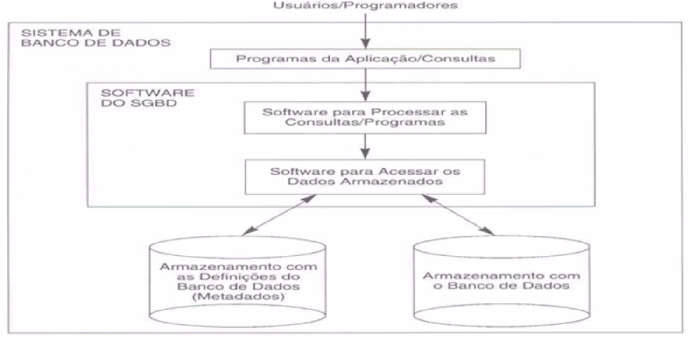

## Notes

*Todas as anotações relacionadas ao material online da disciplina será escrito na aula respectiva aos vídeos sujeridos.*

---

## Aula 1 - 03/02

#### Apresentação da disciplina

- Diferença entre **dado** e **informação** -> Dado é a matéria prima. Dados tratados (ex: clusterização), dados interpretados, conclusões tiradas a partir de dados são informações, são úteis, contextualizados. Dados avulsos podem até ser interpretados de forma errada, se utilizado sem contexto e informação.

---

## Aula 2 - 10/02

*Vídeos sugeridos na aula anterior: Todos da unidade 1*

#### Introdução à BD

Antigamente era usado a **"Abordagem isolada de arquivos"**. Os dados eram armazenados em arquivos individuais, cada sistema tinha sua base particular, isolada (sem comunicação direta entre eles - sem uum controle centralizado). E com alto risco de uma base ter características diferentes das outras (sem um padrão). Segue alguns problemas desse padrão antigo:

- Redundância de dados;
- Inconsistência de dados;
- Dificuldade de aproveitamente dos dados existentes em novas aplicações.

Pela existência desses problemas/dificuldades/limitações foi criada a tecnologia da **abordagem integrada de banco de dados** (abordagem atual).

#### Conceitos

- **Catálogo** (meta dados): possui dados a respeito de como aquele banco está estruturado (tabelas, atributos, índices...) para organização interna do sistema;
- **DDL** (Data Definition Language): Comandos para criação de estruturas. Ex: Create table, indices, relacionamentos...;
- **DML** (Data Manipulation Language): Comandos para manipulação do conteúdo do banco. Ex: Inserts, deletes...
  - **Procedural**: Necessário especificar QUAL dado é necessário e COMO obtê-lo.
  - **Não-Procedural**: Não define COMO os dados serão acessados. Padrão SQL.

#### Cargos

- DBA
- Admin. de BD

#### Arquitetura de 3 níveis

- Nível físico: 
- Nível Conceitual:  
- Visão 1, 2...: 

#### Etapas usuais de um projeto de BD

1. Levantamento dos requisitos: 
2. Projeto conceitual:  
3. Projeto lógico: 
4. Projeto físico: 

#### SGBD

Sistema Gerenciador de Banco de Dados **(SGBD - DBMS)**: Software que administra o banco. Possui funções de recuperar dados, alterá-los... Criar e manter um banco de dados. *Facilita o desenvolvimento. Proporciona um ambiente conveniente e eficiente para manter um BD.*

##### Propriedades do SGBD

- Integridade
- Segurança
- Backup e Recuperação (Restore)
- Concorrência: Acesso múltiplo sem inconsistências nos dados. Ex: E-Commerce (dados real-time para os clientes).
- Monitoramento: Ajuda a avaliar o comportamento a cada momento (caso de instabilidades no sistema...).
- Natureza autodescritiva do sistema de BD: Não tem apenas o BD, mas definições/descrições de suas restrições (catálogo)...
- Isolamento entre os Programas e os dados - Independência dos dados.
- Suporte para as múltiplas visões de dados: Permissões de solicitação de dados...
- Compartilhamento de dados e o processamento de transação multiusuário: Controla o fluxo de dados mesmo com vários usuários armazenando e solicitando dados. 
  - **Transação:** processo que inclui um ou mais acessos/operações ao BD. Ex: Transação bancária, são necessárias duas ações, débito em uma conta, e crédito em outra. A transação gerencia tudo para que todas as operações sejam feitas completamente, ou executa um rollback se necessário... 
- Controle de acesso e autorização.
- Controle de redundância.
- Persistência de dados
- Múltiplas interfaces para os usuários
- Armazenamento de estruturas para processamento eficiente de consultas (Índices...)