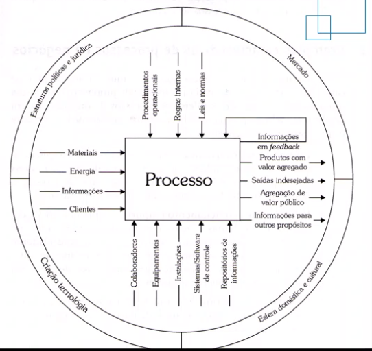
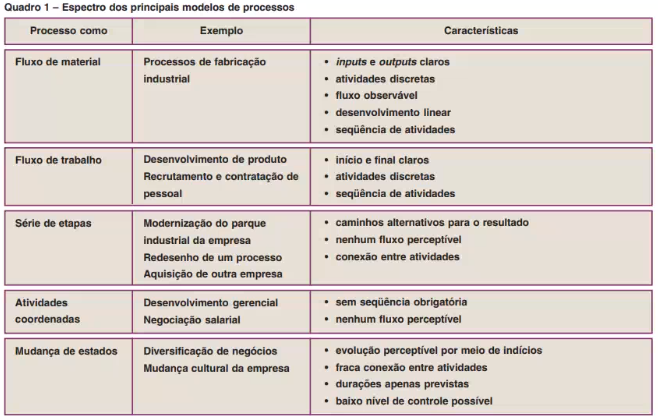

## Notes

Todas as anotações relacionadas ao material online da disciplina será escrito na aula respectiva aos vídeos sujeridos.

Baixar: BizAgi

---

## Aula 1 - 08/02

#### Orientações gerais

BPMs (Business Process Management System): O Gerenciamento de Processos de Negócio é um conceito que une gestão de negócios e tecnologia da informação com foco na otimização dos resultados das organizações por meio da melhoria dos processos de negócio.

---

## Aula 2 - 22/02 - Processos

#### Conceito de processos

Um processo é um conjunto de atividades que por meio de uma sequência lógica transforma matéria prima (recursos disponíveis) em um produto final (agregação de valor, seja por serviço ou produto). *Transforma entradas em saídas.* Uma sequência de atividades para chegar em um resultado final. Entrega valor aos cliente, direto ou indiretamente. Ex: Fábrica de carros - Entrada: matéria prima | Processo: Linha de montagem | Saída: Carro pronto para uso. Ex2: Algoritmo. Ex3: Processo revolucionário do McDonalds.

**Instância:** *É cada instância de um processo, cada execução de um processo. Ex: Cara carro que está na linha de montagem é uma intância daquele processo.*

#### Tipos de processos

Um processo é sempre algo contínuo na empresa? Sim, diferente de projeto, é algo rotineiro dentro da empresa, mas não imutável. Eles vão sustentar seu negócio.

- **Primário**: É o principal, são os processos essenciais de uma organização. Aqueles que passam a percepção de valor para o cliente final por estarem diretamente ligados à experiencia de consumo do produto/serviço final. São os processos que mais tem contato com os clientes. Ex: Processos de venda e maketing, logistica, processos de pós-venda. Em uma universidade seria os processos de ensino, por exemplo.
- **Suporte**: São processos que dão suporte à outros processos, principalmente os primários. Não estão diretamente ligados ao cliente final. Ex: Administração de recursos humanos, que vai contratar os funcionários para exercerem os processos primarios, por exemplo. Administração financeira, a empresa ter recursos suficientes para a aquisição da matéria prima necessária para o produto final...
- **Gerenciamento**: São processos destinados a medir, monitorar e administrar as atividades de uma empresa para certificar que ela opere de forma adequeada e de qualidade. Ex: Gestão de desempenho da linha de montagem, dos funcionários... Gestão de qualidade da matéria prima e produto final (certificar que os produtos alcancem a qualidade desejada).

#### Elementos de um processo

Componentes que podemos identificar em todos os processos. Matéria prima, fornecedores, executores, participantes dos processos, tecnologias e recursos utilizados, políticas...

**Cliente**: Aqueles os quais os resultados dos processos se destinam, aqueles que se beneficiam com esses resultados. Podem ser pessoas fisicas e/ou organizações.

- Clientes internos: São setores internos de uma organização que recebem resultados de processos de realizados em setores.
- Clientes externos: Aqueles que vão se beneficiar do produto/serviço final daquela organização.

**Produto**: Resultado de um processo da organização. Pode ser, ao mesmo tempo, um ou todos os tipos abaixo.

- Serviços: Transporte, assinaturas...
- Informações: São "produtos" intangíveis, normalmente no formato de atas, regras, informações de processos. Tudo que ensina, ou informa algo.
- Materiais e equipamentos: Parte mecânica de um motor. Produtos tangíveis.
- Materiais processados: Iogurte, queijo... (que passam por processos industriais). Geralmente denominados como materiais de bens.

#### Hierarquiade processos

1. Macroprocessos: Visão geral, de cima. Overview geral dos processos chaves da organização. 

2. Processos

3. Subprocessos: Subdivisão de um processo que ainda pode ser dividido em mais de um processo.

4. Tarefas: Atividades simples incluidas em um processo. Não tem como dividir mais, não existem outros subprocessos abaixo dessa atividade.

#### Modelagem de processos

**O que é:** Conjunto de atividades envolvidas na criação de representações de processos de negócio existentes ou que ainda serão propostos. Propósito: ter uma pespectiva completa do processo, uma representação completa e precisa sobre seu funcionamento. Permite compreender, comunicar e gerenciar componentes de processos de negócio.

**Modelo:** Representação simplificada de uma coisa, conceito ou atividade. Simplificação da realidade. Ex: Maquete de um prédio, uma planta baixa...

**Modelo de negócio:** Visão simplificada do negócio. Permite compreende-lo, e identificar problemas e melhorias.

**Notação:** É um conjunto padronizado de símbolos e regras que determinam o significado desses símbolos. Com o objetivo de facilitar o entendimento do modelo por todos os envolvidos no negócio. Exemplo de notação voltado à negócio: BPMN, fluxograma, EPC, UML...

---

## Aula 2 - 22/02

#### Visão sistêmica dos processos

Pode-se definir como uma  capacidade que o profissional tem que o permite ver a empresa como um  todo, e diante disso consegue identificar os **processos**, como  funcionam, como os setores se integram, como é a produção e a entrega  dos produtos ou serviços ao consumidor e ao mercado.

Processos bem definidos, esquematisados e bem pensados (otimizados da melhor forma...) podem definir o sucesso de um negócio.

Com foco nos dois primeiros. 