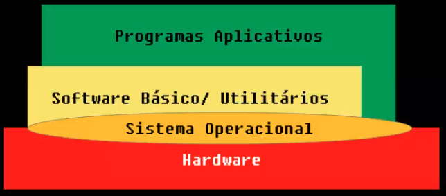

## Notes

Primeira aula do semestre ja começa com uma abertura de fogos de artifício com trilha de star wars. Então meu prof abre a cam com fundo de um cruzador espacial (star wars), depois muda pra um fundo de Mordor.

---

## Aula 1 - 03/02

#### Apresentação da disciplina

---

## Aula 2 - 08/02

#### Respostas das perguntas solicitadas

**Qual sua área preferida no Curso?** -> Tudo relacionado à desenvolvimento, e codificação. Ex: POO, BD, Testes, Segurança.

**Você tem experiência prévia com SO?** -> Não.

**O que é um Sistema Operacional?** -> Basicamente é a ligação entre o Hardware e Software, fazendo toda gerência de processos em execução, uso de memória para uma melhor performace... Além de possibilitar a utilização do computador através de uma interface gráfica.

**Como um sistema operacional atinge seus objetivos?** -> Se o objetivo for uma melhor performace, com o melhor uso do hardware disponível, então ele faz toda uma gerência de todos os processos em execução, pode alterar o uso de memória, entre outros. Por exemplo, se tiverem somente processos leves em execução o SO pode alocar parte da memória RAM livre para ser usada como CACHE acelerando a busca de dados. Outro exemplo e a utilização de SWAP, parte da memória secundária é usada como memória principal quando o uso de RAM chega em um limite. Entre outros exemplos. 

**Quais são os três principais componentes de um sistema computacional na arquitetura de von Neumann?** -> CPU; Memória; Instruções de entrada e saída.

**Quais tipos de memória você conhece? Quais são as características de cada uma?**  -> **Registradores:** Memórias internas na CPU. Armazena temporariamente as instruções passandas para a CPU antes de serem processadas (como uma fila). **Memória Cache:** está entre a CPU e a mamória principal. Ou seja, a CPU procura na cache antes de procurar na principal, por isso mais rápido acesso. **Memória RAM (Principal):** É um exemplo de memória volátil. Permite leitura e escrita, com armazenamento temporário. **Memória secundária:** Armazenamento de dados permanentes (não se perdem com o desligamento da máquina, por exemplo). Exemplos: HD, SSD, Pendrive...

**O que são IRQs ?** -> Um sinal de interrupção enviado do hardware ao processador para "chamar a atenção" do processador para a execução de algum processo em específico, por exemplo: caracteres digitados no teclado, movimentos do mouse, operações de leitura e escrita no HD, entre outros.

**Como funciona um HD / disco rígido?** -> De forma eletromagnética. O disco do HD é composto por trilhas (organização e localização dos dados no disco). Para o registro, a cabeça de leitura se movimenta até a trilha desejada e envia um sinal magnético para o disco, positivo ou negativo, que pode ser entendido como 0 ou 1 (bits).  Por isso pode ser considerado um processo relativimente lento, pois é mecânico, analógico.

#### Estrutura de um SO

- Software básico: Configurações (coisas básicas do sistema).

#### Conceitos básicos

- **SO**
  - Como *gerente de recursos*.
  - Como *máquina estendida*. Significa que ele te da algo além do hardware, exemplo: criar arquivos, receber dados da rede... Ele fornece um conjunto de instruções para os programas e /ou programadores para executar essas tarefas anteriores (Comandos java para ler arquivos por exemplo, ele manda um comando para o SO - O SO que converte para binário para se "comunicar" com o hardware). Ele também já fornece APIs do sistema, como o GPS do android.
- **Kernel:** é o núcleo do sistema operacional, responsável por fazer as interações de hardware e software. Executa as funções básicas de um sistema. É o SO em sí. Ele que aloca memória... Só ele que acessa o hardware!
  - **Funções básicas:** Alocar memória, ver disco rigido
- Execução em **modo kernel** (supervisor): Acesso total ao hardware. Operações que necessitam da comunicação com o hardware Ex: new (necessário alocar memória - só no modo kernel é possível)
- Execução em **modo usuário**: Acesso restrito ao hardware. Somente instruções lógicas e aritméticas do programa.
- **Transição modo usuário - modo kernel - modo usuário:** Switch entre os modos para fluxos que necessitam de cada um.

---

## Aula 3 - 10/02

#### Continuação de conceitos

- **Chamadas de sistema:** Procedimentos disponibilizados pela API do SO para request de serviços pelos usuários (programas -> programadores). 
  - API do windows -> Win32.
  - POSIX: padrão definido pela IEEE para a manutenção de compatibilidade entre sistemas.
  - Programas de sistema/utilitário (config. de rede, gerenciador de arquivos...) usam chamadas de sistema.
- Ambiente operacional = interface gráfica para o usuário final;

**Shell:** Interpretador de linhas de comando, comunica com o kernel para execução dos comandos solicitados;

*SO é como Sauron, faz tudo nas sombras, a gente só vê a interface gráfica.*

#### Arquitetura de SO

**Sistemas monolíticos:** Estrutura única, masisa, *a grosso modo é só o main*. É executado um único programa em modo núcleo, com uma coleção de rotinas (métodos). 

- Se ta tudo junto e misturado todas as rotinas estão sempre disponíveis e visíveis. 
- Manutenção e entendimento complicado.
- Uma falha boba pode derrubar o SO todo.

**Sistemas em camadas:** Dividir o Kernel em camadas independentes, com funções específicas.

- Existe uma hierarquia das camadas, para a comunicação entre elas.
- Pode ser mais lento por causa da hierarquia. O sistema é inteiramente escrito em camadas, logo a comunicação tem que trafegar entre elas sempre.
- Por outro lado a hierarquia proporciona segurança.
- Exemplo: MULTICS - Deu origem ao UNIX.
- Hoje é usado como subsistemas. Não é usado como o MULTICS mais, como o SO inteiro.

**Microkernel:** É um Kernel que executa só as funções básicas. É o kernel menor possível. 

- Só é usado como modo kernel. Para comunicação com o hardware.
- As outras coisas são executadas como serviço. *"Tudo terceirizado - User mode"*.
- Como alternativa para diminuir ao máximo o tamanho da parte principal do sistema, delegando o resto, deixando com os serviços (programas/utilitários/softwares). O sistema é composto em cima do microkernel.
- Muito dificil achar hoje, nem o kernel linux é definido como microkernel.

**Sistemas cliente/servidor:** Sistemas em rede. Variação de microkernel, por ser a mesma ideia de delegar/distribuir as funções. Algumas funções vão ser providas pela rede, vindas de outro computador.

- Prestadores de serviço (servidores) e usuários de serviço (consumidores). Ex: Lab da puc, Teams...
- Comunicação por meio de mensagens, entre as máquinas da rede (Client, Process server, File server...).
- Praticamente todo SI que usamos hoje é um cliente/servidor. pela "onipresença da rede". Sistema na web e computação em nuvem.

**Máquinas virtuais (VM):** Cópia exata do hardware.

- Tradicionalmente utilizada para possibilitar compatibilidade entre sistemas.
- Basicamente faz a tradução do hardware desejado, para o hardware "real" da máquina que está rodando.
- Emulador é uma VM. 
- Importância hoje: 
  - Java roda em uma VM :)
  - Necessidade de execução de múltiplos servidores;
  - Isolar servidores -> isolar falhas;
  - Computação em nuvem (lembrar da AWS).
- Exonúcleos: Divisão do hadware em vários kernels (núcleos) - Computação em nuvem geralmente é assim, a cada solicitação de criação de uma máquina, os recursos do hardware são divididos e parte dele é usado em cada nova máquina. 

---

## Aula 4 - 22/02

#### Diferença entre arquitetura Android - Linux - Win

#### Histórico resumido

- Multiprogramação e Time-sharing (slide)

---

## Aula 5 - 24/02

#### Continuação do histórico

Por que e o que desencadeou a evolução do TCP/IP e a rede?

#### Desafios atuais

- Compatibilidade: Compatibilizar dados. Linux mantem dados de uma forma diferente que o Windows, por exemplo. Outro exemplo: SO conversar com server (hoje utiliza protocolos de rede pra isso).
- Portabilidade: Um sistema ser capaz de executar em mais de um local (hardware). Ex: Android tem alta portabilidade.
- Abertura: Sistemas abertos são mais facilmente compativeis e portateis. Mais dificil fazer um SO conversar com outro fechado. Os protocolos de rede (TCP>HTTP...), por serem abertos, possibilitam a grande escala de comunicação entre sistemas que temos hoje. Foi quase que necessário tais protocolos serem aberto para isso. 
- Escalabilidade: Capacidade de um sistema crescer.