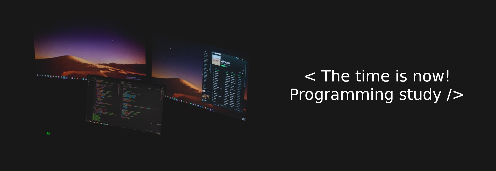

<h3 align="center">Programming study</h3>

Em uma aula minha professora citou a seguinte frase: "De nada adianta a evolução tecnológica se não for utilizada em benefício da sociedade". Desde então estudo mais que nunca para contribuir e fazer a diferença em prol da sociedade, e creio que esse também é o objetivo de muitos. Que tal nos ajudarmos com isso? A muito tempo, para estudar, faço meus resumos e tento escrever uma explicação sobre os assuntos e tecnologias que estudo <a href="https://www.youtube.com/watch?v=ks0lH-4H0sA&t=284s">(Técnica Feynman)</a>, além de resumos das disciplinas da faculdade. Alguns colegas acharam interessante a ideia e queriam fazer o mesmo e contribuir. Logo, criei esse repositório e convido a todos para nos ajudarmos, compartilhando nossos conhecimentos sobre a área de tecnologia, sejam eles quais for!

---

<h3 align="center">Como contribuir</h3>

> 1. Clone o repositório e crie uma branch para sua contribuição;
> 2. Abra um *Pull request* para a *Master* descrevendo suas modificações brevemente.
> 
> *Obs: Se desejar, dê uma olhada nas *Issues* criadas, são alguns tópicos que desejamos um aperfeiçoamento, ou tecnologias novas que ainda não temos no repositório.* 

---

<h3 align="center">Links</h3>

> Aqui está a listagem de todo nosso conteúdo. O link o redirecionará para o arquivo respectivo. **Se sua contribuição incluir um novo arquivo, adicione a listagem do mesmo aqui para todos saberem a existência dele, e facilitar o acesso ao mesmo.**

### Business

| **Title** | Link      |
| --------- | ---------------- |
| Business | [Click here :nerd_face:](Business/Business.txt) |

### Ferramentas

| **Title** | Link 
| --------- | ---------------- | 
| Git | [Click here :nerd_face:](Ferramentas/Git.md) |

### Frameworks

| **Title** | Link 
| --------- | ---------------- | 
| Quarkus | [Click here :nerd_face:](Frameworks/Quarkus.md) |

### Libs

| **Title** | Link 
| --------- | ---------------- | 
| React | [Click here :nerd_face:](Libs/React.md) |

### Linguagens

| **Title** | Link 
| --------- | ---------------- | 
| CSS | [Click here :nerd_face:](Linguagens/CSS.md) |
| HTML | [Click here :nerd_face:](Linguagens/HTML.md) |
| Java | [Click here :nerd_face:](Linguagens/Java.md) |
| Javascript | [Click here :nerd_face:](Linguagens/Javascript.md) |

### Sistemas Operacionais

| **Title** | Link 
| --------- | ---------------- | 
| Linux | [Click here :nerd_face:](Sistemas_Operacionais/Linux.md) |
